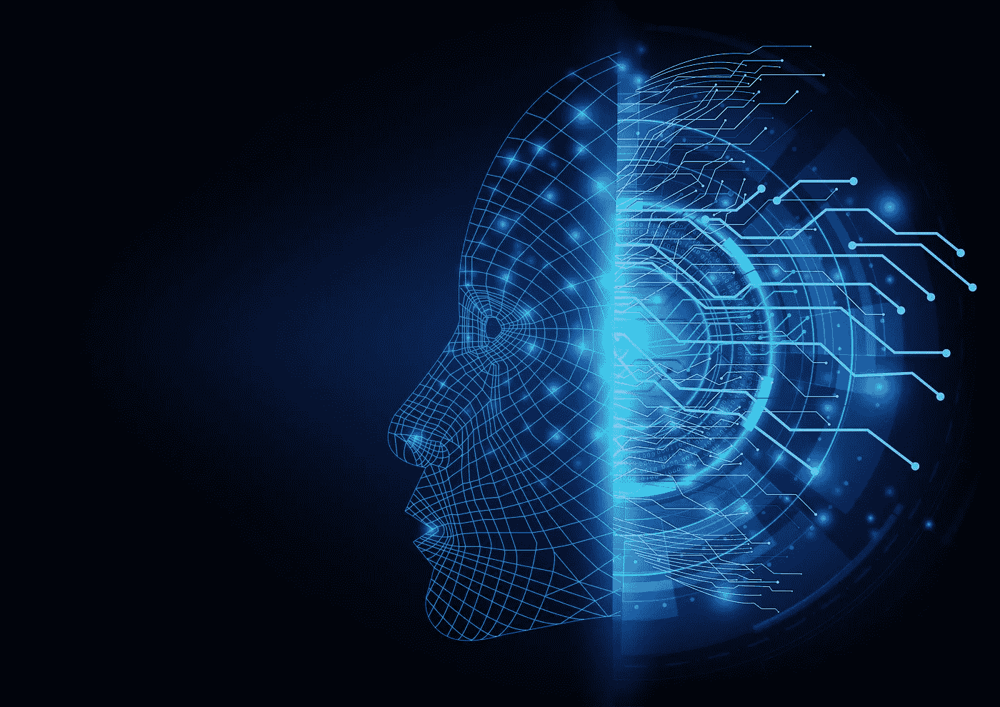

# 人工智能导论

> 原文：<https://medium.datadriveninvestor.com/introduction-to-artificial-intelligence-b74c1d0fbce4?source=collection_archive---------15----------------------->

## 分解该领域的各种术语

Image by [Getty Images](https://www.gettyimages.in/)

人工智能(AI)正在改变我们今天的世界，并已进入从医疗保健到工程和电信的每个领域。它完全改变了我们的生活方式。在开始学习人工智能之前，了解什么是人工智能以及它的元素是非常重要的。在本文中，您将了解人工智能及其关键要素，如机器学习、自然语言处理、计算机视觉等等。

> 人工智能是模仿人类行为和能力的软件的创造

人工智能软件试图模仿人类行为，本质上可以执行人类可以执行的任务。人工智能被用于支持搜索引擎、在线购物推荐、数字辅助等等。人工智能提供的可能性是无限的从检测肿瘤到开发气候变化的解决方案，你会发现它无处不在。

人工智能的一些关键要素包括:

# 机器学习

机器学习是人工智能的基础，在人工智能中，你本质上是教机器根据你的数据集进行预测。您将数据集划分为训练集和测试集，并使用训练数据集来训练(或用更简单的术语来教导)您的模型，以根据提供的数据得出结论。

让我们来看看一个真正有趣的现实生活中的机器学习实现，你不会想到的。澳大利亚一个名为“The Yield”的农业技术项目使用机器学习来预测当地的光照、风力和降雨，并帮助那里的农民决定播种、灌溉和收获的正确时间，从而提高作物产量。从没想过这可以用 AI 来做？现在你一定很好奇这一切是怎么做到的。

让我们借助一个花卉数据集来理解这一点。

1.  假设你收集花的样本，给它们贴上标签，用花的名字和它的特征如形状、大小、颜色等制作一个数据集。这是你的数据集。
2.  现在，您将数据集分为两部分(不一定相等)——训练数据和测试数据。
3.  用您的训练数据训练模型。这是怎么做到的？使用一种算法来处理数据，该算法找出花的名称和其他特征之间的关系。该模型稍后可以用于基于其特征来识别花的名称。
4.  对数据进行定型后，您可以使用测试数据集测试模型的准确性，并使用模型进行进一步预测。

# 计算机视觉

顾名思义，计算机视觉允许计算机使用图像、视频、相机来直观地解释世界。它使计算机能够理解并执行人类可以完成的自动化任务。让我们稍微详细地看看计算机视觉的能力。

## 图像分类

图像分类是指训练一个机器学习模型，根据图像的内容对图像进行分类。图像分类的一个非常简单的例子是根据图像是鸟、猫还是狗来分类。

## 目标检测

训练机器学习模型来对图像中的单个对象进行分类，并使用边界框来识别它们的位置，就像识别图片中鸟的位置一样

Image by [Papers With Code](https://paperswithcode.com/task/semantic-segmentation)

## 语义分割

一种先进的机器学习技术，其中各个像素根据它们所属的对象进行分类，如覆盖或遮蔽图像。此图像显示了语义分割的示例，其中不同的对象覆盖有不同的颜色。

## 人脸检测

一种特殊形式的对象检测，用于在图像中定位人脸。智能手机中的面部解锁可能是最好的例子。人脸检测的另一个有趣的例子是它用于识别一个人的年龄和情绪状态。

## 映象分析

使用图像分析从图像中提取信息，并根据信息提供标签和标题，就像“海滩上的一只狗”可以用来描述下面使用图像分析的图像。

Photo by [kilarov zaneit](https://unsplash.com/@kilarov345?utm_source=medium&utm_medium=referral) on [Unsplash](https://unsplash.com?utm_source=medium&utm_medium=referral)

## 光学字符识别

它是一种用于检测和读取图像中文本的技术，广泛用于读取扫描的文档。

# 异常检测

自动检测系统中的错误、意外和异常事件的能力，如识别您银行账户的异常交易。想象一个可以识别可能的机器故障并提前警告你的系统。听起来很棒！不是吗？

# 自然语言处理

想知道智能手机上的语音助手是如何识别你的声音并为你完成所需工作的吗？是的，自然语言处理或 NLP 就是答案！自然语言处理是我们的计算机识别语言(书面语和口语)并相应地对其做出反应的能力。除了识别我们的语音和执行适当的动作之外，它还可以用来确定信息的语气、翻译文本等等。

# 对话人工智能

对话式人工智能是计算机与你进行对话的能力。聊天机器人是对话式人工智能的最佳例子，机器人参与了与人类的对话。

# 最终注释

人工智能是一个非常强大的工具，可以极大地帮助我们创造解决问题的方法，但是负责任地使用它是很重要的。作为开发者，我们必须确保 AI 系统是公平、安全、可靠和有保障的。

我希望这篇文章能帮助你掌握人工智能的基础知识和它的关键要素，并让你对深入这个领域感到兴奋。