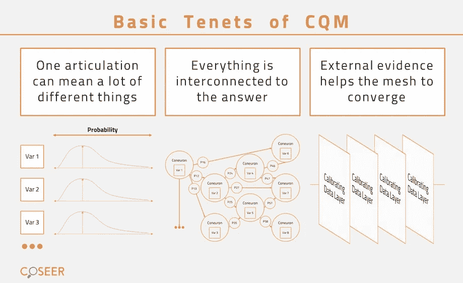

# 校准量子网格介绍——自然语言处理的人工智能

> 原文：<https://medium.datadriveninvestor.com/introduction-to-calibrated-quantum-mesh-an-ai-for-nlp-9a5d1be31b1e?source=collection_archive---------9----------------------->

第一个人工神经网络是在 20 世纪 60 年代开发的，当时披头士和滚石乐队位居排行榜首位。但只是在过去 10 年里，计算能力和大数据的进步才让它们变得足够有用，引起了商界的兴趣。一个特别感兴趣的领域是企业搜索，它本身还停留在 90 年代。

特别是一项技术已经证明了自己在最大限度地利用神经网络方面取得了惊人的成功——深度学习，或复杂的神经网络架构在数据模式中的应用。由于深度学习，计算机现在可以比人眼更精确地识别图像和视频中的对象，比记者更快地将语音转录为文本，比美国农业部更好地预测作物产量，比世界上最好的医生更准确地诊断癌症。

**NLP 挑战**

虽然深度学习已经证明了自己是一个强大的学习系统，但它是否能够解决人工智能的下一个最大挑战:自然语言处理，还没有定论。

人类从很小的时候就开始学习如何高效准确地处理自然语言；事实上，这是我们将要学习的最简单的技能之一。对于机器来说，情况正好相反。但是，如果我们能够让计算机以智能和有用的方式分析、理解和从人类语言中获取意义，可能性是无限的。我们可以发现最聪明的人需要花一生的阅读和研究才能发现的洞见。我们可以全天候提供这种见解，而成本只是人力资源的一小部分，没有任何人工或疲劳相关的错误、认知偏差或风险。

在有大量标注数据可用的情况下，深度学习算法仍然可以应用于自然语言处理。例如，谷歌翻译(Google Translate)已经使用深度神经网络非常接近于类似人类的翻译(或者如果你是一名翻译，就不那么非常接近了)。但是，人工智能必须经过训练才能开始产生结果——谷歌依赖于全球零工经济工人和志愿者大军来清理和结构化其网络训练所依据的数据。仅仅是将哈萨克语翻译成英语就需要[200 万人的投入](http://www.livemint.com/Technology/y5q0KKvINHd7R6zEQfL3MK/How-Google-translations-are-getting-more-natural.html)。

即使他们能够获得足够的数据来用深度学习处理 NLP，也很少有组织能够负担得起深度学习用来标记训练数据的主题专家大军。一个将深度学习应用于自然语言处理的组织的投资回报就更少了。一个很好的例子是 MD Anderson 的[声明](https://www.wsj.com/articles/hospital-stumbles-in-bid-to-teach-a-computer-to-treat-cancer-1488969011),尽管在三年内投资了 6200 万美元来训练 IBM Watson，这个系统却没有产生任何结果。

**智能过程自动化的推动者**

为了使自然语言处理大众化，并使其在主流商业应用中变得负担得起，我们需要一种与深度神经网络目前所能做到的完全不同的思维过程的机器学习。我们需要一种算法，它可以在没有人类监督的情况下，学习如何处理自然语言的概率性质:解释事实，识别意义，根据上下文做出决策，并适应用户不断变化的习惯。换句话说，是一种专门为自然语言处理而构建的算法。

有了这样的算法，自动化白领专业人士已经非常熟悉的大量繁琐而复杂的工作在经济上变得可行:编辑文件，确保遵守严格且不断变化的法规，谷歌搜索并将信息合成到报告中，从迷宫般的遗留数据库中挖掘统计数据，一遍又一遍地回答相同的问题。有了这样的算法，这些专业人士将能够专注于重要的事情:创造力、判断力和策略。

我们称这种人工智能技术为“认知的”，因为它必须以类似于人脑的方式处理语言。它必须回答自然的问题，并以自然的答案做出回应，就像一个经验丰富的专业人士对其组织的数据库了如指掌。它必须将来自不同来源的重要信息综合成简明的摘要和报告，通过在与利益相关方共享之前智能地编辑敏感文档来保护数据安全。

在一个重要方面，智能流程自动化与人力资本非常不同，它提供了更大的规模，全天候运行，成本只是人力资源的一小部分，没有任何手动或疲劳相关的错误、认知偏差或风险。

> 即使他们能够获得足够的数据来用深度学习处理 NLP，也很少有组织能够负担得起深度学习用来标记训练数据的主题专家大军。

通过使用先进的数据科学技术，如[认知校准](https://coseer.com/blog/introduction-to-cognitive-calibration/)，将训练数据分为可靠的等级，并密切遵循人类的思维过程，这是我们 Coseer 开发的。一种叫做**的人工智能算法校准了量子网格**，它被用来训练和处理自然语言，而不需要预先标记数据。CQM 还使 Coseer 能够在众多环境中配置各种问题，最终使其成为真正的认知代理。校准量子网格基于三个基本原则工作:

*   在自然界中，变量没有绝对值，但它们可以以各种几率采取各种形式(量子态)。
*   几乎所有事物都与其他事物相互关联，并具有不同程度的影响，从而形成一个错综复杂的网络。
*   耐心地考虑所有可用的信息，一个一个地应用，可以校准这种网格可以采取的各种状态的各种可能性，从而导致可行的解决方案。

只有时间才能证明，Coseer 的认知算法在人工智能领域是否像披头士和滚石乐队在音乐领域那样具有开创性，但我们已经在应用它来帮助组织更快地采取行动和做出决策，优化投资组合，对市场波动做出反应，降低劳动力成本，实现更大的规模，并发现产品和服务创新。