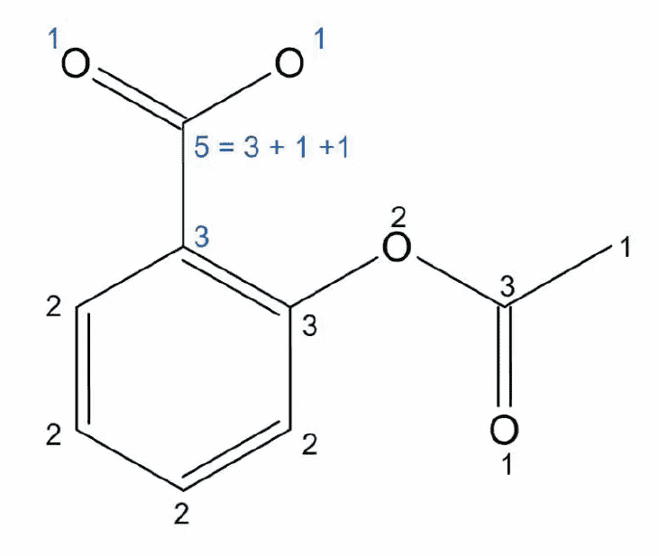

# 化学信息学导论

> 原文：<https://medium.datadriveninvestor.com/introduction-to-chemoinformatics-bf37717301a6?source=collection_archive---------15----------------------->

其实我本科是应用化学和生物工程。这是研究无形事物的好时机。我研究了他们在特定条件下的反应。为了理解这些东西，我们需要学习有机化学，它解释了每个取代基是如何起作用的。我们能用计算机来预期这些活动吗？我们能发现药物吗？化学信息学将给出答案。要知道那些东西，我们需要知道如何把化学物质放入计算机世界，这是一个二元世界。你好，世界化学品！

# 图论表示

Aspirin Structure

这是阿司匹林，世界上最成功的药物。你不必了解所有的有机化学。你可以注意到，作为一个程序员，这只是一个图表。是的，这是真的。我们可以用图表来表示这种结构。

节点是原子，边是键。您可以将图形转移到连接表。在我们去连接表之前，这些表示假设 2D 空间。实际上，化学物质具有三维构象。所以即使成分相同也可以有不同的性质。如果你想表现三维空间，它需要更多的信息。稍后我会解释。

有机化合物主要由氢和碳组成。如果你懂一点化学，你就会知道氢无处不在，而且很容易找到它在哪里，尽管它们被故意省略了。因此，化学信息学的大多数案例在图表或连接表中省略了氢。我们称之为氢抑制。

这是连接表或焊接表。每个节点都有一个唯一的索引，我们用唯一的索引来表示键。在化学中，键有键序。可以是 1，2，3，共振，1.5。你可以把它想象成一个边的重量。

焊接顺序被添加到连接表中。这代表苯，因为我的实验课，我不得不经常闻它，它是一种致癌物。你可以像这样使用原子坐标。

您可以添加任何其他内容，例如，质量差、立体中心和电荷。

# 线性符号

图形表示复杂且计算昂贵。因此，我们需要其他计算起来更容易、更便宜的符号。由于这些原因，线性符号被大量使用。它使用字母数字字符对分子结构进行编码。线性记数法有三个代表，WLN、斯迈尔斯和英奇。WLN 是最早的线性符号，但是现在没有人使用它。SMILES 仍在使用，也被 InChI 取代。InChI 更灵活，大部分语法来自 SMILES。

 [## 一瞬间学会数据科学！？数据驱动的投资者

### 在我之前的职业生涯中，我是一名训练有素的古典钢琴家。还记得那些声称你可以…

www.datadriveninvestor.com](https://www.datadriveninvestor.com/2020/07/23/learn-data-science-in-a-flash/) 

## 笑容

让我们看看 SMILES 是如何构建的及其规则。

*   原子

元素名称:使用字母表。即碳、氮、氯。也可以用周期数代替字母表。[#6]、[7]和[#17]。我们可以用小写和大写来表示芳香族和脂肪族。

*   结合

如果观众可以很容易地推断出来，你可以跳过它，但复杂的化学物质需要在债券上详细说明。-、=、#分别是单倍、双倍和三倍。:表示芳香键。

*   分支和环

取代基放在圆括号()中，环用环原子后的数字表示。

氢没有明确表示出来，氢被抑制了。

示例:

我们正试图用微笑来表示中心的那个。首先，我们分解环，做一个记号，左上记号。我们添加一个取代基，并用括号表示取代基。我们还有一个取代基的取代基。我们在左下方加上括号。我们闭合环，并使用环的数字。

你能认识到这个符号的问题吗？这是一个巨大的问题。化学物质可以有几种符号，因为我们可以在任何地方开始我们的符号。这是微笑的一个主要问题。如果我们不能解决这个问题，我们就不能比较带有微笑的分子。解决这个问题的策略是规范化，它使用特定的算法给出唯一的路径。

## 规范化:摩根算法

我们使用连接性值来区分原子。如果你理解了这个算法，那么你也可以更容易地理解其他算法。

1.  每个原子的初始连通性值是邻居的数量，它不包括氢。
2.  我们对邻居的连通性值求和。
3.  重复步骤 2，直到不同连接值的总数达到最大。
4.  我们可以决定从最大值开始的路径。之后，我们按照降序对连通性值进行排序，并跟踪它们的邻居。

注意:如果出现歧义，那么我们可以考虑原子序数和键序。

例子

它的顺序:

## 内消旋化合物

我们不能恰当地表达内消旋化合物，因为我们没有任何符号来表达手性中心。

## 互变异构体

它代表了非芳香分子的可选电子构型。每个互变异构体都有独特的微笑符号。没有关于微笑中互变异构体的信息。因此，我们需要重新绘制图表，并找出它。

# InChI

这是一种灵活的规范线性符号。它非常灵活，因为它使用的级别可以让您随心所欲地存储信息。它也可以代表内消旋化合物和互变异构体。

你可以很容易地理解 InChI，但 InChI 的要点是增加层(级别)。在这种情况下，他们增加一个氢层来表达互变异构体。

这篇文章发表于 2020 年 9 月 28 日

## 访问专家视图— [订阅 DDI 英特尔](https://datadriveninvestor.com/ddi-intel)