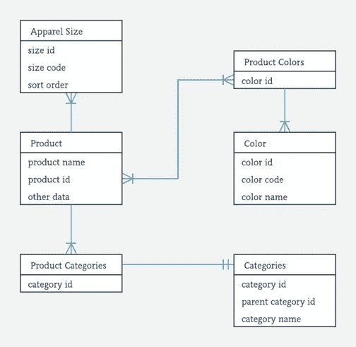
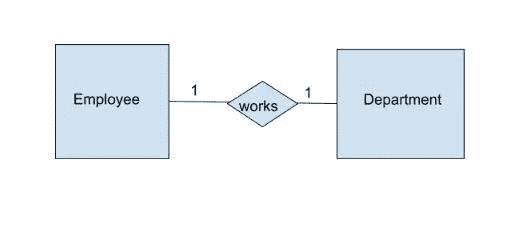
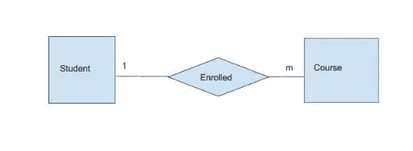
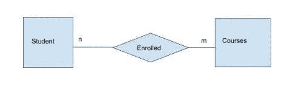
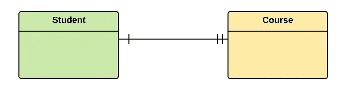
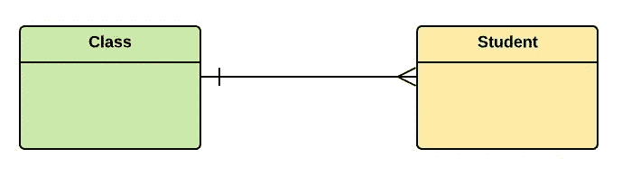
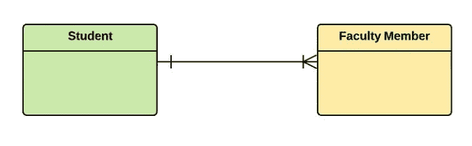

# 数据库和 SQL 简介

> 原文：<https://medium.datadriveninvestor.com/introduction-to-databases-and-sql-1c1ebcec596d?source=collection_archive---------1----------------------->

Photo by [Tobias Fischer](https://unsplash.com/@tofi?utm_source=unsplash&utm_medium=referral&utm_content=creditCopyText) on [Unsplash](https://unsplash.com/s/photos/database?utm_source=unsplash&utm_medium=referral&utm_content=creditCopyText)

SQL 代表结构化查询语言。它是用于关系数据库管理系统(RDBMS)和数据操作的标准计算机语言。

# 谁使用 SQL？

*   后端开发人员
*   数据库管理员
*   数据分析师
*   系统管理员
*   系统工程师
*   数据科学家

我们每天产生的数据量是巨大的。按照我们目前的速度，每天会产生超过 2.5 万亿字节的数据。到 2025 年，预计全球每天将产生 463 的数据，相当于每天 212，765，957 张 DVD！。这证明处理数据变得非常重要，这也是数据库发挥作用的地方。

我们知道数据来自不同的地方，并且是非结构化的。数据库是存储这些数据的地方，但是是有组织的结构。数据库由行和列组成。在这里，数据被分类并以表格的形式存储。例如，一家公司可能有一个包含两个表的数据库，一个用于雇员，另一个用于部门。

 [## 数据科学和软件工程哪个更有前途？数据驱动的投资者

### 大约一个月前，当我坐在咖啡馆里为一个客户开发网站时，我发现了这个女人…

www.datadriveninvestor.com](https://www.datadriveninvestor.com/2019/01/23/which-is-more-promising-data-science-or-software-engineering/) 

一个**表**中的每一行被称为一个**记录**，一列为描述该行的**字段**。在雇员表中，每一行都是一个独特的人，姓名、地址、部门等字段描述了这个特定的雇员。

# 关系型数据库管理系统

RDBMS 代表关系数据库管理系统。它通过使用主键、外键和索引来考虑表之间的关系。因此，在获取和存储数据方面，它比 DBMS 有很大的优势。它在企业中用于存储复杂和大量的数据。

RDBMS 的例子包括

*   Microsoft SQL Server
*   IBM DB2
*   关系型数据库
*   SQLite
*   Postgre SQL

使用 SQL，我们可以在数据库中执行更新、删除和检索数据。数据/对象被表示为表格。这些表由它们的字段名唯一标识，由行和列组成。

# 数据建模

为数据库中的数据存储创建模型的过程称为数据建模。它是在信息系统中以结构化格式表达数据的过程。数据模型的构建块是实体、属性和关系。

# ER 图表

实体关系图显示存储在数据库中的实体集的关系。通过定义实体及其属性，并显示它们之间的关系，ER 图说明了数据库的逻辑结构。

实体:这些是真实世界中存在的物体。实体可以是地点、人和动物。这些由一个矩形框表示，其中包含实体名称。示例包括学生、员工。

**属性**:代表实体的特征。它由一个椭圆符号表示。对于学生实体，姓名、年龄和编号都是属性的示例。

**关系:**描述两个实体之间的关联。它用一个包含关系名称的菱形符号来表示。我们有三种关系

*   一对一
*   多对多
*   一对多

关系的例子包括学生和班级之间的多对多关系。以下内容由陈标注。

**一对一:**一个实体与另一个实体关联。例如:每个雇员都与一个部门相关联。

**一对多:**一个实体与许多其他实体相关联。例如:公司与一个分支机构/办公室/国家的所有员工相关联。

**多对多:**许多实体与许多其他实体相关联。例如:在一个公司中，许多员工与多个项目相关联(已完成/现有)。

## 交叉脚符号:

这是 E-R 图符号中的一种类型。符号包括在下面

**一对一:**

guru99.com

**一对多**

guru99.com

**多对多**

guru99.com

## **SQL 键**

键是关系数据库模型的重要组成部分。它们用于建立和标识表之间的关系，也用于标识表中的任何记录或数据行。

**超级键:**用于标识表格中的行。例如，可以将 student_id，(student_id，name)视为学生表中的超级键。

**主键:**它是一个表的一个或多个字段的集合，唯一地标识数据库表中的一条记录。它不能接受空的、重复的值。一个表只有一个主键。

**替换键:**可以唯一标识表中每一行的一个字段或一组字段。一个表可以有多个主键选项，但只能将其中一个设置为主键。所有不是主键的键都称为备用键。

**唯一键:**唯一标识数据库中记录的一个或多个字段的集合。它类似于主键，但可以接受一个空值。

**外键:**它是一个表中的字段，是另一个表的主键。它在两个表之间创建关系，并维护数据完整性和导航。