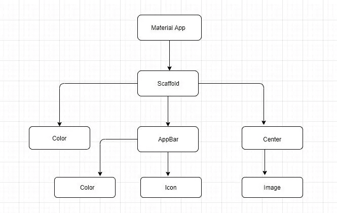

# 颤振介绍

> 原文：<https://medium.datadriveninvestor.com/introduction-to-flutter-291928d6b8a9?source=collection_archive---------15----------------------->

一切从零开始

# 什么是颤振？

Flutter 是 Google 创建的开源 UI 软件包。它帮助开发者开发漂亮的屏幕。它带有预装的小部件，有助于创建漂亮的用户界面屏幕。Flutter 继承了 Web 属性，如填充和边距。

我们可以将这些代码部署到所有不同的平台，如 Android 设备、IOS 设备和 web，而无需重写代码和学习新的语言。

# 为什么颤动？

我们只需要一个代码库来管理它们，另一个原因是，假设你是一名 android 开发人员，你在 Google play 商店发布了一个 android 应用程序，它有很高的知名度和数百万的安装量，ios 粉丝真的需要这个应用程序，他们请求你让它在 IOS 上可用，现在你学会了 swift 来制作 IOS 应用程序。当你需要进行新的更新时，你需要在两个平台上工作，在两个不同的地方更新和维护会变得非常混乱。

 [## 2020 年移动应用发展趋势|数据驱动的投资者

### 不可否认的事实是，智能手机正在改变运营模式、商业模式和市场…

www.datadriveninvestor.com](https://www.datadriveninvestor.com/2020/01/15/mobile-app-development-trends-to-follow-in-2020/) 

在 flutter 中，你只需要知道一种语言，即 dart 语言，通过这种语言，你可以让 IOS 和 Android 用户都可以使用你的移动应用。Dart 类似于面向对象编程。它被谷歌广告词和谷歌纤维内部使用，而且使用量只会越来越大。很快我们将能够使用蜂鸟来创建使用 dart 语言的 web 应用程序。

Dart 是一种编程语言，我们将用它来开发我们在 Flutter 中的应用程序。如果你有 Java 或 JavaScript 的经验，学习它并不难。你会很快明白的。

在 Android 应用程序中，随着屏幕变得越来越大，我们可以在屏幕上放置更多的元素，这意味着相互之间的约束变得更加复杂。更复杂意味着更难理解和处理。在 Flutter 中，有许多来自网页设计的核心概念，允许我们利用行、卡片、列等等。

当你开发应用程序时，最大的痛苦之一是当你不断地改变时，你不得不多次运行你的应用程序。这大约需要 30-40 秒，而在 android 中，保存代码、编译代码并在屏幕上看到它大约需要 2 分钟。在 flutter 中，只要你一点击 Save，你的 UI 就会在几秒钟内改变，这要归功于热重载功能。这就像你在网站上有一个刷新按钮。

当您使用 flutter 时，您可以访问原始内容，因为它是开源的。

# 解剖

flutter 中的所有东西都是一个小部件，你可以在小部件上构建小部件，就像乐高积木一样。小部件树就是一大堆相互嵌套的小部件。让我们构建一个小部件树。

1.  创建一个脚手架类。(视觉布局结构的基本材料设计。)
2.  在顶部添加一个应用程序栏。
3.  放置一个容器。(容器包含应用程序的内容)
4.  要放置小部件，请在容器中添加一列。
5.  在我们的专栏中，我们有两个孩子。一个是行，一个是文本。
6.  在行列中，我们有文本和图标部件。

从上面的代码来看，

我们创建了一个 Scaffold 类，在 Scaffold 中，我们放置了 App Bar 和一个容器。在容器中，我们放置了一个分为行和文本小部件的列。上述步骤的小部件树是

widget_tree

# 小工具

小部件描述了在给定当前配置和状态的情况下，它们的视图应该是什么样子。比如 Padding 是小部件，Margin 是小部件，Center 是小部件，Layout 行和列也是小部件。我们可以将 widget 视为一个蓝图。

## 无状态小部件

小部件是 Dart 类，可以用属性声明。无状态小部件是不可变的。它们始终显示相同的内容，不会影响已经渲染的内容。

## 有状态小部件

根据当前所处的状态，它们可以显示或执行不同的操作。如果你想让你的应用程序非常具有交互性，你需要使用有状态的小部件。

## 颤振发展的先决条件

*   Windows/IOS
*   代码编辑器→ Android Studio，VS 代码(选择 Android Studio)
*   模拟器→用于测试我们的应用程序。

目前就这些。希望你喜欢我的博客。在我的下一篇博客中，我们将开始详细研究 flutter 应用程序。