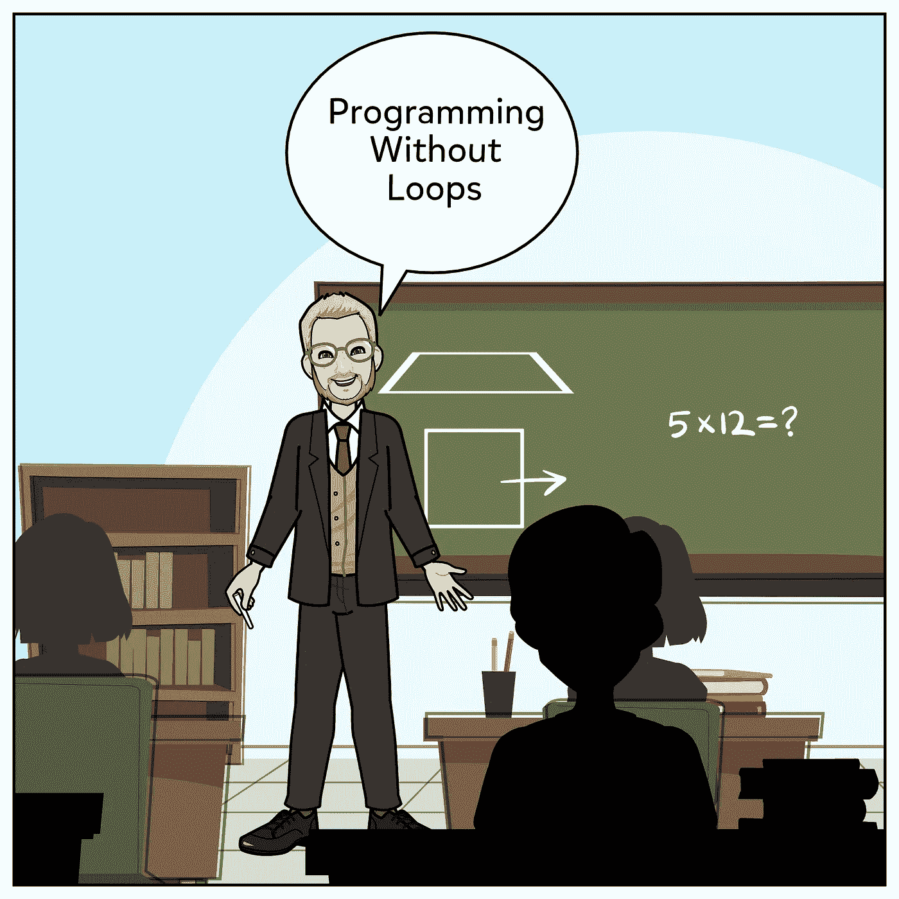

# 使用 Ramda JS 的函数式编程简介

> 原文：<https://medium.datadriveninvestor.com/introduction-to-functional-programming-using-randa-js-94c7a54977fe?source=collection_archive---------8----------------------->



当个人谈论函数式编程时，通常会提到一些函数特性，如不可变数据、纯函数和尾调用优化。

对我来说，函数式编程是关于声明式编程风格和数据流，而不是控制流。

让我们举个例子，

假设您正在构建一个电子商务系统。这个电子商务系统应该接收一个订单，并对其应用一些折扣；如果有两个以上的折扣适用，您的函数应该返回两个最高折扣的平均值。

```
export interface Order { Amount: number Name: string}export interface Discount { Apply: (amount: number) => number; IsValid: (order: Order) => boolean;}function ApplyValidDiscounts(order: Order, discounts: Discount[], numberOfDiscounts: number)
{
}
```

试图使用命令式编程代码来编写这个方法会导致一大块庞大的代码。(如果你不相信我，你自己试试)

# 我将以这个规则定义(R.When)开始我的解决方案。

```
const ApplyDiscountIfValid = (discount: Discount, order: Order) => R.when((order: Order) => CanApplyDiscount(discount, order),
       (order: Order) => ApplyDiscount(discount, order), order);
```

我认为给定订单和折扣，这是不言自明的。如果适用，应用折扣。

# 现在我们需要定义“CanApplyDiscount”和“ApplyDiscount”:

```
const CanApplyDiscount = (discount: Discount, order: Order) => discount.IsValid(order);
```

虽然 CanApplyDiscount 非常简单明了，但 ApplyDiscount 要简单得多。复杂，因为它应该调用“折扣”方法。Apply()"来获得折扣价，然后用新的金额创建一个新的 Order 对象。

```
const ApplyDiscount = (discount: Discount, order: Order) => 
R.pipe(
        () => discount.Apply(order.Amount),
        (newAmount) => WithAmount(newAmount, order))();
```

当我们有一个操作链，并且每个操作都依赖于前一个操作的输出时，我们称之为流水线。

前面的代码相当于

```
const ApplyDiscount = (discount: Discount, order: Order)=>{
      var newAmount=discount.Apply(order.Amount);
      return WithAmount(newAmount , order)}
```

# 现在我们需要带 mount 的函数

该函数应该返回一份修改了金额的订单。修改复制订单的数量意味着突变。在函数式编程中访问和设置属性最好由镜头来完成。

```
const AmountLens=R.lensProp("Amount");const WithAmount = (newAmount: number, order: Order) => R.over(AmountLens, (_) => newAmount, order);
```

> 镜头是什么？为什么要使用它？
> 
> 透镜是一种封装了特定属性的 setter 和 getter 的类型，使用透镜的主要好处是:
> 
> 1-镜头可重复使用:例如，上面定义的 AmountLens 可用于任何具有称为 Amount 属性的对象。
> 
> 2-代码可读性和意图声明:在函数中定义 Lens 表明 underline 属性是函数关注点；这暗示了这个属性会在某个时候发生变异。

R.Over 将复制订单(最后一个参数)，然后访问带下划线的透镜属性(数量)，并使用 setter 函数设置它(第二个参数)。

[](https://www.datadriveninvestor.com/2019/02/21/best-coding-languages-to-learn-in-2019/) [## 2019 年最值得学习的编码语言|数据驱动的投资者

### 在我读大学的那几年，我跳过了很多次夜游去学习 Java，希望有一天它能帮助我在…

www.datadriveninvestor.com](https://www.datadriveninvestor.com/2019/02/21/best-coding-languages-to-learn-in-2019/) 

# 应用所有折扣

```
const ApplyAllDiscounts = (order: Order, discounts: Discount[]) => R.map(discount => ApplyDiscountIfValid(discount, order), discounts);
```

该函数将对所有折扣进行循环，并使用 ApplyDiscountIfValid 应用它们。

# 应用有限数量的折扣

由于 ApplyAllDiscounts 将在折扣适用的情况下返回新的 order 对象，而在折扣不适用的情况下返回相同的旧对象，因此我们需要过滤订单。

## 过滤折扣订单

```
const ApplyLimitedNumberOfDiscounts = (order: Order, discounts: Discount[], numberOfDiscounts: number) => 
R.pipe(() =>
          ApplyAllDiscounts(order, discounts),
          result => 
                R.filter(discountedOrder => discountedOrder.Amount  
                                            != order.Amount, result)
)();
```

## 按金额升序排列。

```
const ApplyLimitedNumberOfDiscounts = (order: Order, discounts: Discount[], numberOfDiscounts: number) => 
R.pipe(() =>
          ApplyAllDiscounts(order, discounts),
          result => 
                R.filter(discountedOrder => discountedOrder.Amount  
                                            != order.Amount,result),
          result=>R.sortBy(discount=>discount.Amount,result))();
```

## 最后，只从列表中选择所需的折扣数量。

```
const ApplyLimitedNumberOfDiscounts = (order: Order, discounts: Discount[], numberOfDiscounts: number) => 
R.pipe(() =>
          ApplyAllDiscounts(order, discounts),
          result => 
                R.filter(discountedOrder => discountedOrder.Amount  
                                            != order.Amount,result),
          result => R.sortBy(discount=>discount.Amount,result),
          result => R.take(numberOfDiscounts, result)
)();
```

# 将订单列表缩减(聚合)为一个订单

```
export const ApplyValidDiscounts = (order: Order, discounts: Discount[], numberOfDiscounts: number) =>
          R.reduce(ReduceDiscountedOrders, WithAmount(0,order), ApplyLimitedNumberOfDiscounts(order, discounts, numberOfDiscounts))
```

R.Reduce 需要一个 reducing 函数(order1，order2=>order)、一个初始对象和数据源。数据源是 ApplyLimitedNumberOfDiscounts 的结果，初始订单对象应该是一个金额为零的空订单。

## 缩减功能

```
const ReduceDiscountedOrders = (order1: Order, order2: Order)=>
        R.pipe(
               ()=>Median(order1.Amount, order2.Amount),
               (newAmount:number)=> WithAmount(newAmount, order1)
)();
```

它接受两个订单对象，计算它们的中值，并返回第一个订单的克隆，金额=中值。

## 中位数函数

不幸的是，R.Median 只能处理数组，所以要处理 params(动态参数数),我们需要使用 R.unapply

```
const Medium=R.unapply(R.Medium);
```

但是我们需要过滤零金额，所以我们不会忽略空单。

```
const Median = R.unapply<number>((inputs)=>
R.pipe((numbers:number[])=>
                        R.filter(val=>val!=0,numbers),R.median) (<number[]>inputs));
```

# 完整的代码

和测试函数

```
function Test() {var result = Main.OrderProcessing.ApplyValidDiscounts({ Name: "order1", Amount: 1000 }, [{ Apply: (amount) => amount - amount / 3, IsValid: (order) => order.Amount >= 5000 },{ Apply: (amount) => amount - amount / 2.5, IsValid: (order) => order.Amount >= 2000 },{ Apply: (amount) => amount - amount / 2, IsValid: (order) => order.Amount >= 1000 },{ Apply: (amount) => amount - amount / 2.25, IsValid: (order) => order.Amount >= 500 },{ Apply: (amount) => amount - 100, IsValid: (order) => order.Name.endsWith("1") },{ Apply: (amount) => amount - 200, IsValid: (order) => order.Name.endsWith("2") },], 1);console.log(result);}
```

**进入专家视角—** [**订阅 DDI 英特尔**](https://datadriveninvestor.com/ddi-intel)