# HTML 简介

> 原文：<https://medium.datadriveninvestor.com/introduction-to-html-e6da4a9a16ae?source=collection_archive---------6----------------------->

快速浏览 html，帮助你理解基本概念并使用它。


Photo by [Luca Bravo](https://unsplash.com/@lucabravo?utm_source=unsplash&utm_medium=referral&utm_content=creditCopyText) on [Unsplash](https://unsplash.com/s/photos/landscape?utm_source=unsplash&utm_medium=referral&utm_content=creditCopyText)

HTML 代表超文本标记语言。它是一种脚本语言，而不是编程语言。借助 HTML 语言中可用的不同标签，它被广泛用于格式化网页。我们目前使用 HTML-5 版本，它是 HTML 4.01 的扩展，该版本于 2012 年发布。在这个博客中，我们将学习一些 html 的概念

# 编写您的第一个 Html 文件

要写 HTML，你会需要一个 HTML 文档，就是一个带*的文档。html* 扩展名。你可以使用像[崇高文本](https://www.sublimetext.com/3)、 [VS 代码](https://code.visualstudio.com/download)和[原子](https://atom.io/)这样的编辑器。

# 块级元素

这些会在您放入该元素的内容周围创建一个块。它从新的一行开始。块级元素包括

*   标题(

    # 至

    ###### )

*   有序和无序列表(

*   列表项(
*   )
*   段落(

    )

# 内嵌元素

内联元素不从新行开始，它只占用所需的宽度。这些不会在新的一行开始。行内元素包括

*   锚()
*   图片()
*   粗体文本(**)**
*   输入()

# 基本 HTML 文件

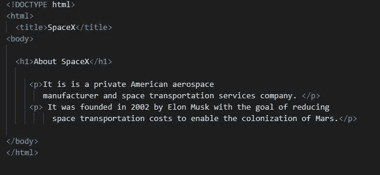

<doctype html="">称为文档类型声明*。它向浏览器*指示文件是用什么 HTML 版本编写的。表示文件是用 html5 编写的。</doctype>

在一个 HTML 文件中，我们用标签来表示根元素。在这个根元素中，有多个元素，可以认为如下

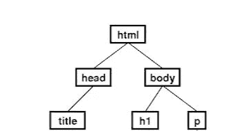

元素包含关于文件的支持信息，通常称为**元数据**。它还包含< title >标签，我们在其中为我们的网页提供一个标题。它还可能包含 Javascript 文件和 CSS 样式表的链接。

元素包含了 html 文件的内容。它保存了我们的网络浏览器显示的信息。在内我们有高级标题

# 到低级标题

###### 标签和一个段落

标签。

HTML 属性提供了关于 HTML 元素的附加信息。它们可以被认为是元素的属性。一个元素可以有一个属性，多个属性，或者根本没有属性。

# 超链接

我们可以通过使用 anchor 标签创建一个超链接来将一个 HTML 页面连接到其他网页。

```
<a href="http://www.google.com">Google</a>
```

href *属性*是指超文本引用，其值是统一资源定位符(URL)。URL 是链接指向的网址或目的地。

# 列表

有时，我们希望在网页内容中包含项目符号和编号列表。这可以在列表项的帮助下完成。我们有两种类型的列表。

## 无序列表

无序列表是没有特殊顺序或次序的项目的集合。这个列表是通过使用

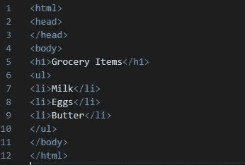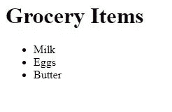

Unordered List

## 有序列表

当我们希望我们的项目按顺序排列时，使用有序列表。这个列表是通过使用

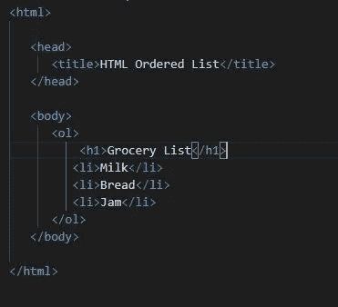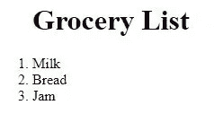

Ordered List

# 形象

我们使用标签将一幅图像插入到我们的 web 页面中，该页面带有一个 *src* 属性，其中包含您想要插入的图像的文件路径。如果图像没有加载，我们使用 *alt* 属性提供一个带有图像描述的可选文本。< img >标签没有结束标签。例如

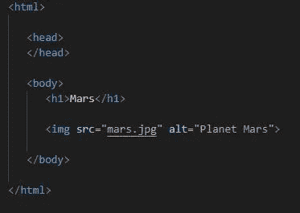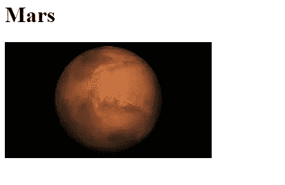

# 桌子

这些允许网页作者安排数据，如文本，图像，链接，其他表格等。分成一排排的单元格。我们使用标签，其中标签用于创建表格行，而

| 标签用于创建数据单元格。 |

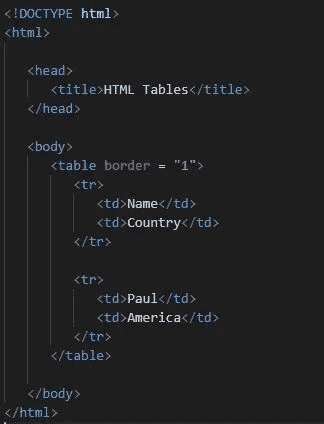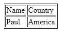

# 形式

表单用于从用户那里收集信息，并将它们存储在服务器中。html 表单包含用户名、密码、联系号码、电子邮件 id 等信息。其中使用的元素有输入框、复选框、单选按钮和提交按钮等。

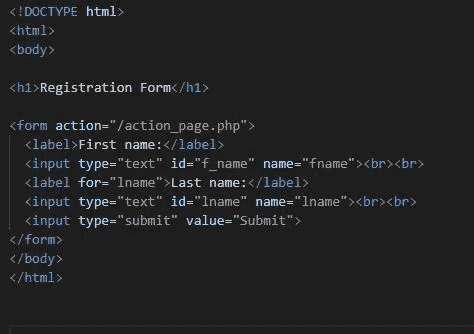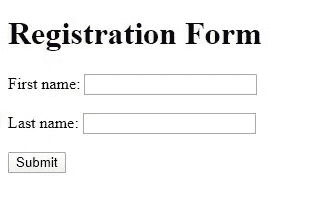

您可以在 HTML 表单中使用不同类型的表单控件，其中一些是

*   文本输入控件
*   复选框控制
*   无线电盒控件
*   可点击的按钮
*   提交和重置按钮

HTML 中有太多的东西需要学习，而且一点也不难。暂时就这样吧！我希望你喜欢这篇文章。