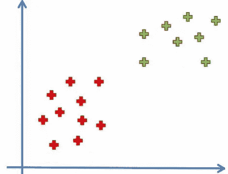
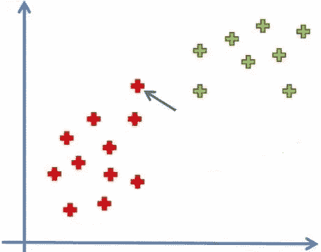
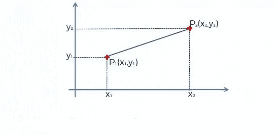
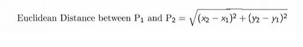
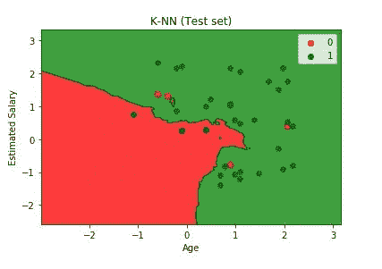

# KNN 介绍(K 近邻)

> 原文：<https://medium.datadriveninvestor.com/introduction-to-knn-k-nearest-neighbors-56d2d39915fb?source=collection_archive---------1----------------------->

如何执行 knn 算法的分步教程

Photo by [Joel Holland](https://unsplash.com/@joelholland?utm_source=unsplash&utm_medium=referral&utm_content=creditCopyText) on [Unsplash](https://unsplash.com/s/photos/spring?utm_source=unsplash&utm_medium=referral&utm_content=creditCopyText)

人工智能(AI)使机器能够从经验中学习，适应新的输入，并执行类似人类的任务。不同领域的人们都在尝试应用人工智能来简化他们的工作。

# 什么是 KNN？

KNN 是存储整个数据集的监督算法之一。当看不见的数据需要预测时，它在整个训练数据集中搜索“k”个最多实例，并且具有最相似实例的数据最终作为预测返回。

## K 是什么？

k 表示测试点或新点周围的最近邻居的数量。如果 k = 3，则检查离新点最近的三个类别的标注，并将最常用的标注分配给新点。

# 应用:

*   它用于手写检测、图像识别和视频识别。
*   该算法已在推荐系统中实现。

# KNN 是如何工作的？

在上面的情节中，我们有两个类。A 类用红点，B 类用绿点。现在我们将在数据中引入一个新的点。

在上面的情节中，你可以看到一个新的观点。要开始预测，我们需要做的第一件事是选择“K”的值。例如，如果 K = 3，这意味着您正在选择与新点距离最小的三个点。让我们考虑 K=5 的值。

当我们指定 K = 5 时，你可以看到新点的邻居。如我们所见，与 b 类相比，我们将 A 类作为多数点。因此，新点属于 A 类。

## K 的值怎么选？

没有官方的方法来选择 k 的值。我们需要通过试错法并假设训练数据未知来找出各种值。另一种选择 K 的方法是通过交叉验证。

## 它是如何预测邻居的？

KNN 使用最小距离度量来查找其最近邻居。一种流行的方法是欧几里德距离法。欧几里德距离是两点间距离平方之和的平方根。它也被称为 L2 规范。

Euclidean Distance

我们还可以使用其他方法，如曼哈顿距离和海明距离来找到最小距离。曼哈顿距离是两点之间差异的绝对值之和。汉明距离用于分类变量。它告诉我们两个分类变量是否相同。

 [## 将定义 2020 年就业前景的五大数据科学和机器学习趋势|数据驱动…

### 数据科学和 ML 是 2019 年最受关注的趋势之一，毫无疑问，它们将继续发展…

www.datadriveninvestor.com](https://www.datadriveninvestor.com/2020/02/19/five-data-science-and-machine-learning-trends-that-will-define-job-prospects-in-2020/) 

## KNN 为什么懒惰？

K-NN 是一个懒惰的学习器，因为它不从训练数据中学习判别函数，而是“记忆”训练数据集。它没有培训阶段。

# 我们来编码吧！

这里我们使用 scikit-learn 库来导入 KNN 模型并直接使用它。网上有许多关于 KNN 的数据集。你可以在下面的链接中找到数据集和代码。

 [## ajaymuktha/机器学习

### 在 GitHub 上创建一个帐户，为 ajaymuktha/机器学习开发做贡献。

github.com](https://github.com/ajaymuktha/Machine-Learning) 

# 导入库

在上面几行代码中，我只是导入了这个过程中需要的所有库

Numpy →这是一个用于处理数组的库。

Pandas →将数据文件作为 Pandas 数据框加载并分析数据。

Matplotlib →我已经导入 pyplot 来绘制数据的图形。

# 导入数据集

我们的文件是 CSV(逗号分隔值)格式，所以我们使用 pandas 导入文件。然后我们把数据分成因变量和自变量。x 被认为是独立的，Y 被认为是从属的。

我们的数据集是关于创业公司的，包含五个特征

1.  使用者辩证码
2.  性别
3.  年龄
4.  估计工资
5.  购买与否

主要目的是发现用户是否已经购买了车辆。根据上述特征，购买与否被认为是因变量，年龄，估计工资是自变量。

# 训练装置和测试装置

从 Sklearn 的子库 model_selection 中，我已经导入了 train_test_split，用于拆分训练集和测试集。我们可以使用 train_test_split 函数进行拆分。函数中的 test_size = 0.25 表示应该保留下来进行测试的数据的百分比。

# 特征缩放

当我们处理一个模型时，确保值在相同的范围内是很重要的，否则很难传递给模型。为了解决这个问题，我提出了特征缩放。它是一种将固定范围内的数据中存在的独立特征标准化的技术。这是在数据预处理期间执行的。

在这里，我们把年龄和估计收入作为自变量，把购买作为因变量。在我们的独立变量中，年龄以十为单位，收入以千为单位，需要对这些变量应用特征缩放以获得最佳预测。

sci-kit 学习库提供了一个类来缩放我们的数据，我们可以从预处理中使用 StandaradScaler 类。我们从库中导入类，我们将为它创建一个对象。我们将利用 fit_transform 方法将独立变量的训练集和测试集转换到相同的范围内。

# 现在让我们来拟合数据

来自 Sklearn，分库邻居。我们导入 KNeighborClassifier，并在训练数据上拟合模型。

sci-kit learn 有一个计算最短距离的内置方法。这里我们计算欧几里德距离，这个方法是闵可夫斯基度规的一部分，p = 2 代表计算欧几里德距离。如果 p =1，代表曼哈顿距离。

# 预测测试结果

# 评估指标

简单地建立一个预测模型不是我们的动机。它是关于创建和选择一个模型，给出样本数据的高精度。因此，在计算预测值之前检查模型的准确性至关重要。我们将利用一种用于计算分类模型准确性的评估度量技术。下面详细讨论一下。

## 混淆矩阵

它是机器学习中分类模型的一种性能测量技术，其中输出具有两个或更多类别。这是一个包含实际值和预测值的四种不同组合的表格。

让我们来理解混淆矩阵中的术语。

## 真阳性(TP)

如果实际值和预测值都是真的，那么就是真正。比如你预测一个女人怀孕了，她也怀孕了。

## 假阴性(FN)

如果实际值为真，预测值为假，那么就是假阴性。例如，你预测一个女人没有怀孕，但她怀孕了。

## 假阳性

如果预测值为假，但实际值为真，则为假阳性。例如，你预测她怀孕了，但她没有怀孕

## 真阴性(TN)

如果预测值为假，实际值也为假，则为真阴性。比如你预测她没怀孕，她也没怀孕。

让我们从 metrics 类导入混淆矩阵并为其创建一个对象，然后我们将 y_test 和 y_pred 作为参数传递，以了解预测值的准确性。这里需要加上真正真负才能知道模型的表现。我们的准确率是 93/100。让我们将预测数据可视化。在下图中，你可以看到七个不正确的预测。

下面是我所做工作的总结:我加载了数据，将数据分为训练集和测试集，应用标准的 scaler 方法将数据归一化到相同的范围内，将分类模型拟合到训练数据中，基于此数据进行预测，并在测试数据上测试预测。

每个机器学习爱好者都必须了解分类和回归算法。下面提供了我关于机器学习算法的博客。暂时就这样吧！我希望你喜欢这篇文章。

 [## 机器学习算法介绍-线性回归

### 人工智能(AI)使机器能够从经验中学习，适应新的输入并执行…

medium.com](https://medium.com/swlh/introduction-to-machine-learning-algorithms-linear-regression-39d422efa7dc)  [## 机器学习算法介绍-多元线性回归

### 关于多元回归和如何构建多元回归，你需要知道的就是

medium.com](https://medium.com/datadriveninvestor/introduction-to-machine-learning-algorithms-multiple-linear-regression-a65c7ae8c2a6)  [## 机器学习算法介绍-逻辑回归

### 关于如何执行逻辑回归的分步教程

medium.com](https://medium.com/datadriveninvestor/introduction-to-machine-learning-algorithms-logistic-regression-eae0bf3883d8)