# 机器学习导论

> 原文：<https://medium.datadriveninvestor.com/introduction-to-machine-learning-3cfc70aaf6b9?source=collection_archive---------12----------------------->

开始写这篇博文…

…举个愚蠢的例子…

…但是如果你不喜欢愚蠢的例子…

…没关系！！！

那我们开始吧。

你喜欢博客帖子吗？

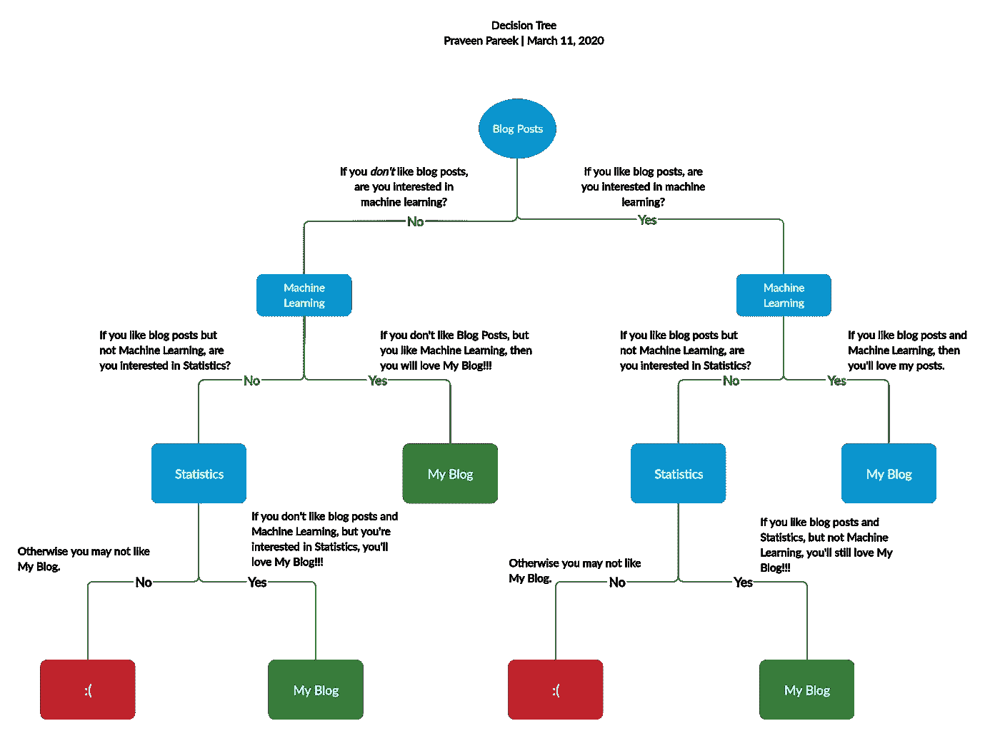

这是一个简单的例子，但它说明了一个**决策树**，一个简单的机器学习方法。

这个特殊的**决策树**的目的是 ***预测*** 是否有人会喜欢我的博客。

 [## 金融中的机器学习|数据驱动的投资者

### 在我们讲述一些机器学习金融应用之前，我们先来了解一下什么是机器学习。机器…

www.datadriveninvestor.com](https://www.datadriveninvestor.com/2019/02/08/machine-learning-in-finance/) 

或者，我们可以说这个**决策树*将一个人分类为*** 要么喜欢我的博客，要么不喜欢。

既然**决策树**是机器学习的一种类型，那么如果你理解我们如何使用这种树来 ***预测*** 或 ***分类*** 如果有人喜欢我的博客，你就已经在理解**机器学习的路上了。**

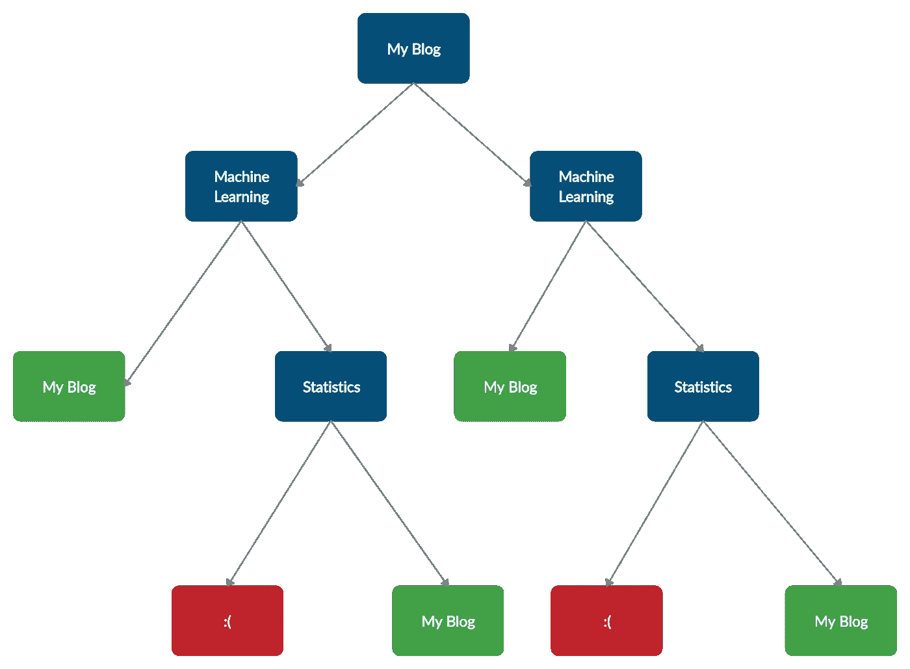

这里再举一个**机器学习**的例子。

想象一下，我们测量了一个人跑 100 米的速度…以及他们喝了多少能量饮料…

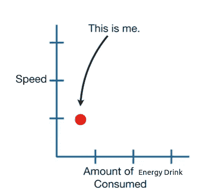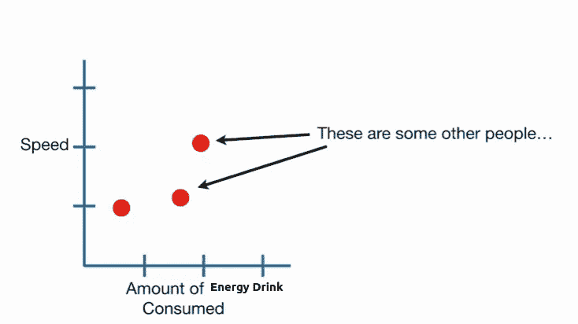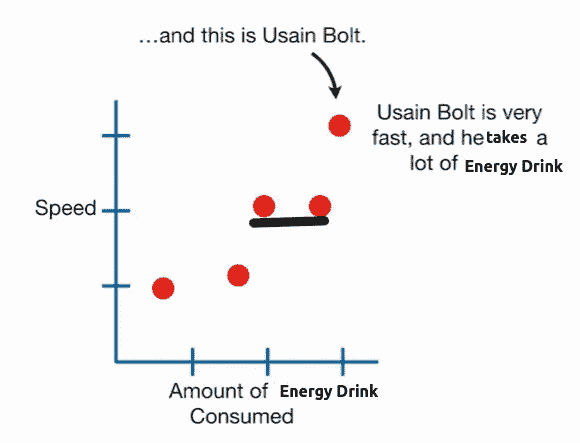

根据这些数据，我们看到，一个人喝的能量饮料越多，他跑 100 米的速度就越快。我们可以拟合一条黑线来表示趋势。

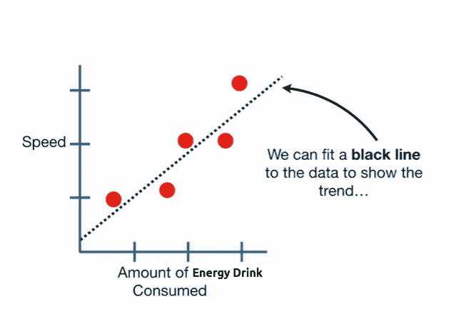

我们也可以用**黑线**做 ***预测*** 。例如，如果有人告诉我们他们有一定量的能量饮料，那么我们可以使用**黑线**来预测那个人可能跑多快。

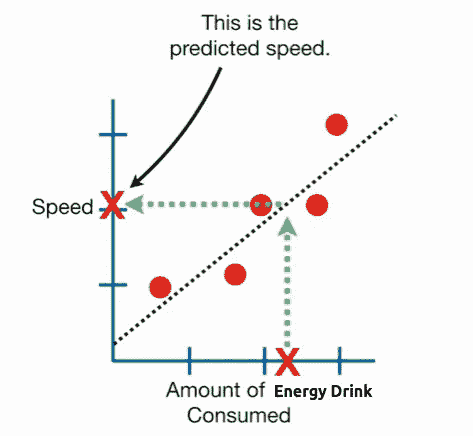

**黑线**是**机器学习**的一种，因为我们可以用它来做 ***预测*** 。

一般来说，**机器学习**就是做 ***预测*** 和 ***分类*** 。

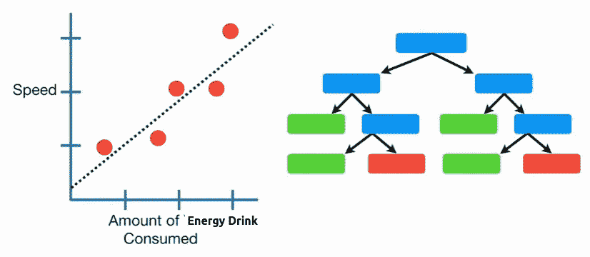

既然可以做出 ***预测*** 和 ***分类*** ，那就来说说**机器学习**中的一些主要思想。

首先，在**机器学习行话**中，原始数据叫做**训练数据**。

所以**黑线**适合**训练数据。**

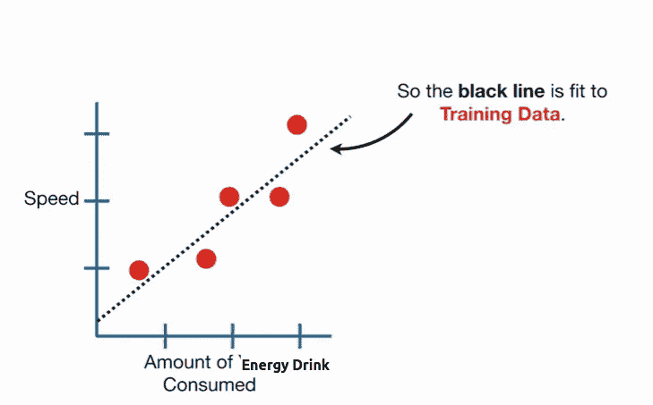

或者，我们可以在**训练数据**上画一条绿色曲线**。**

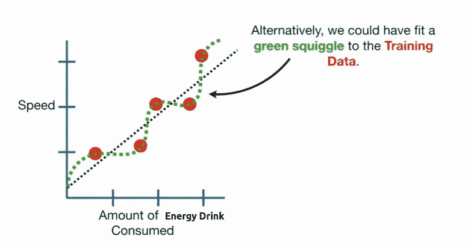

**绿色曲线**比**黑线**更符合**训练数据**，但是记住，**机器学习**的目标是做出 ***预测*** …

…所以我们需要一种方法来决定**绿色曲线**在做出 ***预测*****黑线**时是好是坏…

所以我们找了一个新人，测量他们跑得有多快，喝了多少能量饮料。

然后我们找到另一个人……和另一个人……总之，**蓝点**代表**测试数据**。

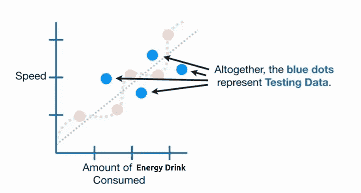

我们使用**测试数据**来比较由**黑线**做出的 ***预测*** 与由**绿色曲线**做出的 ***预测***…

先来看看**黑线**对**测试数据**中每个人的速度预测有多好。

测量每个人在测试数据中的实际速度和预测速度之间的距离，并将所有这些数据相加。

现在让我们用**绿色曲线**来计算实际速度和预测速度之间的距离。

我们记得**绿色曲线**在拟合**训练数据**方面做得很好……但是当我们在做**机器学习**的时候，我们更感兴趣的是**绿色曲线**如何用新数据做出 ***预测*** 。

所以就像以前一样，我们确定这个人的真实速度…和他们的预测速度…并测量他们之间的距离。就像我们对黑线所做的一样，我们将记录绿色曲线的距离。

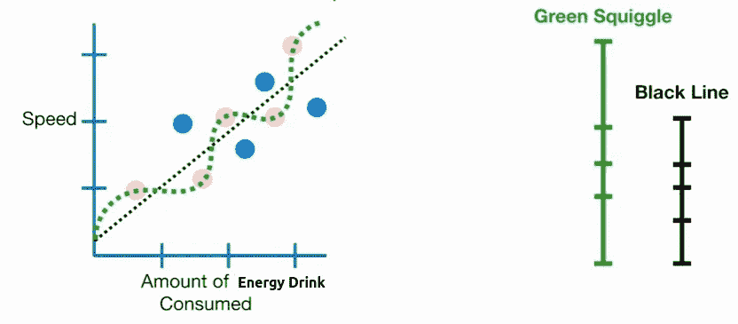

绿色曲线的距离总和大于黑色曲线的距离总和… 换句话说，尽管绿色曲线**比黑色曲线**更适合**训练数据**…**黑色曲线**更适合用**测试数据预测速度。**

因此，如果我们必须在使用**黑线**或**绿色曲线**进行预测之间做出选择，我们会选择**黑线……**

这个例子讲述了关于机器学习的两个主要观点。

**首先，**我们用**测试数据**来评估**机器学习**方法。

**其次**，不要被一个**机器学习**方法与**训练数据**的契合度有多好所迷惑。

**注:**对**训练数据**拟合较好但预测较差，称为**偏差-方差权衡**。

在我们继续之前，你可能想知道为什么我们用简单的黑线和愚蠢的绿色曲线代替..

**深度学习卷积神经网络**

或者

一些最新的、最好的、奇特的机器学习方法

有很多听起来很棒的机器学习方法……每年都有新的令人兴奋的东西出现……但是不管你用什么，最重要的不是它有多棒，而是它在测试数据中的表现。

**概要:**

*   **机器学习**就是做 ***预测*** 和 ***分类*** 。
*   有大量新奇的**机器学习**方法，但了解它们最重要的不是什么让它们如此新奇……而是我们通过使用**测试数据来决定哪种方法最适合我们的需求。**

最后一件事，你可能想知道我们如何决定哪些数据进入**训练集**，哪些数据进入**测试集**。

早些时候，我们只是武断地决定**红点**是**训练数据** …但是**蓝点**也可能是**训练数据**。

> [嘿！我们已经到了激动人心的博客文章的结尾。如果你喜欢这篇博文，并想了解更多，请在这个平台上关注我。](https://medium.com/@praveen.pareek)

[**查看我的精选贴:*一个新世界【战争】！！！***](https://medium.com/@praveen.pareek11/a-new-world-war-9f93e6a4b9b0)