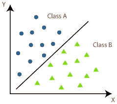
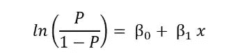
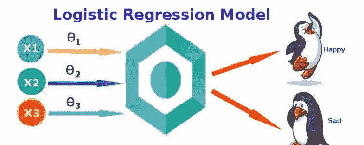
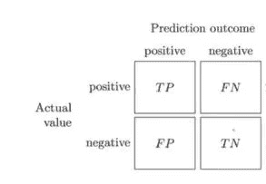

# 机器学习算法介绍-逻辑回归

> 原文：<https://medium.datadriveninvestor.com/introduction-to-machine-learning-algorithms-logistic-regression-eae0bf3883d8?source=collection_archive---------5----------------------->

关于如何执行逻辑回归的分步教程

Photo by [Pietro De Grandi](https://unsplash.com/@peter_mc_greats?utm_source=unsplash&utm_medium=referral&utm_content=creditCopyText) on [Unsplash](https://unsplash.com/s/photos/landscape?utm_source=unsplash&utm_medium=referral&utm_content=creditCopyText)

在这个人工智能时代，机器学习是一个时髦的话题。它专注于开发计算机程序，使计算机能够在没有人类干预的情况下自动学习。与机器学习相关的技术存在于当今时代的每个行业，并且在未来将具有重要意义。

在我以前的文章中，我讨论了回归算法的类型及其实现。你可以在博客的末尾找到链接。在这个博客中，我们将讨论逻辑回归。逻辑回归是分类模型中的算法之一。

 [## 将定义 2020 年就业前景的五大数据科学和机器学习趋势|数据驱动…

### 数据科学和 ML 是 2019 年最受关注的趋势之一，毫无疑问，它们将继续发展…

www.datadriveninvestor.com](https://www.datadriveninvestor.com/2020/02/19/five-data-science-and-machine-learning-trends-that-will-define-job-prospects-in-2020/) 

# 什么是分类？

这是将一组数据分类的过程。它可以在结构化和非结构化数据上执行。类有时被称为目标、标签或类别。它属于监督学习。

classification

# 监督学习

监督式学习顾名思义是指作为老师的监督人的存在。训练数据将由与正确输出配对的输入组成。在训练期间，算法将在数据中搜索与期望输出相关的模式。在训练之后，它将接受新数据，该新数据将基于先前的训练数据来确定新输入将被分类为哪个标签。动机是预测新输入数据的正确标签。它可以写成

# 逻辑回归

它是一种统计机器学习算法，用于对数据进行分类。当因变量是分类变量时，它可以被应用。逻辑回归的目标是根据数据之间的关系将数据分配到各自的类中。逻辑回归的方程式可以写成

Dataaspirant.com

逻辑回归的例子包括

*   确定收到的电子邮件是否是垃圾邮件。
*   以确定银行贷款是否被批准。
*   不管肿瘤是不是恶性的。

我们有许多类型的逻辑回归，比如

## 1.二元逻辑回归:

这是一种有两种结果的分类。例子包括收到的邮件是否是垃圾邮件。

## 2.多项式逻辑回归

这是一种有两种以上结果的分类。例子包括汽车的价格是贵、中还是便宜。

## 3.有序逻辑回归

这是一种按顺序排列更多结果的分类，有序逻辑回归的一个例子是在 1-10 的范围内给幸福评分。

# 我们来编码吧！

这里我们使用 scikit-learn 库来导入线性回归模型并直接使用它。在线上有许多数据集可用于线性回归。你可以在下面的链接中找到数据集和代码。

 [## ajaymuktha/机器学习

### 在 GitHub 上创建一个帐户，为 ajaymuktha/机器学习开发做贡献。

github.com](https://github.com/ajaymuktha/Machine-Learning) 

**导入库**

在上面几行代码中，我只是导入了这个过程中需要的所有库

Numpy →这是一个用于处理数组的库。

Pandas →将数据文件作为 Pandas 数据框加载并分析数据。

Matplotlib →我已经导入 pyplot 来绘制数据的图形

# 导入数据集

我们的文件是 CSV(逗号分隔值)格式，所以我们使用 pandas 导入文件。然后我们把数据分成因变量和自变量。x 被认为是独立的，Y 被认为是从属的。

# 训练装置和测试装置

从 Sklearn 的子库 model_selection 中，我导入了 train_test_split，它用于分割训练集和测试集。我们可以使用 train_test_split 函数进行拆分。函数中的 test_size = 0.25 表示应该保留下来进行测试的数据的百分比。

# 特征缩放

当我们处理一个模型时，确保值在相同的范围内是很重要的，否则很难将它传递给模型。为了解决这个问题，我提出了特征缩放。它是一种将固定范围内的数据中存在的独立特征标准化的技术。这是在数据预处理期间执行的。

在我们的数据集中，我们有四个特征

1.  用户标识
2.  年龄
3.  预期收入
4.  购买

在这里，我们把年龄和估计收入作为自变量，把购买作为因变量。在我们的独立变量中，年龄以十为单位，收入以千为单位，需要对这些变量应用特征缩放以获得最佳预测。

sci-kit 学习库提供了一个类来缩放我们的数据，我们可以从预处理中使用 StandaradScaler 类。我们从库中导入类，我们将为它创建一个对象。我们将利用 fit_transform 方法将独立变量的训练集和测试集转换到相同的范围内。

# 现在让我们来拟合数据

从子库线性模型 Sklearn 中，我们导入线性回归，并根据训练数据拟合模型。

# 预测测试结果

# 评估指标

简单地建立一个预测模型不是我们的动机。它是关于创建和选择一个模型，给出样本数据的高精度。因此，在计算预测值之前检查模型的准确性至关重要。我们将利用一种用于计算分类模型准确性的评估度量技术。下面详细讨论一下。

## 混淆矩阵

它是机器学习中分类模型的一种性能测量技术，其中输出具有两个或更多类别。这是一个包含实际值和预测值的四种不同组合的表格。

让我们来理解混淆矩阵中的术语。

## 真阳性(TP)

如果实际值和预测值都是真的，那么就是真正。比如你预测一个女人怀孕了，她也怀孕了。

## 假阴性(FN)

如果实际值为真，预测值为假，那么就是假阴性。例如，你预测一个女人没有怀孕，但她怀孕了。

## 假阳性

如果预测值为假，但实际值为真，则为假阳性。例如，你预测她怀孕了，但她没有怀孕

## 真阴性(TN)

如果预测值为假，实际值也为假，则为真阴性。比如你预测她没怀孕，她也没怀孕。

让我们从 metrics 类导入混淆矩阵并为其创建一个对象，然后我们将 y_test 和 y_pred 作为参数传递，以了解预测值的准确性。这里需要加上真正真负才能知道模型的表现。

下面是我所做工作的总结:我加载了数据，将数据分为训练集和测试集，应用标准的 scaler 方法将数据归一化到相同的范围内，将回归模型拟合到训练数据，基于这些数据进行预测，并在测试数据上测试预测。

每个机器学习爱好者都必须了解分类算法。下面是我关于回归类型的博客。暂时就这样吧！我希望你喜欢这篇文章。

 [## 机器学习算法介绍-线性回归

### 人工智能(AI)使机器能够从经验中学习，适应新的输入并执行…

medium.com](https://medium.com/swlh/introduction-to-machine-learning-algorithms-linear-regression-39d422efa7dc)  [## 机器学习算法介绍-多元线性回归

### 关于多元回归和如何构建多元回归，你需要知道的就是

medium.com](https://medium.com/datadriveninvestor/introduction-to-machine-learning-algorithms-multiple-linear-regression-a65c7ae8c2a6)  [## 机器学习算法介绍-多项式回归

### 关于多项式回归和如何构建模型，您需要知道的全部内容

medium.com](https://medium.com/@ajaymuktha/introduction-to-machine-learning-algorithms-polynomial-regression-47d3a2b95add)