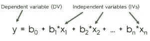
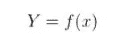

# 机器学习算法介绍-多元线性回归

> 原文：<https://medium.datadriveninvestor.com/introduction-to-machine-learning-algorithms-multiple-linear-regression-a65c7ae8c2a6?source=collection_archive---------4----------------------->

关于多元回归和如何构建多元回归，你需要知道的就是

Photo by [Adam Vradenburg](https://unsplash.com/@vradenburg?utm_source=unsplash&utm_medium=referral&utm_content=creditCopyText) on [Unsplash](https://unsplash.com/s/photos/lake?utm_source=unsplash&utm_medium=referral&utm_content=creditCopyText)

在我的上一篇文章中，我讨论了如何处理只有一个因变量和一个自变量来预测模型的情况(线性回归)。你可以在下面找到这篇文章的链接

 [## 机器学习算法介绍-线性回归

### 人工智能(AI)使机器能够从经验中学习，适应新的输入并执行…

medium.com](https://medium.com/swlh/introduction-to-machine-learning-algorithms-linear-regression-39d422efa7dc) 

如果有一个以上的独立变量怎么办，如果我们的模型需要一个以上的特征来预测结果呢？多元线性回归的概念来了。

 [## 认知计算——一套被广泛认为是……

### 作为它的用户，我们已经习惯了科技。这些天几乎没有什么是司空见惯的…

www.datadriveninvestor.c](https://www.datadriveninvestor.com/2020/02/19/cognitive-computing-a-skill-set-widely-considered-to-be-the-most-vital-manifestation-of-artificial-intelligence/) 

多元线性回归也称为多元回归。这是线性回归分析最常见的形式。它解释了一个因变量和多个自变量之间的关系。

回归的总体思想是检查两件事:

1.  具体来说，哪些变量/特征是结果变量的重要预测因素？
2.  一组预测变量能很好地预测结果吗？

多重回归由以下等式表示

# 监督学习

监督式学习顾名思义是指作为老师的监督人的存在。训练数据将由与正确输出配对的输入组成。在训练期间，算法将在数据中搜索与期望输出相关的模式。在训练之后，它将接受新数据，该新数据将基于先前的训练数据来确定新输入将被分类为哪个标签。动机是预测新输入数据的正确标签。它可以写成

# 我们来编码吧！

这里我们使用 scikit-learn 库来导入多元回归模型并直接使用它。在线上有许多数据集可用于线性回归。你可以在下面的链接中找到数据集和代码

 [## ajaymuktha/机器学习

### 在 GitHub 上创建一个帐户，为 ajaymuktha/机器学习开发做贡献。

github.com](https://github.com/ajaymuktha/Machine-Learning) 

# **导入库**

在上面几行代码中，我只是导入了这个过程中需要的所有库

Numpy →这是一个用于处理数组的库。

Pandas →将数据文件作为 Pandas 数据框加载并分析数据。

Matplotlib →我已经导入 pyplot 来绘制数据的图形。

# **导入数据**

我们的文件是 CSV(逗号分隔值)格式，所以我们使用 pandas 导入文件。然后我们把数据分成因变量和自变量。x 被认为是独立的，Y 被认为是从属的。

我们的数据集是关于创业公司的，包含五个特征

1.  花费在研发上的金额
2.  管理费用
3.  营销费用
4.  创业的地点
5.  创业获得的利润

这里我们还将考虑因变量和自变量，根据上述特征，我们将利润视为因变量，其余视为自变量。

# 数据预处理

一切看起来还好吗？我不这么认为，我们需要在数据预处理方面下功夫。这里我们有一个分类变量，即位置。分类变量不能被机器处理，它应该被编码成一个数字。

这里我们使用 LabelEncoder 对文本进行编码，我们需要从 scikit-learn 导入 Label Encoder 包，为 Label Encoder 创建一个对象。位置的索引值是 3，它属于 X(自变量)，所以我们声明 X[:，3]并且我们将使用 fit_transform 方法将文本转换为数字。

现在，文本已经被数字所取代，如果有两个以上的类别，我们一直将整数分配给不同的类别，这会导致混乱。假设我们有四个类别，我们给第一个类别分配 0，给最后一个类别分配 3。但由于 1 大于 0，3 大于 1，所以模型中的方程我们认为 3 比 0 优先级最高。为了解决这个问题，我们使用虚拟变量，其中 n 个类别有 n 个列，我们使用了 *OneHotEncoder* 。

dummy variables

让我详细解释一下虚拟变量，上图是创建虚拟变量的例子。在图中，我们有三种不同类型的类别，所以我们为每个类别创建了每个列。当给定的类别等于相同的列类别时，我们分配一个或零。

类似于 LabelEncoder，我们将为 OneHotEncoder 创建一个类，并为类别数赋值，在我们的问题中，我们有三个不同的类别，所以我们分配三个。

# 训练装置和测试装置

从 Sklearn 的子库 model_selection 中，我已经导入了 train_test_split，用于拆分训练集和测试集。我们可以使用 train_test_split 函数进行拆分。函数中的 test_size = 0.2 表示应该保留用于测试的数据的百分比。

# 现在让我们来拟合数据

从 Sklearn 的子库线性回归中，我们导入线性回归，并根据训练数据拟合模型。我们使用 R2 分数来衡量我们模型的准确性。

# 预测测试结果

R2-Score

以下是我所做的总结。我已经加载了数据，将特征分为因变量和自变量，将分类数据编码为数字并创建虚拟变量，将数据分为训练集和测试集，将回归模型拟合到训练数据，基于该数据进行预测，并在测试数据上测试预测。

每个机器学习爱好者都必须了解回归，这也是想要学习机器学习的人的正确起点。暂时就这样吧！我希望你喜欢这篇文章。

感谢

 [## 回归和分类的终极指南-博客超级数据科学-大数据|分析…

### 欢迎来到回归和分类的第 1 部分——简单线性回归:第 1 步。你可能还记得这个概念…

www.superdatascience.com](https://www.superdatascience.com/blogs/the-ultimate-guide-to-regression-classification)