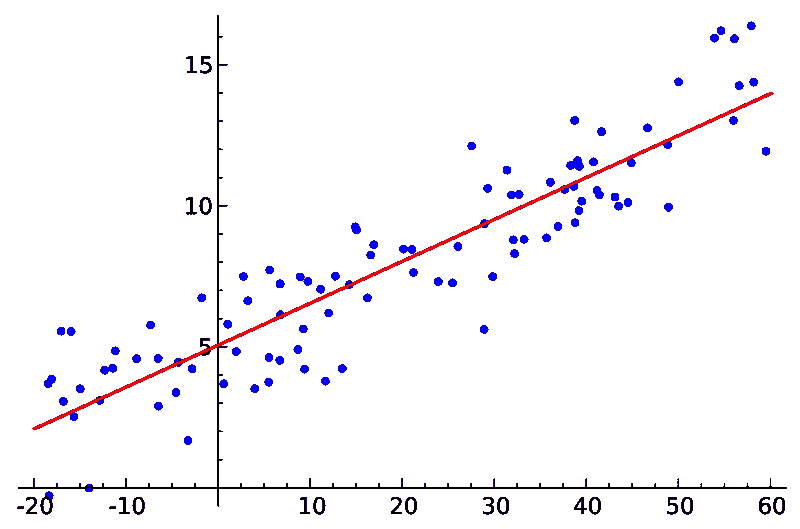
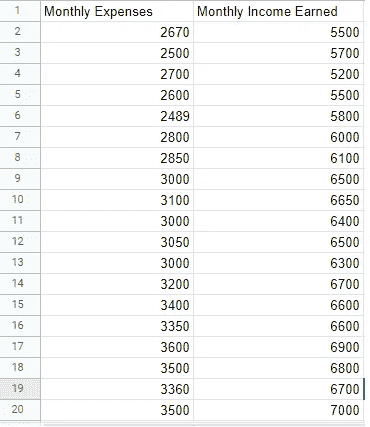
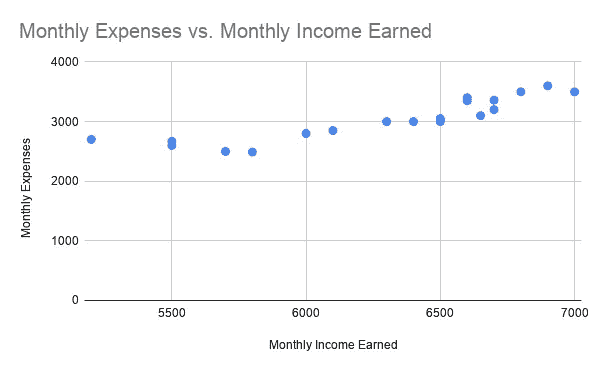
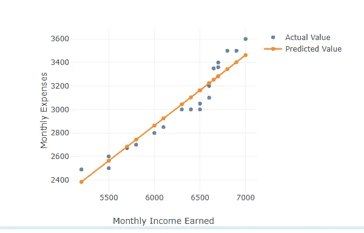

# 机器学习算法介绍:简单线性回归(初学者)

> 原文：<https://medium.datadriveninvestor.com/introduction-to-machine-learning-algorithms-simple-linear-regression-for-beginners-42e846d05286?source=collection_archive---------14----------------------->

Linear regression Model

当学习线性回归模型时，首先想到的是线性方程。因此，不管你是否有计算机科学背景，我们都对这个数学概念有所了解，因为任何中学毕业的人都能够理解简单的线性回归模型。

为了理解线性回归，让我们先探讨一下回归的含义。根据定义，回归是一个变量的平均值与其他变量的相应值之间关系的度量。它是一种对因变量和自变量之间的关系进行建模的方法。回归分析最常见的形式是简单线性回归。

简单线性回归是有一个因变量(y)和一个自变量(x)的线性回归模型。形容词*简单*指的是结果变量与单个预测因子相关的事实。

上图中红线所示的最佳拟合线是基于简单的线性方程计算的:

y = a + bx

这里有几个概念需要解释:

让我们举一个简单的家庭月支出和月收入的例子，并尝试基于简单的线性回归分析对其建模。这将有助于我们预测未来的节省。

首先，你处理一些数据。

 [## 什么是数据目录，它如何使机器学习取得成功？数据驱动的投资者

### 数据目录是机器学习和数据分析的燃料。没有它，你将不得不花费很多…

www.datadriveninvestor.com](https://www.datadriveninvestor.com/2020/08/27/what-is-a-data-catalog-and-how-does-it-enable-machine-learning-success/) 

在一个家庭中，记录每月的收入和支出是一种常见的做法，在计算机的电子表格中的某个地方，我的意思是谁不这样做。

这个数据可能在这一点上看起来更简单，除了控制你的支出(如果它超过你的收入)之外，没有多少用处。

但是要规划未来，如果把线性回归模型运用到其中，会是非常有用的数据。

当我们绘制这些数据时，下面的图表出现了。

Graph for Monthly Income vs Monthly Expenditure

现在，随着我们的进展，我们可以看到这两个参数之间有一些联系。显然，你已经知道了，但是有了准确的数据和图表，你就能确定这种联系，并能回答一些问题，如:

*在未来 5 年里，你能为一项主要支出留出多少钱，比如一辆昂贵的汽车或你孩子的大学学费，以及你需要控制多少钱来满足你的需求？*

为了回答这个问题，你将使用到目前为止你已经收集的数据，并用它来**预测**随着收入的变化你将花费多少。这个想法是，你可以根据过去的数据对未来进行估计性的猜测——这些数据点是你一直在努力记录的。

你最终得到一个数学模型**来描述收入和支出之间的关系。**

一旦定义了这个模型，你就可以向它提供新的信息——你在未来五年内会花多少钱——这个模型将**预测**在不久的将来你需要存多少钱来满足某项特定的开支。

我们上面绘制的图表将定义参数之间的关系，就像这样。

Simple Linear Regression Model showing the line of best-fit

这种关系是简单的线性回归，最佳拟合线由下式定义:

*y = 0.599757x — 735.368087*

*原载于 2020 年 10 月 12 日*[*https://www.numpyninja.com*](https://www.numpyninja.com/post/introduction-to-machine-learning-algorithms-simple-linear-regression-for-beginners)*。*

## 访问专家视图— [订阅 DDI 英特尔](https://datadriveninvestor.com/ddi-intel)