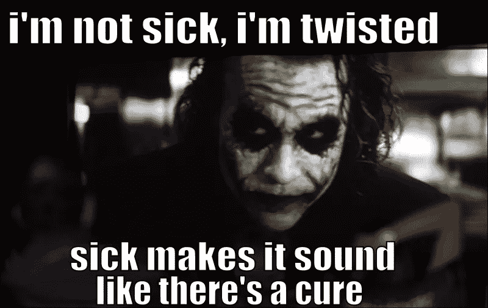
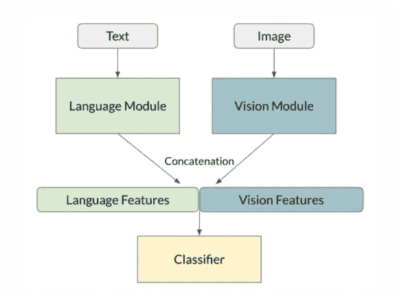
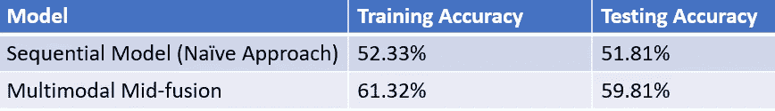

# PyTorch 和 fastText 的模因分类介绍

> 原文：<https://medium.datadriveninvestor.com/introduction-to-meme-classification-using-pytorch-and-fasttext-e667a81b5e0?source=collection_archive---------5----------------------->

> **简介**

*   **为什么要进行模因分类？**

迷因可以成为有趣的内容。但是对一个人来说很有趣的内容对另一个人来说可能是讨厌的。有些人还故意创造一个迷因，其突出目的是传播对一个社区或一个人的仇恨。

因为社交媒体的内容覆盖范围不限于任何人。阅读模因在大学生的生活中是很常见的。然而，许多人在社交媒体网站上分享令人反感的模因，鼓励他们的想法。这种模因试图取笑目标个人或群体。这种迷因的想法和陈述应该被制止，否则就太晚了。许多学生阅读这样的模因，并可能接受这个想法是可以接受的。来自世界各地的数据分析师正试图解决识别这些模因的问题。

虽然迷因分类的问题可以是多类的，但为了简单起见，为了让你对如何处理视觉和语言数据有所了解，我们将首先确定给定的迷因是否是可恨的？(二元分类)

欢迎来到这个增强的领域🐱‍🚀按照时间顺序，我们在我们的研究领域应用了全球平台上一些最佳实践技术。

不要再拖延了，让我们看看如何解决这个问题吧！✌

> **数据预处理:**

如果你是新手，想知道事情如何🤷‍♀️使用 Pytorch 和 FastText，我推荐你花几分钟阅读 Pytorch _tutorials 和 fasttext _ tutorial📰极客不用担心我们有一个 [PyTorch_youtube](https://www.youtube.com/playlist?list=PLLHTzKZzVU9eaEyErdV26ikyolxOsz6mq) 📽给你的播放列表，看看吧。

我们将使用由 Drivendata 脸书仇恨迷因挑战赛提供的数据集。该数据集仅提供给竞争对手，由于公平内容政策，尚未外包。

该数据集由 8500 幅图像组成，每幅图像都有一个唯一的 id 和一个给定的标签，以确定给定的图像是否有毒？

Image taken from Facebook AI Meme Classification challenge dataset.

*   上面是一个给定的迷因图像，为了研究这个，我们首先要从给定的图像中提取文本。我们将使用一些最好的在线 OCR 工具从给定的图像中抓取文本。我们也可以制作自己的 OCR 模型来做同样的事情。
*   数据集中给定的图像大小不同，我们将使用 torchvision.transform 将所有给定图像的大小调整为 dim (224*224*3)，因为不同大小的图像通常难以处理。

现在，我们必须独立处理图像和文本数据，因为解决方案不能只依赖于图像或文本。只有将两者结合起来，才能理解其背后的含义。

幸运的是 PyTorch 已经有一个内置的数据集类，你可以通过这篇简短的[教程](https://pytorch.org/tutorials/beginner/data_loading_tutorial.html)来了解这个类的架构。

令人惊奇不是吗？🧙‍♂️You 不知道 PyTorch 还能提供什么！

我们希望数据集返回准备好用于模型输入的数据，这意味着我们需要准备:

*   应用`image_transform`的图像
*   应用`text_transform`文本

上面介绍了`image_transform`，而`text_transform`将是我们的 fastText 模型创建的“句子向量”。

> **提议的方法:**

1.  要解决这个问题，一个简单的方法是在我们的 image_transform 数据集上应用图像字幕，并将其转换为文本。然后应用各种 NLP 技术，把它当成一个情感分析问题。

*   关于图像字幕可以参考博客:[https://medium . com/analytics-vid hya/introduction-to-Image-caption-generation-using-the-Avengers-infinity-war-characters-6 f 14 df 09 DBE 5](https://medium.com/analytics-vidhya/introduction-to-image-caption-generation-using-the-avengers-infinity-war-characters-6f14df09dbe5)
*   进一步的情感分析可以参考使用 LSTM [创建的 FakeNews 分类器 https://medium . com/@ sthacruz/fake-news-classification-using-glove-and-long-short-term-memory-lstm-a 48 f1 DD 605 ab](https://medium.com/@sthacruz/fake-news-classification-using-glove-and-long-short-term-memory-lstm-a48f1dd605ab)

上述解决方案似乎可行和直接，但我们将创建一个多式联运模式。

*In mid-level fusion by concatenation, input data modes pass through their respective modules after which their features are concatenated. The multimodal features are then passed through a classifier.*

因此，在这种方法中，我们将从我们的 image_transform 和 text_transform 中提取特征，并将它们融合在一起，从而形成 1 个特征向量，并进一步将其作为输入传递给我们的神经网络分类器进行预测。

以上设计称为 ***中级 concat 融合。***

为了创建这种定制的融合，我们可以再次感谢 PyTorch，因为它允许我们根据各自的需要创建定制的模块。参考本[指南](https://pytorch.org/tutorials/beginner/examples_nn/two_layer_net_module.html)并尝试执行。

*   在我们的`LanguageAndVisionConcat`架构中，我们将通过图像模型运行我们的图像数据模式，将最后一组特征表示作为输出，然后对我们的语言模式也是如此。然后，我们将连接这些特征表示，并将其视为一个新的特征向量，并通过最终的全连接图层进行分类。
*   有关语言和视觉模块的定义，请参见`_build_model`方法。语言模块将使用`fasttext`嵌入作为输入，在我们的数据生成器中计算为`text_transform`(为了简单起见，我们将保持嵌入固定，尽管它们适合我们的训练数据)。语言模块的输出将来自可训练的`Linear`层，作为在训练期间微调嵌入表示的一种方式。视觉模块输入将是标准化图像，在我们的数据生成器中计算为`image_transform`，输出将是 [ResNet](https://towardsdatascience.com/an-overview-of-resnet-and-its-variants-5281e2f56035) 模型的输出。

> **结果和讨论:**

Results gained from the above discussed architecture

*   **为什么 b/w 两种方法的准确性有很大差异？**

这是因为我们在天真的方法中使用的图像字幕模型还没有完全开发出来，研究仍在继续以提高其准确性。到目前为止，这个模型只有 70%的准确率，所以这就是为什么在将图像转换成文本时，一些预处理过的数据会丢失或不相关。

但是在多模态的情况下，我们不是将一种形式转换成另一种形式，而是按照要求提取特征，并相应地进行实验，从而相对地给我们更高的准确性。

*   虽然有更多的实践可以产生更好的结果，但这些都有点复杂，为了理解它，你应该有基本的特征提取和多模态方法的知识来提高你的学习。

> **结论和概述**:

由于仇恨迷因问题是多模态的，即它由视觉**和**语言数据模式组成，因此访问不同的视觉和语言模型将是有用的。

**视觉模型和实用程序。** `torchvision` by [PyTorch](https://pytorch.org/docs/stable/torchvision/index.html) 由流行的数据集、模型架构(包括预训练的权重)和常见的图像变换组成。如果你用 PyTorch 解决计算机视觉问题，这是必不可少的。

**语言模型和实用程序。** `fasttext` by [脸书人工智能](https://fasttext.cc/)让为你的数据训练嵌入变得容易。

我们使用`torchvision`视觉模型从模因图像中提取特征，使用`fasttext`模型从属于图像的提取文本中提取特征。这些语言和视觉特征被**用`torch`融合**在一起，形成了一个多模态仇恨模因分类器。

**对于一个人来说，检测给定的内容是否令人讨厌的准确率是 80%,相对于此，我们在 test_data 上获得了 59.81%的准确率，这是一个可接受的分数。**

> 如果你发现在实现上述实际问题的解决方案时有困难，我已经附上了 github [链接](https://github.com/Vib-UX/Meme-Classification)用于两种方法的相同实现。

***感谢您的宝贵时间🙌，请随意在下面写下任何建议…如果你觉得你获得了一些知识，别忘了鼓掌👏***