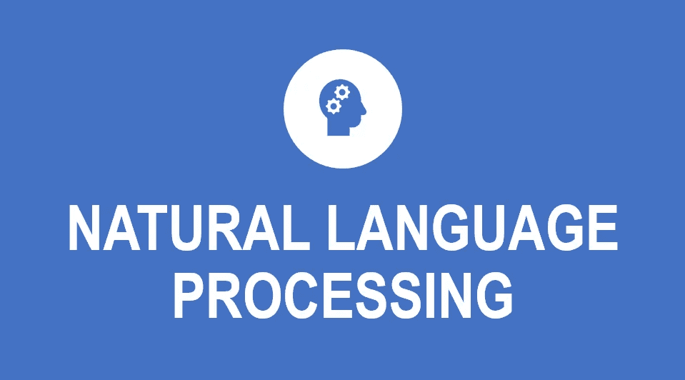
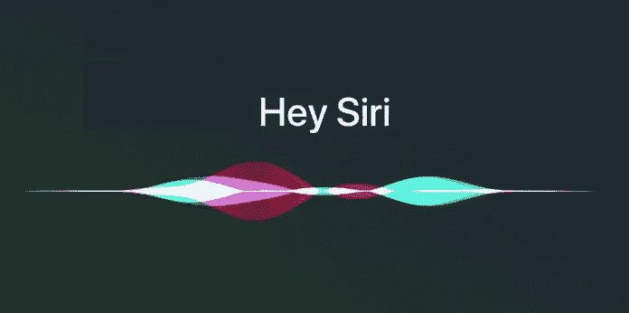
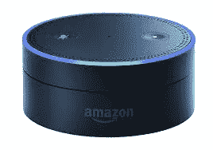

# 自然语言处理(NLP)简介

> 原文：<https://medium.datadriveninvestor.com/introduction-to-natural-language-processing-nlp-bd5b08a49499?source=collection_archive---------4----------------------->

世界上很多信息都是非结构化的:我们需要获取这些数据，并从中提取信息。我们应该关注这种非结构化数据有三个主要原因

> 现在，大量信息以自然语言文本的形式(报纸、网页、医疗记录等)以机器可读的形式存在
> 
> 对话代理正在成为人机交流的一种重要形式
> 
> 如今，许多人与人之间的互动都是通过社交媒体由计算机来完成的

那么，我们如何理解非结构化文本并从中提取数据呢

在这种情况下，自然语言处理可以有所帮助..

*自然语言处理*，或 *NLP* ，是人工智能的一个领域，专注于使计算机具备阅读、理解和从人类语言中获取意义的能力。

NLP 可以用来创建类似于**语音识别**、**文档摘要**、**机器翻译**、**垃圾邮件检测**、**问答、**等系统。

[***TeachOpedia***](https://www.youtube.com/channel/UCCxSpt0KMn17sMn8bQxWZXA)

# **示例**

## **Siri**

它是苹果公司 iOS、watchOS、macOS、HomePod 和 tvOS 操作系统的虚拟助手。你可以用语音命令做很多事情:开始通话、给别人发短信、发送电子邮件、设置定时器、拍照、打开应用程序、设置闹钟、使用导航等等。

[https://www.headlineenglish.com/wp-content/uploads/2020/04/siri.jpg](https://www.headlineenglish.com/wp-content/uploads/2020/04/siri.jpg)

## **Alexa**

亚马逊 Alexa，也简称 Alexa，是亚马逊开发的一种[虚拟助理](https://en.wikipedia.org/wiki/Virtual_assistant) [AI](https://en.wikipedia.org/wiki/AI) 技术。它能够进行语音交互，播放音乐，制作待办事项列表，播放流媒体播客，播放有声读物，并提供天气，交通，体育和其他实时信息，如新闻。

[https://miro.medium.com/max/4944/1*cPCMb_b440XpGin5NY6SHA.png](https://miro.medium.com/max/4944/1*cPCMb_b440XpGin5NY6SHA.png)

## **Gmail 垃圾邮件过滤器**

谷歌开发的著名电子邮件服务 Gmail 正在使用垃圾邮件检测来过滤掉一些垃圾邮件。

[https://www.sema.org/sites/default/files/shutterstock_174041285.jpg](https://www.sema.org/sites/default/files/shutterstock_174041285.jpg)

# 应用程序

## ***文本分析***

文本分析，也称为文本挖掘，是一种从文本数据中提取价值、可操作信息和见解的方法。

示例:

政治观点跟踪

社交网络分析

热门话题分析(什么是热门，人们现在在谈论什么话题)

## 情感分析

这是一项可以用来在给定文本中识别和提取观点的任务。

提取主观信息

检测情绪(生气、高兴、悲伤)

确定意图(感兴趣还是不感兴趣)

## 机器翻译

It 是自动将一种自然语言转换成另一种自然语言，保留输入文本的含义，并在输出语言中产生流畅文本的任务。

示例:

谷歌翻译

## 文本分类

它是根据文本的内容给文本分配标签或类别的过程。

示例:

主题标签

垃圾邮件检测和意图检测。

# **Python 中的 NLP 库**

> Python 中有一些可用的库，这使得它成为执行 NLP 相关任务的一个非常好的编程语言选择。

# 文本 Blob

它*T5 是一个用于处理文本数据的 Python 库。它有一堆很酷的东西，可以帮助分析和理解 python 中的文本数据。Textblob 是任何 NLP 爱好者都应该开始使用的库。它提供了简单的 API，用于处理常见的自然语言处理(NLP)任务，例如*

词性标注

名词短语抽取

情感分析

分类

翻译，等等

***资源***

**文件**——[https://textblob.readthedocs.io/en/dev/index.html](https://textblob.readthedocs.io/en/dev/index.html)

**实用指南**—[https://medium . com/@ uzairadamjee/introduction-to-natural-language-processing-library-text blob-175 dbfd 6a 315](https://medium.com/@uzairadamjee/introduction-to-natural-language-processing-library-textblob-175dbfd6a315)

# 自然语言工具包(NLTK)

NLTK 是一个基本的库，支持 Python 中的分类、词干、标记、解析、语义推理和标记化等任务。它基本上是你进行自然语言处理和机器学习的主要工具。今天，它为正在涉足这个领域(和机器学习)的 Python 开发人员提供了一个教育基础。

这是一个免费的开源库，可以在 Windows、Mac OS 和 Linux 上使用，有大量的教程可以让你顺利进入 NLP 的世界。

***资源***

**文献**——[https://www.nltk.org/](https://www.nltk.org/)

**NLTK 书**——[http://www.nltk.org/book/](http://www.nltk.org/book/)

# 宽大的

它是 Python 中流行且易于使用的自然语言处理库之一。它有助于构建能够处理大量文本并从中获得深刻见解的应用程序。它可以用于与信息提取或自然语言理解系统、深度学习等相关的任务。像 Airbnb、Quora、优步这样的公司正在把它用于生产目的，它有一个活跃的开源社区。

SpaCy 是 NLP 任务的好选择。spaCy 提供的一些特性有

标记化

词汇化

实体识别

依存句法分析

句子识别

词性标注

***资源***

**文件**——[https://spacy.io/](https://spacy.io/)

**实用指南**—[https://medium . com/analytics-vid hya/introduction-to-NLP-library-spacy-in-python-a98cf 344 eb6d](https://medium.com/analytics-vidhya/introduction-to-nlp-library-spacy-in-python-a98cf344eb6d)

# 根西姆

它是一个为主题建模和文档相似性分析而优化的库。在这里列出的 Python NLP 库中，它是最专业的。

即便如此，这也是一个很有价值的工具。它的主题建模算法，比如它的潜在狄利克雷分配(LDA)实现，是同类中最好的。此外，它强健、高效且可扩展。

另外，子领域语义分析(或主题建模)是现代自然语言处理中最令人兴奋的领域之一。

***资源***

**文献**——[https://radimrehurek.com/gensim/](https://radimrehurek.com/gensim/)

# CoreNLP

斯坦福 CoreNLP 是一套工具，用于在你的项目中实现自然语言处理。最初是用 Java 编写的，它也可以与其他语言一起工作，如Python、JavaScript 等等。

这是一套生产就绪的自然分析工具。它包括词性标注、实体识别、模式学习、解析等等。

***资源***

**文件**——[https://stanfordnlp.github.io/CoreNLP/index.html](https://stanfordnlp.github.io/CoreNLP/index.html)

[***TeachOpedia***](https://www.youtube.com/watch?v=bv584v5qRtk)

# 摘要

在这篇文章中，你将了解 NLP 的基础知识，它的应用以及真实世界的例子。最后，我们介绍了 NLP Python 库，它在处理文本数据时非常有用。

> 如果你想看更多的文章，请访问我的博客和 YouTube 频道:
> ***http://uzairadamjee.com/blog*** [***https://www.youtube.com/channel/UCCxSpt0KMn17sMn8bQxWZXA***](https://www.youtube.com/channel/UCCxSpt0KMn17sMn8bQxWZXA)

感谢您的阅读。我希望你喜欢这篇文章😊