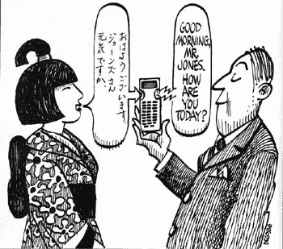
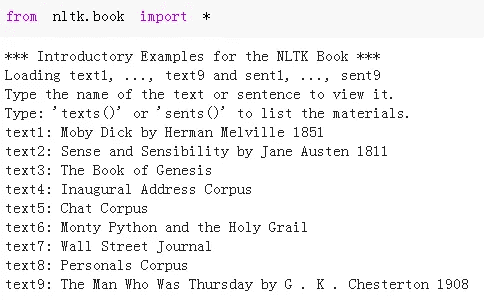
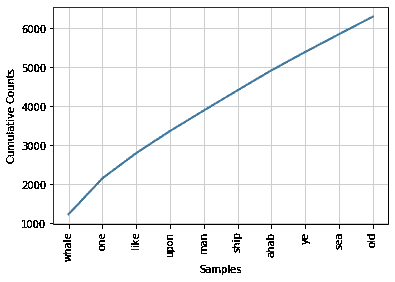

# 使用 NLTK 介绍 NLP

> 原文：<https://medium.datadriveninvestor.com/introduction-to-nlp-with-nltk-1921b2f155f9?source=collection_archive---------10----------------------->

如何处理自然语言数据

我们从经验中学习语言。我们的经验是以听、听、说、读的形式出现的。同样，机器学习算法也在一定程度上从经验中学习语言。由于机器学习算法的“学习”与我们的“学习”相去甚远，语言必须以一种漂亮、整洁的格式进行处理和准备，以便机器学习算法学习。在某种意义上，自然语言处理(NLP)是以机器学习算法可以处理和学习的格式来准备语言。维基百科上更正式的定义是:

> **自然语言处理** ( **NLP** )是语言学、计算机科学、信息工程和人工智能的一个子领域，涉及计算机和人类(自然)语言之间的交互，特别是如何编写计算机程序来处理和分析大量自然语言数据。



[Figure source](https://www.datasciencecentral.com/profiles/blogs/see-this-simple-introduction-to-natural-language-processing-nlp?platform=hootsuite)

在详细介绍如何使用 NLTK 处理文本之前，我想给出一些 NLP 用例的例子:

*   自动更正
*   聊天机器人
*   翻译
*   推文、评论等的情感分析。
*   假新闻和垃圾邮件检测
*   生成文本

这些只是当今实践中使用的 NLP 的一些例子。自从在 NLP 上做了大量的研究以来，它一直在改进。语言是非结构化数据，所以我们可以从语言中推断出很多信息。然而，为了得到有意义和有用的结果，非结构化需要大量的预处理。

[](https://www.datadriveninvestor.com/2019/02/07/8-skills-you-need-to-become-a-data-scientist/) [## 成为数据科学家所需的 8 项技能|数据驱动型投资者

### 数字吓不倒你？没有什么比一张漂亮的 excel 表更令人满意的了？你会说几种语言…

www.datadriveninvestor.com](https://www.datadriveninvestor.com/2019/02/07/8-skills-you-need-to-become-a-data-scientist/) 

像任何其他高级领域一样，全面了解基础知识至关重要。对于优秀的自然语言处理模型来说，预处理语言数据是绝对必要的。在这篇文章中，我将介绍使用自然语言工具包(NLTK)处理文本的一些基础知识。

正如 NLTK [网站](https://www.nltk.org/)上所说，“NLTK 是构建 Python 程序来处理人类语言数据的领先平台”。它提供了许多有用的方法和函数来处理和分析语言数据。

让我们从导入依赖项开始:

```
import nltk
nltk.download("popular")
```

NLTK 也提供书籍让我们练习。我们只需要下载这些书:

```
nltk.download("book")
from nltk.book import *
```



# **文本长度**

文本最基本的特征是长度，使用 **len** 函数可以很容易地计算出长度:

```
len(text3)
  44764len(text1)
  260819
```

《莫比·迪克》比《创世纪》长得多。len 函数给出了令牌的总数。一个**令牌**是一个字符序列。例如，在“你好，世界！”中有 2 个令牌以及“你好，世界:)”中的 3 个代币。我们可能还想通过计算独特单词的数量来检查文本的多样性。例如，一段文本可能很长，只是重复相同的单词。为此，我们**使用**设置 python 的方法。集合只包含不同的值:

```
list = ['a','a','b','c','d','d','d']set(list)
  {'a', 'b', 'c', 'd'}
```

同样，我们可以计算出“莫比迪克”和“创世纪”中独特记号的数量。但是，比较唯一令牌数与所有令牌数的比率更有意义。这一比率也被称为**词汇多样性**，它是一篇文本多样性的一种度量。

```
len(set(text3)) / len(text3)
  0.06230453042623537len(set(text1)) / len(text1)
  0.07406285585022564
```

这两本书的词汇多样性相似，只有 1.2%的差异。

# **词频**

我们检查了单词和独特单词的总数。最常用的词呢？NLTK 还提供了简单易用的函数来确定词频。

词频可以用于情感分析，或者在不阅读全文的情况下对文本有一个大概的了解。

我们可以使用 **FreqDist** 函数计算单词的频率:

```
dist1 = FreqDist(text1)dist3 = FreqDist(text3)
```

我们只是在两本不同的书中创造了单词的频率分布。我们可以用 **most_common** 方法找到常用的单词:

```
dist1.most_common(10)
[(',', 18713),('the', 13721),('.', 6862),('of', 6536),      ('and', 6024),('a', 4569),('to', 4542),(';', 4072),
 ('in', 3916),'that', 2982)]
```

most_common 方法根据每个标记在文本中出现的次数依次返回它。我们只传递我们想看到的令牌数。然而，这里有一个问题。我们可以在最常见的 20 个标记列表中看到，它们大多数是标点符号或无信息的单词(即 a，an，the，is…)。这些记号并没有告诉我们太多关于文本的特征。我们可以轻易地移除这些代币。NLTK 提供了一个简单的下载工具，可以下载常见的无用词，如**停用词:**

```
from nltk.corpus import stopwordspunc = [',','.',';','-','"','!','--','?', '."',"'",':']
```

我们使用停用词和标点符号列表来过滤原始文本。我手动创建了一个标点符号列表，但是 NLTK 也为这个任务提供了工具，比如 **regexp_tokenize** 函数。在我们过滤文本之前，我们将单词转换为小写字母和大写字母不会导致相同的单词被检测为不同的单词:

```
text1_lower = [w.lower() for w in text1]#filter out stopwords and punctuations
text1_filtered = [word for word in text1 if word not in (stopwords.words('english') + punc)]
```

然后我们可以创建一个新的频率分布:

```
dist1_filtered = FreqDist(text1_filtered)
```

按照与 text3 相似的步骤，我们发现这两本书最常见的单词如下:

```
dist1_filtered.most_common(10)
[('whale', 1226),('one', 921),('like', 647),('upon', 566),
 ('man', 527),('ship', 518),('ahab', 511),('ye', 472),
 ('sea', 455),('old', 450)]dist3_filtered.most_common(10)
[('unto', 598),('said', 477),('thou', 284),('thy', 278),
 ('shall', 259),('thee', 257),('god', 231),('lord', 207),
 ('father', 198),('land', 184)]
```

令人惊讶的是，在莫比迪克中最常见的词是“鲸鱼”！

我们还可以使用 FreqDist 对象检查特定单词的计数:

```
dist1_filtered['sea']
455dist1['sea']
433dist1['Sea']
22
```

如果我们不转换成小写字母，我们会误算单词的出现次数。

我们可以画出常用词的频率:

```
len(dist1_filtered)
17074dist1_filtered.plot(10, cumulative=True)
```



Cumulative frequency distribution plot of 10 most common words

10 个最常见的单词产生了全书的 35%以上(过滤版)。

# **二元模型**

有时，仅仅根据单个单词进行分析是不够的。检查组词能让我们对文章有更多的了解。 **Bigram** 是一对词，trigram 是一组三个词等等。如果我们把分析局限在语言上，我们肯定会忽略有价值的信息。因此，在分析自然语言时，我们需要开放思维，寻找复杂的模式和简单的统计数据。

**搭配**NLTK 的功能给了我们一个常见二元模型的列表:

```
text1.collocations()Sperm Whale; Moby Dick; White Whale; old man; Captain Ahab; sperm
whale; Right Whale; Captain Peleg; New Bedford; Cape Horn; cried Ahab; years ago; lower jaw; never mind; Father Mapple; cried Stubb; chief mate; white whale; ivory leg; one hand
```

在“莫比·迪克”这本书的情况下，“莫比”和“迪克”都没有出现在常用词中。然而，“莫比·迪克”却在常见的重婚者名单中。

# **条件**

语言数据也可以根据定义的条件进行分析。例如，我们可能希望检查以特定字符结尾或长度超过特定长度的单词。

让我们检查一下我们一直在分析的书中的单词长度:

```
fdist1_length = FreqDist(len(w) for w in text1_filtered)
fdist3_length = FreqDist(len(w) for w in text3_filtered)fdist1_length.most_common(5)
[(4, 24215), (5, 21529), (6, 16349), (7, 13547), (3, 10476)]fdist3_length.most_common(5)
[(4, 6172), (5, 3840), (6, 2431), (3, 2083), (7, 1530)]
```

这两本书在单词长度方面是相似的，但是平均单词长度可以在一些任务中提供有用的信息。例如，更正式的来源通常比非正式的来源(如推特或短信)有更长的单词。

我们可以基于多个条件搜索文本。例如，下面的代码返回以“tion”结尾且超过 10 个字符的单词。

```
[w for w in set(text1_filtered) if w.endswith('tion') and len(w) > 10]
['congregation','ejaculation','abstraction','combination', ...#length > 15[w for w in set(text1_filtered) if w.endswith('tion') and len(w) > 15]
```

# **结论**

NLP 是一个非常广泛的领域，在工业和我们的日常生活中有许多不同的应用。在这篇文章中，我的目的是让你了解使用 NLTK 的 NLP。我们可以将语言视为非结构化数据，因此它需要大量的处理和分析，以获得对语言数据的全面理解并从中得出结果。

感谢您的阅读。如果您有任何反馈，请告诉我。

# **参考文献**

*   [https://www.nltk.org/](https://www.nltk.org/)