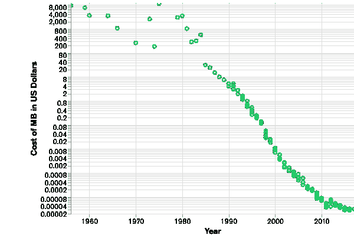
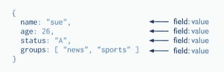
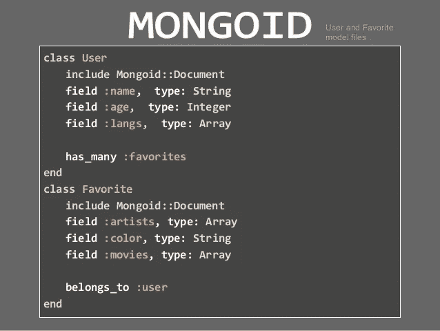

# 面向 Rails 开发人员的 NoSQL 和 MongoDB 简介

> 原文：<https://medium.datadriveninvestor.com/introduction-to-nosql-and-mongodb-for-rails-developers-bada4e74e01e?source=collection_archive---------3----------------------->

# 探索 Mongoid 作为 ActiveRecord 的替代品

Photo by [Kevin Ku](https://unsplash.com/@ikukevk?utm_source=medium&utm_medium=referral) on [Unsplash](https://unsplash.com?utm_source=medium&utm_medium=referral)

# 介绍

SQL 最早开发于 20 世纪 70 年代，其数据存储的关系模型一直延续至今。SQL 数据库管理员和开发人员的需求量仍然很大，因此学习 SQL 及其相关技术仍然是一项值得努力的工作。但是在过去的十年里，一个新的流行词已经在数据库世界里流传开来:NoSQL。什么是 NoSQL(“不仅是 SQL”)，为什么它与今天相关？

当 SQL 在 20 世纪 70 年代被创造出来的时候，计算机科学家对数据如何存储和数据能做什么有着完全不同的概念。数据存储非常昂贵，因此减少数据重复至关重要。为了防止重复，SQL 数据库利用带有主键和外键的固定模式来表达模型之间的关系。他们专注于为所有数据创建一个单一的真实来源。

Storage Costs over Time in USD

对于僵化的模式，在整个应用程序开发生命周期中更改 SQL 数据库既困难又耗时。然而，NoSQL 数据库是灵活的，允许开发者避开基于模式的关系数据库的约束。随着敏捷开发实践席卷了技术世界，NoSQL 数据库被独特地定位于满足开发人员拥有适应性强的数据存储系统的需求。

 [## 多平台 SaaS 应用的 2020 年发展选择|数据驱动的投资者

### 我目前正在为公司做一个新项目。该项目包括一个移动应用程序，由一个…

www.datadriveninvestor.com](https://www.datadriveninvestor.com/2020/07/13/2020-development-choices-for-multi-platform-saas-application/) 

虽然通常有四种不同类型的 NoSQL 数据库(文档、键值、宽列存储和图形)，但文档数据库已经成为使用最广泛的选项。文档结构存储数据的方式是任何使用过 JSON 文档的开发人员都熟悉的。MongoDB 是当今最流行的文档数据库。

Document Database Structure (MongoDB)

# Rails: ActiveRecord 和 Mongoid

当我第一次学习 Rails 时，ActiveRecord 是最“神奇”的部分。尽管 ActiveRecord 只是在幕后启动标准的 SQL 查询，但它允许开发人员轻松地创建复杂的关联和查询数据。作为一个对象关系映射器(ORM)，ActiveRecord 允许程序员与存储在数据库表中的信息进行交互，就像它是一个传统的 Ruby 对象一样。在博客应用上访问用户的帖子就像`User.first.posts`一样简单——不需要复杂的 SQL `JOIN`和`SELECT`查询。

ActiveRecord 是一个 ORM(强调关系型的 R)，而 Mongoid 是一个 ODM(对象-文档-映射器),它用文档数据库 MongoDB 映射对象。

# 设置 Mongoid

请注意，本教程利用 macOS 上的家酿安装说明。如果您不在 macOS 上，请参阅 MongoDB 文档。

要在您的机器上安装 MongoDB，请按照下列步骤操作:

1.  点击 MongoDB 自制软件点击:`brew tap mongodb/brew`
2.  安装 MongoDB 社区版:`brew install mongodb-community@4.2`
3.  运行 MongoDB: `brew services start mongodb-community@4.2`

现在我们已经在机器上安装了 MongoDB，让我们创建一个新的 Rails 应用程序来开始探索这项技术。注意:本教程假设您的计算机已经为 Rails 开发进行了配置。

要使用 Mongoid 创建新的 Rails 应用程序，请遵循以下步骤:

1.  创建 app: `rails new <app-name> --skip-active-record`(由于我们使用的是 Mongoid，所以不需要安装 ActiveRecord 及其依赖项)。
2.  在你的宝石文件中，添加一个对蒙古宝石的引用:`gem 'mongoid', '~> 7.0.5'`
3.  通过运行`bundle install`安装依赖项
4.  生成默认的 Mongoid 配置:`bin/rails g mongoid:config`(这将创建`config/mongoid.yml`文件来代替传统上 ActiveRecord 附带的`database.yml`文件)

# 与蒙古人的关系

虽然 MongoDB 不像 SQL 那样是关系数据库，但它仍然可以存储模型之间的关系。如果我们要创建一个学生应用程序，我们可能有两个类:`Student`和`Teacher`。一个老师**有很多**学生，一个学生**属于**一个老师。

我们不会创建迁移，而是立即开始用 Mongoid 构建我们的模型。首先，在`app/models`中创建`student.rb`和`teacher.rb`。

在`teacher.rb`中，插入以下代码:

同样，在`student.rb`中，插入以下代码:

为了使用 Mongoid 建立学生和教师之间的一对多关系，我们将使用习惯于 ActiveRecord 的人会感到非常熟悉的语法。

在教师类，插入`has_many :students`。在学生类中插入`belongs_to :teacher`。

MongoDB 的另一个强大特性是能够存储 ActiveRecord 中没有的各种数据类型。例如，考虑下面的`User`和`Favorite`类。`Favorite`类包含一个名为 artists 的属性，这是一个数组。使用 MongoDB，不需要创建额外的带有外键和连接表的 Artist 模型。

# 结论

尽管 ActiveRecord 经常让人觉得与 Rails 有着千丝万缕的联系，但 Mongoid 提供了一种查询数据库中存储的数据的替代方法。对于习惯于 ActiveRecord 的人来说，大部分语法都很熟悉，但是存储数据的基本方式却完全不同。

要使用 MongoDB 和 scaffolding 创建完整的 Rails 博客应用程序，请遵循 [MongoDB 官方教程](https://docs.mongodb.com/mongoid/current/tutorials/getting-started-rails/#add-mongoid)。

*最初发表于*[T5【http://github.com】](https://gist.github.com/2565c7559762e9885e8ff7dfdae59a16)*。*

**访问专家视图—** [**订阅 DDI 英特尔**](https://datadriveninvestor.com/ddi-intel)