# 初学者熊猫入门

> 原文：<https://medium.datadriveninvestor.com/introduction-to-pandas-for-beginners-d224d21b588?source=collection_archive---------5----------------------->


# 介绍

Pandas 是构建在 numpy 之上的开源 Python 库，为 Python 编程语言提供了高性能、易于使用的数据结构和数据分析工具。

熊猫在学术、金融、经济、统计、分析等领域有着广泛的应用。

我相信说 pandas 是数据科学家和分析师在 Python 中取得成功的工具箱中最重要的工具是没有错的。特别是在数据分析的情况下，pandas 被用作大多数项目的主干。

Pandas 大约在 2008 年由开发者 **Wes McKinney** 开始开发，目的是帮助 python 获得能力**加载、清理、转换、建模和分析以不同格式保存的**数据。

在熊猫出现之前，python 并没有那么伟大，但现在有了熊猫，它就在那里大放异彩了！所以你应该明白这个包裹的重要性。

这个完整的库及其所有特性不是我们可以在一篇文章中掌握甚至讨论的，但是当然必须有一个开始的方法。当我开始研究熊猫时，我真的发现作为一个分析领域的完全初学者，与我在网上找到的大多数材料合作是如此令人沮丧。

这就是为什么我有了一个初步的想法，总结出 pandas 特性的一个小的子集，可以说足以处理大多数或者几乎所有的常见用例。不管怎样，这取决于你自己，一旦你达到了理解这一点的水平。

现在，让我们继续前进，看看熊猫给我们带来了什么。

就像我在开头提到的，熊猫是建立在 numpy 库的基础上的，所以你很好地了解 numpy 是很重要的，以便继续前进并和熊猫一起玩。如果你觉得需要重温一下你的数字知识，可以在这里找到这篇[文章](https://medium.com/analytics-vidhya/introduction-to-numpy-for-beginners-9a0db6bc2a07?source=---------2------------------)。希望有用。

# **安装并导入**

Pandas 是一个易于安装的软件包。根据您的环境，您可以使用以下命令之一进行安装:

```
**conda install pandas** # if you use anaconda
OR
**pip install pandas**
```

# 熊猫数据结构

熊猫主要用于以下目的，在我们开始之前了解这些是值得的。

1.将不同文件格式的数据加载到内置数据对象中。

2.数据对齐和缺失数据的综合处理。

3.使用默认和自定义索引创建快速高效的数据框对象。

4.数据集的整形和旋转。

5.基于标签的大数据集切片、索引和细分。

6.按数据分组以进行聚合和转换。

7.数据的合并和连接。

8.时间序列功能。

Pandas 有 3 种不同类型的数据结构来支持这些操作。

**1。系列** `**-**` **1D 集装箱**

**2。数据框-2D 容器**

**3。面板-3D 容器**

通常数据序列被认为是熊猫中最常用和最主要的对象。但这不是最基本的开始。让我们从系列开始。

# **系列**

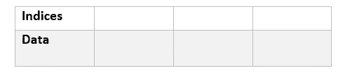

series 是一维数组，与 numpy 数组非常相似。一个系列本质上有两个组成部分，数据部分和索引。下面是创建新系列的常用语法。

```
**series = pd.Series ( data , index)**
```

正如您所看到的，这个函数将两个列表作为输入来创建一个序列。

我们可以在这个地方提供它们，如下所示

```
**series=pd.Series([10,20,30,40],[‘a’,’b’,’c’,’d’])
print(series)**
```

或者我们可以先分别定义它们，然后给出如下参考。

```
**mydata = [10,20,30,40]
myindex =[‘a’,’b’,’c’,’d’]
series=pd.Series(mydata,myindex)
print(series)**
```

如果我说第二种方法更合适，我希望你同意。所以是的，坚持第二种方法作为一个好的做法。

如果我们不给出自己的索引方法呢？它将从 0 开始自动索引。

看看下面的例子。

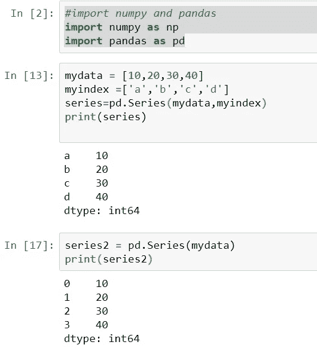

请注意，当显示内容时，pandas 使用的是垂直表示，所以我使用的上面的插图与用图形表示系列有点不匹配。相反，我们应该以下面的方式考虑一个系列。


过一会儿你会明白为什么最好这样想象一个系列，还是坚持住。

请注意，当我没有提到使用列表作为索引字段时，已经发生了自动索引。

现在，我希望你还记得 python 中的字典数据结构。

如果没有，它只是一个以键:值成对方式存储元素的结构。

例如

```
**mydict = {‘k1’:’val 1',’k2':’val 2',’k3':’val 3',’k4':’val 4'}**
```

**因为字典中的数据是按照我们需要的格式组织的，所以当我们将它们排列成一个序列时，我们可以将字典作为唯一的输入来使用 pd 创建一个序列。Series()函数，这样键将自动成为索引字段的值。**

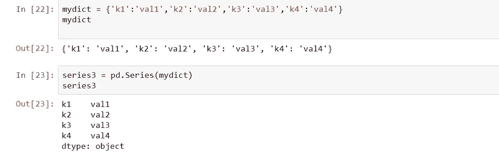

还要注意，我们也可以给 numpy 数组作为这个函数的输入参数。

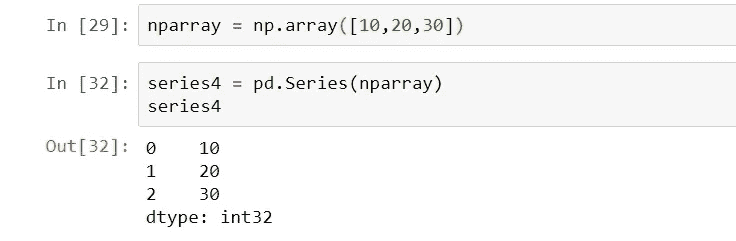

当我们的数据是一个标量值时，还有另一种有时很有用的方法来创建一个标量序列。必须提供一个索引来匹配所需的长度，然后标量值将被重复以匹配长度。

```
scalar_series = pd.Series(5, index=[0, 1, 2, 3])
print (scalar_series)
```

从我在上面展示的这些例子中，您可以注意到，系列数据结构可以保存各种数据类型。但是这种灵活性只适用于索引字段。数据字段是同质的。

关于一个系列，以下三个特性是需要注意的要点。

**同质数据**

**尺寸不可变——长度固定**

**可变数据的值——可以更改现有元素。**

# 访问系列的元素

可以通过引用它们的索引来简单地访问值。

这里要注意的另一件事是，即使你在定义数据序列时提供了自己的索引，你仍然可以通过默认索引 0 1 2 等来引用这些元素。(这有时被称为绝对指数)

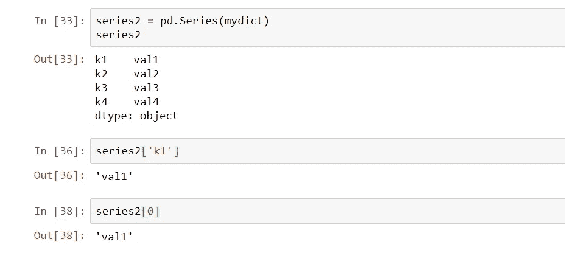

此外，我们可以像这样选择一系列值。请注意使用绝对索引和给定索引值作为限制时的差异。

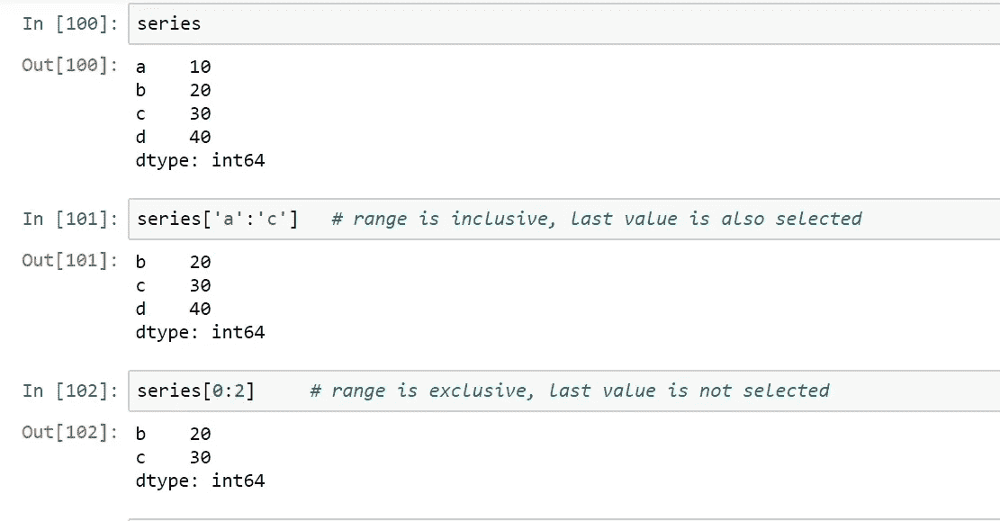

# 数据帧

数据框，就像我之前提到的，就像 2D 系列的对应物。基本上就像一张桌子。

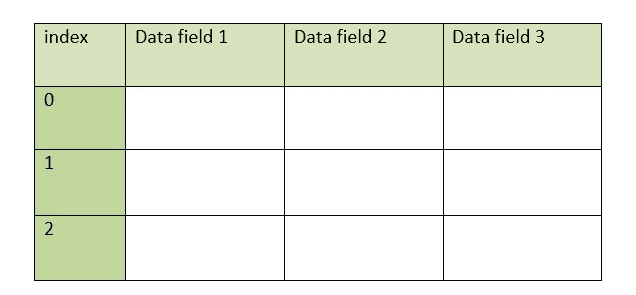

正如你在这里看到的，这是一个共享一个公共索引的系列的集合，不是吗？是的，它是。

这就是为什么我之前说，以垂直的方式思考一个系列很重要，以适应这种情况。

使用以下语法可以创建数据框

```
dataFrame = pd.DataFrame( data , row_indexing, column_indexing )
```

为了简单起见，我们先分别定义这三个对象，然后再创建数据框。

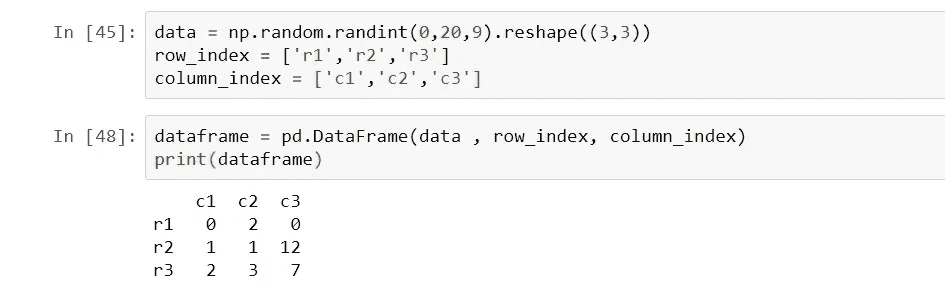

不要被这个 np.random 搞糊涂了。randint (0，20，9)。整形((3，3))

我只需要 9 个随机整数，所以我使用 numpy 中的随机数生成器生成了一个由 0 到 20 之间的 9 个随机数组成的数组，并将其重塑为一个 3x3 的矩阵，然后使用该矩阵作为我的数据帧的数据部分。

现在我将使用熟悉的标签和细节来声明一个新的数据集，

我们将在这里继续使用它。

```
data = [[‘Alice’,’22', ‘A01’] , [‘John’, 23, ‘A002’] ,[‘Ben’, 21, ‘A005’]]
row_index = [‘r0’,’r1',’r2']
column_index = [‘Name’,’Age’,’REG_NO’]
mydf  = pd.DataFrame(data , row_index, column_index)
print(mydf)>>> out
Name Age REG_NO
r0 Alice 22 A001
r1 John 23 A002
r2 Ben 21 A005
```

# 选择数据

下面的选择是显而易见的操作，所以没什么好解释的，所以我只提一下语法。

**选择一列**

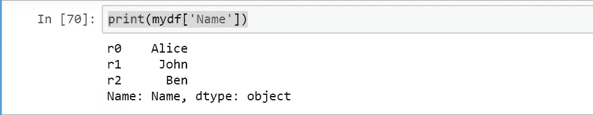

我们还可以使用**点符号**从数据框中获取一列，但是这种符号的使用受到限制，因为它在以下情况下不起作用

**列名中有空格，**

**当列名等于方法名时，**

**当列名等于变量名时**

# 选择多列

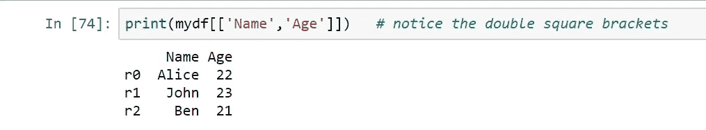

# 检查列的数据类型

请注意，在 pandas 中，单列被视为一个系列。

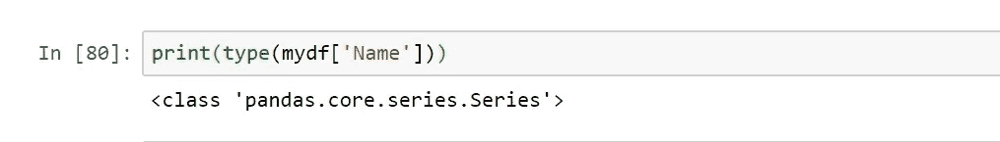

现在，列被视为一个系列，您可以应用系列的选择方法，进一步从选定的列中选择值，如下所示。

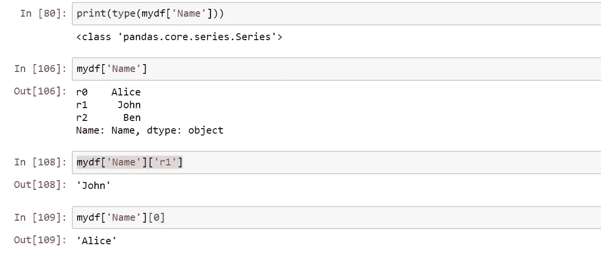

# 选择行

选择行有两种方法，使用 **loc[ ]和 iloc[ ]** 方法

**loc [ ]** 函数取记录的索引字段的值。

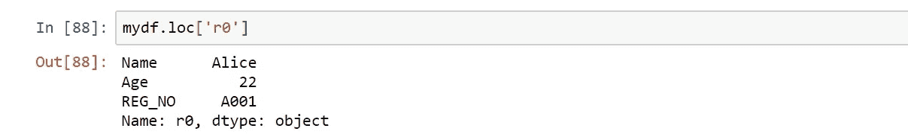

**iloc[]** 函数将记录的绝对索引作为输入。

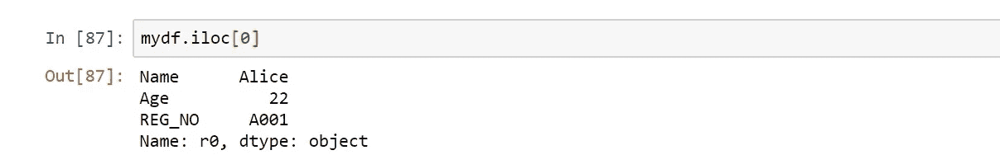

# 选择多行并仅选择所需的列

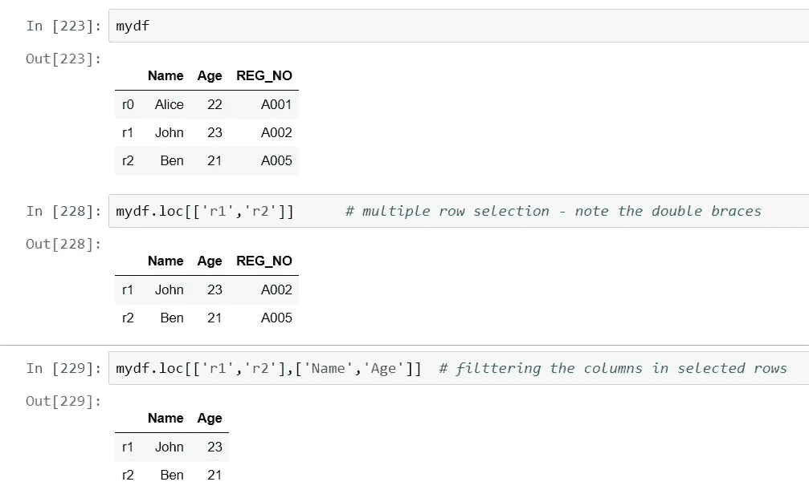

# 条件选择

有时我们需要根据条件过滤出数据，例如特定列的值高于给定限制的行。(我知道你明白“**有条件的”**是什么意思但是你知道，必须保持它的完美所以，跟我裸露一点)

在这种情况下，下列符号将具有它们通常的含义

**< > ==！= |(或)&(和)**

下一个要记住的重要事情是，要使用类似于< or >的数字比较来执行条件选择，我们考虑的列必须是数字类型的。

要检查数据框中各列的数据类型，可以使用 **df.dtypes()** 方法，而要将特定列更改为数值字段，最好的方法是使用 **pd.to_numeric( )** 函数。

下面我展示了如何进行转换。

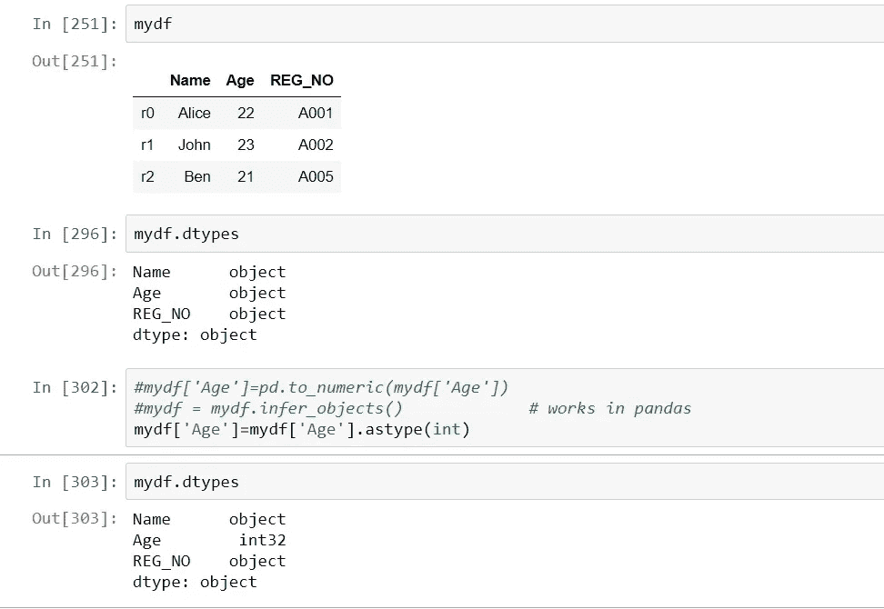

现在让我们看看如何过滤年龄大于 21 岁的记录

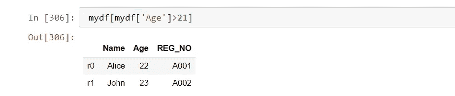

现在你可以看到，产生的结构也是一个数据框，现在如果你想从这个集合中只查看一个单独的列，你可以使用我们之前提到的方法过滤它。例如，我只想查看年龄超过 21 岁的人的名字。我可以这样做

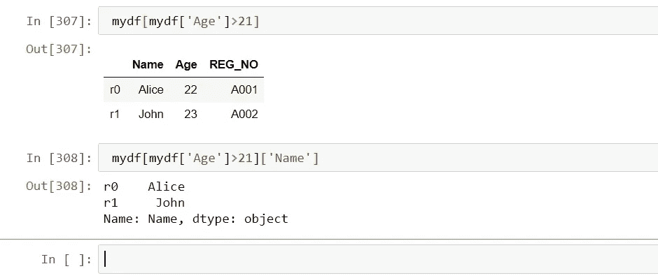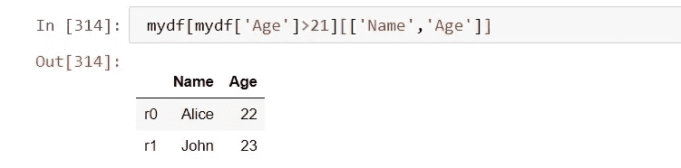

要应用多个条件，我们可以用逻辑运算符& (AND)和| (OR)来组合条件。

例如，返回年龄大于 21 小于 23 的数据

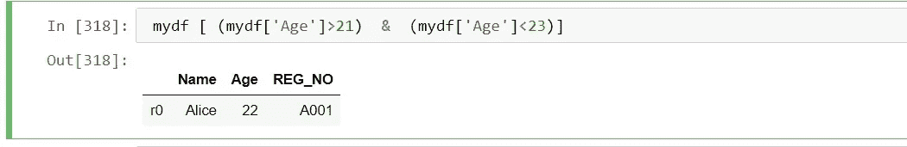

# 从文件导入数据

熊猫图书馆支持各种文件格式，excel 文件，csv 文件，JSON 和 sql 和 html 等等。

在这种情况下，我们可以使用许多内置函数，我将只提到其中最常用和最有用的两个，但这里有一个很好的参考来阅读 pandas 中的所有输入函数。当您需要处理不同的数据格式时，可以随时去那里阅读。

从 excel 文件导入数据

> 通用语法

```
Data_frame = pd.read_excel(‘file_path’,sheet_name = <’sheet name’ or sheet index>)
```

**sheet_name** 参数用于引用包含您的数据的工作表。

请注意，在 excel 中，工作表索引从 0 开始。

如果你有第一张表本身的数据，只需要提到路径就足够了。

这是我的电子表格中的表格

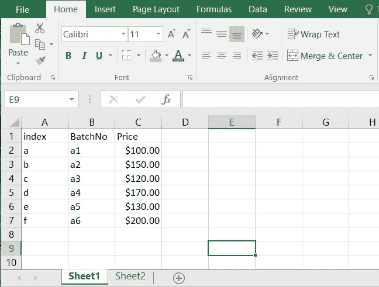

这是我将它导入到我的熊猫数据框时的样子。

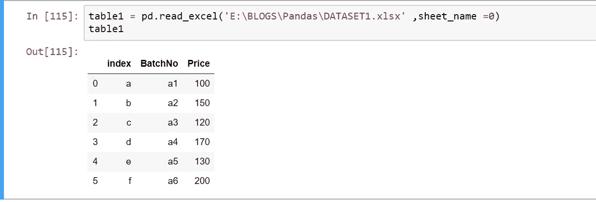

***注意，pandas 为我的文件引入了一个新的索引字段**

从 CSV 文件导入数据

CSV —逗号分隔文件是数据科学领域中最广泛使用的文件格式，我想你会同意这一点。您可以轻松地将 csv 数据导入数据框，如下所示。这与导入 excel 非常相似。但是没有提到纸张编号，因为 csv 中没有多个纸张。

> 通用语法

```
Data_frame = pd.read_csv (‘<file_path>’)
```

这里，pandas 将在您导入的表中包含一个额外的索引字段。

# 添加新行

向数据框中添加新行有时会很棘手。也许你已经经历过了。还有其他方法来满足向数据框添加新数据的要求，但是我将讨论最有效和最容易记住的方法，而不是必须记住许多不同的语法，因为它非常容易完成这项工作。

要在数据框中添加一个新行，首先我们需要将数据安排到一个具有 key : value 格式的结构中，其中 key 必须是列标题，value 必须是数据部分。

我们可以通过将新数据放入字典或熊猫系列来实现这一点。

假设我需要向上面从 excel 导入的表中添加一个新行。

我的新数据行就像 **index : g，BatchNo : b1，Price :400**

一旦我将这个细节放入字典或序列中，为了将这个记录插入到数据帧的末尾，我可以使用 **dataframe.append()** 函数以及一个名为 **ignore_index** 的附加参数


此外，您还可以使用相同的方法将两个数据框合并在一起。

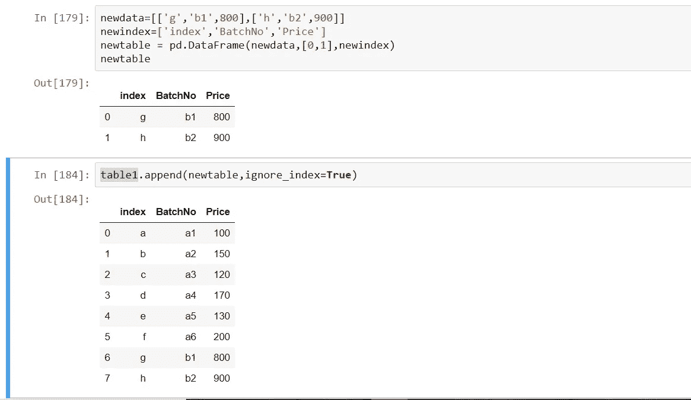

请注意，如果在语法中交换两个数据框的位置，可以将新数据连接到现有表的开头。

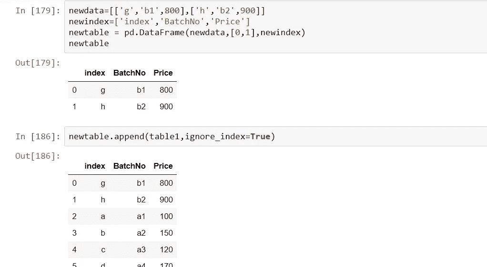

此外，如果我们需要合并两个不同大小的数据框，这意味着具有不同数量的列，我们可以再次使用 append()方法。例如，假设我的新数据包含另一个名为“折扣百分比”的字段，而该字段在原始表中并不存在。

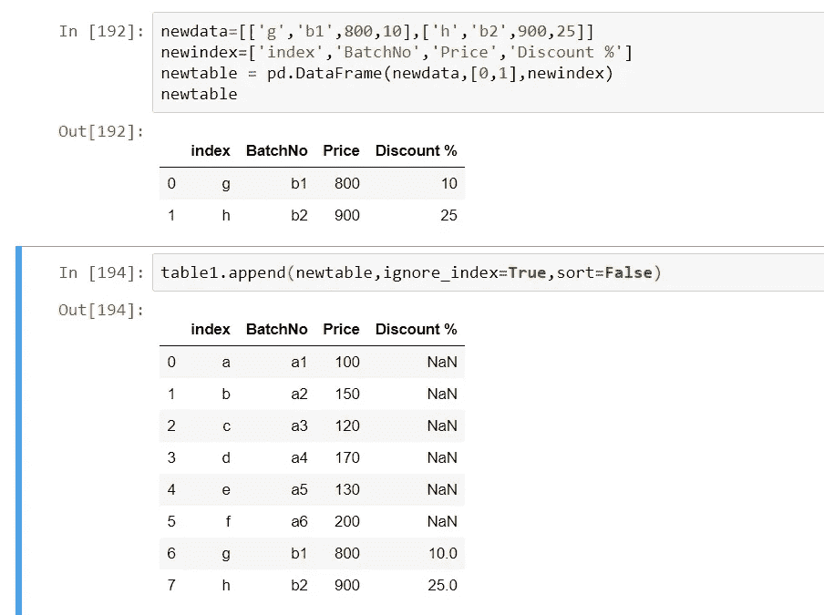

这个“Nan”的意思是“不是一个数字”，就像 python 中默认的空值。

注意，这里如果我们没有提到排序参数值为 False，旧版本的 pandas 将根据字母顺序对列进行重新排序。

永远记住，为了使您所做的更改永久，不要忘记您需要将新的结果替换到结构本身，或者将 inplace = true 作为一个输入参数。例如

```
table1 = table1.append(newtable,ignore_index=True,sort=False)ortable1.append(newtable,ignore_index=True,sort=False,inplace=True)
```

就这样，用一个功能你就可以管理大部分操作，是不是很神奇？当然是了..

现在，请确保您也阅读了 **merge()** 和 **join()** 函数。我不打算在这里包括它们，因为我需要使这篇文章看起来足够简单，以免吓跑新的蜜蜂。但是我将在我的下一篇文章中包括它们，以供熊猫参考。(正在编写中)

# **添加新列**

新列应该首先定义为 pandas 系列，索引在现有表中。

然后可以很容易地将其添加到数据系列中。

如果列长度小于数据框中的记录数，剩余的记录将用 Nan 字符填充。

如果新列有额外的值，它们将被丢弃

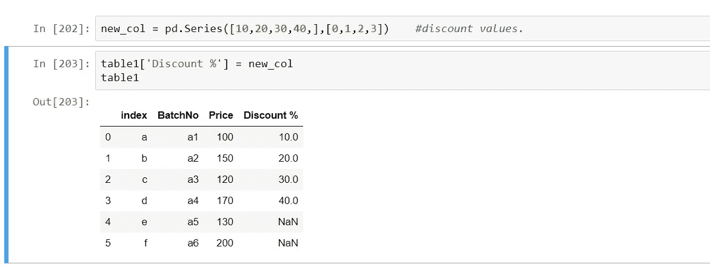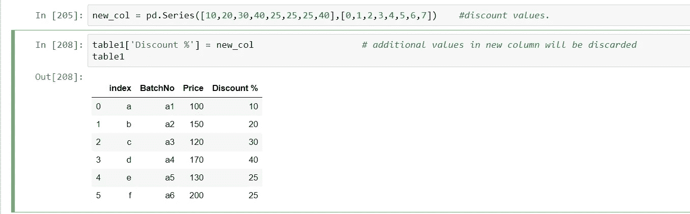

# 删除行和列

这可以使用 **drop()** 功能来完成

在这个操作中，除了列名或行索引，我们还必须提到轴参数。

**对于行，轴参数为 0，对于列，轴参数为 1。**

看看下面的例子。

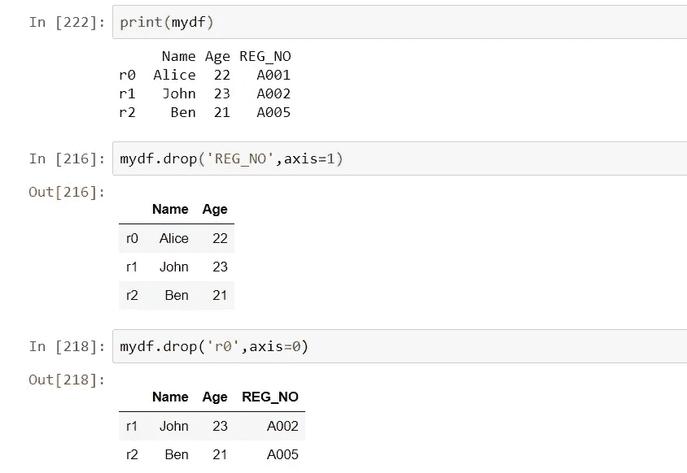

需要注意的是，无论何时使用`.drop()` 方法，Pandas 都不会永久删除一行/一列，因为它不希望您意外丢失数据。

要永久删除一行/一列，必须在该函数中设置原位参数，如下`inplace=True`

```
mydf.drop(‘r0’,axis=0,inplace = True)
```

# 索引选项

# **重置数据帧的索引**

在对数据框进行一些操作后，如果您的索引看起来不完全像您想要的那样，您可以使用`.reset_index()`轻松地重置它。这将我们的 DataFrame 索引重置为名为`index` 的列，Pandas 的默认索引值`[0,1,2 ...]`是我们的新索引。

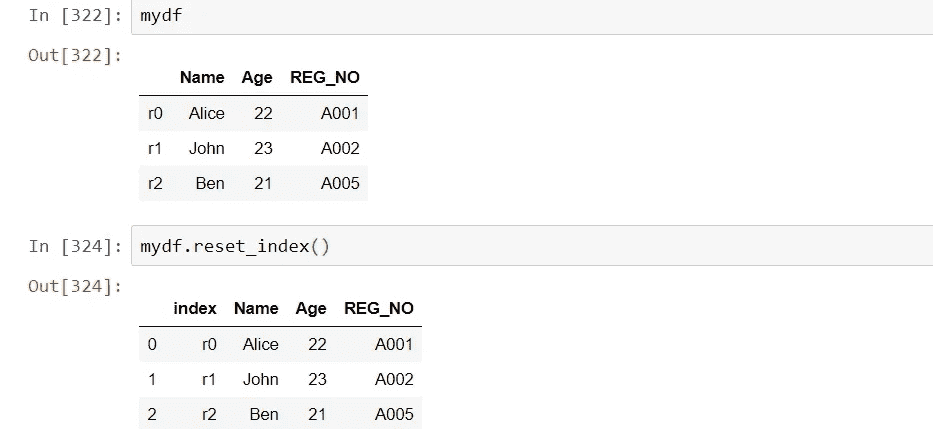

这里，为了永久地应用这个改变，我们必须提到 inplace = True 参数。

```
mydf.reset_index(inplace=True)
```

**设置数据帧的索引**

类似地，我们可以通过使用 set_index()函数来指定想要使用哪一列作为索引标签。

我将为我的 mydf 数据帧创建一个新列，并将其设置为索引，如下所示。

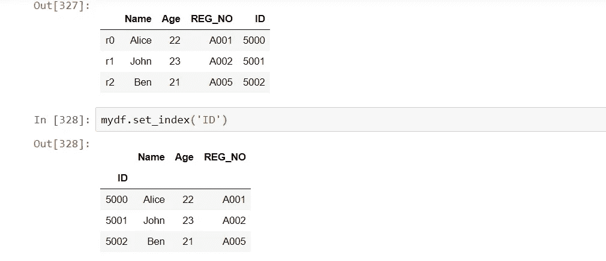

因此，正如您所看到的，与 reset_index()函数在旧列仍在的情况下插入新的索引列不同，set_index()函数完全替换了以前的索引字段。

同样，使用 inplace = true 使更改永久化。

除此之外，如果你也能学习多级索引会更好，但是我相信这超出了一篇初学者文章的范围，所以为了简单起见，我将跳过它。

# 清理数据集

最常见的情况是，当您使用一个巨大的数据集时，由于各种原因，数据集中有丢失的值。熊猫会自动用一个`NaN or Null`值填充那些缺失的元素，就像你在上面的一些例子中看到的那样。但是这种 Nan 或 Null 在许多操作中是不需要的。

因此，我们可以使用`.dropna()`删除那些自动填充的值，或者使用`.fillna().`将它们替换为合适的值

我将创建两个具有不同形状的随机值的数据帧，如下所示，这样将有 Nan 个值。

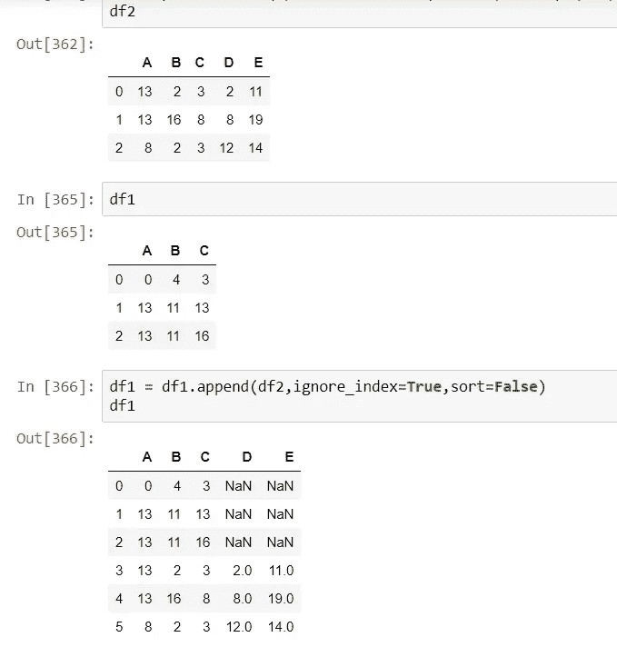

```
df1.isnull().sum()
```

上面的方法可以用来检查每一列中有多少空值。

德罗普纳()

现在让我们看看 dropna()是如何工作的

```
dropna(axis=0) remove all the rows that has a missiing value in it.dropna(axis=1) remove all the columns that has a missiing value in it.
```

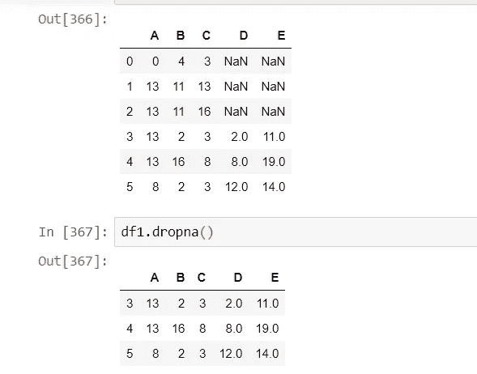

请注意，永久效果需要 inplace 参数。

菲尔娜

fillna()函数将用给定的值填充所有的 Nan 点，如下所示。

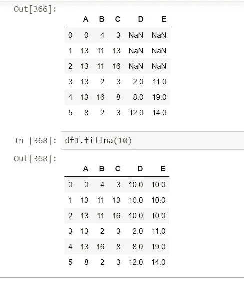

但是在大多数情况下，这种填充操作无法使用这样一个公共值来完成。

我们经常需要逐列替换 Nan 值，而且大多数时候是使用它们的平均值来完成的。这就是如何使用平均值替换 D 列中的 Nan 值。

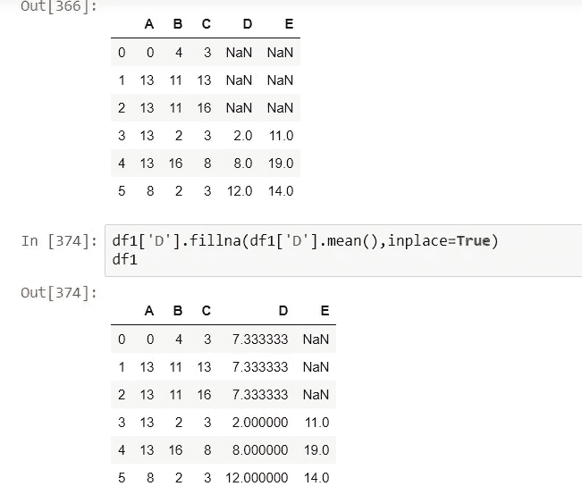

**分组**

grouby()函数允许您根据特定列中的值将数据集中的行组合在一起，以便您可以对它们执行聚合函数，如求和、均值、中值、标准差等。

在下面的例子中，我有一个从 excel 导入的表格，我对它做了一点修改以适应这个例子。看看我们如何根据批次号对行进行分组，并查看每个批次中其他列的平均值。

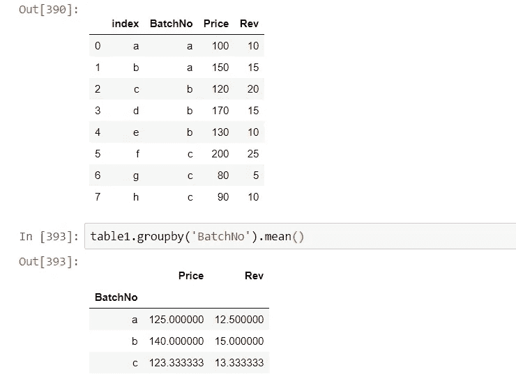

使用 count()方法，我们可以获得一个项目在数据帧中出现的次数。

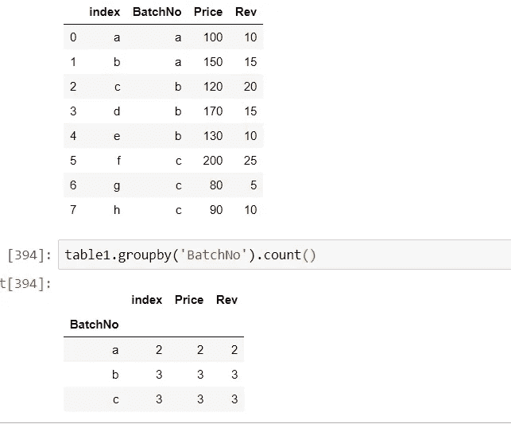

使用 describe()方法，我们可以大致了解数据帧的样子。它为我们提供了每个数据帧索引的摘要。

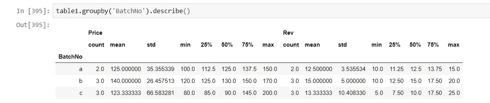

如果您不熟悉此视图，您可以将此描述转置 90 度

```
#try thistable1.groupby(‘BatchNo’).describe().transpose()
```

# 在数据帧中查找唯一值

唯一值就是数据帧中的不同值。下面是一些可以用来检查列中唯一值的方法。

使用`.unique()`，我们可以找到一列中所有唯一的值。

使用`.nunique()`我们可以得到计数，或者不同值的数量。

使用 value_count()我们可以获得唯一值及其出现次数。

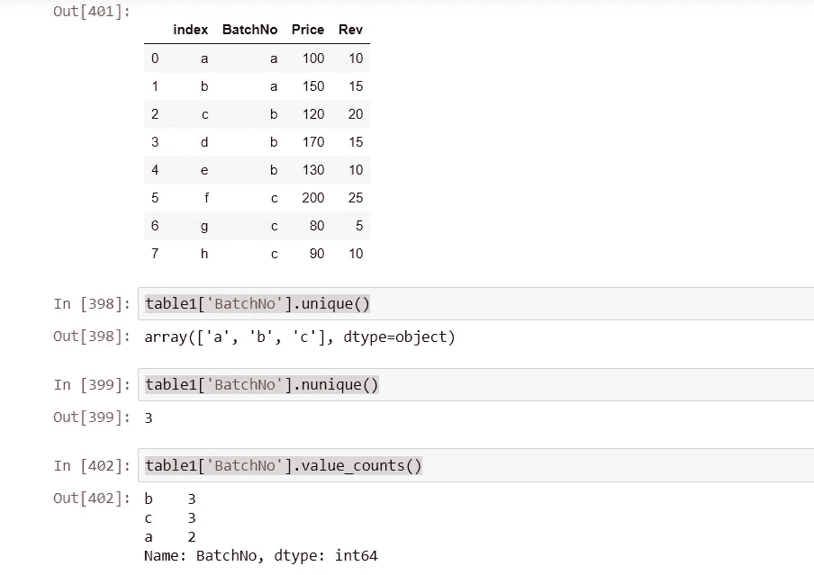

**apply()方法**

`.apply()`方法用于调用一个普通函数来重复作用于数据帧中特定列的元素。假设我们有一个函数来计算给定价格的 10%折扣，我们需要将这个函数应用到表中的所有价格上，我们可以这样做。

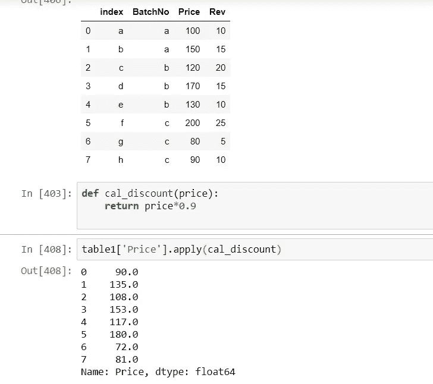

# 数据帧操作

大多数情况下，当您专业地处理数据集时，您在导入数据后要做的第一件事是，打印几行以保留作为可视参考，因为打印整个数据集将会是一种混乱，在大型数据集的情况下，

这可以通过以下方式轻松实现

**df.head( n )** 显示数据集的前 n 行，或者

**df.tail(n)** 它将显示数据集的最后 n 条记录。这两个函数都太简单了，我不认为我们需要执行一个例子。试试吧！

**df.info()** 提供关于数据集的基本细节，例如行数和列数、非空值的数量、每列中的数据类型以及数据帧使用的内存等

**df.shape** 不是一个函数(因此没有括号),而是数据集的一个属性，它显示了数据集中的列数和行数。

**df.drop_duplicates( )**

将从数据集中移除重复的行。该函数使用一个名为“keep”的参数。此参数的默认值为“first ”,这意味着当检测到重复时，将保留第一个重复，而删除其他重复。

如果设置 keep = 'last '，将保留最后一次出现的内容，删除其他内容。

如果设置 keep = 'false '，则不会保存任何重复的事件

和 inplace 参数，以便保存对数据框的更改。

# 列名争论

通常，数据集会有冗长的列名，包括符号、大写和小写单词、空格等。

为了使按列名选择数据更容易，我们可以花一点时间清理它们的标签。

**df.columns** 将打印出所有的列名。

然后我们可以使用。 **rename()** 方法，通过将旧名称映射到新名称的字典来重命名所需的或所有的列。

请参见下面的示例

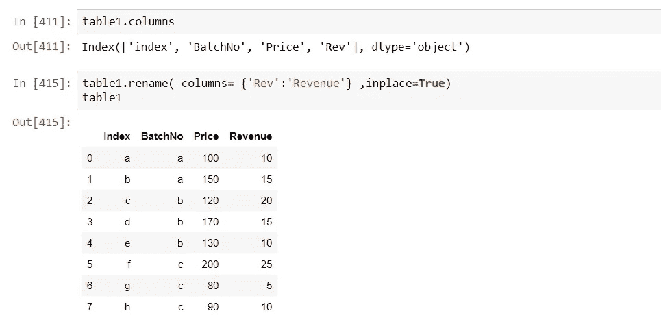

有时，大写字母也很麻烦，你可以用下面的方法将所有的列名转换成小写字母，而不用分别重命名。

```
table1.columns = [col.lower() for col in table1]
```

# **对数据帧进行排序和排序**

假设我们需要显示数据帧，其中某一列按升序显示，我们可以使用`.sort_values()` 函数轻松地对其进行排序

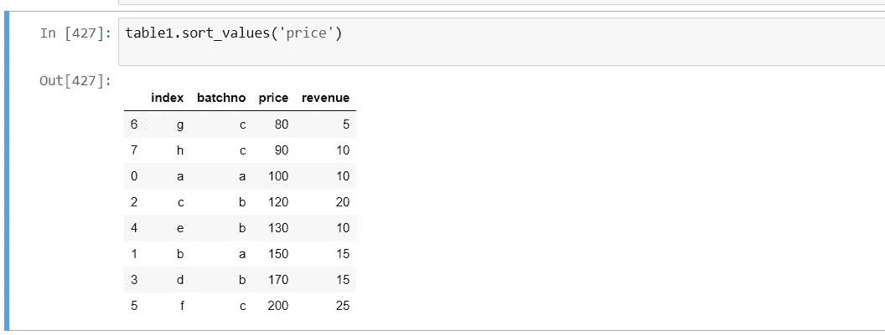

# 将数据保存到输出文件

在对数据进行清理和重新排列的大量工作后，如果您需要将它保存为您喜欢的格式，类似于我们读取数据的方式，pandas 提供了直观的命令来将其保存为各种不同的格式。

前夫;前妻;前男友;前女友

```
df.to_csv(‘file path/filename.csv’)df.to_excel(‘file path/filename.csv’)
```

嗯，我希望这将涵盖开始使用熊猫的大部分内容，如果你一直热衷于此，现在你应该对什么是熊猫以及如何使用它进行数据准备有很好的了解。

现在，你不需要记住所有这些语法，它们会随着不断的使用而保存在你的记忆中。

但是此时最重要的是对这个库的能力有一个大致的了解，这样你就可以通过谷歌搜索你需要的操作很容易地找到精确的语法，直到你达到不需要参考的程度。

我故意试图缩小文章的范围，以防冗长和深入的解释通常不是初学者友好的材料，但即使如此，文章似乎太长，但不能帮助！

熊猫不是小孩子的游戏，好像是！

最后，熊猫肯定比这大，所以今天就开始发现，去寻找更多。