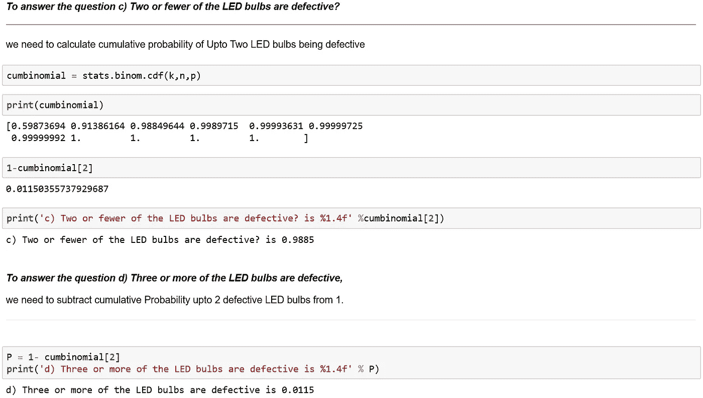

# 概率分布介绍

> 原文：<https://medium.datadriveninvestor.com/introduction-to-probability-distributions-56b5253344b8?source=collection_archive---------1----------------------->

**概率分布**是一个函数，描述了获得一个随机变量可以假设的可能值的可能性。换句话说，变量的值基于潜在的**概率分布**而变化。

## 导入必要的库:

有不同类型的**概率分布**，它们服务于不同的目的并代表不同的数据生成过程。

我们将学习最基本的分布:

## **1)二项分布**

*   广泛使用的是离散随机变量的概率分布。
*   在质量控制和质量保证职能中起主要作用。

*   其中 P(X = x)是在 n 次试验中获得 x 次成功的概率， *𝜋* π是感兴趣事件的概率

## Python 中用于二项分布的一些重要函数:

## 1)概率质量函数

***scipy . stats . binom . PMF****给出二项分布的概率质量函数。*

binomial = scipy . stats . binom . PMF(k，n，p)，

*   其中 k 是一个数组，取值范围为{0，1，…，n}
*   n 和 p 是二项式分布的形状参数

输出二项式给出了数组形式的二项式分布函数的概率。

## 2)累积密度函数

cum binomial = scipy . stats . binom . CDF(k，n，p)给出累积二项分布。

输出 cumbinomial 以数组的形式给出了二项式分布函数的累积概率。

## 3)绘制二项式密度函数

matplotlib.pyplot.plot(k，binomial，' o-')函数为我们提供了二项式分布函数的绘图。

**示例:**

一家 LED 灯泡制造公司定期对其制造的产品进行质量检查。历史上，该公司生产的 LED 灯泡的故障率为 5%。假设随机抽取 10 个 LED 灯泡作为样本。

a)没有一个 LED 灯泡有缺陷的概率是多少？
b)到底是哪一个 LED 灯泡有缺陷？两个或更少的 LED 灯泡有缺陷？
d)三个或更多 LED 灯泡有缺陷

# 泊松分布:

*   这种离散分布在质量控制中也起着重要作用。
*   泊松分布是在给定的时间或空间间隔内随机发生的事件计数的离散概率分布。在这样的机会领域，可能会出现不止一次。在这种情况下，泊松分布可以用来计算概率。
*   例子包括每个项目的缺陷数量，每个变压器生产的缺陷数量。
*   注意:泊松分布有助于预测排队情况下的到达率，在这种情况下，形成了一个队列，人们等待接受服务，服务率通常高于到达率。

**性质:**
**均值μ = λ
*标准差σ = √ μ
*泊松分布是二项分布当 n 趋近于∞且 p 趋近于 0 时的极限*

Python 中解决泊松分布问题的一些重要函数

## 1)概率质量函数:

poisson = scipy . stats . poisson . PMF(n，rate)其中 n 是一个类似分位数的数组，rate 是它以数组形式给出泊松分布结果的平均值。

## 2)累积密度函数:

poisson = scipy . stats . poisson . CDF(n，rate)其中 n 是其中 n 是类似分位数的数组，rate 是它以数组形式给出累积密度函数结果的平均值。

## 示例:

众所周知，一家制造厂每月的工伤数量遵循泊松分布，平均每月有 2.5 起工伤。在给定的一个月里

a)无工伤发生？

b)至少发生一次工伤？

# **正态分布**

*   分析领域中最流行的连续分布之一。
*   在许多自然发生的测量中观察到正态分布，如出生体重、身高和智力等

在哪里

*   f(x)用于表示概率密度函数
*   x 是连续变量的任意值，其中-∞ < x < ∞

*   e denotes the mathematical constant approximated by 2.71828
*   Π is a mathematical constant approximated by 3.14159
*   μ and σ are the mean and standard deviation of the normal distribution.

# Properties:

1.  Theoretical normal density functions are defined between -∞ and ∞
2.  There are two parameters, location (μ which is the mean) and scale (σ which is standard deviation).
3.  It has a symmetrical (bell shape) around the mean. mean = median = mode
4.  Areas between specific values are measured in terms of μ and σ
5.  Any linear transformation if a normal random variable is also normal random variable.
6.  If X1 is an independent normal random variable with mean μ1 and variance *𝜎* 12σ12，X2 是另一个独立的正态随机变量，均值为μ2， *𝜎* 22σ22，那么 X1 + X2 也是一个正态分布，均值为μ1 + μ2，方差为*𝜎*12σ12+*𝜎*22σ22

**例如:**

在印度进行了一项关于智能手机使用的调查，观察到智能手机用户平均每天花费 68 分钟发送消息，相应的标准偏差为 12 分钟。假设发送消息所花费的时间服从正态分布。

a)每天花超过 90 分钟发送消息的智能手机用户比例是多少？

b)花费少于 20 分钟的顾客比例是多少？

c)花费在 50 分钟到 100 分钟之间的顾客比例是多少？

## **谢谢，继续学习:)**