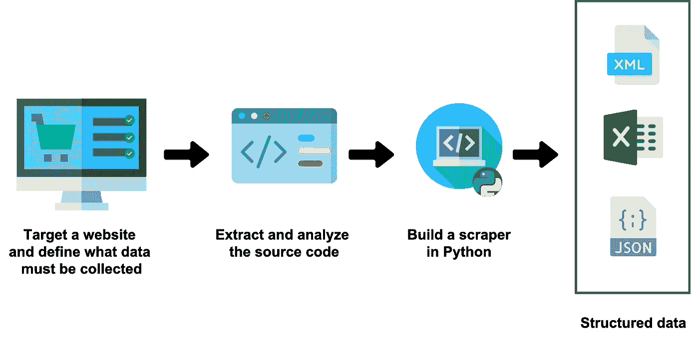
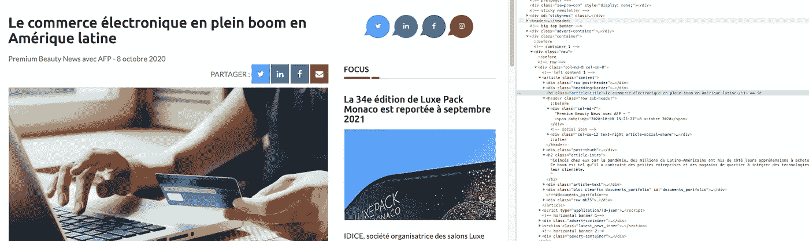
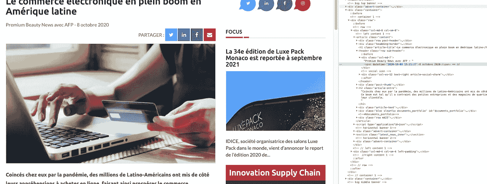
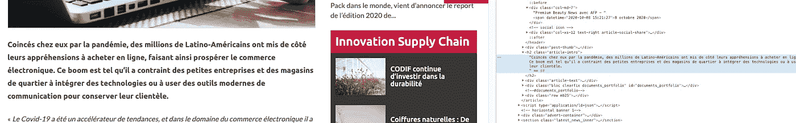
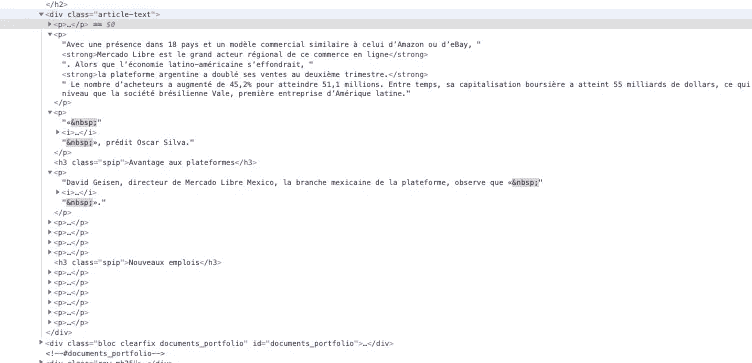
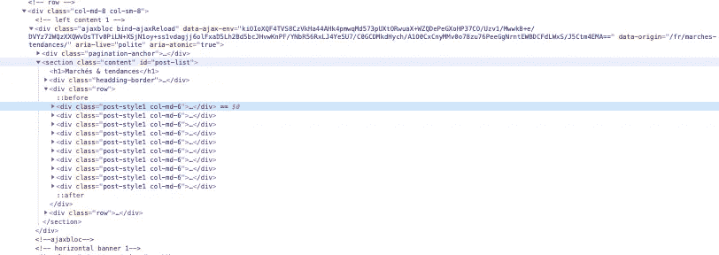
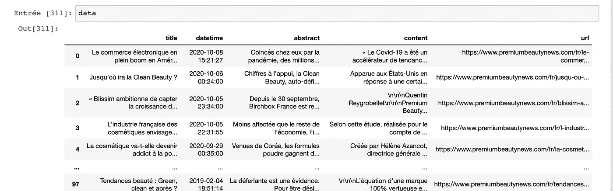

# 使用 BeautifulSoup 和请求介绍 Python 中的抓取

> 原文：<https://medium.datadriveninvestor.com/introduction-to-scraping-in-python-with-beautifulsoup-and-requests-ab7b1c9bc113?source=collection_archive---------1----------------------->

## 一旦你开始刮，互联网就成了你的数据库



Image by the author: scraping workflow

出于各种原因，组织中不同级别的许多人可能需要从互联网上收集外部数据:分析竞争、聚合新闻源以跟踪特定市场的趋势，或者收集每日股票价格以构建预测模型…

无论你是数据科学家还是商业分析师，你可能会不时遇到这种情况，并问自己这个永恒的问题: ***我如何才能提取这个网站的数据来进行市场分析？***

提取网站数据并对其进行结构化的一种可能的免费方式是**抓取。在这篇文章中，你将学习数据抓取以及如何用 python 轻松构建你的第一个抓取器。**

*ps*:本文支持入门视频教程*🎥*我用 Python 做了关于数据抓取的。有兴趣可以在这里* *观看* [*。*](https://www.youtube.com/watch?v=7Odi2_u-yDk)

*ps**:如果你对源代码感兴趣，可以在这里* *抓取* [*。*](https://github.com/ahmedbesbes/scraping-tutorial)

# 什么是数据抓取？🧹

让我给你省掉冗长的定义。

广义地说，数据抓取是以编程方式提取网站数据并根据个人需求构建数据的过程。许多公司正在使用数据搜集来收集外部数据并支持他们的业务运营:这是当前多个领域的常见做法。

## 学习 python 中的数据抓取需要知道什么？

不多。要构建小型刮刀，您必须对 Python 和 HTML 语法有一点熟悉。

要构建可扩展的工业刮刀，您需要了解一两个框架，如[](https://scrapy.org/)****或 [**硒**](https://www.selenium.dev/) **。******

# ****用 Python 构建您的第一个刮刀****

## ****设置您的环境****

****让我们来学习如何把一个网站变成结构化数据！为此，首先需要安装以下库:****

*   ****[**请求**](https://requests.readthedocs.io/en/master/) **:** 模拟 HTTP 请求，如 GET 和 POST。我们将主要使用它来访问任何给定网站的源页面。****
*   ****[**BeautifulSoup**](https://www.crummy.com/software/BeautifulSoup/bs4/doc/) :非常容易解析 HTML 和 XML 数据****
*   ****[**lxml**](https://lxml.de/) :提高 xml 文件的解析速度****
*   ****[**熊猫**](https://pandas.pydata.org/) **:** 将数据组织成数据帧，并以您选择的格式(JSON、Excel、CSV 等)导出。)****

****如果您使用的是 Anaconda，那么您应该已经准备好了:所有这些包都已经安装好了。否则，您应该运行以下命令:****

```
****pip install requests
pip install beautifulsoup4
pip install lxml
pip install pandas****
```

****为了让人们容易地跟随我的视频教程，我还使用了一个 jupyter 笔记本来使这个过程互动。****

## ******我们要刮什么网站和数据？******

****我的一个朋友问我能不能帮他刮这个[网站](https://www.premiumbeautynews.com/fr/marches-tendances/)。所以我决定在教程里做。****

****这个网站叫做高级美容新闻。它发布美容市场的最新趋势。如果你看看首页，你会看到我们想要收集的文章被组织在一个网格中。****

********

****Screenshot made by the author — Article headlines****

****多页:****

********

****Screenshot made by the author — Pagination: here’s where scraping comes in handy****

****当然，我们不会只提取这些页面上出现的每篇文章的标题。我们会进入每个岗位拿走我们需要的一切:****

******标题**、**日期**、**摘要**:****

********

****Screenshot made by the author****

****当然还有剩余的**帖子的全部内容**。****

# ****给我看看代码！****

****因为这就是你在这里的原因，对吗？****

****基本进口优先:****

```
****import requests 
from bs4 import BeautifulSoup 
import pandas as pd 
from tqdm import tqdm_notebook****
```

****我通常定义一个函数来解析给定 URL 的每个页面的内容。这个函数将被多次调用。姑且称之为 **parse_url:******

```
****def** parse_url(url):     
    response = requests.get(url)
    content = response.content     
    parsed_response = BeautifulSoup(content, "lxml")     
    **return** parsed_response**
```

## ****提取每个帖子的数据和元数据****

****首先，我将定义一个函数，根据给定的 URL 提取每个帖子的数据(标题、日期、摘要等)。然后我们将在遍历所有页面的 for 循环中调用这个函数。****

****要构建我们的 scraper，我们首先必须理解页面的底层 HTML 逻辑和结构。先从提取帖子标题开始。****

****通过在 Chrome inspector 上检查该元素:****

********

****Screenshot made by the author — Title of the post****

****我们注意到标题出现在类**“文章标题”**的 **h1** 中。
使用 BeautifulSoup 提取页面内容后，可以使用 **find 方法提取标题。******

```
****title = soup_post.find("h1", {"class": "article-title"}).text****
```

****现在让我们看看日期:****

********

****Screenshot made by the author — Date of the post****

****日期出现在**跨度**内，跨度本身出现在**“行子标题”类的**标题**内。**使用 BeautifulSoup 将这些内容翻译成代码非常容易:****

```
**datetime = soup_post.find("header", {"class": "row sub-  header"}).find("span")["datetime"]**
```

**关于摘要:**

****

**Screenshot made by the author — Abstract of the post**

**看起来它包含在类“article-intro”的一个 **h2** 标签中。**

```
**abstract = soup_post.find("h2", {"class": "article-intro"}).text**
```

**现在，帖子的全部内容呢？实际上很容易提取。该内容分布在类**“文章-文本”的 **div** 中的多个段落( **p 标签**)。****

****

**Screenshot made by the author — The full content of the post**

**BeautifulSoup 不需要遍历每个单独的 **p 标签，**提取它的文本，然后连接所有的文本，它可以用这样一种方式提取完整的文本:**

```
**content = soup_post.find("div", {"class": "article-text"}).text**
```

**让我们将一切打包到一个函数中:**

## **提取多个页面上的帖子 URL**

**如果我们检查主页的源代码，在主页上，文章与标题一起显示，**

****

**Homepage source**

**我们将看到网格中出现的十篇文章中的每一篇都在类**“post-style 1 col-MD-6”**的 **div** 中，而后者本身又在类**“content”的 **section** 中。****

**因此，提取每页的帖子非常容易:**

```
**url = "https://www.premiumbeautynews.com/fr/marches-tendances/"**
**soup = parse_url(url)
section = soup.find("section", {"class": "content"})
posts = section.findAll("div", {"class": "post-style1 col-md-6"})**
```

**然后，对于每个单独的帖子，我们可以提取出现在一个“ **a 标签”**内的 URL，该标签本身在一个 **h4 内。我们将使用这个 URL 来调用我们之前定义的函数 **extract_post_data。******

```
**uri = post.find("h4").find("a")["href"]**
```

## ****分页****

**一旦在给定页面上提取了帖子，您可能希望转到下一个页面并重复相同的操作。**

**如果您查看分页，您会注意到一个“下一步按钮”:**

****

**Screenshot made by the author — Pagination**

**当您到达最后一页时，此按钮变为非活动状态。
换句话说，当下一页按钮激活时，你要告诉 scraper 抓取当前页面的帖子，移动到下一页，重复操作。当按钮变为非活动状态时，该过程应该停止。**

**总结这一逻辑，它将转化为以下代码:**

**一旦这个循环完成，您将拥有 posts_data 中的所有数据，您可以将其转换成漂亮的数据帧并导出到 CSV 或 Excel 文件。**

```
**df = pd.DataFrame(posts_data)
df.head()**
```

****

**dataframe of the scraped data — image by the author**

**感谢阅读坚持到最后！如果你对本教程的视频录制感兴趣，这里有链接:**

# **从这里去哪里？**

**你刚刚学会如何建立你的第一个刮刀，祝贺你！**

**现在，如果你想改善它，你可以考虑以下步骤:**

*   **多重处理和多线程脚本的执行**
*   **安排刮刀在一段时间内运行，以自动化数据刮削**
*   **句柄错误——随着时间的推移，刮刀很难维护，因为源代码可能会改变**
*   **部署一个数据库或 s3 存储桶来存储抓取的项目**

**这可能会让你忙上一阵子！**

**数据抓取快乐！**