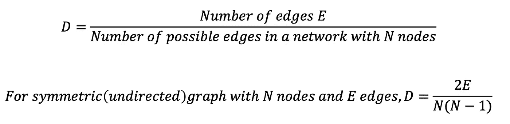
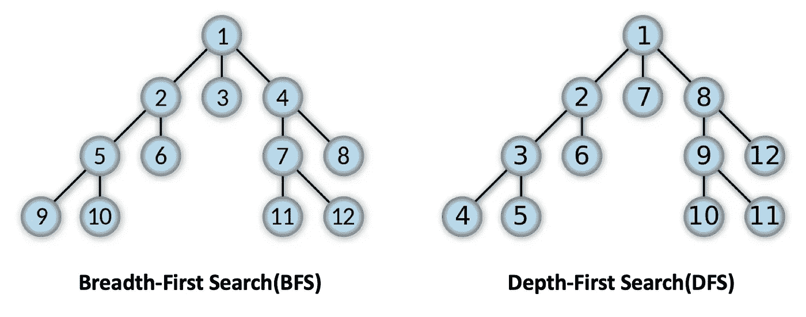
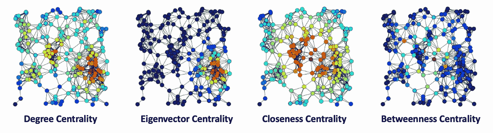
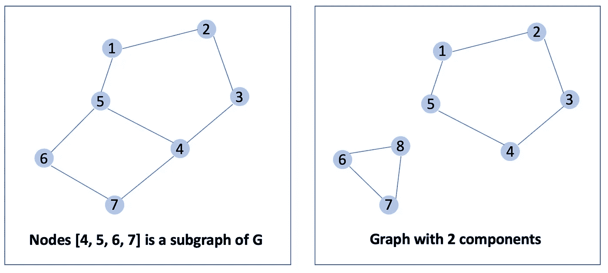
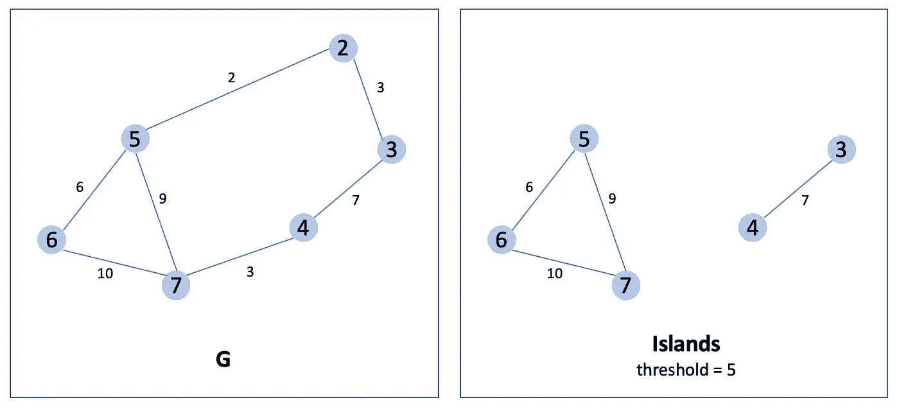
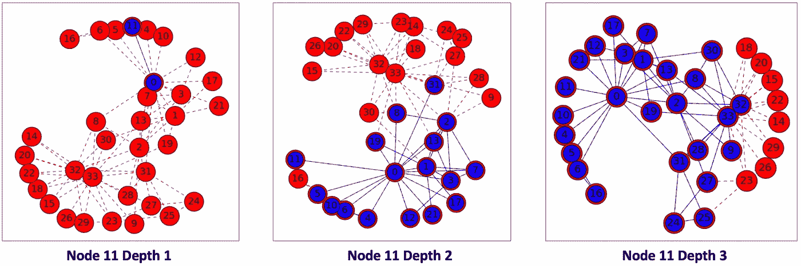
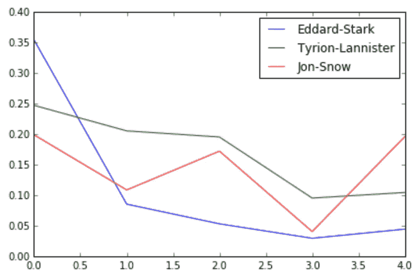
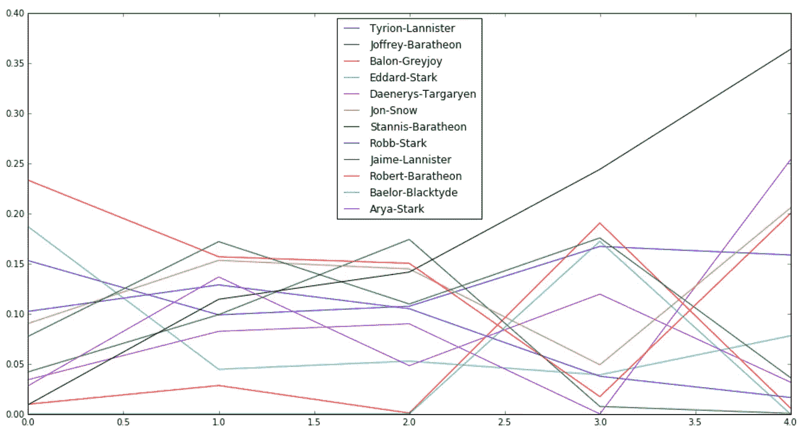
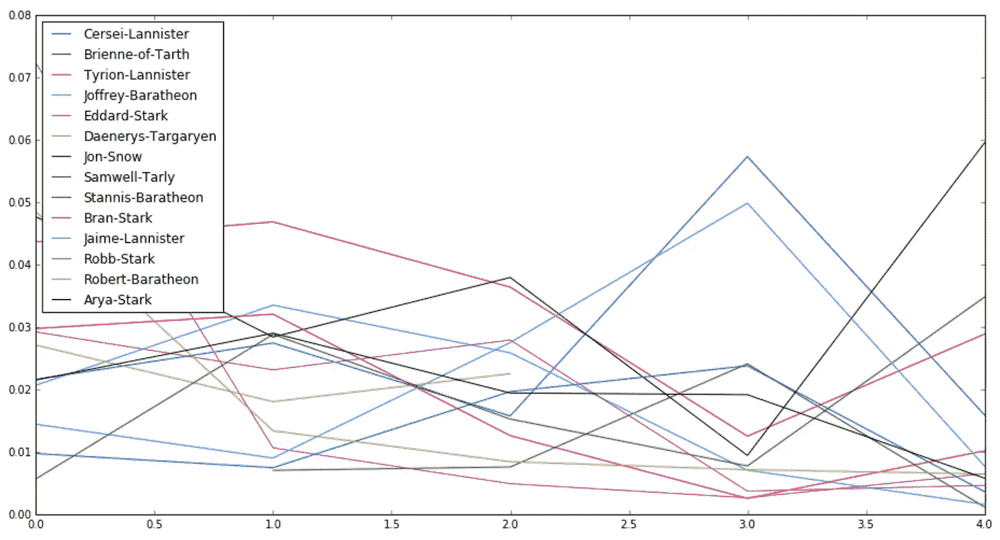
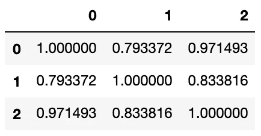

# 社会网络分析导论

> 原文：<https://medium.datadriveninvestor.com/introduction-to-social-network-analysis-bb31f6d692e8?source=collection_archive---------0----------------------->

## 研究 Python 中社会网络分析(SNA)的大数据应用

```
Feel free to follow me on Medium :)
```

在现代世界，每个人都非常沉迷于社交媒体，老实说，几乎要花半天时间在社交媒体上。此外，我们可以知道，几乎任何一个让人们互动的系统，都可以被建模为一个社交网络。最近在 DataCamp 上完成了《[一个权力的游戏](https://learn.datacamp.com/projects/76)的网络分析》案例研究。在这个项目中，我们将看看系列丛书*《冰与火之歌》*(电视剧*《权力的游戏》*)以及使用不同的中心性度量标准，人物的重要性在书中是如何变化的。


# 社会网络分析

**社会网络分析(SNA)** 是通过使用网络和图论，根据连接它们的节点和边来调查社会结构的过程。

## 图论

一个图由通过**边**(也称为链接或关系)连接的**顶点**(也称为节点)组成。

这里有三种不同的边关系:

*   **二进制和值(权重)**
*   **对称和非对称(方向性)** —无向图和有向图之间存在区别，在无向图中，边对称地链接两个顶点，在有向图中，边不对称地链接两个顶点。
*   **单模和多模**

## 图形测量

**大小** —网络的大小可以指节点数 *N* 或边数 *E.*

[](https://www.datadriveninvestor.com/2020/03/19/big-data-disrupts-credit-applications-as-we-know-them/) [## 大数据颠覆了我们所知的信贷应用|数据驱动的投资者

### 融合是金融领域的最新流行词，由于支付和贷款之间的关系，我们现在…

www.datadriveninvestor.com](https://www.datadriveninvestor.com/2020/03/19/big-data-disrupts-credit-applications-as-we-know-them/) 

**密度** —网络的密度 *D* 被定义为具有 *N* 个节点的网络中的边数 *E* 与可能的边数之比。



**直径** —图中所有节点对之间最短距离的最大值。

**最短路径** —对于未加权距离，我们计算两个节点之间的边数，对于加权距离，我们计算两个节点之间的权重之和。我们还有两种算法来寻找最短路径:

*   **广度优先搜索(BFS)** —从根节点开始，在移动到下一级节点之前，探索当前深度的所有邻居节点。
*   **深度优先搜索(DFS)** —从根节点开始，在移动到下一级的分支之前，沿着每个分支尽可能远地探索。



## 节点测量

**度中心性**—一个节点拥有的边数(定义为关联到一个节点的链接数)。

**特征向量中心性** —特征中心性是网络中节点重要性的度量。它给网络中的所有节点分配相对分数，使得与高分数节点的连接比与低分数节点的相等连接对所讨论的节点的分数贡献更大。因此，特征向量中心性高的节点本质上连接到许多高度节点。

**贴近度中心性** —在连通图中，一个节点的归一化贴近度是该节点与图中所有其他节点之间最短路径的平均*长度。因此，一个节点越中心，它离所有其他节点就越近。*

***介数中心性** —节点的标准化介数是一个节点在两个其他节点之间的最短路径上充当桥梁的次数。*

**

*Different Categories of Centrality from Wikipedia*

## *网络测量*

***子图** —网络中节点的子集，以及连接这些节点的所有边。*

***组件**—互不相连的网络子图。*

**

*Subgraph and Component*

***岛** —仅保留权重大于阈值的边。*

**

*Islands*

***ego 网络**—以某个节点(Ego 节点)为中心的子网络，通过从 Ego 节点开始运行广度优先搜索，限制深度小于 3。*

**

***聚类系数**——衡量自我的朋友也是彼此的朋友的比例，以及图中节点倾向于聚集在一起的程度。*

***团** —定义为无向图的最大完全连通子图，其中团中的每两个不同节点都是相邻的。*

# *案例分析:《权力的游戏》的网络分析*

## ***数据***

*《权力的游戏》是 HBO 电视台非常受欢迎的电视连续剧，改编自乔治·R·R·马丁的畅销丛书《冰与火之歌》。该数据集包含从第一到第五的书籍系列*冰与火之歌*。我们还将使用这个数据集来分析《权力的游戏》系列书中人物的共现网络。*

*首先，我们将只加载第一本*权力的游戏*数据来检查列的名称。*

```
*import pandas as pd
book1 = pd.read_csv('datasets/book1.csv')
book1.head()*
```

*得到的数据帧`book1`有 5 列:`Source`、`Target`、`Type`、`weight`和`book`。源和目标是由边链接的两个节点。每条边的权重属性告诉我们人物在书中的互动次数。*

*一旦我们已经有了创建网络的数据，我们将使用`networkx`，一个网络分析库，并为第一本书创建一个图形对象。*

```
*import networkx as nx
G_book1 = nx.Graph()*
```

*目前，图形对象`G_book1`为空。因此，我们应该用来自`book1`的边填充它，并载入其余的书。*

```
***# Creating a list of networks for all the books**
books = [G_book1]
book_fnames = ['datasets/book2.csv', 'datasets/book3.csv', 'datasets/book4.csv', 'datasets/book5.csv']
for book_fname in book_fnames:
    book = pd.read_csv(book_fname)
    G_book = nx.Graph()
    for _, edge in book.iterrows():
        G_book.add_edge(edge['Source'], edge['Target'], weight=edge['weight'])
    books.append(G_book)*
```

## *寻找最重要特征的程度中心性*

*首先，我们使用度中心性来衡量一个节点在网络中的重要性，方法是查看它拥有的邻居数量和它所连接的节点数量。*

```
*# Calculating the degree centrality of book 1 and book 5
deg_cen_book1 = nx.degree_centrality(books[0])
deg_cen_book5 = nx.degree_centrality(books[4])# Sorting the dictionaries according to their degree centrality and storing the top 10
sorted_deg_cen_book1 = sorted(deg_cen_book1.items(), key=lambda x: x[1], reverse=True)[0:10]
     **('Eddard-Stark', 0.3548387096774194)**
sorted_deg_cen_book5 = sorted(deg_cen_book5.items(), key=lambda x: x[1], reverse=True)[0:10]
     **('Jon-Snow', 0.1962025316455696)***
```

*根据程度中心性，我们了解字符的重要性随时间而变化，因此我们想考察几个字符的程度中心性的演变。*

**

```
*%matplotlib inline
evol = [nx.degree_centrality(book) for book in books]
degree_evol_df = pd.DataFrame.from_records(evol)
degree_evol_df[['Eddard-Stark', 'Tyrion-Lannister', 'Jon-Snow']].plot()*
```

*通过绘制线图，我们可以看到，随着系列丛书的进展，艾德·史塔克的重要性在下降。琼恩·雪诺在第四本书中有所下降，但在第五本书中突然上升。*

## **中间性*寻找最重要的特征的中心性*

*接下来，我们使用介数中心性来寻找《权力的游戏》中的重要角色，并绘制出这五本书的网络的介数中心性的演变。*

```
*evol = [nx.betweenness_centrality(book, weight='weight') for book in books]
betweenness_evol_df = pd.DataFrame.from_records(evol).fillna(0)# Finding the top 4 characters in every book
set_of_char = set()
for i in range(5):
    set_of_char |= set(list(betweenness_evol_df.T[i].sort_values(ascending=False)[0:4].index))
list_of_char = list(set_of_char)betweenness_evol_df[list_of_char].plot(figsize=(13,7))*
```

**

*随着系列丛书的进展，我们可以看到史坦尼斯·拜拉席恩的重要性有一种奇特的上升。在第五本书中，他明显比网络中的其他角色更重要。*

## **PageRank* 查找最重要的字符*

*现在，我们尝试 PageRank 来寻找我们的《权力的游戏》角色中的重要角色，并绘制这五本书中该网络的 PageRank 的演变。 **PageRank** ( **PR** )是谷歌搜索在其搜索引擎结果中对网页进行排名的一种算法，是衡量网站页面重要性的一种方式。它评估万维网(定向网络)中网页的内链接和外链接。*

```
*evol = [nx.pagerank(book) for book in books
pagerank_evol_df = pd.DataFrame.from_records(evol)set_of_char = set()
for i in range(5):
    set_of_char |= set(list(betweenness_evol_df.T[i].sort_values(ascending=False)[0:4].index))
list_of_char = list(set_of_char)pagerank_evol_df[list_of_char].plot(figsize=(13,7))*
```

**

*根据 PageRank，史坦尼斯·拜拉席恩和琼恩·雪诺是第五部书中最重要的人物。*

## *不同度量之间的相关性*

*我们已经看到了计算网络中节点重要性的三种不同的度量，但是我们希望通过使用 Pearson 相关性来查看 PageRank、介数中心性和度中心性之间的相关性。*

```
*measures = [nx.pagerank(books[4]), 
         nx.betweenness_centrality(books[4], weight='weight'), 
            nx.degree_centrality(books[4])]
cor = pd.DataFrame.from_records(measures)
cor.T.corr()*
```

**

*我们可以得出结论，对于我们的字符共现网络，这三个度量之间有很高的相关性。*

## ***结论***

*最后，根据程度中心性和 PageRank，琼恩-雪诺**T3 是第五本书中最重要的角色。而对于中间中心性，在第五本书中，史坦尼斯-拜拉席恩**T5【明显比网络中的其他人物更重要。*****

```
*p_rank, b_cent, d_cent = cor.idxmax(axis=1)print(p_rank)     **Jon-Snow**
print(b_cent)     **Stannis-Baratheon** print(d_cent) **Jon-Snow***
```

*创建这篇文章的源代码可以在我的 [Github](https://github.com/shirley0823/Network-Analysis-of-Game-of-Thrones) 中找到。*

# *关于我*

*非常感谢您阅读我的文章！大家好，我是雪莉，目前在亚利桑那州立大学攻读商业分析硕士学位。如果您有任何问题，请随时联系我！*

```
*Email me at ***kchen122@asu.edu***and feel free to connect me on [**LinkedIn**](https://www.linkedin.com/in/kuanyinchen-shirley/)!*
```