# SQL 简介

> 原文：<https://medium.datadriveninvestor.com/introduction-to-sql-5d8231ee92a5?source=collection_archive---------7----------------------->

## 数据科学结构化查询语言基础

# 结构化查询语言(SQL)

SQL 是用于关系数据库管理和数据操作的标准计算机语言。它用于在关系数据库上执行、创建、读取、更新和删除(CRUD)操作。在这篇介绍性的文章中，我将重点关注对数据库的单个表的“读”操作。我将介绍您开始使用 SQL 时需要的语句。除了语句之外，这些语句是 select-from、where、group by、order by、limit 和 aggregate 函数。不管你使用什么样的数据库管理系统，这篇文章中的陈述都会对你有用。最流行的数据库管理系统是 MySQL、PostgreSQL、Oracle、Microsoft SQL Server 和 SQLite。出于本教程的目的，我们将使用 SQLite。

## 设置

对于代码，我将使用一个示例 SQLite 数据库。您可以从以下网址下载该数据库的副本:

[](https://www.sqlitetutorial.net/sqlite-sample-database/) [## SQLite 示例数据库及其图表](https://www.sqlitetutorial.net/sqlite-sample-database/) 

对于本教程，我们将只使用数据库中的一个表。我们将使用的表是“tracks”此外，为了使 jupyter 笔记本上的数据更加可视化，我们将使用 read_sql pandas 方法来查看作为 pandas 数据框的查询结果。让我们从导入必要的库开始，并打开到示例数据库文件的连接。

```
import pandas as pd
import sqlite3
cnx = sqlite3.connect('chinook.db')
```

# SELECT、FROM 和 LIMIT 语句

SELECT 语句允许我们选择将根据我们的查询显示的数据。它应该总是伴随着一个 FROM 语句，该语句告诉数据库使用什么表来获取信息。要选择表中的所有列，select 语句后跟“*”，并以“*”结束查询；.'

```
SELECT * 
FROM tracks;
```

该查询将显示整个“tracks”表。为了使熊猫的查询可读，我们需要用三重引号将整个查询括起来。通常，我们可能会使用字符串来过滤我们的查询。因此，需要三重引号来避免破坏查询块。

```
'''SELECT * 
FROM tracks;'''
```

极限语句的行为类似于。熊猫的头()方法。因此，如果您添加一个 LIMIT 5 语句，它将获得查询的前五行。让我们将这个语句添加到我们的查询中，并获得一个 pandas 数据框。

```
sql = '''SELECT * 
FROM tracks
LIMIT 5;'''
pd.read_sql(sql, cnx)
```

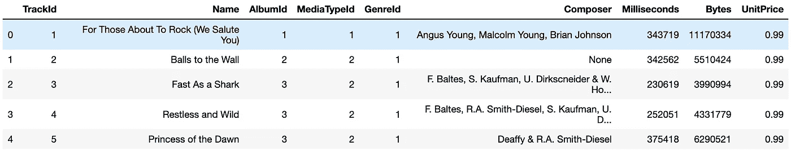

First five rows of the ‘tracks’ table.

如果我们只想获得曲目的名称、作曲家及其价格。我们可以使用列名作为 SELECT 语句的输入，用逗号分隔它们。

```
sql = '''SELECT name, composer, unitprice 
FROM tracks
LIMIT 5;'''
pd.read_sql(sql, cnx)
```

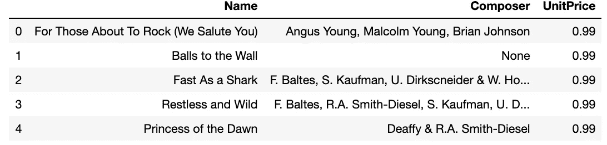

Name, composer, and unit price.

# 聚合函数:COUNT()、AVG()、SUM()

COUNT()函数返回与指定查询匹配的行数。AVG()和 SUM()函数分别返回数值列的平均值和总和。对于本例，让我们获得记录数、所有磁道的大小(以字节为单位)和平均磁道长度(以毫秒为单位)。

```
sql = '''SELECT COUNT(*) AS count, SUM(bytes) AS total_bytes, AVG(milliseconds) AS avg_length 
FROM tracks;'''
pd.read_sql(sql, cnx)
```

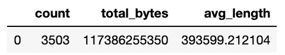

Count, tota size and the average length of tracks.

根据我们的查询，有 3，503 个磁道，总大小为 11，738，625，535 字节，平均长度为 393，599.212104 毫秒。修改如何通过在 SELECT 语句中声明别名来更改列名。这是通过在我们可以为其设置别名的每个变量后使用 AS 语句来实现的。

[](https://www.datadriveninvestor.com/2019/01/23/which-is-more-promising-data-science-or-software-engineering/) [## 数据科学和软件工程哪个更有前途？数据驱动的投资者

### 大约一个月前，当我坐在咖啡馆里为一个客户开发网站时，我发现了这个女人…

www.datadriveninvestor.com](https://www.datadriveninvestor.com/2019/01/23/which-is-more-promising-data-science-or-software-engineering/) 

# WHERE 和条件语句

WHERE 语句用于过滤我们的查询。它将只返回符合设定条件的记录。如果需要满足多个条件，WHERE 语句可以与 AND 和 OR 条件一起使用。让我们假设我们想要获得来自 AlbumId 2 或 3 的所有轨道。

```
sql = '''SELECT name, composer, AlbumId
FROM tracks
WHERE AlbumId = 2
OR AlbumId = 3;'''
pd.read_sql(sql, cnx)
```

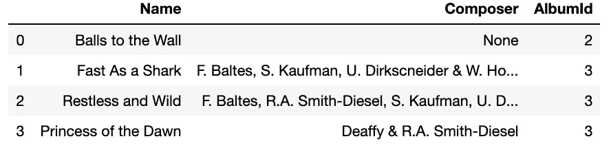

Tracks in AlbumId 2 or 3

现在，如果我们不得不从几个专辑中获取所有的曲目，那将是非常乏味的。我们可以编写一个 IN 语句，而不是编写多个 OR 条件语句，这与。isin() pandas 方法。

```
sql = '''SELECT name, composer, AlbumId
FROM tracks
WHERE AlbumId IN (2,3,4)
AND milliseconds>280000;'''
pd.read_sql(sql, cnx)
```

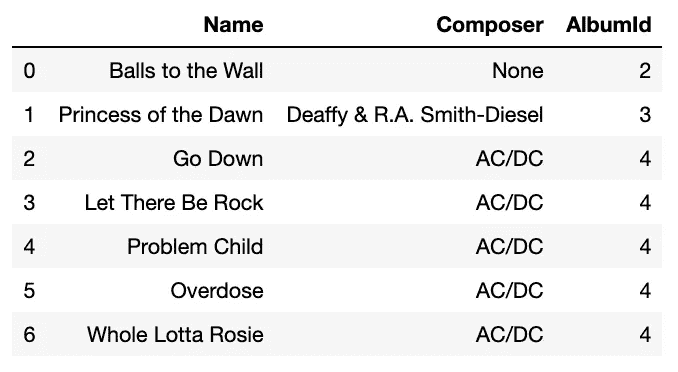

Tracks with a duration of more than 280,000 milliseconds in selected albums.

上表列出了 AlbumId 2、3 或 4 中持续时间超过 280，000 毫秒的所有曲目。我们已经看到了如何根据数值过滤，现在，如何过滤一些作曲家。我们会做完全相同的事情，只是指定用单引号括起来的字符串。

```
sql = '''SELECT name, composer, AlbumId
FROM tracks
WHERE Composer = 'AC/DC';'''
pd.read_sql(sql, cnx)
```

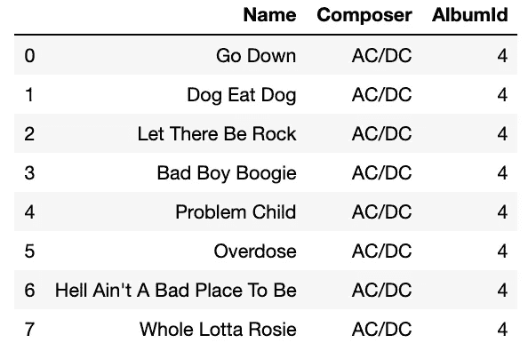

AC/DC track list

例如，如果您不想要一个特定的作曲家，而是想要一个作曲家名字以 C 开头的音轨，该怎么办呢？这就是 LIKE 语句发挥作用的地方。LIKE 语句与 Where 语句成对出现，根据指定的模式进行筛选。下表列出了不同的运算符。

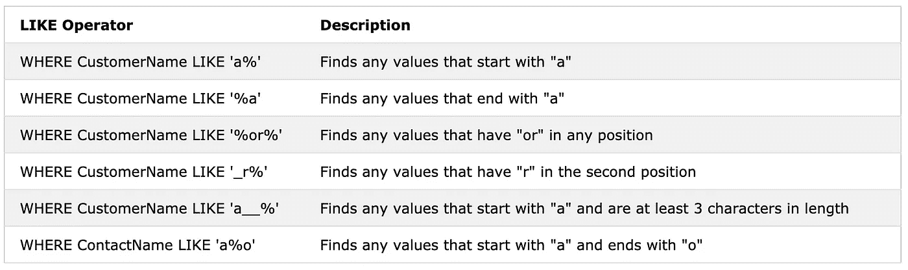

©Refsnes Data W3Schools

让我们看看名字以 m 开头的人创作的曲目。

```
sql = '''SELECT name, composer, AlbumId
FROM tracks
WHERE Composer LIKE 'm%';'''
pd.read_sql(sql, cnx)
```

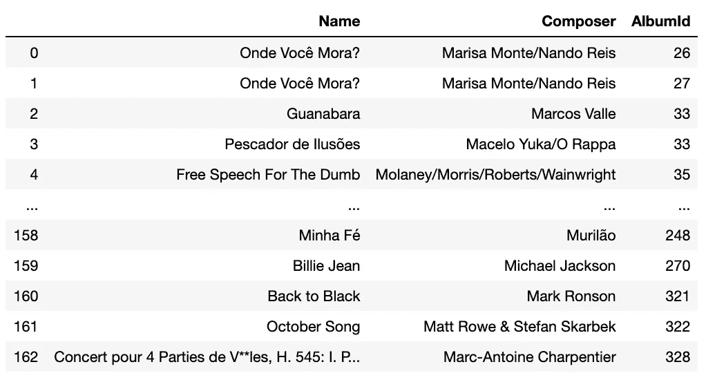

List of tracks

# GROUP BY 和 HAVING 语句

GROUP BY 语句通常与上述聚合函数一起使用，因为它将与汇总行具有相同值的行分组。我们可以查询该表，按照专辑 id 对曲目进行分组。

```
sql = '''SELECT albumid, COUNT(*), AVG(milliseconds), MIN(UnitPrice)
FROM tracks
GROUP BY albumid;'''
pd.read_sql(sql, cnx)
```

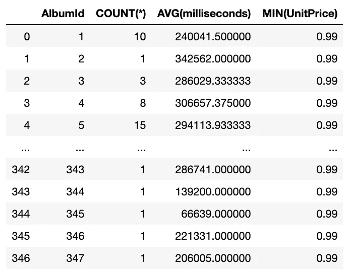

Tracks grouped by album id

对于这个例子，我查询了数据库，按照专辑 id 对曲目进行分组。然后，用 COUNT 语句计算每张专辑中有多少首曲目。此外，我使用 AVG()聚合函数获得了每张专辑中曲目的平均持续时间，并使用 MIN()函数获得了专辑中包含的曲目的最低价格。

GROUP BY 与 WHERE 语句不兼容。相反，我们可以使用另一种称为 HAVING 的语句。对于上面的查询，让我们将搜索范围限制在 EN 6 和 10 首歌曲之间的专辑。

```
sql = '''SELECT albumid, COUNT(*), AVG(milliseconds), MIN(UnitPrice)
FROM tracks
GROUP BY albumid
HAVING COUNT(*) BETWEEN 6 and 10;'''
pd.read_sql(sql, cnx)
```

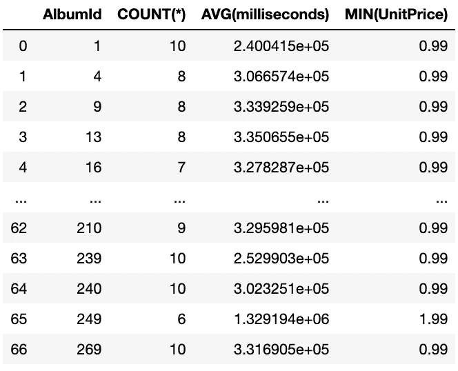

Albums containing between 6 and 10 tracks

在本节中，除了学习 GROUP BY 和 Having 语句之外。我们也有机会使用 MIN()和 BETWEEN 语句。这些语句也可以与 WHERE 语句一起使用。MIN()和 MAX()分别从数值变量中获取最小值和最大值。BETWEEN 设置一个间隔来限定数值变量。请记住，BETWEEN 语句中设置的边界是包含的，在本例中是 6 和 10。

# 按语句排序

我们已经成功地查询了表并过滤了结果，但是现在我们想通过一些变量对它们进行排序。我们可以使用 ORDER BY 语句做到这一点。让我们详细说明一下上一个按平均持续时间排序专辑的查询。

```
sql = '''SELECT albumid, COUNT(*), AVG(milliseconds), MIN(UnitPrice)
FROM tracks
GROUP BY albumid
HAVING COUNT(*) BETWEEN 6 and 10
ORDER BY AVG(milliseconds) DESC
LIMIT 10;'''
pd.read_sql(sql, cnx)
```

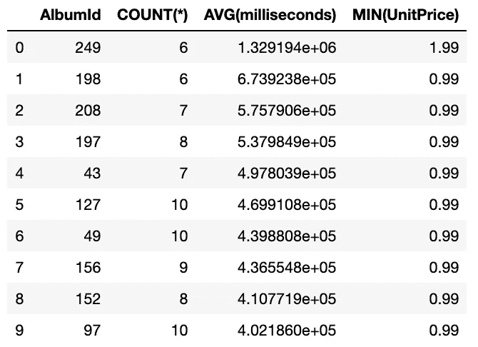

Top 10 albums by mean track duration

我们已经根据专辑的平均曲目时长对列表进行了排序。我包含了 DESC 语句，以降序(从最高值到最低值)对值进行排序。默认情况下，ORDER BY 语句使用升序，因此，如果您想从最低到最高对值进行排序，就不需要添加 ASC 语句。

# 将所有这些放在一起:基本连接

SQL 是一个强大的查询工具，拥有大量的应用程序和复杂的语句。本教程是从单个表开始的很好的入门教程。然而，在现实世界的数据库中，数据永远不会停留在单个表中。您必须根据键值来连接表。例如，我们可以使用 join 语句将 tracks 表连接到 albums 表，并获取专辑名称。tracks 表中的 albumid 列指向 albums 表中的一个专辑 id。为了结束本教程，让我们做一个最终的查询，它封装了所涉及的大部分内容。

1.  选择专辑名称、包含的曲目数量以及专辑的总价。
2.  从“曲目”和“专辑”表中
3.  按白蛋白分组
4.  过滤包含 8 至 12 首曲目的专辑
5.  将行数限制为 10 个最贵的相册。

```
sql = '''SELECT title, COUNT(t.name) AS tracks, SUM(t.UnitPrice) AS album_price
FROM tracks AS t
JOIN albums AS a ON t.AlbumId=a.AlbumId
GROUP BY t.albumid
HAVING COUNT(t.name) BETWEEN 6 AND 12
ORDER BY SUM(t.UnitPrice) DESC
LIMIT 10;'''
pd.read_sql(sql, cnx)
```

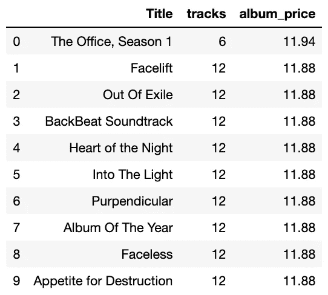

Top 10 most expensive albums

太好了！我们利用两个表格中的信息，设法得到了最贵专辑的名字和它们包含的曲目数量。有趣的是，这张最贵的专辑只有 6 首歌。请注意，也可以为表定义别名。当处理多个表时，我们必须将表的名称(或其别名)附加到变量名，即 t.name(列:名称，来自 tracks 表)。

在寻找数据科学或分析职业时，SQL 是最有价值的语言之一。请参考下一节的资源，继续磨练您的 SQL 技能。

# 参考资料和进一步阅读

[https://www . techopedia . com/definition/1245/structured-query-language-SQL](https://www.techopedia.com/definition/1245/structured-query-language-sql)

[](https://www.w3schools.com/sql/default.asp) [## SQL 教程

### SQL 是一种在数据库中存储、操作和检索数据的标准语言。我们的 SQL 教程将教你…

www.w3schools.com](https://www.w3schools.com/sql/default.asp)  [## 11.13.sqlite3—SQLite 数据库的 DB-API 2.0 接口— Python 2.7.17 文档

### SQLite 是一个 C 库，它提供了一个轻量级的基于磁盘的数据库，不需要单独的服务器进程…

docs.python.org](https://docs.python.org/2/library/sqlite3.html)