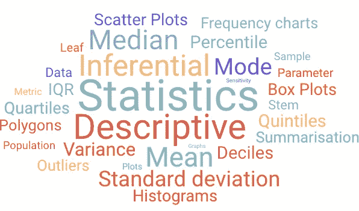
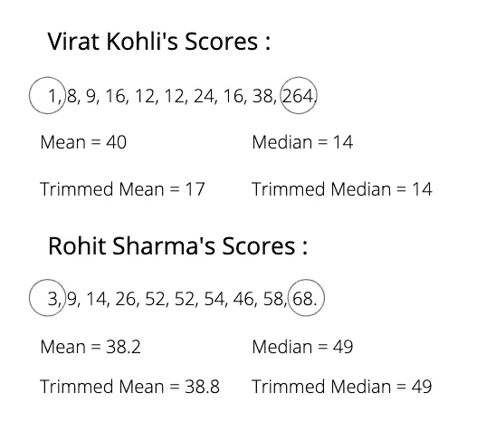
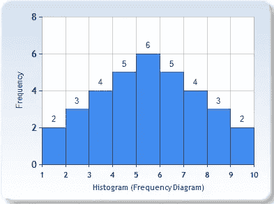
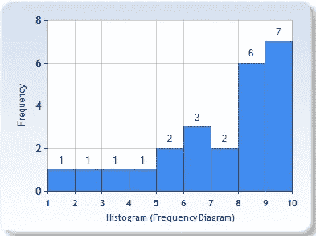
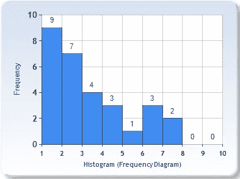
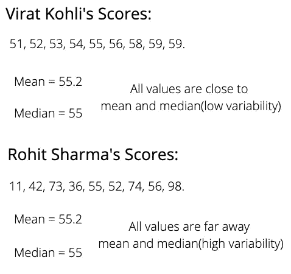
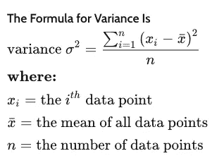
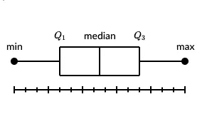

# 统计学导论—第二部分

> 原文：<https://medium.datadriveninvestor.com/introduction-to-statistics-part-2-25fb0f3e0b93?source=collection_archive---------11----------------------->

起飞前。我想建议在这里阅读我文章的第一部分[。](https://towardsdatascience.com/an-introduction-to-statistics-part-1-e056837afa8e)

如果你听说过集中性的**度量**和扩散性的**度量**这两个术语，请举手。我想你们大多数人都知道其中的一些，但对这里使用的术语感到困惑。让我们试着理解它们是什么，以及它们如何有用。

# 中心性的测量:

> 中心性测量是一种试图用代表其分布中心的单个值或分布中的典型值来描述整个数据集的测量。

为了证明中心性的度量，让我们举一个例子。想想最近 10 场 ODI 比赛中 Virat Kohli 的得分。分数看起来像 21，28，29，26，22，22，24，16，38，198。

**平均值**的计算方法是将所有得分相加，然后除以总比赛次数。以上分数的平均值为 42.5。这实际上意味着维拉特·科利在他参加的最后 10 场比赛中的得分约为 42。

**模式**是数据中出现频率最高的值。以上分数的众数为 22。一个数据集也可能有两种模式。

**中位数**是通过对所有分数进行排序，并选取实际位于数据中心的分数(根据数据点的数量有所不同)计算出来的。排序后的分数看起来像——16，21，22，22，24，26，28，29，38，198。上述得分的中位数是 25。这意味着，在维拉特·科利最近 10 场比赛中，有 50%的得分低于 25。

 [## 数据科学和软件工程哪个更有前途？数据驱动的投资者

### 大约一个月前，当我坐在咖啡馆里为一个客户开发网站时，我发现了这个女人…

www.datadriveninvestor.com](https://www.datadriveninvestor.com/2019/01/23/which-is-more-promising-data-science-or-software-engineering/) 

## 对异常值的敏感度:

让我们扩展我们的第一个例子，以说明各种中心性措施对异常值的敏感性。让我们考虑一下最近 10 次 ODI 中 2 个击球手的得分。
Virat Kohli: 1，8，9，16，24，12，12，16，38，264。罗希特·夏尔马:三、九、十四、二十六、五十二、五十二、五十四、四十六、五十八、六十八

**问)谁在系列中表现更好？**

如果我们考虑总得分，Virat Kohli 以 400 分领先于 Rohit Sharma 的 382 分。如果我们计算平均值，Virat Kohli 的平均值为 40，超过 Rohit Sharma 的平均值 38.2。但这就足够确凿了吗？让我们来计算一下中位数，Virat Kohli 的中位数 14 比 Rohit Sharma 的 49 小得多。这意味着 Virat Kohli 在他参加的 50 %的比赛中得分不到 14 分，这是糟糕的，而 Rohit Sharma 在他参加的 50%的比赛中得分不到 49 分，这似乎是不错的。为什么均值和中值显示两个完全相反的统计数据？这就是离群值出现的原因。

> 离群值是远离数据中其他点的值。

在上面的例子中，我们可以清楚地看到在 Virat Kohli 的统计数据中有一个异常值(264)。让我们移除异常值(我们必须从数据的末尾和开头移除 n 个异常值)并计算新的平均值，该平均值也称为**修整平均值。**同样，让我们计算**修整后的中位数。**

The removal of outliers shows a clear picture.

现在，正如您所看到的，修剪后的平均值显示了所需的实际解释，您还可以注意到，在去除异常值后，平均值变化很大，但中位数没有变化。

> 平均值对异常值非常敏感，而中位数和众数则不敏感。

# 不同分布的中心性度量:

## 对于对称分布:

均值=中位数=众数(对于单峰分布)

平均值=中间值，存在两种模式(双峰分布)

## 对于左偏分布:

平均<median true=""></median>

But if heavy tail exists in between then Median<mean></mean>

## For Right Skewed Distributions:

Mean>中位数>模式(大部分是真的！)

但是如果重尾存在于中间，那么中值>均值>众数

# 传播的测量:

> 中心性的测量不能告诉我们任何关于数据的扩散和可变性的信息。传播的测量告诉我们在人群中存在的可变性和传播。

The above definition is illustrated in the stats given.

**1)范围** 是给定数据集中最高值与最低值之差。对于上面的例子，Virat Kohli 的范围是 8，而 Rohit Sharma 的范围是 87，这清楚地表明 Rohit Sharma 的分数具有更大的可变性和分布。

**2)方差** 所有点与平均值的偏差之和并不能说明任何关于扩散和可变性的问题，因为 Rohit Sharma 和 Virat Kohli 的结果都是零。[ (51–55.2) + (52–55.2) + ……..] = 0 和
[(11–55.2)+(42–55.2)+…。] = 0.
为了解决这个问题，我们可以在计算总和时计算偏差的平方，这就是所谓的**方差。** 尽管取绝对值是另一种解决方案，但平方函数是首选，因为它具有
a)更好的属性(如平滑和可微分)
b)还会放大异常值的影响。

我们可以注意到方差的单位和数据的单位是不同的。因此**标准偏差**被引入，它就是方差的平方根。

3) **四分位间距**

四分位数范围是数据集中间 50%的分布量。换句话说，就是第一个四分位数和第三个四分位数之间的距离。
QR = Q3 Q1

以下是找到 IQR 的方法:

**第一步:**将数据从少到多排序。

**第二步:**求中位数。如果数据点的数量是奇数，则中位数是中间的数据点。如果数据点的数量是偶数，则中位数是中间两个数据点的平均值。

**第三步:**求第一个四分位数。第一个四分位数是有序列表中中位数左边的数据点的中位数。

**第四步:**求第三个四分位数。第三个四分位数是有序列表中中位数右边的数据点的中位数。

**步骤 5:** 通过减去 Q3 Q1 计算 IQR。

# 箱线图:

> 箱线图用于显示数据中的分布、中间值和异常值。

盒须图也称为盒状图，显示一组数据的五个数字汇总。五位数汇总是最小值、第一个四分位数、中值、第三个四分位数和最大值。

在盒状图中，我们从第一个四分位数到第三个四分位数画一个盒子。一条垂直线穿过盒子的中间。胡须从每个四分位数到最小值或最大值。

# 概述

我在前两篇文章中介绍的是统计学的基础，我希望你今天学到了一些东西。如果您有任何反馈，请随时留言，并与任何可能觉得有用的人分享。