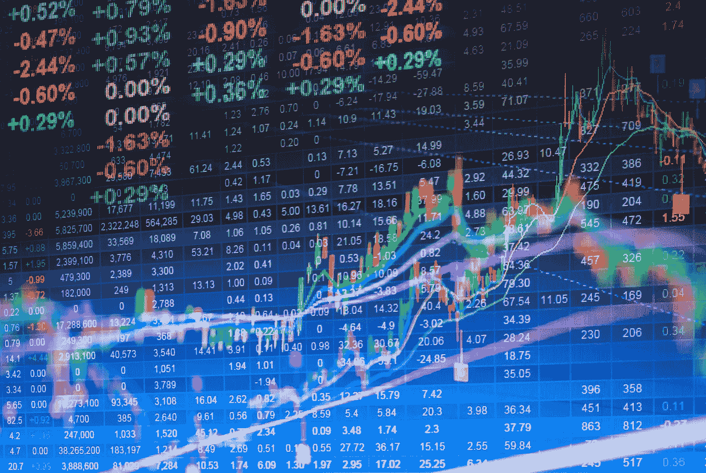
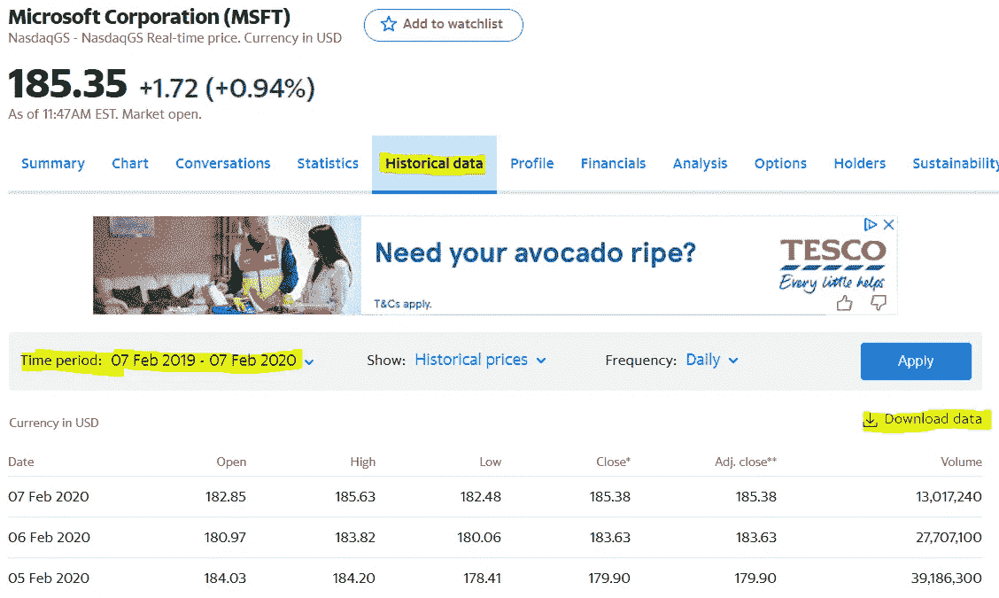
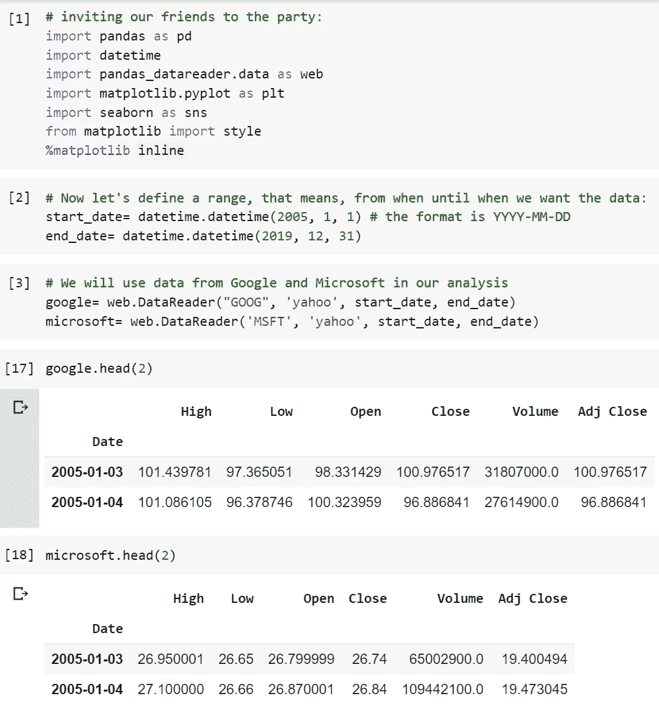
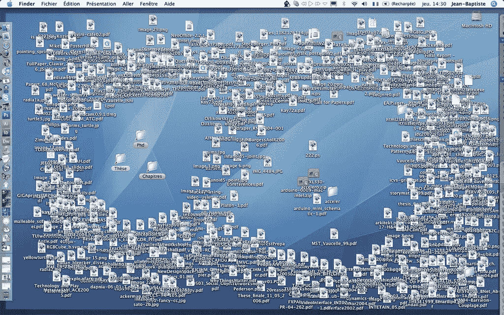
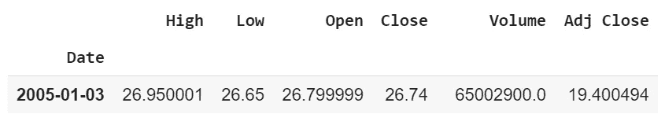
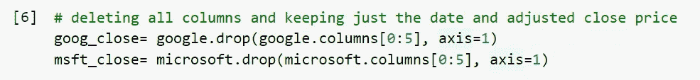
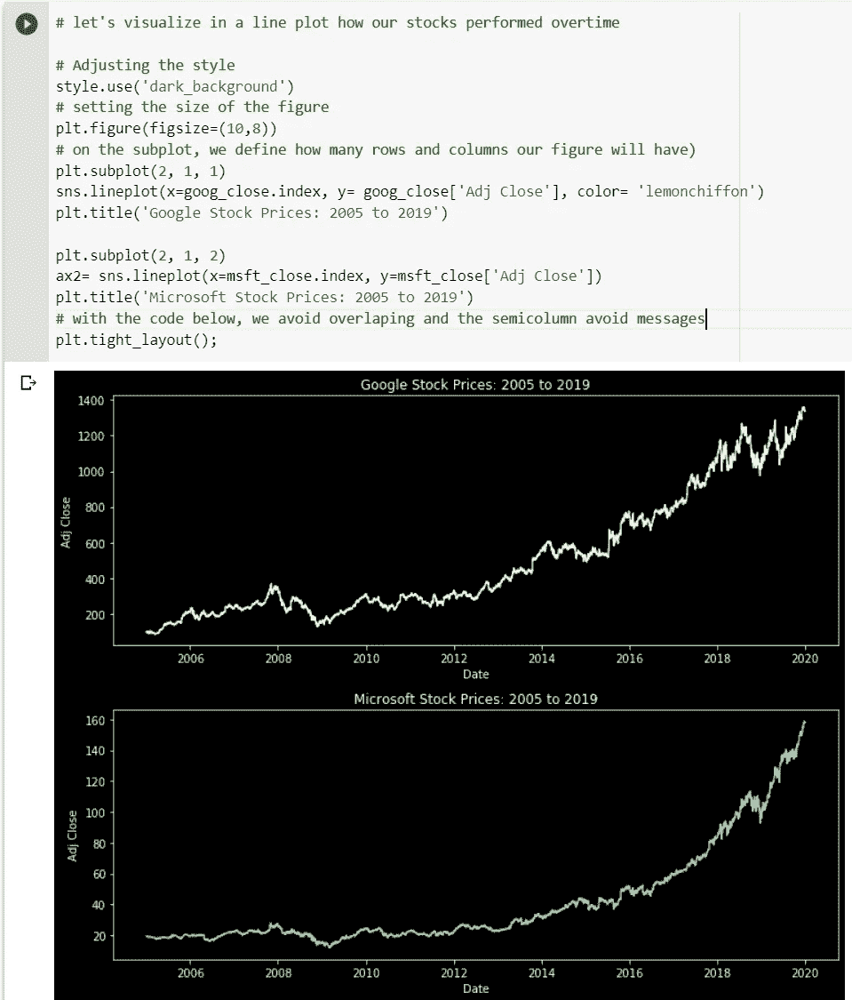

# Python 中的股票分析介绍。

> 原文：<https://medium.datadriveninvestor.com/introduction-to-stock-analysis-in-python-574246e689e3?source=collection_archive---------0----------------------->

## 了解如何访问，选择和绘制股票价格，而无需下载任何文件！

[Source](https://www.google.com/url?sa=i&url=https%3A%2F%2Fwww.nasdaq.com%2Fmarket-activity%2Fquotes%2Freal-time&psig=AOvVaw3bd3B7XdldAhnsz9Famnbh&ust=1581183932416000&source=images&cd=vfe&ved=0CAIQjRxqFwoTCKiK46n_v-cCFQAAAAAdAAAAABAD).

股票市场是数据科学家最感兴趣的地方之一。数据很多，分析预测的可能性是无限的。也是学生开始学习机器学习时爱用的热门话题之一，毕竟谁不想知道一股会有更高还是更低的价格呢？

然而，处理这种数据可能有点棘手，尤其是在 Kaggle 数据集的舒适区之外，当您想要选择您感兴趣的股票进行分析时。还有，我们应该用什么样的正确价格来进行可视化和预测呢？如何进行简单而有效的可视化？

这正是我们今天要讨论的。本教程是为那些想了解基础知识的初学者设计的，是你探索更复杂主题的起点。

 [## 2019 年最值得学习的编码语言|数据驱动的投资者

### 在我读大学的那几年，我跳过了很多次夜游去学习 Java，希望有一天它能帮助我在…

www.datadriveninvestor.com](https://www.datadriveninvestor.com/2019/02/21/best-coding-languages-to-learn-in-2019/) 

装有所有代码和注释的笔记本在这里**等着你。**

**让我们从数据开始。它将来自[雅虎财经](https://finance.yahoo.com/)，在这里你可以通过名称或符号搜索任何在不同股票市场上市的公司:**

****

**Just type the company name on the search bar. [Source](https://finance.yahoo.com/).**

**今天，我们将以两家最受欢迎的科技公司为例:**谷歌**和**微软**。当我们查看股票信息时，我们可以看到每只股票的历史数据:**

****

**Besides the historical data, you can find useful information about the company in the other tabs. [Source](https://finance.yahoo.com/).**

**我强调了两个对我们非常有用的工具:我们可以选择我们想要看到的股票的时间框架，我们也可以下载这些数据。很酷，不是吗？如果我向您展示一些更好的东西会怎么样:**我们可以直接从我们的 python 笔记本中访问这些数据！****

**在下面的代码中，我将:**

*   **加载我们需要的库，包括[*pandas _ datareader*](https://pandas-datareader.readthedocs.io/en/latest/)*，*将检索我们需要收集的信息的库；**
*   **定义数据的日期范围(记得使用格式 YYYY-MM-DD)；**
*   **创建两个数据框，一个用于 Google 的股票价格，另一个用于 Microsoft**
*   **显示每个的前几行，看看它们是什么样子。**

****

**Extract info from yahoo finance and loading it into a data frame. Source.**

**简单容易，对吧？这样，你可以从任何你想要的共享中获得数据，选择你想要分析的日期，所有这些都不需要下载**什么都不需要！**我不认识你，但我喜欢不需要再往已经乱七八糟的电脑里添加文件的时候。**

****

**All the csv files from previous projects. They have sad eyes! [Source](https://www.google.com/url?sa=i&url=https%3A%2F%2Fwww.flickr.com%2Fphotos%2Fjeanbaptisteparis%2F1335225507&psig=AOvVaw0b96MpQ0D3256qPBRqrINo&ust=1581181528438000&source=images&cd=vfe&ved=0CAIQjRxqFwoTCODrvK32v-cCFQAAAAAdAAAAABAT).**

**现在我们要选择合适的值来使用，让我们检查一下可能性:**

****

**[Source](https://github.com/lucasmoratof/stock_projects/blob/master/Stock_Analysis_Basics.ipynb).**

**一种常见的方法是使用接近值进行分析和预测，但选择哪一个，因为我们有“接近”和“调整后的接近”？嗯，根据一些消息来源，像[这个](https://quant.stackexchange.com/questions/25703/which-close-price-should-we-use-for-machine-learning)和[这个](https://budgeting.thenest.com/adjusted-closing-price-vs-closing-price-32457.html)的，调整后的价格是最有意义的，因为它代表了股价的公平情况，包括像支付股息、股票分割等因素。这是我们今天要用的，但是我们如何选择呢？简单易行:**

****

**We are using drop to delete columns one to four (remember that in python lists the last number is exclusively), it’s important to set the axis=1 (column). [Source](https://github.com/lucasmoratof/stock_projects/blob/master/Stock_Analysis_Basics.ipynb).**

**现在，我们想要绘制所有这些我们拥有的好数据，这样我们就可以可视化价格随时间的变化。在 python 中，我们主要通过 [matplotlib](https://matplotlib.org/) 和 [seaborn](https://seaborn.pydata.org/) 来实现。它们不是最容易学习和使用的东西，但是通过一些练习(以及 stackoverflow 的帮助),我们可以做出一些好看的情节。请随意复制和粘贴下面的代码，如果你有好的想法和喜欢使用的风格，不要害羞，在评论中分享你的想法。**

****

**We construct the plots with multiple layers of code. It is literally a game of try and test, until we got something that doesn’t scare us (or an error). [Source](https://github.com/lucasmoratof/stock_projects/blob/master/Stock_Analysis_Basics.ipynb).**

**最后，现在来看一下**了解如何解释图表的重要性，这是数据分析师/科学家最重要的技能之一**。通过这个简单的情节，我们已经可以对我们的股票产生有趣的见解:**

*   **显然，谷歌比微软更不稳定。**
*   **两家公司在 2008 年的危机中都损失了价值，但它们很快恢复了价值。**
*   **自 2012 年以来，谷歌一直以相对稳定的速度增长。对于微软来说，我们可以在 2014 年之后看到一条强劲的上升曲线。**
*   **微软在 2018 年至 2020 年间股价翻了一番。显然，对于谷歌来说，同样的事情发生在 2017 年至 2020 年之间。**

**今天就到这里。在这篇文章中，我已经向你展示了股票分析的基础，如果能知道你对下一篇关于金融分析的文章感兴趣的话，那就太好了。感谢您的阅读！**