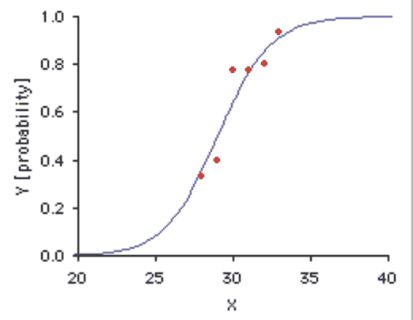
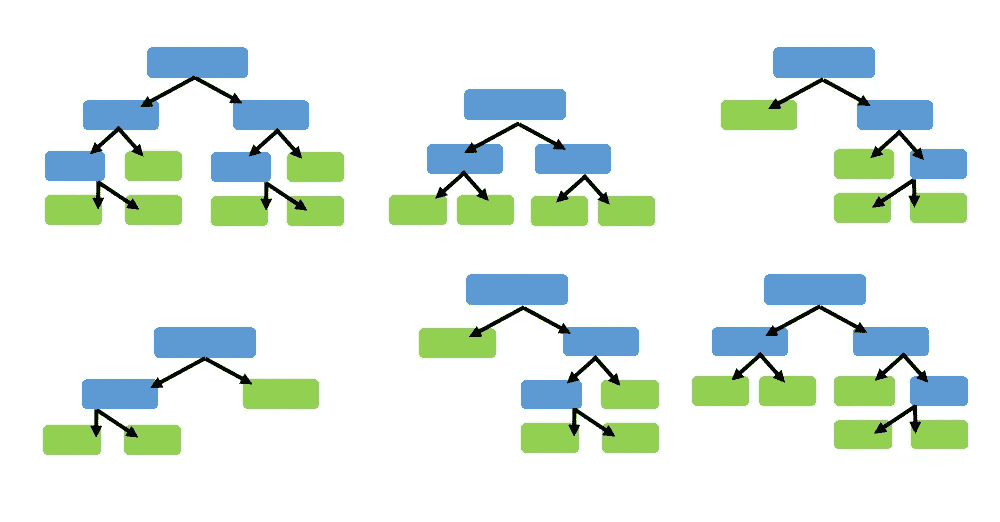
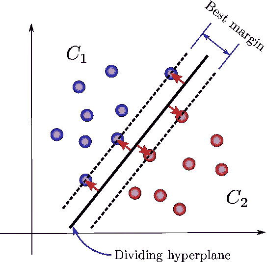
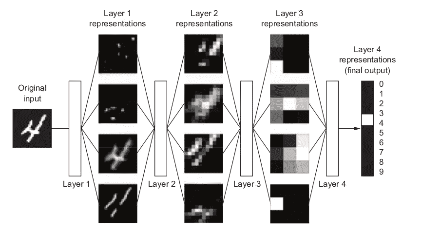
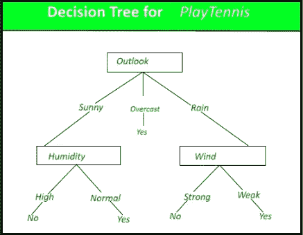

# 监督学习算法简介

> 原文：<https://medium.datadriveninvestor.com/introduction-to-supervised-learning-algorithms-6f6a0738d7a?source=collection_archive---------6----------------------->

机器学习的基础介绍，在这篇文章中你将能够学习机器学习中不同的监督学习算法以及它们是如何工作的…

[here](https://ece.emory.edu/_includes/images/sections/programs/Machine%20Learning.png)

# 监督学习算法

**使用最多的监督算法有:**

*   **简单线性回归**是一种简单而强大的监督学习技术。线性回归的目的是确定输入变量(解释变量)如何影响输出变量(响应变量)。

 [## 使用 Python 在不到 5 分钟的时间内完成线性回归

### 如果你正在寻找一个快速而有针对性的入门，线性回归在你的 ML 学习之旅中是必须的…

medium.com](https://medium.com/python-in-plain-english/linear-regression-in-less-than-5-minutes-using-python-2c693dd429cb) 

*   **逻辑回归**是一种监督分类算法。这是一种区别算法，意味着它试图找到两个类之间的边界。它模拟一个类别的概率。

 [## 使用 Python 在不到 5 分钟的时间内完成逻辑回归

### 如果你正在寻找一个快速而有针对性的入门，逻辑回归是你的 ML 学习之旅中的一个必须…

medium.com](https://medium.com/python-in-plain-english/logistic-regression-in-less-than-5-minutes-using-python-d0c30fff8f12) 

*   **随机森林**是一种监督学习算法。它构建的“森林”是决策树的集合，通常用“打包”方法训练。bagging 方法的一般思想是学习模型的组合增加了整体结果。随机森林的一个大优势是它可以用于分类和回归问题，这形成了当前机器学习系统的大多数。让我们看看分类中的随机森林，因为分类有时被认为是机器学习的构建块。下面你可以看到有两棵树的随机森林的样子。

 [## 用 python 实现简单直观的随机森林方式

### 随机森林是机器学习中使用的一种强大而精确的方法，目的是在机器学习中建立一个坚实的背景

medium.com](https://medium.com/datadriveninvestor/random-forest-simple-and-intuitive-way-with-python-45b53a8ba892) 

*   支持向量机(SVM):是一种监督机器学习算法，可用于分类或回归问题。它使用一种称为内核技巧的技术来转换您的数据，然后基于这些转换，它会在可能的输出之间找到一个最佳边界。简而言之，它执行一些极其复杂的数据转换，然后根据您定义的标签或输出计算出如何分离您的数据。

 [## 有趣又简单的支持向量机(SVM)算法

### SVM 算法是学习人工智能基础时必须的，如果你有兴趣获得人工智能的核心…

medium.com](https://medium.com/datadriveninvestor/support-vector-machine-svm-algorithm-in-a-fun-easy-way-fc23a008c22) 

*   **深度学习**是机器学习的一个子领域，涉及被称为人工神经网络的大脑结构和功能所启发的算法，这些神经网络是一组算法，大致模仿人脑，旨在识别模式。他们通过一种机器感知、标记或聚类原始输入来解释感官数据。它们识别的模式是数字的，包含在向量中，所有现实世界的数据，无论是图像、声音、文本还是时间序列，都必须转换成向量。

 [## 深度学习简介

### 大多数人都被与深度学习相关的大量可用信息淹没了，我的目标是弄清楚…

medium.com](https://medium.com/@zahraelhamraoui1997/introduction-into-deep-learning-8b72bf5cd9f3) 

*   **决策树学习**是一种监督学习算法(有一个预定义的目标变量)，主要用于分类问题，它是一个无环图，可以用来做决策。在图的每个分支节点中，检查特征向量的特定特征 j。如果特征值低于特定阈值，则跟随左分支；否则，遵循正确的分支。当到达叶节点时，将决定该示例所属的类。例如，该图显示了 playTennis 的决策树:

Decision trees for the concept [play tennis.](https://www.geeksforgeeks.org/decision-tree/)

 [## 用 python 实现决策树简单直观的方法

### 决策树是机器学习的革命性算法之一，每个初学者都需要对决策树的概述

medium.com](https://medium.com/python-in-plain-english/decision-trees-easy-intuitive-way-with-python-23131eaad311) 

*   **k-最近邻(k-NN)** 是一种非参数学习算法。与其他允许在模型建立后丢弃训练数据的学习算法相反，k-NN 将所有训练样本保存在内存中。一旦一个新的、以前未见过的样本 x 出现，k-NN 算法就找到最接近 x 的 k 个训练样本，并返回多数标签(在分类的情况下)或平均标签(在回归的情况下)。

# 结论

如果你正准备开始你的机器学习，并想从头开始学习，我将制作这个关于机器学习的 5-6 分钟长的系列，并在每章的结尾做一些辅助项目，所以请保持关注，祝学习愉快

这些是我个人的研究，如果你有任何意见，请联系我。

 [## 公平算法|数据驱动的投资者

### 许多人都有算法偏见。软件工程师关心算法偏差，因为我们关心…

www.datadriveninvestor.com](https://www.datadriveninvestor.com/2020/02/22/algorithms-for-fairness/) 

欢迎来到我的媒体页面

[Github](https://github.com/zahrael97) ， [LinkedIn](https://www.linkedin.com/in/zahraelhamraoui97/) ， [Zahra Elhamraoui](http://zahraelhamraoui1997@gmail.com/) ， [Upwork](https://www.upwork.com/o/profiles/users/~01e52291fa456a8934/)

## 访问专家视图— [订阅 DDI 英特尔](https://datadriveninvestor.com/ddi-intel)