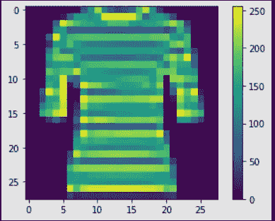

# Tensorflow 2.0 与时尚 Mnist 数据集简介

> 原文：<https://medium.datadriveninvestor.com/introduction-to-tensorflow-2-0-with-fashion-mnist-dataset-2f243423c563?source=collection_archive---------5----------------------->

Tensorflow 2.0 最终版本于 2019 年 9 月 30 日公布。它是谷歌用于机器学习和高性能数值计算的开源 AI 框架。它支持许多分类和回归算法，更一般地说，支持深度学习和神经网络。

**tensor flow 2.0 的新特性**

*   强大的实验
*   在生产中部署强大的模型
*   不需要创建会话
*   低级 API 支持
*   训练速度提高 3 倍

**先说时尚 Mnist 数据集**

时尚-MNIST 是 Zalando 文章图像的数据集，由 60，000 个样本的训练集和 10，000 个样本的测试集组成。每个示例都是 28x28 灰度图像，与 10 个类别的标签相关联。它被分成 10，000 个测试数据集和 50，000 个训练数据集。

***加载重要库***

*   现在加载我们的数据集

加载数据集给 **set () ()** 其中我们已经传递了一个值(X_train，y_train)，(X_test，y_test)

line2 用于检查形状输出将是:((60000，28，28)，(60000，))

第 6 行用于定义一个类名

最后，第 10–12 行用于绘制带有颜色条的图像

该图像属于衬衫类，其值为 0 到 255。但是 TensorFlow 只接受 0 到 255 之间的值，所以我们需要转换它。

第 2 行和第 3 行将值从 0–255 更改为 0–1

第 6–8 行将使用颜色条绘制相同的图像，它已更改为 0–1

现在，是时候建立我们的模型了

第 2 行和第 3 行用于导入库

*第 6 行-****model = Sequential()***我们可以在一个序列模型中传递一个数组或者只添加另一个层

 [## 深度学习用 7 个步骤解释-更新|数据驱动的投资者

### 在深度学习的帮助下，自动驾驶汽车、Alexa、医学成像-小工具正在我们周围变得超级智能…

www.datadriveninvestor.com](https://www.datadriveninvestor.com/2019/01/23/deep-learning-explained-in-7-steps/) 

第 7 行-***model . add(Flatten(input _ shape =(28，28)))*** flatten 用于改变 1d 中的输入数据

第 8 行用于添加密集层，第 9 行用作输出层

第 14 行 **model.compile()** 用于编译模型，第 18 行 **model.fit()** 用于拟合模型。

第 1 -3 行用于使用 **model.evaluate(X_test，y_test)** 检查 test_loss

第 8-9 行是检查准确性，给出 87%

现在，我们用我们的预测再次绘图

一次所有代码-

感谢阅读。

[**笔记本**](https://github.com/namratesh/Machine-Learning/blob/master/1.Intorduction%20to%20Tensorflow2.0.ipynb)

参考资料:

*   [https://www.tensorflow.org/datasets/catalog/fashion_mnist](https://www.tensorflow.org/datasets/catalog/fashion_mnist)
*   [https://www.tensorflow.org/tutorials/quickstart/beginner](https://www.tensorflow.org/tutorials/quickstart/beginner)