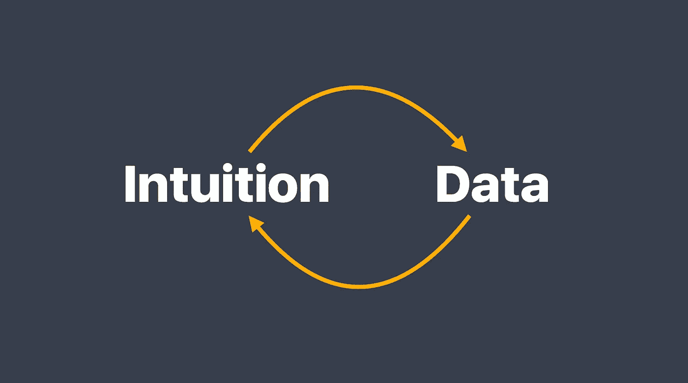

# 直觉还是数据:哪个能带来更好的创新决策/

> 原文：<https://medium.datadriveninvestor.com/intuition-or-data-which-leads-to-better-innovation-decisions-f2bdc85f2d65?source=collection_archive---------18----------------------->

## “我们需要更多的数据。”

你听过多少次了？有多少次你转动你的眼睛(身体上或精神上)，然后耐心地试图解释，当你在做新的事情时，没有数据。

有类似的创新，在某些方面相似的东西可以用作基准，但没有一样东西完全像你正在创造的东西，因为在你的公司里以前没有这样的东西。

作为创新者，我们不断平衡我们对直觉决策的需求和舒适，以便我们能够快速前进，满足更广泛的组织对数据和确定性的需求，以最大限度地降低风险。

## **但是的直觉和数据在创新的早期应该扮演什么角色*？***

这正是我的朋友和前同事 Nick Pineda 在他的论文中试图回答的问题，“相关的经验和直觉是创新决策者成功的驱动力吗？基于面试的方法”

罗宾:嗨，尼克！感谢您今天抽出时间与我交谈。你在论文中探索的主题很吸引人，也是每个创新者都在努力解决的问题。我很好奇，是什么让你决定去探索它？

尼克:有趣的是，决定写论文的过程实际上激发了这个话题。

对于我的硕士项目的顶点，我们被告知要做一个咨询项目，但我已经在咨询行业工作了这么多年，所以我对这个前景并不太感兴趣。一天，当我走路去上班的时候，我的直觉告诉我，“尼克，这不是你参加硕士项目的原因。”我把这种感觉告诉了我的教授和导师，他们接受了不同的方法。

当我们讨论我能做什么时，同一个话题不断出现——许多关于创新的出版物，尤其是关于敏捷的，都是关于度量的，在我们采取行动之前，我们需要有证据。我不反对这一点，但是仅仅通过这个镜头来看待事物扼杀了一个有潜力成为令人惊奇的东西的想法。最终，我们决定将我的论文集中在创新过程的前端发生了什么，以及是直觉还是证据和数据导致了成功。

罗宾:你学到了什么？

尼克:两件事，一件不令人惊讶，一件令人惊讶。

首先，不足为奇的是，创新决策者非常清楚直觉或直觉在他们的过程中扮演的角色。

第二，令人惊讶的是，任何更倾向于一个方向而不是另一个方向(数据对直觉)的人，都有更多的失败，并努力处理他们从这些经历中学到的东西，并将这些知识融入未来的行动和决策。成功的创新者知道如何在他们的理性过程和直觉过程之间创造一个舞蹈。

Robyn :直觉告诉我们，利用直觉和数据来做决策会带来更好的结果。然而，如此多的创新者依赖直觉，如此多的公司需要数据，你怎么能鼓励成功所需要的“舞蹈”呢？

**尼克**:你需要从小处着手。

首先是创新的人，帮助他们进入内在空间，并认识到直觉可以表现出来的所有不同方式。它可以表现为感官体验，温度的变化，甚至颜色。它因人因时而异，关键是要认识到它何时发生。

建立这种意识的一个简单方法是反思你如何决定是否信任某人。每次你遇到一个新的人，你必须迅速决定是否信任这个人。你是怎么做到的？促使你做出决定的感觉或感觉是什么？你有多少次是对的？

接下来，你需要在团队内部创建一种语言或流程，将直觉具体化。在我的研究中，我发现了一些有远见的领导者的例子，他们经常能够运用自己的直觉，但他们的团队经常感到被冷落，并奇怪为什么他们要做所有的工作，而领导者只是要凭直觉做出决定。更成功的团队在使用直觉的原因、时间和方式上更加开放，甚至特别要求其他团队成员在会议上分享他们的直觉。

然后，作为领导者，我们需要正常化这样一个事实，即我们并不总是有准确的证据来知道什么是正确的决定，我们相信我们作为领导者在这个领域学到的东西来做出决定。

**罗宾**:最后一点非常关键，领导者必须以身作则，做出他们想看到的行为，这包括运用和交流他们的直觉。还有什么关于领导者和决策的事情吗？

Nick :理想情况下，领导者会超越对直觉的正常使用，积极努力消除组织对直觉的偏见。

大多数组织在做决定时，会有意识或无意识地遵从房间里收入最高或最有资格的人。这是一种高度理性的行为，但并不会导致最佳决策。原因是它忽略了一个事实，即经验的多样性掩盖了其他数据点和直觉体验，而这些数据点和直觉体验是达成更好决策的对话的一部分。

创新是一种群体体验，当直觉被允许在群体中出现时，群体智慧开始显现，群体做出更好的决策。

Robyn :对于领导者和决策者来说，这是一份相当艰巨的任务清单:

1.  管理你在直觉和数据之间的个人舞蹈
2.  通过创造一种围绕直觉的语言来规范直觉
3.  创造方法去挖掘不同的经历和直觉

非常感谢你分享这些伟大的见解，尼克！

****

# 为了学习更多关于直觉和创新的知识，Nick 创建了一个推荐书籍、视频和活动的列表。

## 你可以在 [MileZero 的博客](https://www.milezero.io/2020/07/23/intuition-or-data-which-leads-to-better-innovation-decisions/)上看到它们

*Robyn M. Bolton 是*[*mile zero*](http://www.milezero.io/)*的创始人&首席导航员，她在那里与大型组织的高管合作，超越创新理论和戏剧，以释放他们组织的潜力，创造真正的变化，并获得真正的结果。你可以在*[*www . mile zero . io*](http://www.milezero.io/)了解更多关于她的信息和作品

*原载于 2020 年 7 月 23 日*[*https://www . mile zero . io*](https://www.milezero.io/2020/07/23/intuition-or-data-which-leads-to-better-innovation-decisions/)*。*