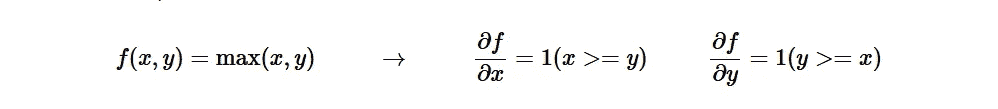
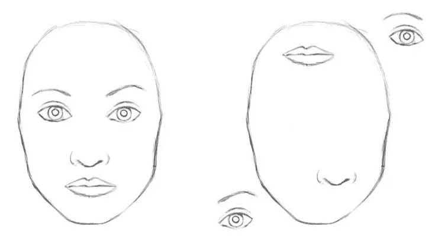

# 对 CNN 中汇集层的直觉

> 原文：<https://medium.datadriveninvestor.com/intuition-to-pooling-layers-in-cnn-a45be956a3a9?source=collection_archive---------4----------------------->

*理解汇集层和对反向传播的影响的方法*

Credits [@sickhews](https://unsplash.com/@sickhews)

CNN 基于权重共享策略，神经元能够对数据执行卷积，卷积滤波器由权重形成。随后进行汇集操作，这减少了表示的空间大小，从而减少了网络中的计算量和参数。池层也有助于控制过度拟合。

> 在池层上没有学习发生

使用像最大池、平均池甚至 L2-诺姆池这样的函数来获得池单元。在池层，前向传播导致一个 *N* × *N* 池块被减少到一个单一值——即“获胜单元”的值。

在实践中，最大池层只有两种常见的变化:一种池层具有 *F* =3， *S* =2(也称为重叠池)，更常见的是 *F* =2， *S* =2。具有较大感受野的池大小具有太大的破坏性。

## 最大池上的反向传播

Forward Propagation of CNN

为了理解 maxpooling 上的反向传播，我们必须理解 max(x，y)的导数。

Derivative of max(x,y)

也就是说，在较大的输入上,(子)渐变为 1，在另一个输入上为 0。直观上，如果输入为 *x* =4， *y* =2，那么最大值为 4，功能对 *y* 的设置不敏感。也就是说，如果我们将它增加一个微小的量 *h* ，函数将继续输出 4，因此梯度为零:没有影响。

由于 max(x，y)运算的后向传递有一个简单的解释，即只将梯度发送到前向传递中具有最高值的输入。因此，在池层的正向传递期间，通常跟踪最大激活的索引(有时也称为*开关*)，使得梯度路由在反向传播期间是有效的。

## 合并图层有什么问题

**To a CNN, both pictures are similar, since they both contain similar elements.**

如果我们在谈论一个人脸检测器，那么合并图层会丢失很多有价值的信息，并且它忽略了部分和整体之间的关系，所以我们必须结合一些特征(嘴、两只眼睛、椭圆形脸和鼻子)来说这是一张脸。

## 无池层的 CNN

为了减小表示的大小，他们建议偶尔在 CONV 层使用较大的步幅。丢弃池层也被发现在训练良好的生成模型中是重要的，例如变分自动编码器(VAEs)或生成对抗网络(GANs)。未来的架构似乎很可能很少甚至没有池层。

# 参考

[1] [卷积神经网络中的反向传播，jefkine](http://Backpropagation In Convolutional Neural Networks)
【2】[Jae Duk Seo](https://medium.com/the-bioinformatics-press/only-numpy-understanding-back-propagation-for-max-pooling-layer-in-multi-layer-cnn-with-example-f7be891ee4b4)
【3】[Max Pechyonkin](https://medium.com/@pechyonkin?source=post_page-----b4b559d1159b----------------------)
【4】[cs 231n 用于视觉识别的卷积神经网络](https://cs231n.github.io)
【5】[梯度下降和反向传播](https://towardsdatascience.com/part-2-gradient-descent-and-backpropagation-bf90932c066a)

## 尾注

> 如果你坚持到最后——请鼓掌。(具体来说是 50 次)
> 这会让我有动力写更多。谢谢你。