# 直觉神经网络

> 原文：<https://medium.datadriveninvestor.com/intuitive-neural-networks-cb4f6e1c9aa0?source=collection_archive---------8----------------------->

几乎所有的事情都与神经网络有关，是时候用最少的数学知识来理解它们背后的逻辑直觉了。

Photo by [Alina Grubnyak](https://unsplash.com/@alinnnaaaa?utm_source=medium&utm_medium=referral) on [Unsplash](https://unsplash.com?utm_source=medium&utm_medium=referral)

# 介绍

机器学习是一个研究领域，它关注于通过某些特定任务的经验来改进性能测量。随着 LeCun 教授在 90 年代后期对手写数字(MNIST)数据集分类的 LeNet-5 的介绍，研究界的人们开始认识到，具有多个隐藏层的神经网络可以达到最先进的(SoTA)结果(这是当时研究人员不太欣赏的想法)。由于通过 GPU 提供的大量数据和计算能力的存在，促进了深度学习方法的现代进步，并因此产生了巨大的网络，如 GPTs (GPT-3，最近)、ResNet、VGG 等。在本文中，我们将重点关注这些 SoTA 架构所基于的神经网络的基本思想。

 [## 冗长但有价值的神经网络指南|数据驱动的投资者

### 如今可用于机器学习的神经网络类型如此之多，以至于它值得一个冗长的指南…

www.datadriveninvestor.com](https://www.datadriveninvestor.com/2019/04/04/neural-networks/) 

# 神经元

一般来说，大脑利用神经元网络高效地完成几十项复杂的任务。每个神经元处理从树突进入的信号，并给出输出，该输出被发送到其他神经元并被进一步处理。因此，我们可以明确地说，网络的去除，甚至网络复杂性的降低，都会损害其决策过程。

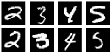

A snapshot from MNIST Dataset. [Source](http://yann.lecun.com/exdb/mnist/).

例如，手写数字很容易被大脑解读以区分数字，但如果我们必须编写一个程序来对它们进行分类，这将是一项非常艰巨的任务。为了解决这个任务，我们从这些动态激活的神经元中获得了一些灵感，并制定了一种模仿它的方法。目前人工智能代理的主流思想是开发一个包含人工神经元的计算机程序(代理)(因为神经元是目前执行复杂任务的最强大的实体),它最终将超越人脑的能力。

来自身体感觉部分的脉冲到达树突，如果它们强到足以产生刺激，轴突就输出一个尖峰。因为生物神经元是活细胞，它们可以自我修改以定义刺激阈值，因此本质上是动态的。

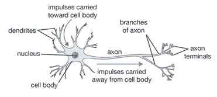

A biological neuron. [Source](https://codzify.com/AI/Introduction_to_Artificial_Intelligence).

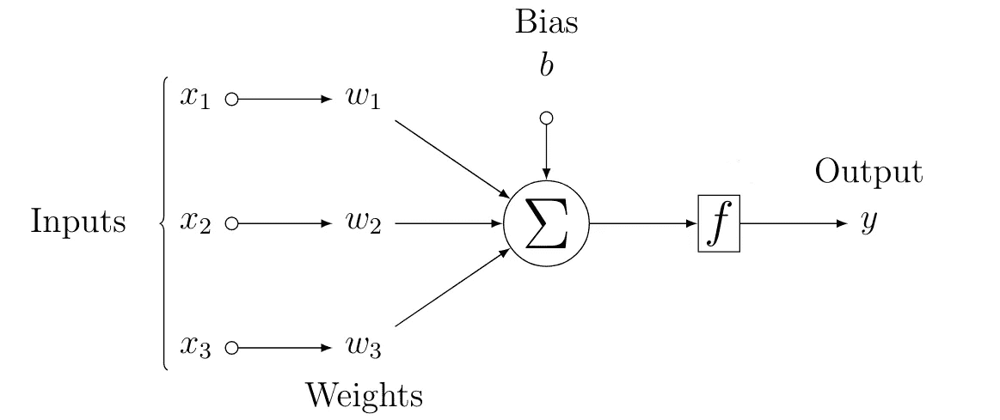

An artificial neuron. Created by Author on LaTeX.

类似地，人工神经元具有一些输入，并且每个输入( *xᵢ* )被附加到权重( *wᵢ* )和偏差( *bᵢ* )(它们是在它们的训练期间被学习的)。权重影响特定输入的重要性。它们执行计算并产生信号，该信号通过激活功能( *f* )转发，以产生输出尖峰( *y* )，假设来自 *f* 的这种信号高于阈值。

为了说明，让我们考虑一下 MNIST 手写的数字。每个数字的大小为 28×28 像素，每个像素的灰度值在[0，1]的范围内，其中 0 和 1 分别代表黑色和白色。二维数组被整形为长度为 784 的一维数组 *x* ，每个索引对应一个输入像素( *xᵢ* )。我们知道黑/暗像素对曲线/纹理没有贡献，因此它们不太重要，亮/白像素在数字(标签)的确定中表现出相当重要的意义。特定像素(称为特征)的相关性由附加的权重确定。

# 单层感知器

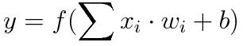

Eq. 1

上面的等式在数学上描述了单层网络的基本功能。它还建立了与生物神经元的关系。准确地说，输出 *y* 是输入特征的仿射变换的函数，其特征在于通过加权和的特征的线性变换，结合通过增加的偏差的平移。

单层模型的主要目标在于为相应的输入( *xᵢ* )识别一组权重( *wᵢ* )，以使数据有效地适合我们的预测输出(\hat{y})。这将确保数据集上的通用行为。

暂时忽略函数 *f* ，我们明白:

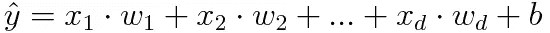

Eq. 2

其中 *d* 是输入的特征总数， *wᵢ* 是所需的权重。如果我们将所有特征收集到一个向量 **x** ∈ ℝᵈ中，并将我们的所有权重收集到另一个向量 **w** ∈ ℝᵈ中，则可以使用点积来简化上述等式:

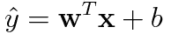

Eq. 3

上式中的 **x** 对应单个数据点的特征。为了在一个 *n×d* 维空间中表达所有输入(在数据集中)的 **x** ，我们引入了一个设计矩阵 **X** ∈ ℝ^{n × d 】,其中每行对应一个示例，每列对应一个特定特征。

因此，对于 n×d 维空间，等式 3 可以重写为:

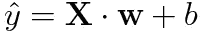

Eq. 4

并且对最佳参数权重向量 **w** 和偏差 *b* 的搜索在于目标函数(质量度量)和更新参数以提高质量的过程。

> ∘ **为什么我们关注向量和矩阵？**
> 
> **答:**矢量化的方程(如方程 1 中的方程。4)简化数学，确保代码运行更快。事实上，GPU 的内核比标准 CPU 多得多(与 CPU 的 4 个内核相比，大约为 4000 个)，这使得多线程进程能够高效工作，因为矩阵中每个单元的计算都独立于其他单元。

# 多层感知器

顾名思义，我们现在的深度学习神经架构不止一层。我们在上一节中介绍了仿射变换(带平移的线性变换),并介绍了单层网络的输出是如何产生的。在这一节中，我们将深入探讨多层感知器。

## 隐藏层

线性模型基于一个强有力的假设，即单个仿射变换可以将我们的输入数据映射到输出，这是非常不现实的。此外，线性意味着单调性，即输入的增加最终会导致输出的增加或减少。让我们考虑一下数字的分类，像素强度的增加并不意味着获得更高数量级的数字的概率增加。因此，这种假设在图像数据的情况下肯定会失败(当然，还有各种其他情况)。

我们知道每个输入特征(像素)的相关性比预期的更复杂。因此，我们在输入和输出之间引入了一些更完全连接的(密集)层，称为隐藏层。这种架构被称为多层感知器(MLP)。

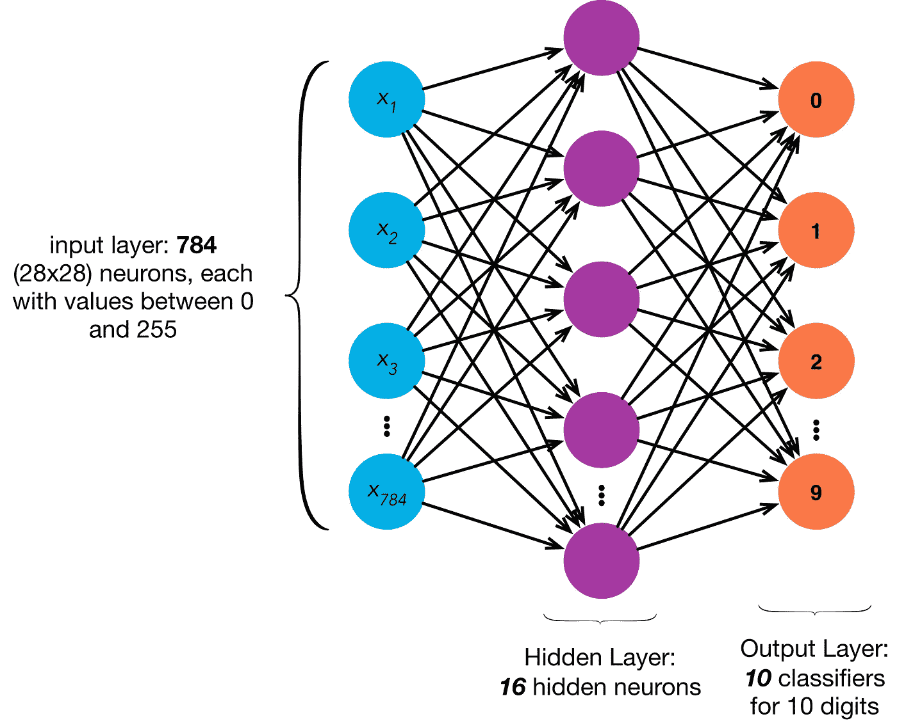

Source: [Medium](https://medium.com/@xzz201920/multi-layer-perceptron-mlp-4e5c020fd28a)

以 MNIST 数据集为例，我们将定义一个包含 16 个神经元的隐藏层，如上图所示。该图清楚地解释了 784 个输入特征、隐藏层(可以堆叠更多这样的全连接(密集)层，具有任意数量的神经元)和输出层。请注意，输入层和输出层都不被认为是隐藏的。

之前，我们将输入矩阵定义为 **X** ∈ ℝ^{n × d}，其中 *n* & *d* 分别是示例和特征的数量。

对于一个一个隐层的 MLP，用 *h* 个神经元(隐单元)，我们可以定义一个隐层矩阵 **H** ∈ ℝ^{n × h}。

由于隐藏层和输出层都是完全连接的，我们将隐藏层权重和偏差设为 **W** ∈ ℝ^{d × h}和 **b** ∈ ℝ^{1 × h}，将输出层权重和偏差设为 **W** ∈ ℝ^{h × c}和 **b** ∈ ℝ^{1 × c}。

我们为第一层(隐藏层)选择了 simple (1 ),为第二层(输出层)选择了 simple(2 ),并且 *c* 是类的数量。对于我们的 MNIST 示例: *n* = 1， *d* = 784， *h* = 16， *c* = 10，如图所示。

数学上，

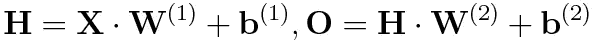

Eq. 5

可以重写为

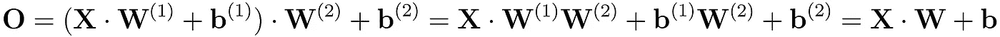

Eq. 6

在哪里

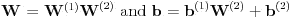

最终结果(**o**=**x**⋅**w**+**b**)将我们带回一个实际上等同于等式 1 的线性层。这意味着将线性层相互堆叠将再次建立线性行为，并且将如同只有一个层存在一样。

为了灌输非线性行为，隐藏层中的每个神经元受到激活函数 *f* 的影响，其输出被称为激活。这个激活函数带来了非线性，并且有助于 MLP 架构不退回到线性模型。等式 5 可以重写为:

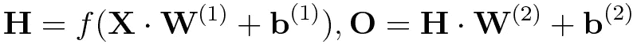

激活函数( *f)* 产生所需的非线性，并因此导致线性层的堆叠是非线性的。这可以通过给定的图中所示的各种激活功能来实现。

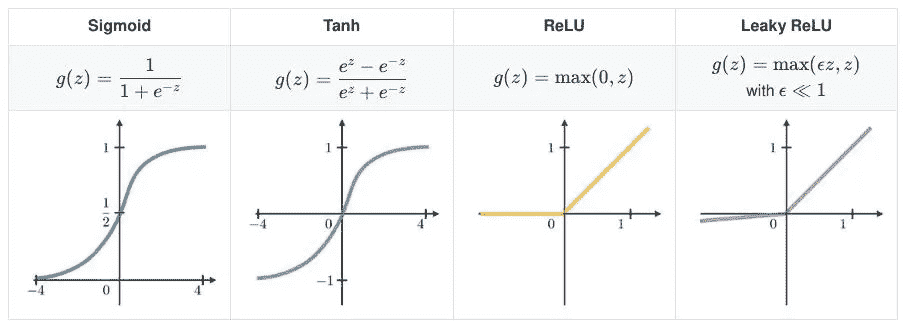

Source: Adapted from [Github](http://github.com).

非线性层的增加增加了神经网络中的参数数量，从而使网络很容易将任何输入映射到其输出。

## 结论

通过上面的例子和简单的数学，我们理解了单层和多层感知器是如何工作的。我们还研究了 GPU 如何促进神经网络，以及添加非线性如何增强神经网络架构。

# 结束注释

## 作者:

你可以通过 [LinkedIn](http://linkedin.com/in/anubhav4sachan/) 、 [Twitter](http://twitter.com/anubhav4sachan/) 、 [Instagram](http://instagram.com/anubhavenue/) 和[电子邮件](http://hi@anubhavsachan.com)与我联系。我喜欢就深度学习相关的话题进行深入的对话。

## 脚注:

选择 *d* (而不是明显的选择 *n* )是因为所有的特征都可以在 *d* 维空间中可视化。然而， *n* 用于表示数据集中所有示例的计数。

[AI 栈交换链接:GPU 如何促成一个深度学习架构的训练？](https://ai.stackexchange.com/questions/21938/how-do-gpus-faciliate-the-training-of-a-deep-learning-architecture)

例如，它可能取决于周围的像素(称为*上下文*)，就像在直线的构造中一样。

## 参考资料:

1.  3B1B，格兰特·桑德森:【https://www.3blue1brown.com/neural-networks 
2.  帕特里克·温斯顿，麻省理工学院，第 12a 和 12b 讲:[https://www.youtube.com/watch?v=uXt8qF2Zzfo](https://www.youtube.com/watch?v=uXt8qF2Zzfo)
3.  潜入深度学习: [d2l.ai](https://d2l.ai)

附:所有图片归各自所有者所有。这篇文章从参考文献中得到很大启发，因为它产生了很大的直观性，我推荐你观看并订阅它们。

## 访问专家视图— [订阅 DDI 英特尔](https://datadriveninvestor.com/ddi-intel)