# 入侵者 Vim

> 原文：<https://medium.datadriveninvestor.com/invader-vim-afe7a2b593e5?source=collection_archive---------22----------------------->

Image credit: [Invader Zim](https://en.wikipedia.org/wiki/Invader_Zim), created by [Jhonen Vasquez](https://en.wikipedia.org/wiki/Jhonen_Vasquez)

# Vim 是什么？

Vim 是一个命令行编辑器。它的前身是 Vi——一个基于 UNIX 的编辑器，最终得到了改进，他们给了它一个新名字:Vi 改进版。因此:VIM。

# 如何开始

使用 Vim 很容易启动。我不会介绍安装，因为它是预装在 Max & Linux 中的。然而，如果你想把它安装在 pc/windows 上，那么[访问这个网站并阅读说明。](http://www.vim.org/download.php)

## 使用 Vim 创建一个新的文本文件

这很简单:首先启动你的终端，使用“vim”命令并指定你选择的文件名。我将把我的文件命名为“new_file.rb”:

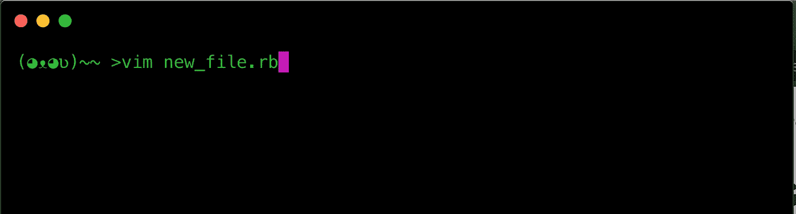

My command line, thanks to zsh and Hyper.

我选择了。因为我将展示 ruby 代码作为一个例子，展示如何使用 vim 作为一个 IDE。

点击回车键，你会看到如下:

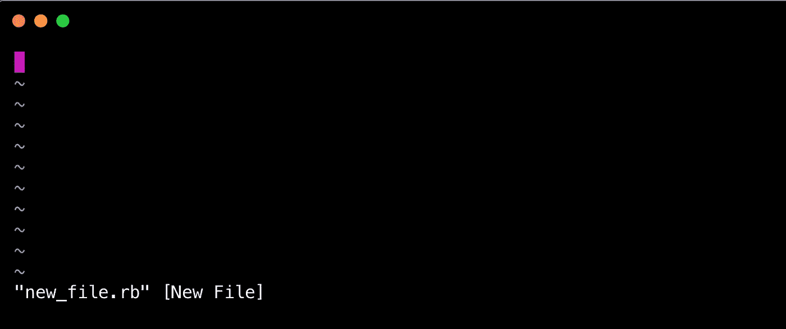

要学习的第一个命令是安全退出，不做任何改变。出于好奇，以防你打开其中一个隐藏文件:

首先，键入冒号':'

这将使你进入“命令行”模式，该模式控制保存、退出等操作。想象一下这样说，“这里有一些命令:”

键入“q！”—那是一个‘q’，后面跟着一个感叹号，‘！’

当然，如果你想保存它，只需使用' x '，而不是，再次后接'！'：

# 模式

基本的 VIM 知识有三种主要模式:

*   常态
*   插入
*   命令行

以下是如何激活每种模式。

## 正常模式:

按“esc”键进入正常模式。你会发现自己经常这样做。

Press the ‘esc’ key to enter Normal mode.

## 插入模式:

按“I”键进入插入模式。这将允许您向文档中添加文本。

Press the ‘i’ key to enter Insert mode.

## 命令行模式:

我们已经在上面介绍了阅读文档和不修改文档就退出的最低要求。要进入命令行模式，只需键入一个‘冒号’——每个‘qwerty’键盘都会让你 shift+；为了实现这一点。

shift+; is the usual way to get a colon on common qwerty keyboards, and gets us into Command Line mode.

# 基本的文本导航和交互

在文档中导航主要是通过正常模式实现的。

*   **箭头键**会带你上下左右。
*   **(美元符号)将跳转到一行的末尾。**
*   **dd (两个 d)将删除一整行——也许“破坏性删除”是一个好的迷因。**
*   ****u** (只是字母‘u’)将*撤销*最近的任何动作。**
*   ****v** (然后箭头键)将高亮显示文本。**
*   ****y** ( *猛拉*您高亮显示的文本)将复制文本。**
*   **p ( *粘贴*)将粘贴你‘拉’出来的，也就是所谓的复制的文本。**
*   ****o** 将创建一个新行，而不会中断光标所在的当前行，无论光标在该行的什么位置，然后它会自动将您置于**插入**模式。**
*   ****控制** + **ww** ( *工作窗口*)将在不同的窗口之间切换，如果您激活了“分割”模式(参见下面的命令行模式，了解如何使用“分割模式”)。**

# **命令行操作**

**在更高的层次上有许多操作，可以让您在整个文档中跳转，并执行正常的顶层任务，如保存、退出、搜索等。**

**进入*命令行模式*执行以下所有操作(记住在输入以下任何内容之前，先点击冒号)。**

*   ****问！**会退出不保存(说'*退出【T11 ')帮助我记住是个' q ')。***
*   ****x！**将保存并退出(我说'*保存并退出*'帮助我记住它是一个' x ')。**
*   ****您要将光标移动到的行的编号**(无论您是否切换左侧的数字，这都将起作用)。**
*   ****设置数字**(实际上在进入命令行模式后输入'*设置数字*——你就是字面上的“设置数字”)将会切换左边的数字，很像你最喜欢的 IDE。**
*   ****$** (你可能认为你以前见过这个——记住这是针对*命令行*模式的)会将光标一直跳到最后一行的开头。**
*   ****/** + < **要搜索的文本** >例如，如果你想在下面搜索单词“moon”，只需键入“moon”——不需要引号或其他任何东西**

**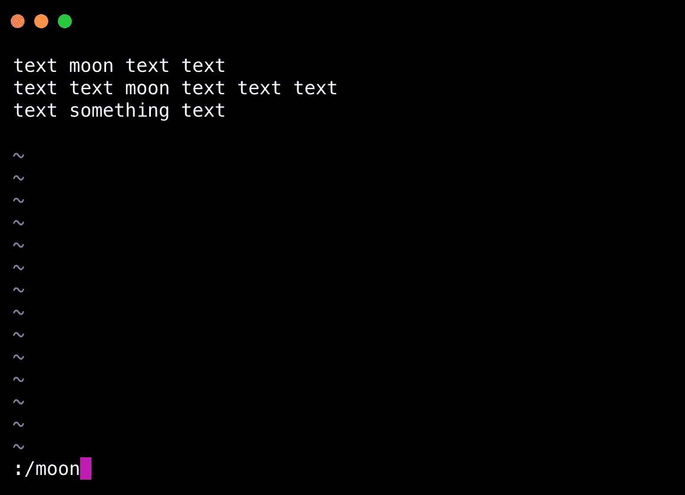****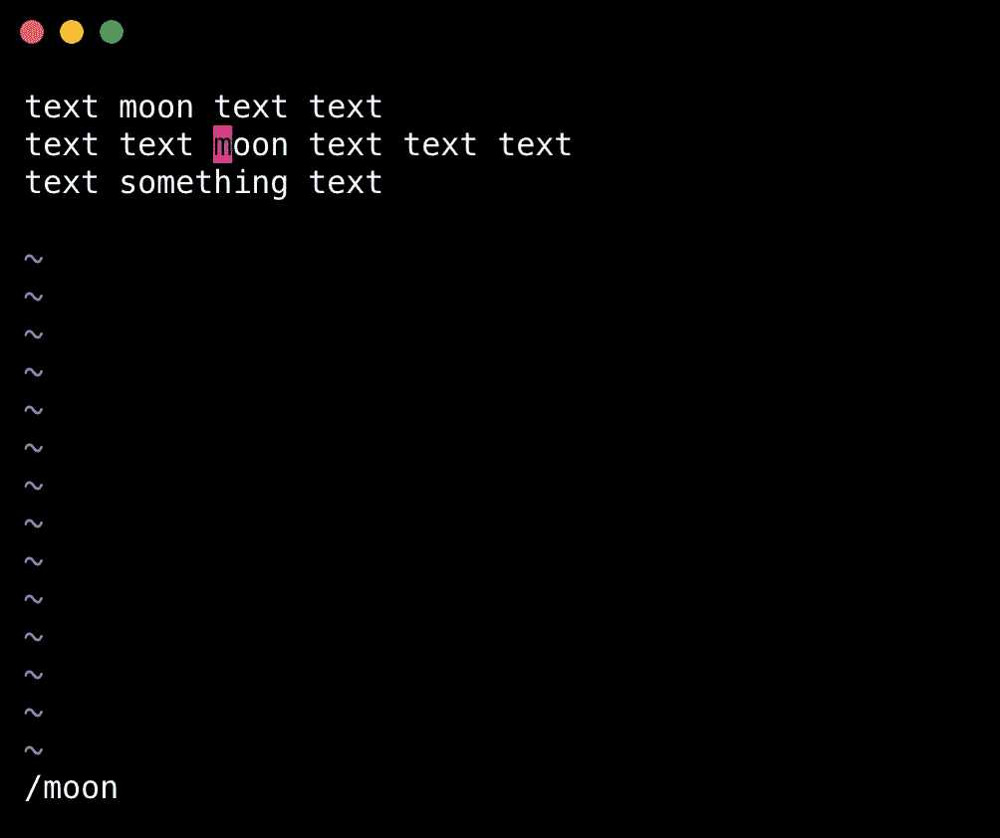**

**then use ’n’ to cycle through each occurance**

*   ****n** 是在您找到同一搜索项的多个匹配项后的“下一个”。**
*   ****分割** < **文件名** >将在当前文件的顶部水平打开另一个文件:**

**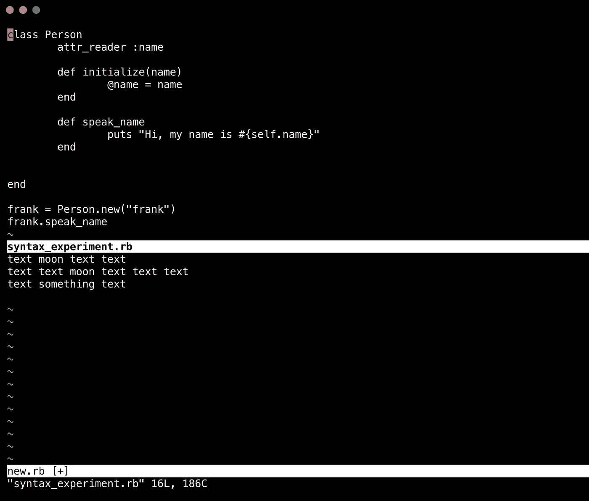**

**Remember you can jump between each ‘window’ using control+ww**

*   ****v split**<**filename**>会像“split”一样打开另一个文件，只是它会在当前文件的左侧垂直打开(因此是“v”):**

**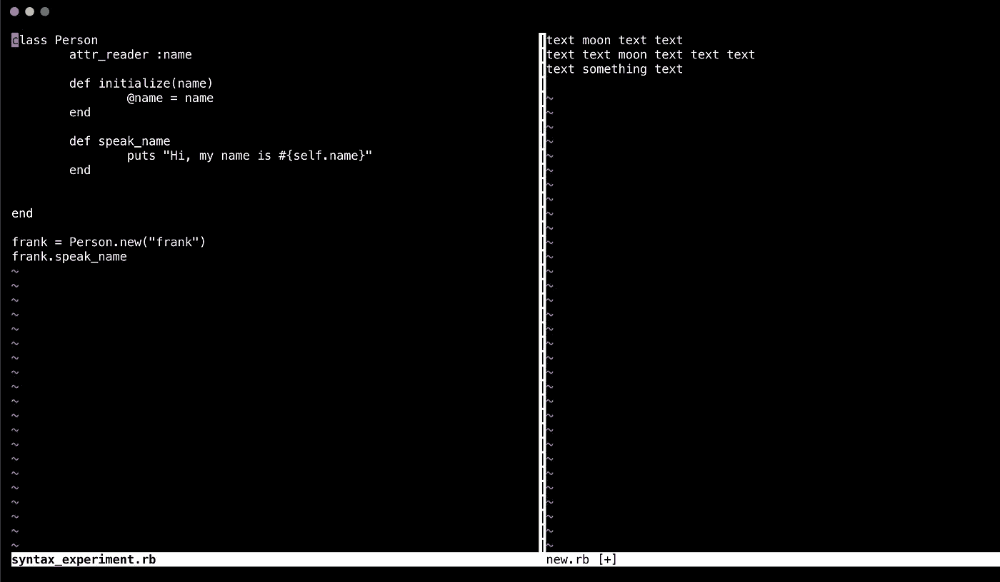**

**Remember you can jump between each ‘window’ using control+ww**

# **使 VIM 成为基于命令行的 IDE 的额外功能**

## **语法突出显示—命令行模式**

*   ****在**上的语法(逐字输入这个短语)将切换特定语言的语法高亮显示！根据您的编码语言，确保您的文件名具有适当的扩展名:**

**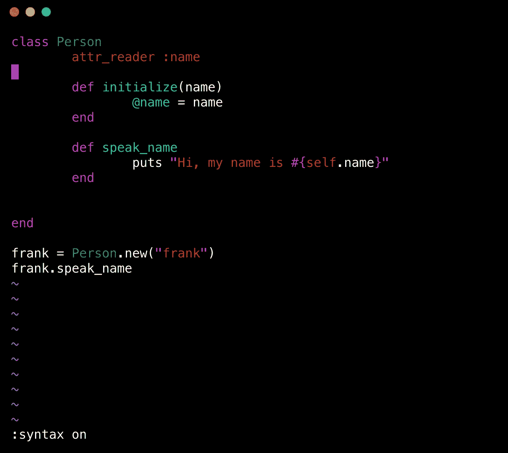**

**Toggle it off by typing ‘***syntax off***’ in Command Line Mode**

## **搜索突出显示—命令行模式**

*   ****设置 hlsearch** (字面意思是在冒号后输入这个)将突出显示搜索结果，使它们更容易被发现。有一个实际的 [Vim 提示 Wiki](https://vim.fandom.com/wiki/Highlight_all_search_pattern_matches) 向您展示如何映射这个命令和命令' **nohlsearch** '来轻松地打开和关闭它。**

**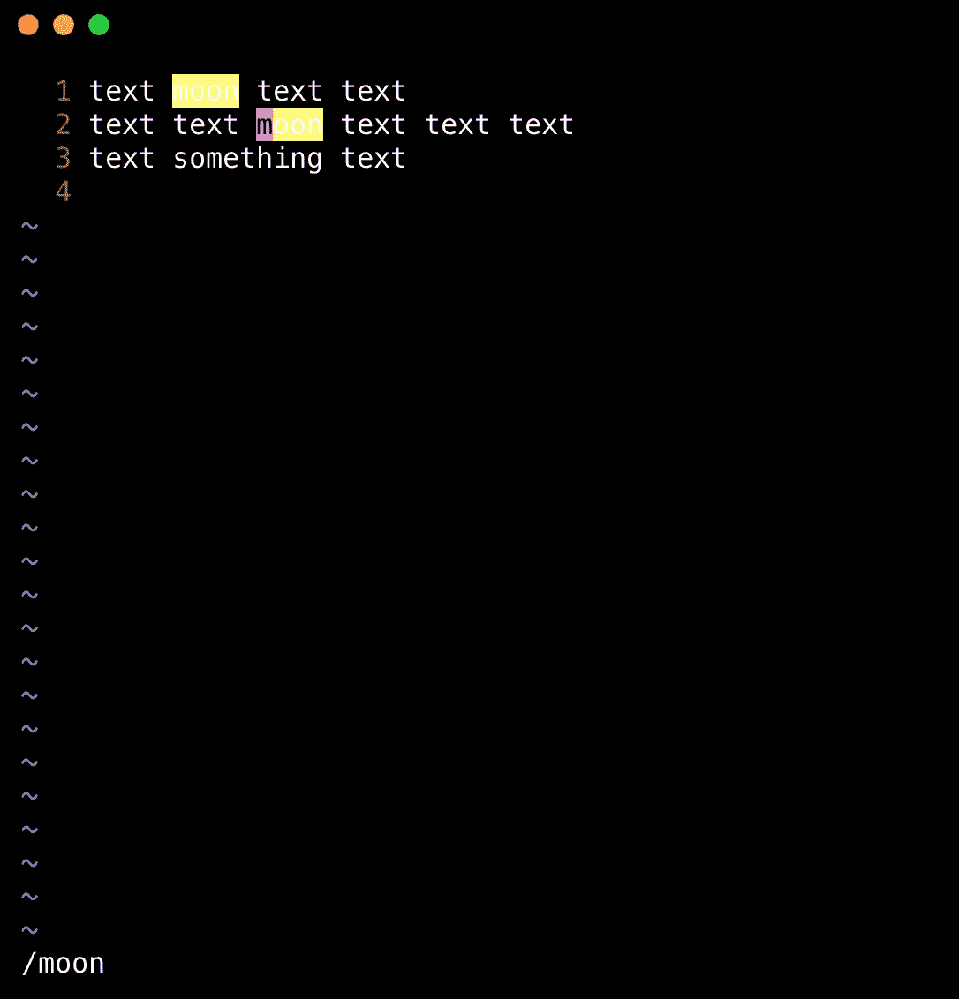**

# **设为默认**

**在您使用 VIM 进行几次编码之后，您可能会开始考虑如何将这些首选项设为默认值，这样您就不必一直在、 *set number、set hlsearch* 上键入*语法。***

**在你的根目录(通常是/Users/username)或者任何你发现隐藏的地方。vim '文件，新建一个名为'**' T5 '的文件。vimrc***’*(你得自己创建，不是自动创建的)。**

****

**进入后，添加以下几行:**

**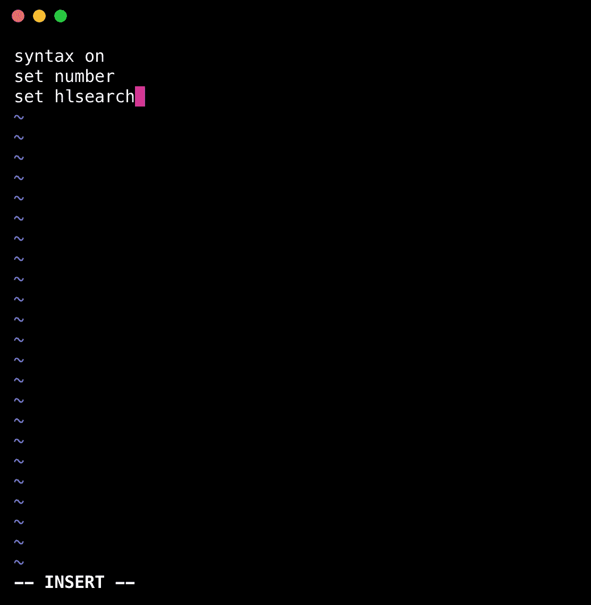**

**If you’re feeling proactive, feel free to checkout any other cool VIM preferences and add them now. Save and exit for changes to take effect.**

**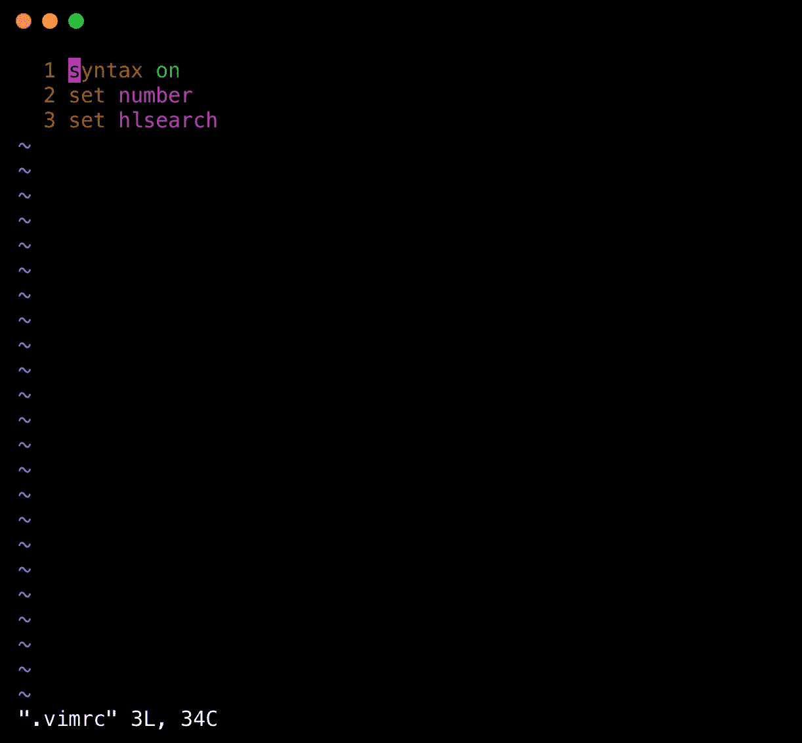**

**Open the file with vim again to see the above.**

**请注意，如果您想要禁用某个首选项，只需使用一个双引号" "注释掉一行，如下所示:**

**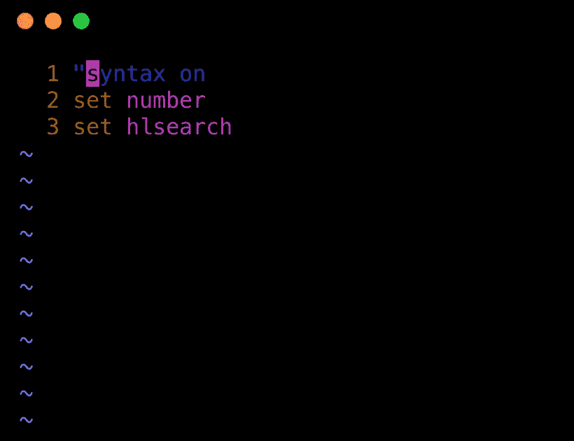**

# **概述**

**当您在命令行上需要快速编辑文件时，使用 VIM 很有趣——或者，如果您已经打开了许多窗口，使用 VIM 将帮助您节省工作内存空间(如果您正在运行一些密集型的东西)。**

**就我个人而言，当我在 Chrome 中打开很多标签页时，我喜欢限制打开另一个标签页或窗口的需要。过去，我从命令行创建文本文档，作为测试小部分代码或测试我对特定概念的假设的一种方式。**

**这些都是我从布莱恩特儿子在 OpenSource.com 大学的教程中收集来的，我强烈推荐他。他还提供了一个非常有用的备忘单。**

# **资源**

** [## Vim 入门:基础知识

### 我记得我第一次遇到维姆的时候。我是一名大学生，计算机科学中的计算机…

opensource.com](https://opensource.com/article/19/3/getting-started-vim)  [## vim 编辑器:如何启用和禁用 vim 语法高亮显示？

### vim 语法常见问题:如何打开(启用)或关闭(禁用)vim 语法高亮显示？打开语法高亮显示…

alvinalexander.com](https://alvinalexander.com/linux/vi-vim-editor-syntax-highlighting/#:~:text=Turning%20on%20syntax%20highlighting%20in,in%20your%20vimrc%20configuration%20file)  [## 我的在哪里？vimrc 文件？

### 要创建您的 vimrc，启动 Vim 并执行以下操作之一::e $HOME/。vimrc "在 Unix、Mac 或 OS/2 上:e $HOME/_vimrc…

stackoverflow.com](https://stackoverflow.com/questions/10921441/where-is-my-vimrc-file)  [## 突出显示所有匹配的搜索模式

### 当搜索时，突出显示所有的搜索结果通常是有帮助的(例如，在一个程序中，它允许你快速地…

vim.fandom.com](https://vim.fandom.com/wiki/Highlight_all_search_pattern_matches)  [## 备忘单:Vim

### 在这个备忘单中，您将学习如何使用 Vim 来完成工作或项目。为了更深入的了解…

opensource.com](https://opensource.com/downloads/cheat-sheet-vim)**