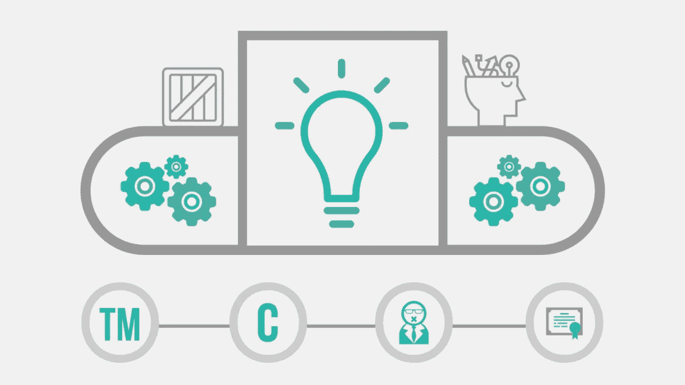
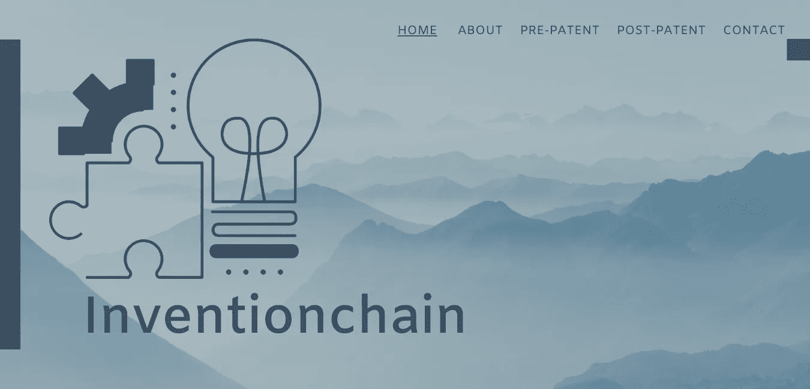
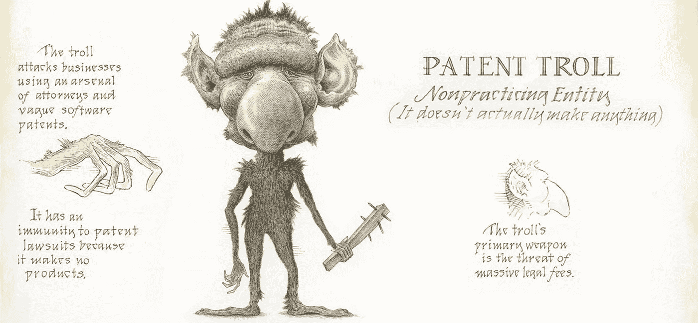
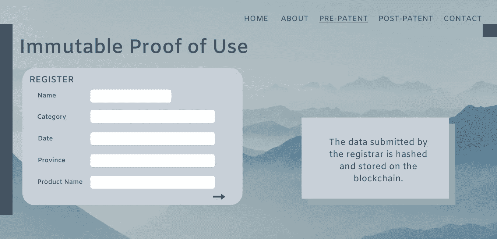
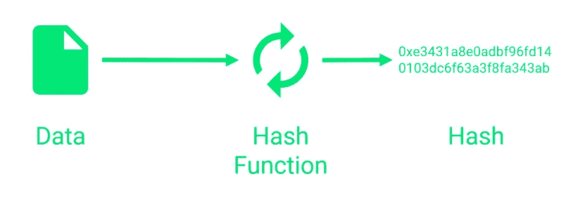
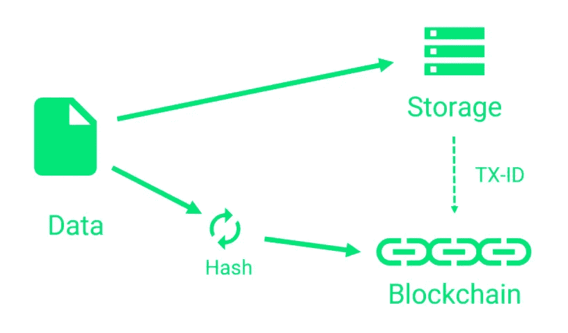
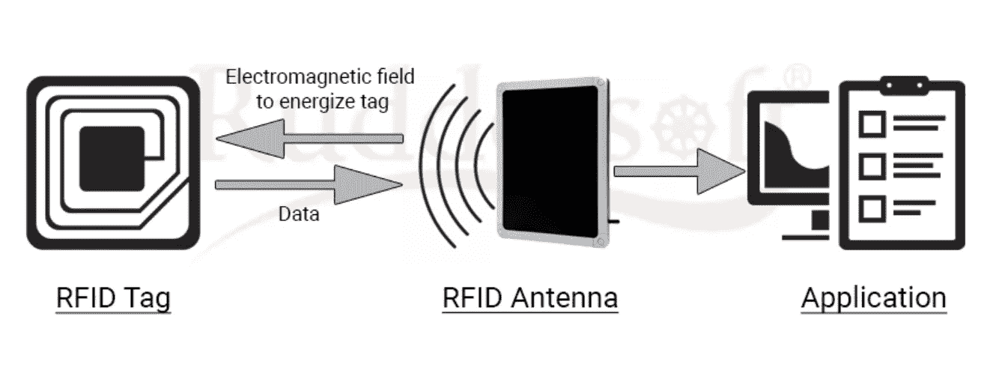
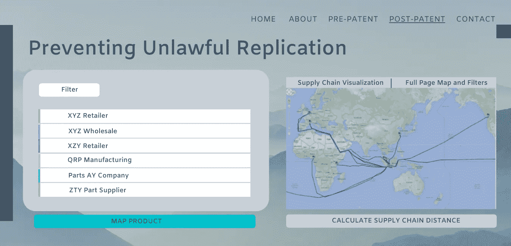
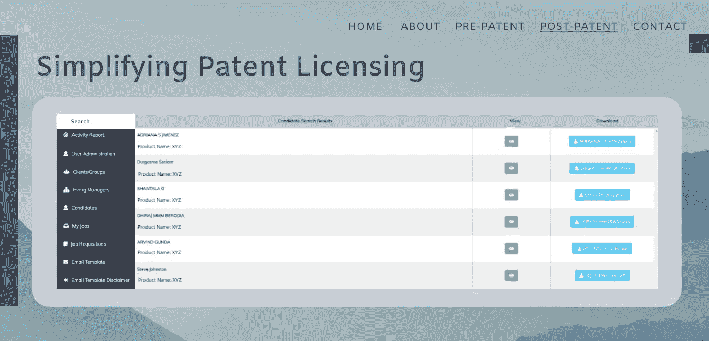

# 发明链

> 原文：<https://medium.datadriveninvestor.com/inventionchain-fdc7cf0ea225?source=collection_archive---------9----------------------->

讽刺真的是最好的。

让我们以弗雷德里克·格拉夫先生为例。他是费城自来水厂的工程师，据说早在 1836 年就拥有消防栓的第一项专利。

*据推测。*

你看，**没有他专利的官方记录**,因为当时美国专利局在一场大火中被毁*。*

***作为消防栓是他的专利。***

真实的故事。

# 撇开喘息的笑声不谈，这个故事真正的亮点是，知识产权已经存在了很久很久。

我们有权拥有源于我们思想的东西。知识产权，或称 IP，是由你想到的想法和概念组成的，可能会有潜在的发展。像文章、发明、书籍、图片、音乐、标语等等。

 [## 创新提醒:区块链 3.0、Terra 协议、ICO 门户网站等

### 尽管过去几个月加密货币的价格波动很小，但这项技术并没有停止发展…

www.datadriveninvestor.com](https://www.datadriveninvestor.com/2019/03/16/innovation-alert-blockchain-3-0-terra-protocol-an-ico-portal-more/) 

**IP 持有价值，它属于你。**为了保护信息安全，政府系统实施了四种主要的安全措施:

Listed below from left to right.

1.  **商标** —用于文字、文字组合、符号等。
2.  **版权** —针对文章或软件等创造性作品
3.  **商业秘密** —配方、程序、工艺等。
4.  **专利** —实用、设计和工厂(机器、图形、工厂)

既然我们知道知识产权有价值，它可以被视为无形资产。然而，保护这些资产会变得

a)耗时，以及

令人困惑

> 事实上，从审查申请开始，在加拿大获得专利平均需要 1000 天，或者大约 34 个月。

显然，这个过程相当繁琐。即使你申请了专利，你的权利要求也不会被审查，除非专利局接到电话。更奇怪的是，加拿大和美国实行的是先申请专利制度。

以前，使用的是**先发明制**，看起来更公平。现在，审查员收到文件的日期是申请日期的决定因素——不要与发送文件的日期相混淆。

好吧，鲁哈尼，但这有什么关系呢？

先申请系统不会照顾弱者。*创新者和发明者必须与潜在的模仿者竞争建立专利——即使他们首先发明了专利，也是第* ***第一个*** *文件才是最重要的。*

***对申请过程的不良认知*** 是系统落后的另一个恩人。通常，承认是不完整的，不正确的，或者是试图在不知情的情况下为已经存在的产品申请专利。

> 根据耶鲁大学进行的一项研究，1963 年至 2005 年间，86%的专利申请被驳回。

维护不当的 IT 协议会导致不必要的法律纠纷和时间浪费。

这里有一个问题——创新需要什么？

> *创造力。*

…好吧，但是还有什么？

> *时间。*

专利制度浪费了什么？

> *时间。*

哇，你着火了🔥

# 发明链简介

Inventionchain UI

一个位于区块链的平台，旨在通过提供以下功能来节省时间和能源

1.  不变的使用证明
2.  防止非法复制
3.  优化专利许可

该平台旨在为两种不同的人群服务，即*前专利发明人*和*后专利所有人*。虽然发明链不能替代政府颁发的专利，但它可以加强流程中所需的证据。

该平台的目标是多样化的——发明链使用区块链的各种最佳功能来服务广泛的客户群，包括独立发明者和各种产品阶段的大公司。

通过整合用于数据存储的哈希系统、用于产品分销的 RFID 跟踪技术和用于许可协议的智能合同，Inventionchain 成为了区块链的巅峰之作。

# 预专利:通用不可变使用证明

使用基于工作证明的区块链系统，发明链作为一个平台，提供关于知识产权所有权的准确和清晰的细节。

在与政府专利程序的合作中，防篡改区块链将以不变的方式给注册表打上时间戳，以指示创意/申请的准确记录时间。

这将解决任何关于先文件系统的问题。发明链也给了知识产权所有者保护任何知识产权侵权者或专利流氓 T21 的优势。

这些公司从专利侵权诉讼中获利。他们从破产的所有者那里购买廉价的专利，但是不生产任何东西。相反，他们发现其他人似乎侵犯了他们的专利，并利用他们赚钱。

Inventionchain UI

通过使用专利申请表格，类似于政府管辖下的专利申请表格，*提交的文件被添加到对等区块链。*安全性是有保证的，因为**不变性**伴随着工作验证共识模型而来。

使用 ***散列系统*** 存储注册商的数据。通过将数据的哈希存储在区块链上，用户可以知道是否有任何数据被修改，因为块数据的更改会导致哈希的更改。

数据可以在任何时间被散列*，并与首先分配给区块链上的事务的散列进行比较。这提供了防篡改性，并加强了 USPTO 等政府机构所需的任何证据。*

原始数据存储在一个关系数据库中，该数据库后来被分配了相应事务的 ID(散列)。这样做*降低了事务成本*，因为只有一部分数据，即散列，实际上存储在区块链上。

专利流程将需要大量信息——发明链通过保证使用证据使该系统更加安全。

# 后专利:防止非法复制

发明链还通过解决诸如非法复制等问题来迎合处于**专利后**的创新者。供应链管理和分散化技术的进步带来了大量的机会。

通过使用 *RFID 跟踪*和发明链，企业或业主可以跟踪他们的产品通过商业流的路径。

产品到达零售商的路径，*分销渠道*，变成*透明*。

> 突然，所有者可以看到产品是否被转移到未经授权的零售商或市场，违反了分销协议。

通过跟踪产品的物理和时间数据，可以检查这些产品采用的路线，以确定第三方产品实际上是真实的竞争者还是仅仅是非法的复制品。

Inventionchain UI

该系统将通过提供产品行程的经验证据来防止专利侵权。

# 后专利:简化专利许可

最后，发明链通过更快地联系利益相关方，极大地简化了专利许可过程。典型的许可计划成功率很低——寻找感兴趣的被许可方并非易事，更不用说协商协议了。

使用智能合同，发明链保护发明的新颖性，这是获得专利资格的必要组成部分，同时仍然可以找到潜在的被许可方或投资者。

该分类账将包括产品的简要描述，而那些对许可感兴趣的人将同意智能合同中概述的条款。它甚至可以让所有者找到拥有行业知识和商业秘密的被许可人。

此外，漫长的知识产权过程使得界定谁拥有什么变得困难和模糊。在发明链上注册作品和制定所有权交易将创建一个系统的、有组织的和诚实的所有权历史，包括像分许可和转让这样的事情。

Inventionchain UI

区块链交易是不可变的，所以一旦注册到区块链，交易的细节就不能再更改了。使用智能合同**降低了交易成本**并且**为发明者和用户创造了一个直接的市场。**

如果满足预编程的合同条款，合同将*自动执行*并完成交易。这减少了管理成本、负担和压力。

我期待着继续建设和发展发明链。知识产权是一个被低估的领域——交流就是一切，因为人就是一切。

> 如果我们找不到优化这些人中最好奇和最有动力的人——创新者和发明家——的方法，我们就会停滞不前。

为新兴的科技🥂干杯

*如果你喜欢这篇文章，一定要给它几个*👏s，在 Medium 上跟我学！

*   *随时联系我*[*LinkedIn*](http://www.linkedin.com/in/ruhaniwalia)
*   *查看我的* [*个人网站*](https://ruhaniwalia.com)