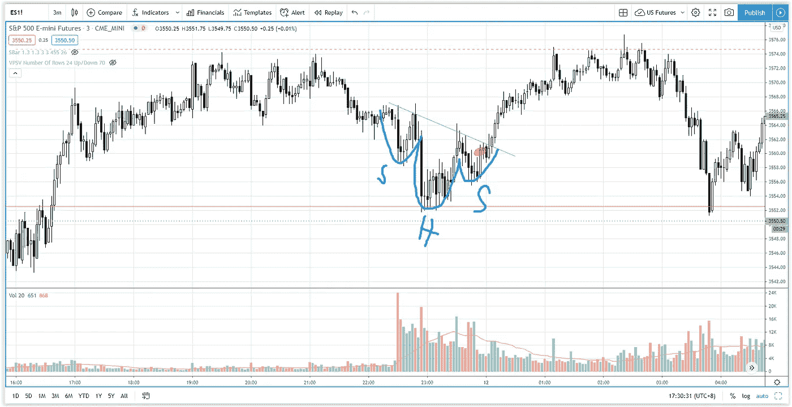

# 价格行为交易中的反向头肩顶模式

> 原文：<https://medium.datadriveninvestor.com/inverse-head-and-shoulders-pattern-explained-in-price-action-trading-873730ffd67c?source=collection_archive---------22----------------------->

找出如何分析，交易和利润的逆头肩底形态在价格的行动方式与数量传播分析。

观看视频，了解 2020 年 11 月 12 日交易时段标准普尔 500 指数期货的**每日市场分析。在这个视频中，你将看到最后一节的市场回顾和三分钟内的交易回顾(包括进场、出场和背后的原理)。展望未来，我将涵盖偏见，要注意的关键水平，我稍后的交易计划。**

## 时间戳

*   [1:35](https://www.youtube.com/watch?v=jEFXVBlBwB0&t=95s) 市场回顾
*   [3:56](https://www.youtube.com/watch?v=jEFXVBlBwB0&t=236s) 贸易回顾
*   [4:30](https://www.youtube.com/watch?v=jEFXVBlBwB0&t=270s) 逆头而肩
*   [6:48](https://www.youtube.com/watch?v=jEFXVBlBwB0&t=408s) 价格动作交易
*   威科夫的努力与结果
*   [13:25](https://www.youtube.com/watch?v=jEFXVBlBwB0&t=805s) 当前股市展望

如果你还没有看我的[每日市场分析视频](https://www.youtube.com/watch?v=ZELd7j2ZH78)，为了更好地了解市场回顾和交易回顾。

**偏向** —中性(日内交易)；看涨(长期)

**关键点位** —阻力:3587、3560；支持:3500、3480–3500

**潜在设置** —在关键级别寻找潜在反转。

# 资源

**每周市场展望&最佳交易建议**直达您的收件箱:[https://www.tradeprecise.com/](https://www.tradeprecise.com/)

**职业免费**制图平台:创建账户→[www.TradingView.com](https://bit.ly/2U2Femd)

**非美国居民？** ( **马来西亚、新加坡**、澳大利亚、新西兰、欧洲等):[点击此处，存款 2000 新加坡元](https://ji.hn/sgtiger)即可获得**免费股票(价值 100++美元&老虎经纪**的欢迎礼物)

美国居民？[点击此处，存款 1500 美元](https://ji.hn/ustradeup)，就有机会在 TradeUP 获得**份免费的 AMZN(价值 3000++** ) & **份欢迎礼物**

**从媒体获取无限文章** —加入以下:[https://priceactiontrading.medium.com/membership](https://priceactiontrading.medium.com/membership)

# 进一步阅读

 [## 凯西·伍德警告市场即将调整——标准普尔 500 价格走势分析

### 在 2020 年 12 月 18 日对彭博的采访中，方舟投资公司的首席执行官兼首席信息官凯西·伍德警告说…

medium.com](https://medium.com/datadriveninvestor/cathie-wood-warns-market-correction-soon-price-action-analysis-on-s-p-500-7e621e013310)  [## ARK Invest 的 Cathie Wood 预测基因组股表现优于特斯拉？

### 方舟投资公司的首席执行官凯西·伍德预测，最大的上涨惊喜可能来自基因组股票，尤其是…

medium.com](https://medium.com/datadriveninvestor/ark-invests-cathie-wood-predicts-genomic-stocks-outperform-tesla-b67f3c4bbc68)  [## 阿里巴巴崩溃——马云失踪了吗？—购买或销售

### 自 2020 年 10 月以来，阿里巴巴股价暴跌 34%，负面消息不断。巴巴触底了吗还是…

medium.com](https://medium.com/datadriveninvestor/alibaba-baba-crashes-is-jack-ma-missing-buy-or-sell-90c20dd6ba21) 

Photo by Author — Ming Jong Tey

Photo by Author — Ming Jong Tey

披露:如果您点击本文中的链接进行购买或开立账户，并将所需金额存入推荐的经纪人账户，我们将免费为您赚取佣金。

免责声明:本演示中的信息仅用于教育目的，不应作为投资建议。