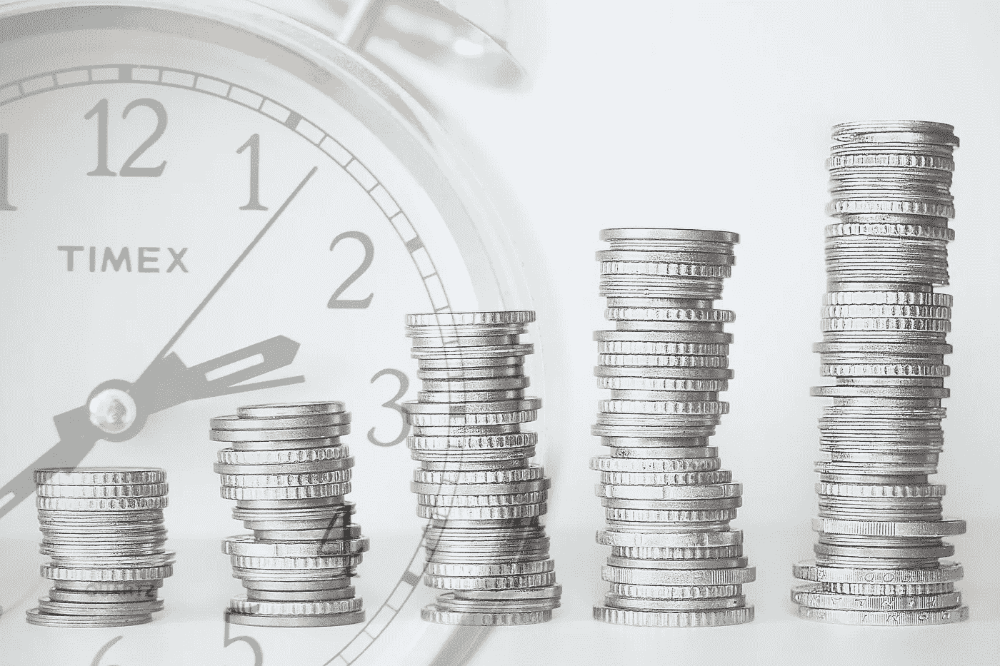
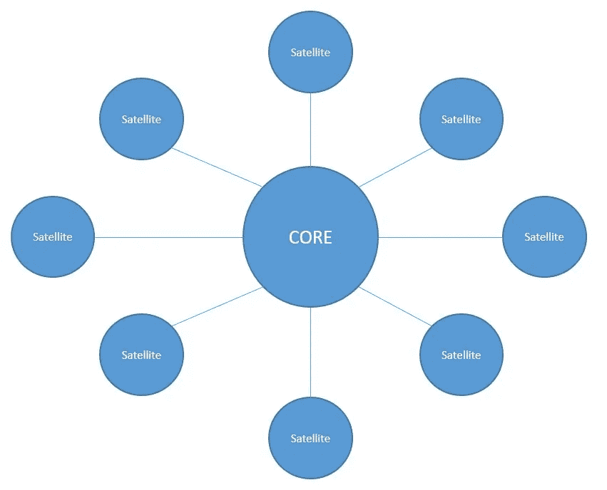

# 用核心卫星策略投资 ETF

> 原文：<https://medium.datadriveninvestor.com/invest-in-etfs-with-the-core-satellite-strategy-df622c1dfbd2?source=collection_archive---------7----------------------->

(Picture by Tumisu on pixabay.com)

对于那些想安全被动地投资于 ETF，但又时不时想为投资组合增加其他价值的人来说，核心卫星策略可能很有意思。

## 这是什么？

它不是一种帮助你决定何时买卖哪种标的的策略。而是指你的资产在投资组合或资产配置中的基本分布。这一策略是由两位美国科学家发明的，他们从根本上相信证券交易所的被动和广泛投资，但他们也看到了有个别股票的表现优于整体市场。

 [## 轻松投资颠覆性技术|数据驱动型投资者

### 研究并做好你的尽职调查，找出 10 个可能主宰未来行业的装袋者可能会很难。的…

www.datadriveninvestor.com](https://www.datadriveninvestor.com/2020/07/13/investing-in-disruptive-technology-made-easy/) 

核心卫星战略现在正试图将被动和主动这两种截然不同的方法结合成一个共同的战略。

The Core-Satellite-Strategy (own picture)

## 它是如何工作的？

首先是核心。核心代表系统的安全部分，人们可以用它来追求买入并持有的方法。他不是在投机，而是应该在以后获得养老金。它在投资组合中的权重相应增加，最高可达 80%。

可以有几种不同类型的卫星，它们的体积要小得多，总共只占组合的 20%左右。这是投资组合中更具投机性的部分，你可以在这里发泄一下。卫星现在正是由投资组成的，这些投资在未来有更好的机会获得比整个市场更好的利润。可靠地找到这样一个雄心勃勃的人的机会更小，但为了将风险降至最低，核心相应地被加重。

80-20 分布不一定总是精确的，每隔半年或一年调整一次就足够了。当然，这一方面是通过销售实现的，但更优雅的做法是简单地增加已经变得太小的部分，因为这可以节省销售可能产生的税收。

## 哪种投资适合作为核心？

最核心的是人生投入，这是那么确定，不会出问题的。哪些投资符合这个要求？

非常广泛分散的 ETF 非常合适。一方面，有一些单独的交易所交易基金覆盖了整个世界(例如摩根士丹利资本国际 ACWI 公司或富时环球交易所交易基金)。另一方面，它是工业化国家 ETF 和新兴市场 ETF 的经典组合(例如 MSCI World 和 MSCI Emerging Markets ETF)。

这种核心还可以包含其他广泛分散的 ETF，如投资于小公司或小盘股的 ETF，因为这些不包括在主要 ETF 中。重要的是要避免核心部分的重叠，这样就不会有内容重叠的 ETF。在 ETF 筛选工具上看一看 ETF 的构成，就能对它有所了解。

债券和其他低波动投资也适合补充核心。

## 哪些投资适合做卫星？

卫星也可以完全由专门的交易所交易基金覆盖。例如，如果你想稍微增持科技股，因为你相信该行业未来将继续像过去一样好，你可以增加一只特殊的科技股 ETF。这同样适用于那些被认为比整体市场有更好增长机会的经济体。

有各种各样的因素交易所交易基金，正好涵盖你认为有前途的领域。在这种情况下，不能再排除与核心全球投资组合的重叠，但在这种情况下，这是一个故意翻倍和增持的问题。

在经典的核心卫星策略中，卫星由个股组成，这些个股的权重使得被视为最有机会的股票也占据了最大的份额。你可以用同样的方法做，也可以对它们进行同等的加权。

**再者，所有可能的资产都可以充当卫星，比如大宗商品、大宗商品 etc(可以说是大宗商品 ETF)，还有 P2P 贷款、加密货币。一方面，卫星是一项严肃的投资，另一方面，如果你有这样做的冲动，你也应该在这里给他们一个地方，让他们能够简单地尝试不同的东西。**

如果你想了解更多关于 ETF 和这种策略的可能候选人，那么请阅读我关于[动量 ETF、](https://medium.com/makingofamillionaire/how-well-are-momentum-etfs-doing-in-the-crisis-38ef89a91de6) [品质因素 ETF](https://medium.com/makingofamillionaire/how-to-get-more-out-of-your-money-with-the-nobel-prize-winning-strategy-69c1c51f662b)和[价值 ETF](https://medium.com/makingofamillionaire/the-10-best-value-etfs-invest-like-warren-buffett-4727aaccf8a1)的文章。

英俊的约翰尼

**访问专家视图—** [**订阅 DDI 英特尔**](https://datadriveninvestor.com/ddi-intel)