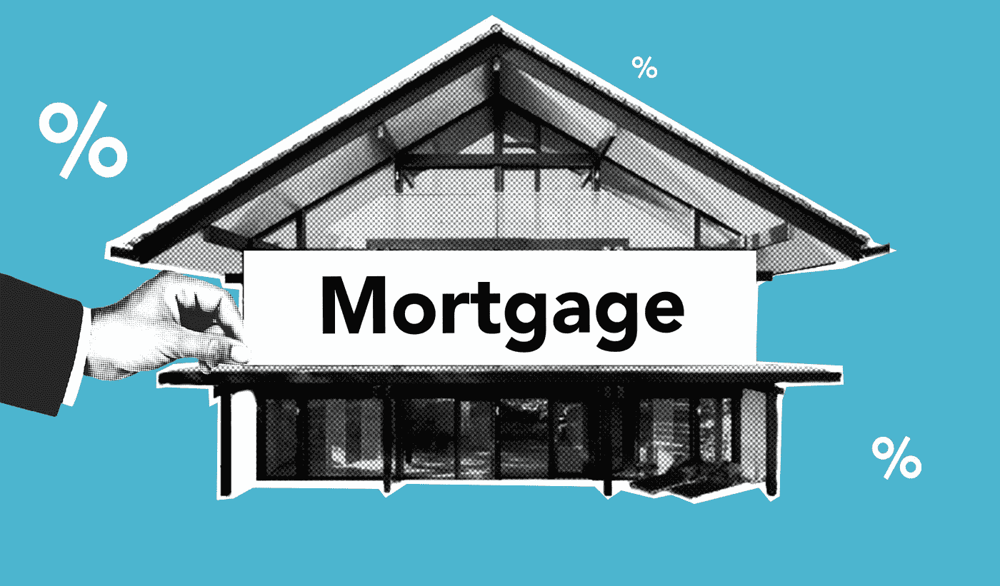

# 像专业人士一样投资房地产

> 原文：<https://medium.datadriveninvestor.com/invest-in-real-estate-like-the-pros-acdc74514842?source=collection_archive---------23----------------------->

如何建立和利用你的团队？

Photo by [David McBee](https://www.pexels.com/@davidmcbee?utm_content=attributionCopyText&utm_medium=referral&utm_source=pexels) from [Pexels](https://www.pexels.com/photo/high-angle-shot-of-suburban-neighborhood-1546168/?utm_content=attributionCopyText&utm_medium=referral&utm_source=pexels)

商业和生活中的一个重要教训是，你不能独自做大事。

无论是建立一个成功的企业，解决复杂的政治问题，还是找到致命疾病的治疗方法，没有一项重要的努力是由人们自己完成的。

> 伟大的事情是由朝着共同目标努力的团队完成的。

虽然业余爱好者可能会尝试自己投资房地产，但专业人士从不这样做。

## 为什么需要团队？

即使你购买的是独栋租赁房，而不是商业地产，拥有一个致力于帮助你成功的专家团队将有助于确保你实现目标。

> 购买和管理房地产所涉及的任务非常多，一个人自己去了解和做需要大量的工作和知识。

考虑一下房地产投资的一些不同方面的例子:

*   知道在哪里购买房产
*   在你的目标区域寻找好的房产
*   知道为你的财产付出的代价
*   计算你的现金流和回报
*   报价和谈判
*   检查属性
*   寻找融资
*   购买财产保险
*   进行修理
*   寻找和筛选租户
*   管理租户和物业
*   记账和报税

好像很多？如果你想一个人去做，那就是了。重要的是要明白自己擅长承担什么，什么事情最好由专业人士来做。

***虽然你需要参与并管理这项投资的方方面面，但依靠专业人士既能加快进程，又能帮助你更成功，因为他们的专业知识能指导你做出更好的决策。***

Photo by [fauxels](https://www.pexels.com/@fauxels?utm_content=attributionCopyText&utm_medium=referral&utm_source=pexels) from [Pexels](https://www.pexels.com/photo/top-view-photo-of-people-near-wooden-table-3183150/?utm_content=attributionCopyText&utm_medium=referral&utm_source=pexels)

## 谁应该在团队中？

你的团队中应该有几个成员:

*   房地产经纪人——在帮助你寻找、协商和购买房产方面至关重要
*   检查员——确保你知道你要做什么很重要
*   **抵押贷款经纪人**——除非你用现金购买，否则你需要借钱来购买房产
*   **产权公司** —处理交割并提供产权保险
*   **保险公司**——保护您的投资免受灾难性损失的重要因素
*   **物业管理公司** —在寻找、筛选和管理租户方面至关重要
*   **会计**——帮助跟踪你的收入和支出以及报税

基于我的知识和优势，我非常积极地参与寻找和谈判潜在房屋的价格，但我总是与经验丰富的代理人一起工作，以获得他们的帮助和建议。

我也自己保存这些书，因为我只有七栋房子，所以不会花太多时间。我使用一个叫做 [Housters](https://housters.com) 的廉价在线软件，考虑到价格，这个软件相当好用。

***最后，由你自己决定如何经营你的房地产生意。如果你是一个有执照的代理人，你可能不需要另一个代理人来帮助你，尽管你可能仍然会发现他们是有价值的，特别是如果你正在寻找一个你不太了解的领域。***

虽然所有这些角色都很重要，但我想更详细地讨论其中的三个:房地产经纪人、抵押贷款经纪人和物业管理公司。

## 房地产经纪人

一旦你决定成为一名房地产投资者，并想好需要什么样的帮助才能成功，你就必须开始组建自己的团队。由于房地产经纪人是这一过程中至关重要的组成部分，我总是从那里开始。

> 你的房地产经纪人是你寻找和购买物美价廉的房产的重要伙伴，所以要确保你选择得当。

最好从其他投资者的推荐开始。请记住，我们所做的与大多数购房者不同，所以你需要在投资房地产方面非常有经验的专业人士，而不仅仅是向希望搬家的家庭出售独栋房屋。

Photo by [PhotoMIX Company](https://www.pexels.com/@wdnet?utm_content=attributionCopyText&utm_medium=referral&utm_source=pexels) from [Pexels](https://www.pexels.com/photo/building-metal-house-architecture-101808/?utm_content=attributionCopyText&utm_medium=referral&utm_source=pexels)

**你需要找到出租条件好的房产，而且你能以一个好价钱买到。大多数家庭都在寻找他们喜欢的房子，如果他们“爱上”某个房产，他们愿意支付额外的费用。**

投资者不能这样操作，你的团队必须围绕购买物有所值(希望低于市场价)的房产这一目标，这样你才能在投资中赚钱。

在和一个代理合作之前，先和几个代理谈一谈。我总是更喜欢自己拥有租赁物业的代理，因为这有助于我确保他们了解我在努力做什么。

当你打电话询问房产时，请不要随便使用代理人拿起的电话。代理人，因为他们的佣金，总是在找工作。他们会试图让你相信他们是你最好的伙伴，即使他们不是。在你的投资之旅中，随意选择一个代理人对你没有好处。

## 抵押贷款经纪人

除非你用现金购买房产，否则你需要贷款。 ***利用别人的钱是房地产的一大好处。你可以提高你的回报，使用比你原本需要的少得多的资本。*** 这可以在房地产上谨慎地做到，因为它通常是一种稳定的投资(与股票市场相比，保证金账户风险很大)。

你应该通过与各种金融机构交谈来购买抵押贷款。这将有助于你了解他们是如何工作的，他们在寻找什么，什么对你有用。

我更喜欢和经纪人一起工作，因为他们会为我货比三家。他们可以接触到成百上千的金融机构，可以帮助我找到最适合我融资的交易。

再次， ***找一个熟悉投资房产的经纪人或贷款人很重要。*** 买房住(称自住)和租房住的规则不一样。通常情况下，你会看到所需的首付更高(通常投资为 25%，自住为 20%)，利率高出+/- 0.5%，所需的文书工作更繁重。

Photo by [Gabby K](https://www.pexels.com/@gabby-k?utm_content=attributionCopyText&utm_medium=referral&utm_source=pexels) from [Pexels](https://www.pexels.com/photo/road-sign-signpost-architecture-5849569/?utm_content=attributionCopyText&utm_medium=referral&utm_source=pexels)

一个好的经纪人可以帮助你解决所有这些问题，并了解正在发生的事情。他们还可以帮助你通过[承销过程](https://www.investopedia.com/terms/u/underwriting.asp)，借此贷方将根据你应其要求提供的信息对你偿还贷款的能力做出判断。有一个经纪人，了解你在做什么，可以帮助你处理数字和文书工作。

> 不管你有多喜欢这处房产，价钱都得算出来。投资是基于逻辑和理性，而不是情绪，所以在购买之前，请确保您了解自己的现金流、总回报和风险。

## 物业经理

寻找和购买你的财产只是一个开始。 ***这笔投资你会持有多年，所以需要好好管理。专业的物业管理公司可以帮助你确保获得并留住优秀的租户，以及在不破产的情况下维护你的房子。他们确实会收取你月租金的 7%到 10%，但如果他们很好，他们会让你赚到比他们收取的多得多的钱。***

> 像所有其他团队成员一样，你会想要面试几家物业管理公司。他们并非生而平等！

寻找你所在地区有经验的投资者的推荐。在线评论可能有用，也可能没用。房地产经纪人通常会决定尝试一下管理，但不知道它是如何运作的。我见过自称物业经理的人，他们不知道如何写租约、保存文件或驱逐房客。

管理租赁物业的租户有很多法律要求，所以你必须找到一家不会给你带来麻烦的可靠公司。需要记住的几条是:

*   租约是法律文件，任何一方都可能在法庭上使用，因此必须正确书写以保护您的利益
*   联邦住房法禁止基于种族、宗教、性别等受保护特征的歧视；你和你的物业经理不能有不同的申请要求，一个种族或性别相比，另一个，或者你可能会发现自己在法律上的麻烦
*   每个州都有法律规定，当房客没有按时支付房租时，如何收取滞纳金
*   每个州都有自己的一套驱逐不付房租或违反租约的房客的法律
*   不驱逐使用你的财产使用和销售毒品的租户会导致政府关闭你
*   不迅速修理房子里的某些物品以保持“适宜居住”可能会让你面临诉讼

为了更好地了解房客和房东的相关法律，请查阅 Nolo 的“[每个房东的法律指南”。 ***即使你使用物业经理，你也应该阅读这本书，这样你可以确保经理遵守规则。你仍然会发现自己要为经理处理这些问题的方式负责。***](https://store.nolo.com/products/every-landlords-legal-guide-elli.html)

Photo by [Shopify Partners](https://burst.shopify.com/@shopifypartners?utm_campaign=photo_credit&utm_content=Picture+of+A+Judge+Addresses+The+Court+%E2%80%94+Free+Stock+Photo&utm_medium=referral&utm_source=credit) from [Burst](https://burst.shopify.com/?utm_campaign=photo_credit&utm_content=Picture+of+A+Judge+Addresses+The+Court+%E2%80%94+Free+Stock+Photo&utm_medium=referral&utm_source=credit)

除了了解和遵守法律，拥有专业的物业管理还有其他几个好处:

*   宣传您的酒店的系统，例如使用 MLS
*   通过信用和背景调查、收入核实等审查申请人的系统。
*   关于收租、滞纳金和驱逐的标准规则
*   搬进、搬出、租户损坏等的标准程序。
*   一批维修公司，可以在短时间内接到通知来解决重要问题
*   将文件保留规定时间的记录系统(想象一下，你因为拒绝了一份申请而被起诉歧视，但你没有保留该申请或任何其他申请来证明你在实践中是公平的)

一些业主决定自己管理他们的物业。这可以工作，如果你有一个或两个(假设你仍然遵循所有的规则)，或者如果你没有一个白天的工作，并希望拥有一个物业管理业务成为你日常生活的一部分。

请记住，管理住宅物业需要专业、专注的努力才能做好。因此，在尝试 DIY 方法之前，确保你为承诺做好了准备。

我不管理我的出租屋，我使用专业公司。我住在城外，有一份全职工作，而且我有四个孩子，所以试图自己解决问题是不切实际的。它减少了我的现金流，但没有它我将无法管理我的投资，所以它绝对是值得的。

> 我宁愿要一小块馅饼，也不要一点馅饼也没有。

像你团队的所有成员一样，你必须管理经理。如果你有一家公司在寻找和留住优秀租户方面做得不好，或者没有帮助你保持积极的现金流，那么你应该换掉它们。甚至可能要尝试几家公司，直到你找到一家适合你的，但是不要害怕拥有你的房地产生意。

Photo by [Pixabay](https://www.pexels.com/@pixabay?utm_content=attributionCopyText&utm_medium=referral&utm_source=pexels) from [Pexels](https://www.pexels.com/photo/abundance-bank-banking-banknotes-259027/?utm_content=attributionCopyText&utm_medium=referral&utm_source=pexels)

## 结论

投资房地产是一个在工作之余积累财富的好方法，但是这需要帮助。 ***花时间去寻找、建立和管理一个优秀的专业团队将会帮助你确保你的财务未来。*** 特别注意态度和经验，确保你的团队与你结盟，购买投资性房产，而不仅仅是居住的房子。

如果你付出额外的努力来建立一个好的团队，这将在你的投资生涯中带来回报。从有能力、有动力的专业人士那里获得帮助，会让你腾出更多的时间来研究你的策略和房地产业务的方向。一旦开始，你会对结果感到惊讶。一次买一套房子，你就能致富，一个优秀的团队将帮助你更快、风险更小地致富。

> 归根结底，你的房地产投资是一项业务，你需要这样对待它。

让我知道你对投资房地产的想法！

## 资源

*要了解更多关于如何在房地产行业起步的信息，请阅读本文:*

 [## 如何(以及为什么)开始涉足房地产

### 最重要的第一步。

medium.com](https://medium.com/money-clip/how-and-why-to-get-started-in-real-estate-8a2e4e0ab50) 

*要了解我如何以市价购买房产，请阅读本文:*

 [## 积累财富的秘密

### 当我通过寻求价值购买投资性房地产时，我如何产生权益。

medium.com](https://medium.com/datadriveninvestor/the-secret-to-building-wealth-cab646114422) 

*要了解更多关于杠杆如何增加房地产财富的信息，请看这篇文章:*

 [## 像专业人士一样积累财富

### 杠杆率如何让房地产成为财富引擎。

medium.com](https://medium.com/datadriveninvestor/build-wealth-like-the-pros-2dc9a732a24) 

我与列出的任何网站都没有关系，也没有从我的文章中的任何合作伙伴或推荐中赚钱。我不是律师，会计师，或注册理财规划师。所有材料都是基于我的知识和经验，出于提供信息的目的而真诚呈现的。它无意取代专业建议。在做出任何法律、税务或财务决定之前，你都应该向专家咨询。