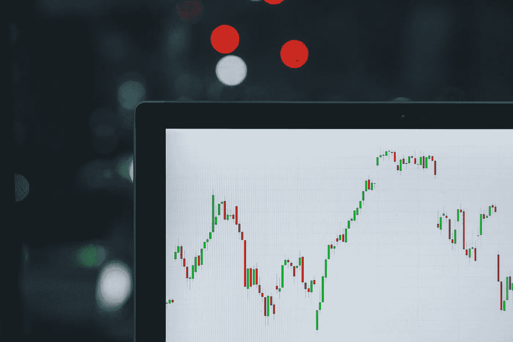

# 投资自己:会有回报的

> 原文：<https://medium.datadriveninvestor.com/invest-in-yourself-it-will-pay-off-d99b848d4cbf?source=collection_archive---------6----------------------->

谈到为未来做准备，我们经常被告知，或者我们经常读到，我们应该尽早开始投资。背景通常是金融投资，而这种投资的接受者往往是股票市场。

Photo by [M. B. M.](https://unsplash.com/@m_b_m?utm_source=unsplash&utm_medium=referral&utm_content=creditCopyText) on [Unsplash](https://unsplash.com/s/photos/wall-street?utm_source=unsplash&utm_medium=referral&utm_content=creditCopyText)

如果不是股票市场，那就是退休基金，或者仅仅是一个储蓄账户，或者任何其他可以存放你的*钱的地方。然而，金钱是我们唯一可以用来投资的东西吗？肯定不是。股票市场和储蓄账户绝对不是我们唯一可以投资的地方。*

我们在生活中做的每一件事都需要某种形式的投资。这可能是一种能量投资——当我们走路、跑步、思考和写作时——也可能是一种注意力投资，例如当我们听讲座、与朋友交谈或只是在电视机前试图保持清醒时。然而，所有这些投资确实还需要一件东西——*时间*。

 [## 算法交易的机器学习|数据驱动的投资者

### 当你的一个朋友在脸书上传你的新海滩照，平台建议给你的脸加上标签，这是…

www.datadriveninvestor.com](https://www.datadriveninvestor.com/2019/01/30/machine-learning-for-stock-market-investing/) 

一旦你开始思考时间投资的想法，就很容易跳到本文的要点；我们应该更加关注对自己的投资。

毫无疑问，时间是我们人类最宝贵的资源，所以我们必须明智地使用它。一旦你开始把自己的身体、思想和整体生活方式视为一个活生生的、会呼吸的股票市场，你就能开始看到投资它的重要性。让我们逐一考虑这三个“部分”。

## 1.你的身体

当涉及到你的身体和你的身体健康时，毫不奇怪，你的所有行为都会对它的持续时间产生巨大的影响。你的身体会一直伴随着你，所以你必须决定你希望它在你的一生中保持什么样的状态。我们从小就被告知，我们必须吃得好，经常锻炼，这真的不是谎言。

不幸的是，我们的身体似乎不会像许多股票一样随着时间变得更“有价值”，但我们可以确保它们不会太快失去太多“价值”。只要保证你喝足够的水，吃足够的水果和蔬菜，你就可以惊人地减缓这种不可避免的状况恶化。

另一个组成部分——锻炼——将与良好的饮食携手合作，以确保你不会经历复利的错误结局；随着时间的推移，你身体的“价值”迅速呈指数下降。

## 2.你的思想

你应该考虑进行重大投资的下一个“基金”是你的头脑。有一个简单的方法可以保持健康的头脑，并几乎无限地扩展它，那就是吸收有价值的信息。

这种投资可以以读书、听播客或看电视的形式出现。对“有价值”这个词的强调并不是为了恐吓你，也不是暗示你每天应该吸收的信息有一个明确的层次。

价值是高度相对的。例如，如果你是一名天体物理学家，那么关于恒星和行星的数据对你来说(很可能)比护士或律师更有价值。

通过吸收相对于你自己的兴趣、爱好、欲望和需求来说有价值的信息，你将因此通过投资增加你头脑的价值。这将有利于个人，也可能有利于其他人，但一会儿会有更多的讨论。

## 3.你的生活方式

最后，你必须投资于你的生活方式。这是时间真正发挥作用的地方，因为尽管锻炼和阅读需要时间，但改变你生活方式的关键方面需要更长的时间。这是我鼓励你鞭策自己的地方，如果你不这样做，总有一天会有人取而代之，这将是更难适应的。

学习不同的技能，尝试新事物，对你的生活方式做出微妙或极端的改变，这些都是扩展你的能力范围并使你的生活质量更好的好方法。

简单地尝试新事物是投资时间的好方法，因为你可能会发现你喜欢的新爱好，甚至是新的就业机会。花 100 个小时学习一项新技能听起来可能很多，但它可能会在未来带来数千小时的工作机会，或者与有趣的新人进行无数次令人兴奋的对话。

> “对知识的投资回报最大”
> 
> —本杰明·富兰克林

一旦你开始应用这些概念，并开始投资于自己，你将能够利用所有这些变化。这让一切又回到了复利的概念上。一旦你对自己的生活方式做了微小的、渐进的改变，你就为那些想从这些改变中受益的人打开了大门。这可能是新的友谊或工作机会的形式，然后它变得很清楚，复合发挥作用。

如果你改变你的生活方式，使你现在吃得健康，经常锻炼，你可以从提高能量水平，减少去看医生的次数，最重要的是，在地球上有更多的时间中受益。

当你读更多的书，关注时事时，你会发现自己能够和其他有相似兴趣的人进行更高质量的对话。这将导致更令人满意的交流，你将享受更多的信息，无论是内部思考还是与他人对话。

当你花一些时间学习一项新技能时，其他人可能会想在你身上投资(即要求你开始为他们工作)，然后你会以工资/合同等形式收获新技能带来的利益。

Photo by [Cytonn Photography](https://unsplash.com/@cytonn_photography?utm_source=unsplash&utm_medium=referral&utm_content=creditCopyText) on [Unsplash](https://unsplash.com/s/photos/handshake?utm_source=unsplash&utm_medium=referral&utm_content=creditCopyText)

所以，当你在考虑改变你的生活或者想知道你应该朝哪个方向走的时候，先停下来想想你生活中可以从一些投资中受益的领域。

当你投资自己时，其他人也会想做同样的事，就像投资金融市场一样，除非你有所投入，否则你不会有任何收益。