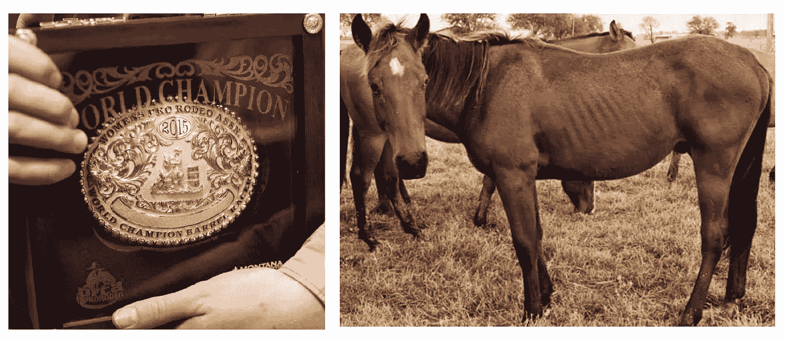
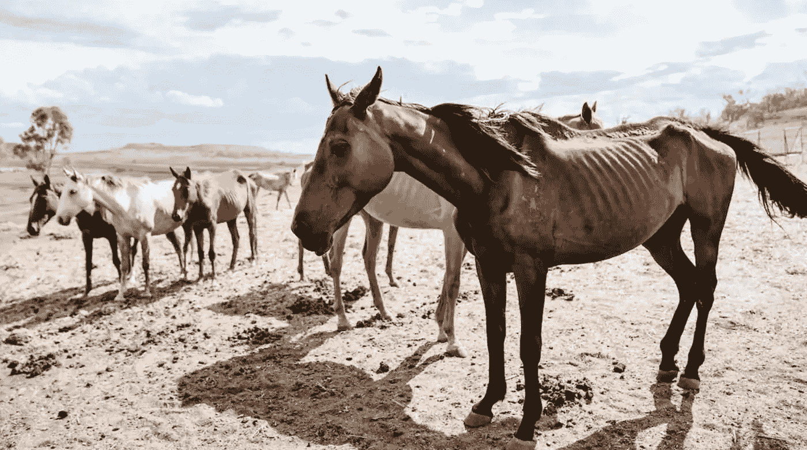
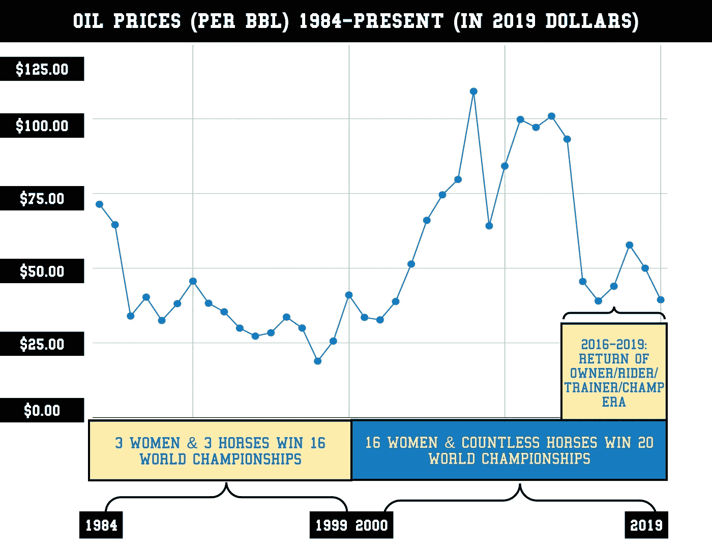
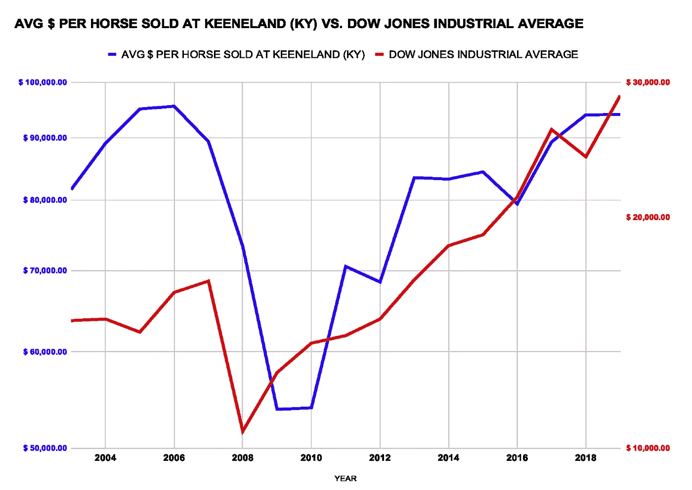
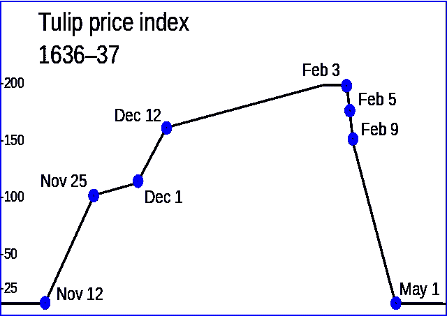
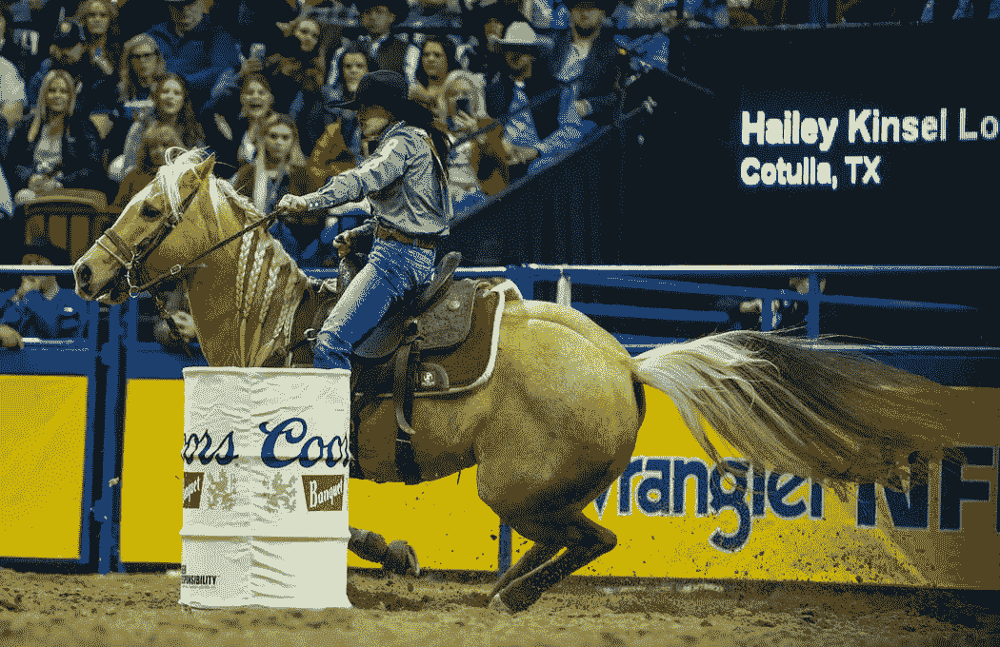

# 喂不饱的马的趋势似乎是地下钱庄和泡沫的结果

> 原文：<https://medium.datadriveninvestor.com/investigation-into-the-dubious-dufurs-suggests-bad-banking-equine-asset-bubble-3524fb512f3d?source=collection_archive---------1----------------------->

**Left:** A 2015 Barrel Racing World Championship Buckle. [Source: Houston Chronicle](https://www.houstonchronicle.com/news/houston-texas/houston/article/Prize-mount-brings-home-the-gold-buckle-6711899.php#photo-9141061)**. Right:** Dufur Ranch in Caddo, OK. Source: Confidential**.**

## 木桶比赛，“郁金香狂热”，数学，事实和金钱线索提供了一个严峻的现实

最近几周我们[揭露了这样一个事实](https://medium.com/datadriveninvestor/does-bancorpsouth-bank-have-a-collateralized-horse-obligation-eb94b07a7c03)一些据称营养不良的马匹被抵押作为**Bancorp south bank(**[**NYSE:BXS**](https://finance.yahoo.com/quote/BXS/)**)**股东拥有的部分资产的担保。在用无人机任务核实[后，调查开始评估抵押品*价值*。今天，马类资产可以作为抵押贷款的担保，也可以(在某些情况下)作为个人购买此类资产的担保，就像买车一样。](https://medium.com/datadriveninvestor/drone-mission-inspects-bancorp-southbanks-famished-four-legged-collateral-more-info-is-revealed-3f51c6054b4d)

**Report:** [The West Australian: Horses ‘starving to death’ amid carcasses (January 29, 2020).](https://thewest.com.au/lifestyle/horses-starving-to-death-amid-carcases-ng-s-1992233)

此外，在过去的六个月里，关于马匹营养不良表现的报道已经从佛罗里达州的浮出水面，一路[到澳洲的](https://thewest.com.au/lifestyle/horses-starving-to-death-amid-carcases-ng-s-1992233)，例如*(见上文)*。为了更好地理解，我们跟踪了资金的流向，因为它与俄克拉荷马州卡多的杜福尔表演马的那些动物有关，这里是更大的图片…

为什么 BXS 借了杜福尔马的钱？为什么银行会借钱给马？如果我说，这是‘Bob Baffert Stables’(两届冠军三冠王教练的同名物)——这是一回事。然而，杜福尔马的繁殖和训练主要是为了“桶赛”，桶赛是一个术语(全国)，很少有人知道，理解，或关心，就此而言！数据和事实表明，正确的答案是一种叫做“ [*非理性繁荣”的东西。*](https://www.investopedia.com/terms/i/irrationalexuberance.asp)

*与巴弗特和他的同行相反，路易斯安那州博西尔市的桶形赛车教练(兼艺术家)安吉拉·法斯特万承认，“尽管到处都是钱，但这个领域最好的教练得到的报酬和学校老师一样。”这增加了杜福尔刺激的理论，即在这个利基市场中，有些东西在经济上是不可靠的。*

*不过，首先你可能会想… ***什么是#*^$桶跑？****

*好问题…*

*[**根据 Mirriam-Websters**](https://www.merriam-webster.com/dictionary/barrel%20racing?utm_campaign=sd&utm_medium=serp&utm_source=jsonld) 的说法，这是:*“女子竞技比赛，骑在马上的骑手以三叶草的方式绕着三个桶做一系列急转弯(最快的时间获胜)。”**

*此外，在 [***城市*Dictionary.com**](https://www.urbandictionary.com/define.php?term=barrel%20racing)上找到的一个木桶赛车的定义补充了第一个，进一步定义了这个术语，说:*

> *“或者，把钱扔出卡车窗外，让一个朋友用金属管打你的小腿，也会给你同样的快感。”*

*事实上，桶赛是一项运动。*不同于*众所周知的纯种马赛马(招揽赌博*和*薄荷朱利酒的经济影响)，一项调查显示*几乎所有*案件的成本都远远超过手段。经过训练参加这项运动的马匹市场似乎受到了 20 年来 1%的涌入、债务的获取、*过度*慷慨的父亲和 ***石油繁荣*的推动。***

*反过来，这创造了一种类似于 17 世纪荷兰郁金香热的现象。*

*16 世纪晚期，郁金香球茎被引入荷兰，引发了郁金香狂热。到了 1636 年，事情变得“古怪”起来根据 2017 年[史密森尼杂志的一篇文章](https://www.smithsonianmag.com/history/there-never-was-real-tulip-fever-180964915/)，当时，“一名水手将一种罕见的郁金香球茎误认为洋葱，并与他的鲱鱼三明治一起吃了，他被指控犯有重罪，并被关进监狱。一种名叫“永远的奥古斯都”(Semper Augustus)的球茎，以其火焰般的白色和红色花瓣而闻名，售价超过了阿姆斯特丹时尚街区的一座豪宅*

***Dutch TulipMania explained. Source: Youtube/RadarExtra.***

*在桶赛中，最终目标是赢得世界冠军，这是通过一个赛季的艰苦、昂贵和令人生畏的竞争完成的。高潮发生在内华达州拉斯维加斯的托马斯和麦克中心——在一个满是泥土的篮球场上，十个晚上的比赛都是世界前 15 名的比赛:[全国总决赛竞技](https://www.prorodeo.com/prorodeo/national-finals-rodeo)。*

*在职业桶赛作为竞技表演的 71 个赛季中，48 个不同的世界冠军被加冕。14 名女性是两届冠军。五个拥有三个冠军皮带扣。四个女士赢了四个，只有一个人赢了更多:十一个。11 次世界冠军 Charmayne James *也*成为第一个骑着两匹*不同的*马登上她运动项目山顶的人(2002 年)。在 48 个世界冠军中，只有 3 个(6%)能够骑着两匹不同的马赢得冠军。因此，在 94%的情况下，很少有证据表明骑手是赢得冠军的主要因素。关于其他马载竞技活动中的相同指标，没有一个接近 94%。*

* [## 如果资本主义失败了，那么还有什么选择呢？数据驱动的投资者

### 在当前政治领域的修辞之旅中，我们都可以面对面地接触到流行词汇，如…

www.datadriveninvestor.com](https://www.datadriveninvestor.com/2020/03/16/if-capitalism-is-a-failure-then-what-is-the-alternative/) 

从 1984 年到 1999 年，三名女子和三匹马赢得了十六次世界冠军。这三匹马加在一起，按今天的美元计算不到 75000 美元。从那以后，16 位女性赢得了最近的 20 个冠军头衔，马的价格也一飞冲天*！*

**Oil prices seem to correlate with Champion diversity in Barrel Racing.**

随着以德克萨斯州和俄克拉荷马州为中心的木桶赛车育种者的温床，职业木桶赛车锦标赛的多样性和油价之间存在直接的相关性*(见上文)*。这并不奇怪。此外，看看时尚的纯种赛马世界。肯塔基州列克星敦的 Keeneland auctions(该行业最强大的拍卖网站)的每头动物的总售价与道琼斯工业平均指数(股票市场指数)直接相关。

**Stock Market vs. Keeneland per-head-sale price (in 2019 dollars)**

不同之处在于，自 1665 年以来，纯种赛马在美国一直广受欢迎。纯种赛马与 NBC 签订了利润丰厚的合同，对所有三项三冠王赛事和育种者杯赛事进行全国报道。1931 年，在德克萨斯州一个小镇的“牛仔聚会”上，桶形赛车诞生了。这项运动在第二次世界大战后以现在的形式出现。NFR 曾经在 ESPN2 上直播过(2008 年创下了六次直播的记录)，这使得 93%的美国观众都可以收看。然而，它现在驻留在“牛仔频道”上，为牛仔竞技提供了大约一半的曝光率，这是它曾经在 ESPN2 上电视转播时获得的。

在过去的 20 年里，女牛仔每年的收入以与通货膨胀相同的速度增长。然而，购买成品马的价格“几乎翻了一番”，法斯特万说。

根据 cowgirl.com 的一篇文章[，近年来，当谈到购买一匹成品的、经过验证的、年轻的桶形赛马时，“数字急剧攀升，尤其是如果你的目标是赢的话。你可能会为这种品质的马支付与购买新车一样多的钱，从紧凑型福特车到法拉利。”](https://cowgirlmagazine.com/the-cost-of-being-a-cowgirl/)

实际上*没有办法*在最高水平的表演中赚到足够的钱来养活自己和家人。兽医费用、饲料费、拖车费、柴油费、额外的人手、兽医用品、马具费和报名费——很快就加起来了…

**据 barrelracingtips.com:**

> “如果你有 NFR 资格证书在望，你可以计划至少需要赚 6 万美元，并且很可能至少会花掉这个数目的费用。
> 
> 前 15 名之间的平均常规赛奖金为 97，210 美元。所以很可能你赢的越多，你旅行的次数就越多，你的花费也就越大。总而言之——如果你是全国最顶尖的桶形赛手之一，你能做到收支平衡就不错了。"

然后就是今天的马价！我询问了七名 NFR 资格赛选手和一名冠军对红崖围捕协会网站上的一条评论的看法，该网站号称，

> “一匹久经考验的赛马价值 5 万美元。对于职业桶形赛手来说，这确实是一个很小的代价。”

与这种说法相反，没有人认为 5 万美元是他们愿意为一匹马支付的金额。一名玩家甚至声称输掉 23.64 万美元获得资格，然后在拉斯维加斯赢得 2.6 万美元。一整季的最高净利润？令人窒息的 14000 美元。我用了“令人窒息”这个形容词，因为 1.4 万美元勉强超过了美国的贫困线。

至于荷兰的郁金香热，人们看到了单个郁金香球茎的价值，于是大笔资金涌入这场从荷兰东印度群岛引进这些花卉的游戏。

通过贷款进口郁金香的合同，投机活动猖獗，希望他们以后可以卖更多的钱，偿还贷款，并获得丰厚的利润。在查尔斯·麦凯的书《疯狂的人群》中，他写道，在 1636 年(泡沫的高峰期)，有人用 21 英亩的土地换了一个“永远的奥古斯都”灯泡！此外，在 1636 年，郁金香开始在荷兰股票市场上交易。

Tulip Prices (in Guilders) in 1636–1637\. Source: [Steemit.com](https://steemit.com/bitcoin/@penguinpablo/6-reasons-why-bitcoin-can-t-be-compared-with-the-tulip-mania).

同样，2014 年,[《沃斯堡明星电讯报》](https://www.star-telegram.com/sports/article3851928.html)报道称，当地一家折扣靴子连锁店的所有者在拍卖会上支付了 85 万美元，买下了那匹(据称受伤的)曾让这位 2012 年世界冠军骑手获得荣耀的木桶赛马。那匹马还没有重复这一壮举。

**最终，在 1637 年初**，有人意识到你可以自己种植郁金香球茎，于是消息传开了。灯泡的价格暴跌。拥有大量球茎的人们不得不接受损失、巨额贷款违约和欧洲经济崩溃。

从 1984 年到 1999 年赢得这 16 个冠军头衔的三位女性(詹姆斯、雪莉·鹿皮森和克里斯蒂·皮特森)都是**自己“种植”这些马**。他们训练、培养、塑造，用更少的钱、*和大量的工作*成为冠军。同样真实、令人震惊的说法也可以用在詹姆斯和卡维身上，她们是三位女性中最先在两种不同的坐骑上获得冠军的两位。第三匹马，玛丽·伯格，用一匹很普通的马换了一匹 2 岁名叫“莫”的马，完成了这个壮举。伯格拥有、训练、比赛，最终在 2016 年，68 岁的她在“莫”号上赢得了第二个冠军头衔。

自 2017 年以来，两匹名为“姐姐”的不同的马被两个不同的女人*训练和拥有*。两个组合都占据了最后三个冠军。25 岁的 Hailey (Kinsel) Lockwood 最近刚从德州农工大学毕业，已经赢得了前两项冠军——14 年来第一次蝉联冠军。

Most recent back-to-back WPRA champion Haley (Kinsel) Lockwood’s approach resembles the days of old. Source: [Las Vegas Review-Journal](https://www.reviewjournal.com/sports/rodeo/national-finals-rodeo/2019-nfr-las-vegas-7th-go-round-results-1912346/).

在过去二十年的一半以上的情况下，*其他人*每个赛季训练或拥有 15 匹 NFR 资格赛或冠军赛的马。例如，伯格的第一个头衔(2006 年)来自加利福尼亚一匹赛马主人的马。同样，我们也有靴子店的朋友以及艾伦·杜福尔，他在成为声名狼藉的桶马大亨之前是一名银行家。艾伦和泰瑞·杜福尔作为赞助商，帮助一名骑手两次获得 NFR 资格，在某些情况下，她骑他们的马。

在法斯特万看来，“杜福尔/甘特故事最好的部分是杜福尔只支付账单，但杰基是骑着优秀马匹的优秀骑师，这些马匹由优秀的教练训练，并由杜福尔购买。”

杜福尔的故事只是过去 20 年中投入桶赛的所有大笔资金的一个例子，这些资金来自更有利可图的来源，在许多情况下，“飞出了窗外”。

然而，过去的四个冠军已经能够采取本土的方法，而不用看着钱“飞出窗外”因此，在桶装比赛中，就像在生活中一样，最重要的是:数学——所有的事情都回归到平均值。

唯一的问题似乎是买家还没有认识到这一现实——这也解释了为什么 BXS 和它的同行们仍然在抵押马匹。然而，这个数字可能会激怒 BXS 的投资者及其同行，以及拥有这些信息的潜在马业主停下来，思考并问自己: ***我买的是什么，值那么多钱吗？***

最后，对于那些完全出于对动物福利的关注而关注这个故事的人来说，有人花 85 万美元买了一匹再也赢不了的马的事实**仅仅提供了一个杜福尔马为什么会挨饿的主要例子**。唉，会不会是桶跑(以及其他各种马术运动)的大牌车主在法拉利上花了这么多钱，*他们买不起汽油？*

— — — — — — — — — — — — — — — — —

## 作者的披露

*我/我们在提及的任何股票中没有头寸，并且没有计划在未来 72 小时内建立任何头寸。我自己写了这篇文章，虽然它可能是由 Medium 的编辑策划的，但它表达了我自己的观点和可证实的事实。我没有收到任何报酬(除了来自 Medium)。我和这篇文章中提到的股票的任何公司都没有业务关系。*

## DDI 的披露:

*本文及其分析仅代表作者观点，与《数据驱动投资者》( DDI)编委会的立场无关。我们鼓励读者对这一主题和相关主题进行自己的尽职调查和研究。DDI 也没有以任何方式与此话题相关的交易头寸或财务利益。**