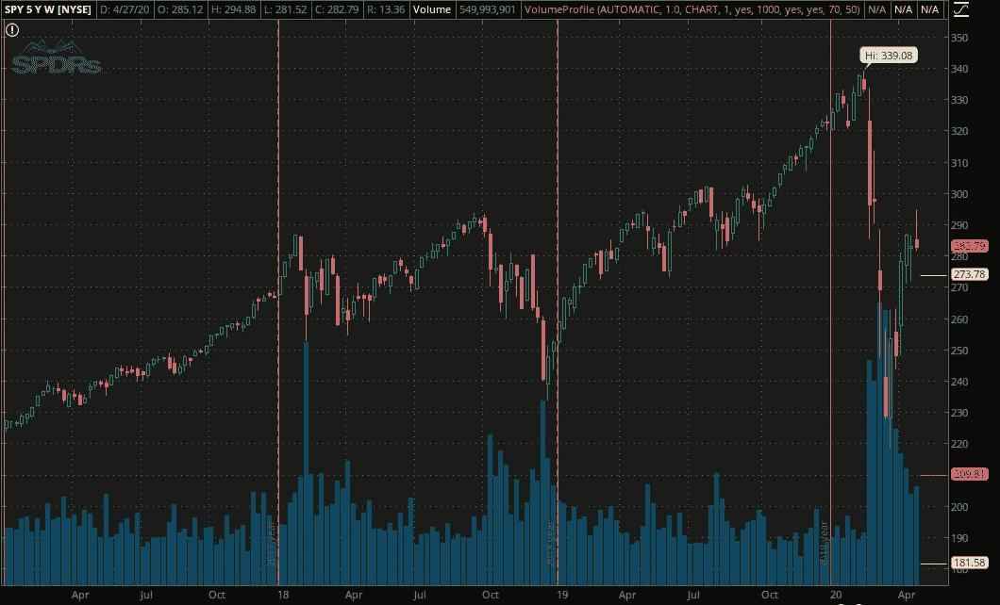
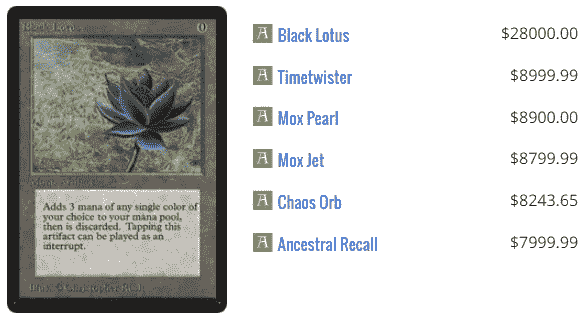
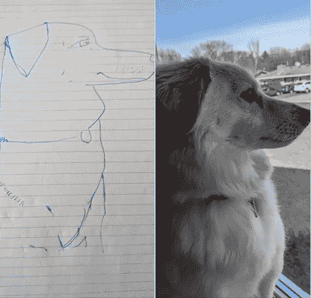

# 在 COVID 疫情期间投资我的未来:幸运者之一

> 原文：<https://medium.datadriveninvestor.com/investing-for-my-future-during-the-covid-pandemic-one-of-the-lucky-ones-1f793941dddb?source=collection_archive---------7----------------------->

## 我是如何应对下跌的股市和因新冠肺炎而增加的空闲时间的

Photo by [Markus Spiske](https://unsplash.com/@markusspiske?utm_source=medium&utm_medium=referral) on [Unsplash](https://unsplash.com?utm_source=medium&utm_medium=referral)

# 寻找有利的一面

虽然我不像一些政治人物那样见多识广，在疫情的重力压到美国人之前成功地抛售了他们的投资组合，但我绝对是在严重的经济困难时期仍然有稳定收入和一些现金可花的幸运者之一。除了作为美国经济刺激计划的一部分分发的 1200 特朗普美元之外，我的工作可以远程完成，我的博客仍在为我赚外快。此外，不断下跌的资产价值使我能够在各种市场上积累，以有吸引力的价格在我的投资组合中建立长期头寸。我不仅考虑购买股票和收藏品，我还投资时间学习新技术来推进我的职业生涯。

# 购买血液

在生活中，我是一个乐观主义者；市场上的一头*公牛*总是在寻找可以购买的东西。在疫情的前一年，股票的高价格使得我很难以我想拥有的名字建仓。回报的风险对我来说并不好，而且我不是唯一一个。尽管价格上涨，但在任何一天快速浏览媒体，似乎每个金融分析师和他们的兄弟都在预测市场最终会陷入低迷……[它只是需要一个催化剂](https://time.com/5793506/a-stock-market-crash-was-coming-coronavirus-was-just-the-spark/)。新冠肺炎迅速征服了世界，并在三月中旬震惊了全球经济，因为看不见的威胁关闭了全美的城市。生意停止了，习语的老市场仍然成立，“多头走楼梯，空头坐电梯下来。”

SPY Weekly Char (2017-current)

一旦事情发生，股票开始下跌，我把一些存款转移到我的交易账户，开始买入，认为这是黑天鹅事件。当许多大经纪商开始提供免佣金的在线交易时，理解零售投资领域发生的一个非凡的范式转变是很重要的。我永远不会使用 Robinhood 应用程序，但我很欣赏它的影响！因为我不用担心佣金，而且我的资金相对较少，所以当事情发生动荡时，我每天都会买入一些股票，建立小额头寸。它实际上是在伸出“触角”，帮我衡量市场情绪。当事情触底反弹时，我看到了机会，增加了买入量，形成了我想要的仓位。

Jerome Powell, the Fed chair. Credit…Eric Baradat/Agence France-Presse — Getty Images

何美联储很快宣布了救市措施和[科学正在戏弄潜在疗法](https://www.gilead.com/news-and-press/company-statements/gilead-sciences-statement-on-access-to-remdesivir-outside-of-clinical-trials)，所以这次策略对我来说很有效。人们陷入恐慌，我以感觉像交易的价格收购了我想拥有的公司。这叫做*买血*，如果你想成为一名成功的交易者，你需要习惯这一点。我不是一个伟大的交易者，但我不是市场新手。我不主张投资或交易，除非你有一个稳定的财务状况！

# 另类投资

除了股票之外，我还在关注收藏品等另类市场的投资。我是一个长期的[魔术:聚会](https://www.mtgstocks.com/sets/75) (MTG)玩家，自然开始在易贝寻找交易，因为人们将会出售。我总是把魔法卡和投资联系在一起。当我还是个孩子的时候，我研究了这个游戏，发现孩之宝拥有它，并且说服我妈妈用我的零花钱买股票。我的第一笔投资，今天我仍然拥有这些股票！

虽然看到人们为了把食物放在餐桌上而被迫变卖财产的情况令人沮丧，但魔法卡供应的增加使价格下降，因为没有需求来满足它。对于怀疑论者来说，这些年来，一些神奇的卡片已经升值到令人难以置信的程度！人们愿意为一些最稀有的完好无损的纸板支付数万美元。

Magic: The Gathering Black Lotus and prices

## 小心收藏品

人们不仅仅是在清算他们的魔法卡片收藏……这种程度的经济衰退可能会让你找到你想要收藏的任何东西的交易，无论是硬币、邮票还是葡萄酒。浏览易贝和 Craigslist 这样的网站，但是要小心！艰难的时期将人们置于可怕的境地，而且常见的是看到假冒收藏品和骗局的增加。有些人会做任何事来快速赚钱，即使其他人也受到伤害。

# 投资自己

虽然我是幸运的一员，但这并不是说病毒没有对我造成伤害。在过去的 60 天里，除了遛狗之外，我几乎没有离开过家。我一直是个夜猫子，发现自己熬夜越来越晚，在此过程中患上了失眠症。我试图让自己放松的方法之一是通过在线学习内容。我[探索 Docker、Elasticsearch、Apache Airflow、Plotly 和 Dash 以及 Linux](https://towardsdatascience.com/three-data-science-technologies-to-explore-while-you-self-isolate-what-is-docker-airflow-and-78969ba4f5fe) 的时间比疫情之前多了很多。

 [## 投资区块链前要问的三个简单问题(也是一个困难的问题)|数据…

### 现在是了解区块链的最佳时机。不同货币之间的增长率，比如…

www.datadriveninvestor.com](https://www.datadriveninvestor.com/2020/03/12/three-simple-questions-and-one-difficult-one-to-ask-before-investing-in-a-blockchain/) 

如果你想投资自己，Medium 和 YouTube 上有无穷无尽的教程。如果是计算机新手，[我建议学习 SQL](https://www.w3schools.com/) 。如果对数学感兴趣，[查看数据科学](https://towardsdatascience.com/why-did-i-ever-get-into-data-science-aa69d3c74d19)！由于一直呆在家里，我甚至尝试画我的狗！

My dog Rigby

# 包扎

人们压力很大，形势很暗淡，但这并不意味着找不到机会。如果想投资，耐心点，买入恐慌。当谈到另类投资时，保持开放的心态，考虑在你的投资组合中包括收藏品、葡萄酒和艺术品。不要忘记花时间投资自己，即使病毒的重量令人沮丧。如果你有兴趣学习一些技能，可以看看我的其他教程:

# 谢谢大家！

*   *如果你喜欢这个，* [*关注我的 Medium*](https://medium.com/@erickleppen) *了解更多*
*   [*通过订阅*](https://erickleppen.medium.com/membership) 获得完全访问权限并帮助支持我的内容
*   *让我们连线上*[*LinkedIn*](https://www.linkedin.com/in/erickleppen01/)
*   *用 Python 分析数据？查看我的* [*网站*](https://pythondashboards.com/)

[**—埃里克·克莱本**](http://pythondashboards.com/)

 [## 使用 Python 和 Ally Financial API 轻松收集股票和期权数据— 3 个示例查询

### 使用 Python 连接到 Ally API，用几行代码收集股票和期权数据。三个例子…

towardsdatascience.com](https://towardsdatascience.com/collect-stock-and-options-data-easily-using-python-and-ally-financial-api-3-example-queries-45d162e4f055)  [## 使用 VirtualBox 在您的计算机上为数据科学项目创建一个免费的 Linux 虚拟机…

### 跳过云，使用自己的硬件。使用 Ubuntu 和 Oracle VirtualBox 轻松免费地设置虚拟机

towardsdatascience.com](https://towardsdatascience.com/create-a-free-linux-virtual-machine-on-your-computer-for-data-science-projects-using-virtualbox-c862ffa7eec)  [## 我用来打败网上约会和找老婆的策略

### 当发送发自内心的信息失败时该怎么办…

medium.com](https://medium.com/@erickleppen01/the-strategy-i-used-to-beat-online-dating-and-find-a-wife-ad6ae4532514)