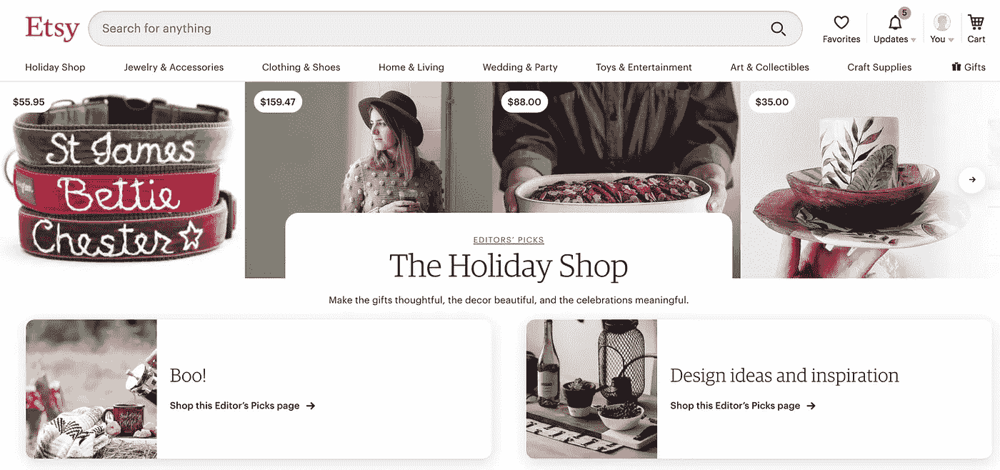
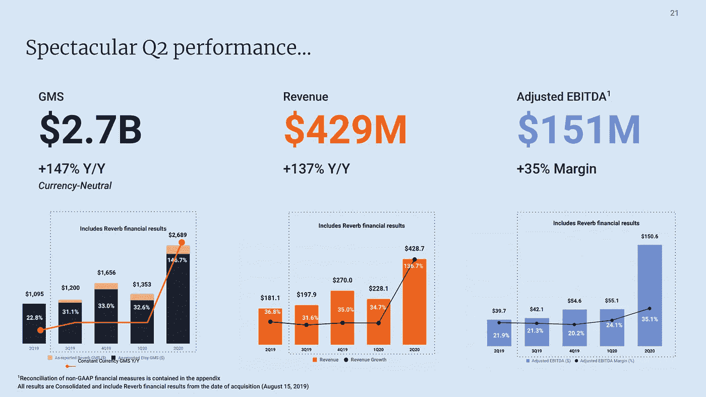
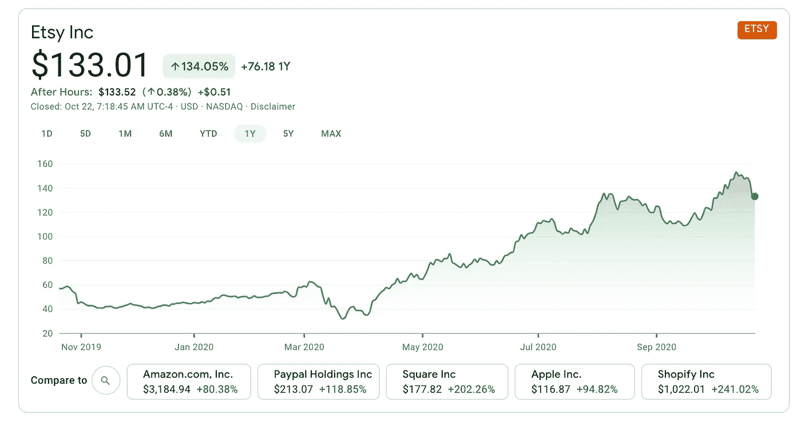

# Etsy 的投资理念

> 原文：<https://medium.datadriveninvestor.com/investing-ideas-on-etsy-83b83a8a05aa?source=collection_archive---------11----------------------->

## 疫情期间，消费者开始转向 Etsy

冠状病毒期间，消费者呆在家里，争相购买与 Covid 相关的物品、家居用品和家居装饰品。以下是我对 Etsy 的一些投资想法，因为它们在这个独特的时期成长壮大。

Etsy 是一个独特和创造性商品的在线市场。他们是因新冠肺炎疫情而受益和增长的公司之一，因为客户转向 Etsy 购买口罩和其他家居用品。我记得当疫情开始的时候，我需要一个面具。我的第一选择是亚马逊，但它们都卖完了，所以我去了我的第二选择——ETSY。自从我买了第一个面具后，我还买了其他东西，比如一个手工制作的非洲碗、俄勒冈州的空气植物和几个装饰性的花盆。我喜欢独特的手工制品，所以我和数百万使用 Etsy 的新顾客有很多选择。

> 我们“保持商业人性化”的使命植根于我们的信念，即尽管自动化和商品化是现代生活的一部分，但人类的创造力不能自动化，人类的联系不能商品化。-Etsy

# Etsy 的关键数据

*   活跃买家:6030 万(同比增长 41%)
*   活跃卖家:310 万(同比增长 35%)

# ETSY 收入增长

*   2017 年:4.412 亿美元
*   2018 年:6.037 亿美元
*   2019 年:8.188 亿美元
*   **2020 年估计:**。13-15 亿美元(这是我自己的估计)
*   2020 年的 Q2:4.287 亿美元

 [## 轻松投资颠覆性技术|数据驱动型投资者

### 研究并做好你的尽职调查，找出 10 个可能主宰未来行业的装袋者可能会很难。的…

www.datadriveninvestor.com](https://www.datadriveninvestor.com/2020/07/13/investing-in-disruptive-technology-made-easy/) 

Etsy 的收入正以极高的速度增长。从 2017 年到 2018 年，它们以 36.8%的速度增长。从 2018 年到 2019 年，Etsy 增长了 35.6%。对于 2020 年的 Q2，由于 COVID 期间需求的激增，Etsy 实现了 4.287 亿美元的收入。他们有可能在 2020 年实现超过 100%的收入增长，但这只是一个估计。我认为 Etsy 将有一个伟大的第三季度和第四季度以及所有新的买家和卖家的假期。

Image from Etsy investor relations

# 为什么是 Etsy？

在 Covid 之前，Etsy 的年增长率为 35-36%，令人印象深刻，因此它已经是一家快速增长的科技和电子商务公司。在疫情期间，消费者以更高的价格抢购医疗用品、口罩、家居用品和食品。人们越来越依赖电子商务和快递来获得他们需要的物品。Etsy 填补了一个空白，因为普通人可以制作面具并在 Etsy 上出售。这数百万新顾客将会回来购买更多与 Covid 相关的商品和节日礼物。

> *Etsy 是独特创意商品的全球市场。我们将全球几乎每个国家的数百万买家和卖家联系在一起，以利用商业的力量。我们的使命是“让商业人性化”*

# ETSY 股票

Etsy 股票在过去的 6 个月里表现非常好，上涨了 111%。在过去的 30 天里，该股在每股 110 美元至 153 美元之间波动。在我们为假日购物季做准备的时候，它显示出了强大的力量和势头。我拥有 Etsy 的股票和看涨期权，我认为随着越来越多的人依赖电子商务购物，它将是一家值得持有 2-3 年的好公司。

# 关于我

我在初创公司和大型企业的销售和市场营销岗位上工作了 8 年。我在高增长团队工作，向北美领先的公司销售软件。这些年来，我成为了一名优秀的员工，并去了各个办公室培训其他人如何销售软件和发展团队。现在，我是一名全职投资者、期权交易员和独立作家。我在追随 13 年前开始的投资热情。感谢你支持我作为一名作家的工作，我希望你能在我的研究、文章和观点中找到价值。

查看我的付费时事通讯，了解我的[精选股票:SCALE 89](https://jamescarter.substack.com/)

*披露:我拥有 ETSY 的股票和看涨期权。本文代表本人想法，非理财建议。*

## 获得专家观点— [订阅 DDI 英特尔](https://datadriveninvestor.com/ddi-intel)