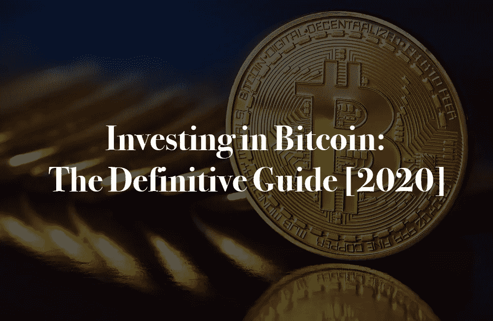
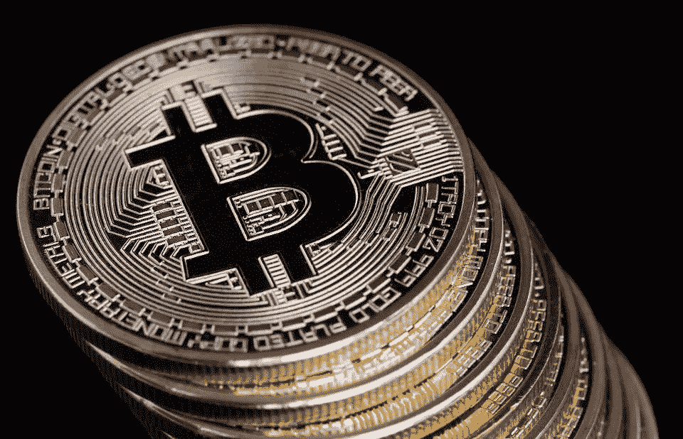
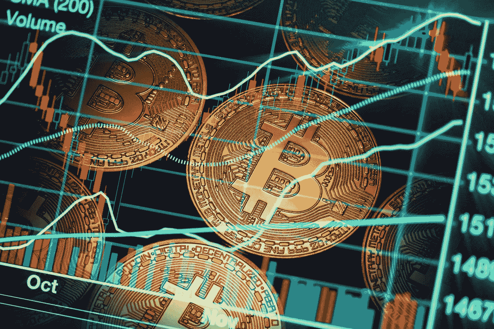
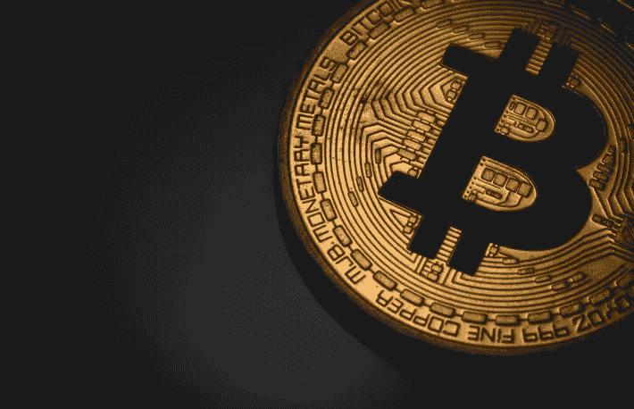
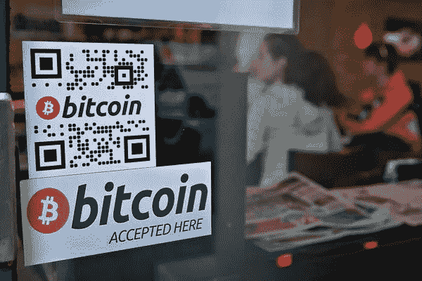
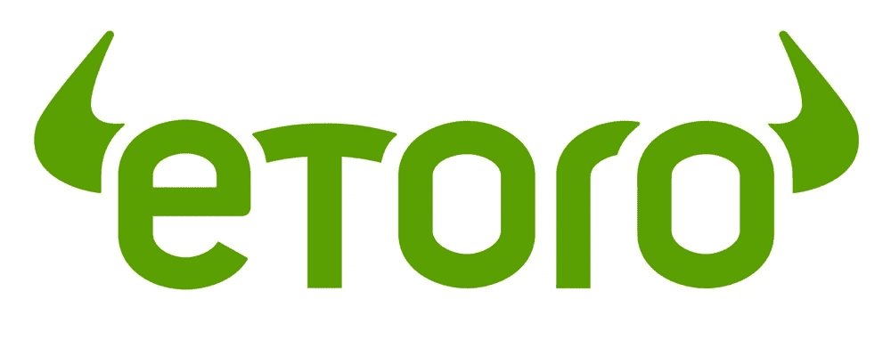
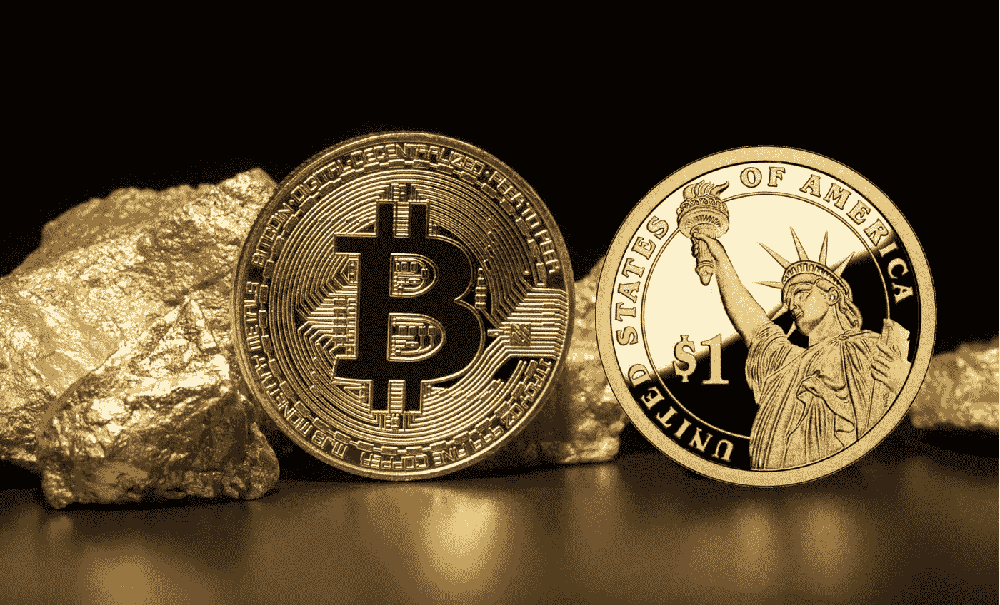

# 投资比特币:权威指南[2020]

> 原文：<https://medium.datadriveninvestor.com/investing-in-bitcoin-the-definitive-guide-2020-beb402116bb2?source=collection_archive---------24----------------------->

在过去十年里，投资比特币是最赚钱的金融活动之一，如果不是最赚钱的话。

有很多这样的故事，有人通过购买并持有比特币数年来卖出，赚了数百万美元，比买入时多了几百倍甚至几千倍。

虽然理论上这似乎很容易，但成功交易或投资比特币需要大量知识，这往往需要数年时间和许多学习曲线来完善。

对于那些有兴趣了解如何投资比特币的人来说，本指南将首先详细说明比特币是什么，然后继续研究比特币的工作原理。

 [## 总部位于瑞士的 ETP 进入加密交易市场|数据驱动的投资者

### 虽然金融市场几乎没有沉闷的时刻，特别是在引入…

www.datadriveninvestor.com](https://www.datadriveninvestor.com/2019/03/10/swiss-based-etp-enters-the-crypto-trading-market/) 

接下来，我们将看看投资比特币的一些策略，以及 2020 年在[进行比特币在线交易的一些最佳地点](https://primexbt.com)。我们开始吧！

# 比特币是什么？

## 比特币的诞生

[比特币](https://bitcoin.org)是世界上第一种也是领先的数字货币，自 2008 年诞生以来，比特币的价值、被采用的程度以及在主流社会的影响力都在不断增长。

在比特币白皮书发布几个月后，一个名为中本聪的匿名组织或个人于 2009 年初推出了比特币。

第一笔比特币交易存储在比特币区块链的第一个区块，即创世纪区块。

虽然今天比特币价值数十亿美元，但当比特币首次推出时，只有极少数人知道它，他们大多由计算机科学家、密码学家和数字无政府主义者组成。

随着时间的推移，越来越多的人听说了比特币，它逐渐成长，随着这一切的发生，它的价值急剧增加。

随着时间的推移，投资比特币可能带来的利润导致越来越多的人参与进来，如今比特币是世界上最受关注的新技术之一。

## 什么是共识？

共识是所有[加密货币](https://coinmarketcap.com)为了成功必须达到的一种状态。

与普通货币不同，加密货币不是由一个中央团体或机构管理，而是运行比特币网络的计算机是分散的。

这意味着运行比特币网络的代码，以及所有交易的记录，会同时存储在数千台电脑上。

这些计算机中的每一台都可以与网络的其余部分进行通信，为了让比特币网络正常运行，每一笔交易记录都必须与所有其他计算机上存储的记录相匹配——这种状态称为共识。

比特币的共识机制被称为“工作证明”，尽管还有许多其他机制，但另一种主要机制被称为“利益证明”

## 比特币怎么用？

比特币可以用于各种各样的金融活动，随着它的普及，人们使用比特币的方式也越来越多。

最初的两个主要用途是投机和作为暗网的货币。

由于比特币的价值上下波动，人们一直参与比特币交易，以产生利润。暗网长期以来一直是比特币的家园，在比特币生命的早期，大多数比特币交易都是在暗网上进行的。

然而，如今每天转移的比特币总量中，只有一小部分与非法商品交易有关。

如今，新的用途更加普遍，例如国际汇款，这是使用银行、西联汇款(Western Union)和贝宝(Paypal)进行日常交易的一种替代方式，也是在受限情况下向组织提供资金的一种方式。

# 比特币是如何运作的？

## 区块链技术

[区块链](https://blockchain.com)是一项神奇的技术，它让比特币发挥作用，并为加密货币提供了生存所需的工具，而此前许多数字货币的尝试都失败了。

区块链基本上是一种数据结构，其中带有时间戳的事务组被链接在一起，每组事务被称为一个块。

将每个数据块安全地链接到前一个数据块的方法是使用加密技术，使用一种称为哈希函数的东西，将前一个数据块中的所有数据转换为一长串字母和数字。

生成的字符串随后存储在下一个块中，如果在此之前的任何块中的任何数据发生了更改，则前一个块的哈希将生成一个与存储的字符串不同的字符串，这使得快速检查区块链是否被篡改变得很简单。

## 采用率的增长

随着时间的推移，比特币网络的用户、用于证明工作的哈希能力、处理的交易数量以及单个比特币和所有现有比特币的总价值都在持续增长。

聪明的是，比特币的设计考虑到了这一点。从算法上来说，比特币网络确保了随着时间的推移，其价值将会增长。

影响这一点的机制是比特币的价值不可避免地增长，因为比特币的使用会爆炸，而其供应会保持稳定，还有一种称为 halvening 的通缩机制。

减半是一个过程，在工作证明期间，每 4 年赢得一个区块时释放的比特币数量减半。

目前，奖励金额为每块 12.5BTC，从 50BTC 开始，此后在 2012 年和 2016 年已经减半。

## 使用比特币的好处\

使用比特币有广泛的好处，这一点在它的持续增长中显而易见，不仅作为一种投机工具，而且在比特币区块链而不是传统金融机构进行的金融交易量中也是如此。

使用比特币的主要好处是伪匿名、支付更便宜、支付更快，以及任何人都可以自由使用比特币。

虽然使用比特币不是完全匿名的，但它是伪匿名的，这意味着使用网络不需要姓名、出生日期或地址等信息。

使用比特币进行转账比使用贝宝(Paypal)和西联汇款(Western Union)等支付处理器便宜得多，国际转账也比银行快得多。

最后，任何人都可以使用比特币，世界上没有任何政府可以阻止你这样做。

# 买卖比特币最好的地方有哪些？

## PrimeXBT

PrimeXBT 是全球领先的多资产保证金交易平台，其增长速度超过了老牌平台，后者未能适应 2020 年交易者更复杂的需求。

自 2017 年推出以来，直到今天，PrimeXBT 一直将自己定位为一些直到最近还主导市场的其他交易所的现代、技术领先版本。

通过拥有每秒可执行高达 12，000 笔交易的强大交易引擎，然后额外提供[行业领先的保证金交易](https://primexbt.com/trade-bitcoin-with-leverage)和杠杆率，PrimeXBT 现在已经发展到每天管理高达 9.5 亿美元的交易量。

在加密资产上，交易员享有高达 100 倍的杠杆率，这是目前最高的杠杆率，而在一系列传统资产上，包括股票指数、外汇对、大宗商品和金属交易员享有高达 500 倍的杠杆率。

先进的图表技术，包括完全可定制的小部件和多显示器支持，以及一些业界最高质量的安全功能。

PrimeXBT 还通过[费用](https://primexbt.com/fees)削弱了市场，这是我们见过的最低费用，在所有交易和所有资产类别中仅为 0.05%。

## 币安

[币安](https://binance.com)是市场上最知名的加密货币交易所之一，一直致力于保持其曝光率，并在加密货币交易者和他们之间建立双向对话。

这主要是通过他们的首席执行官通过他们的社交媒体渠道发送定期和持续的消息来实现的，这已经成为他们成长的有效工具。

除此之外，币安创造了他们自己的本土加密货币，称为币安硬币或简称 BNB，交易者使用这种令牌来降低他们在网站上交易的费用，最高可降低 25%。

虽然 25%是一个不错的折扣，但值得注意的是，币安的费用开始时明显高于其他交易所，一个很好的例子是，即使 BNB 币安的费用减少了 25%，但仍然是 PrimeXBT 的 10 倍，这是我们发现的最便宜的平台。

对于交易者来说，这可能是一个重要的考虑因素，老实说，考虑到支付更高的费用所带来的长期利润损失，这也是一个重要的考虑因素。

然而，虽然有这个缺点，也有一些其他的积极因素要考虑。

币安是这一领域的创新者，一直致力于推出分散式交易所，以取代集中式交易所。除此之外，币安发射台是 IEO 领先的发射台之一，许多表现最好的 ieo 都从这里开始。

## eToro

[eToro](https://etoro.com) 是历史最悠久的面向零售市场的在线交易平台之一，于 2006 年在以色列推出，自那以来一直是最知名的传统交易平台之一。

eToro 通过在网上开展大规模的广告活动而变得像今天一样知名，eToro 的营销能力基于他们所看到的成功是显而易见的。

多年来，eToro 专注于为股票和外汇等传统资产提供交易解决方案，并回避加密货币。

然而，近年来，eToro 已经清楚地认识到成为即将到来的加密浪潮中不可或缺的一部分的重要性，他们已经努力将一系列加密资产添加到他们的列表中。

这个平台本身设计得很好，对于初学者来说很容易使用，导航也很直观。eToro 背后的技术也是最好的，交易是可靠的。

eToro 的垮台是他们向交易者收取的高额费用——高于 PrimeXBT 和币安，远远超出了我们认为的经济、物有所值的选择。

不幸的是，与加密货币交易平台相比，这反映了传统交易世界中通常存在的较高费用。

# 有哪些最好的比特币投资策略？

## 按购入证券的美元价格平均计算法

美元成本平均(DCA)是定期购买加密的过程，目的是将总成本分散到一系列购买价格中，以防止波动。

在正常情况下，一项投资可能是在一次购买中进行的，而在 DCA 中，要投资的总资金可以分成。

然后，在接下来的 4 个月中的每个月的第一天，可以购买该数量的密码，这意味着将有 4 个单独的资产购买价格。

如果市场不稳定，或者是熊市，那么通过逐步买入，每一次连续买入都更有可能接近底部。

当一些购买可能净损失或只有小收益时，一些购买也可能处于趋势的绝对底部，他们将最大化潜在的利润。

## 霍德林

加密行业最著名的口号之一是术语“hodling”，这是对“holding”一词的修改，意思是购买并长期持有一定数量的加密货币。

由于比特币随着时间的推移不断大幅升值，最有利可图的策略之一实际上是简单地购买比特币并持有数年。

这样做的好处是不必对每个趋势变化都做出反应，就像那些众所周知必须应对巨大压力的交易者一样。

霍德勒从长远考虑，购买比特币，因为他们真的相信比特币未来的价值会比现在高得多。

随着下一轮大牛市正在形成，现在是投资比特币的最佳时机。

# 比特币的未来会怎样？

今天的比特币看起来和以往一样强大，过去几年的一个主要发展是，现在比特币真的开始向主流迈出重要的步伐。

随着比特币价格的每一次下跌，它不仅在用户数量和曝光率上有所增长，或许最重要的是，在合法性上也有所增长。

随着时间的推移，质疑比特币是否只是一个不可避免会失败的骗局的声音越来越少，而质疑比特币在未来全球商业中将扮演何种角色的声音越来越多。

比特币无疑是当今最令人兴奋的可交易金融资产，越来越多的传统金融市场看到了这一领域风险的降低和机会的增加。

虽然比特币在金融领域的重要性越来越大，但这也反映在许多其他领域，如学术界、在线零售和主流社会。

# 总之:投资比特币

正如我们所见，投资比特币有很多因素，但要记住的最重要的一点是，投资者对比特币背后的市场和技术了解得越多，产生巨额利润的机会就越大。

比特币诞生于 10 多年前，在那段时间里，它从一项被广泛误解的边缘技术发展成为如今世界上许多顶尖大学教授的课程。

比特币的价值来自它提供独特解决方案的多种不同方式，以及支撑比特币网络区块链的技术的稳健性。

虽然有许多在线投资比特币的平台，但最好和最差的平台之间有很大的差异，我们上面提到的平台绝对是买卖比特币的最佳平台。

如今，比特币看起来比以往任何时候都更强大，未来几年，比特币将以前所未有的方式闯入主流。