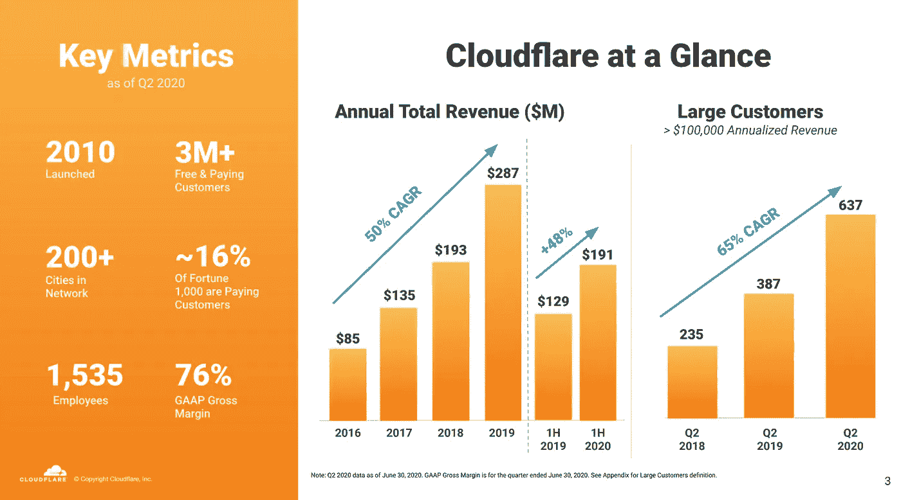
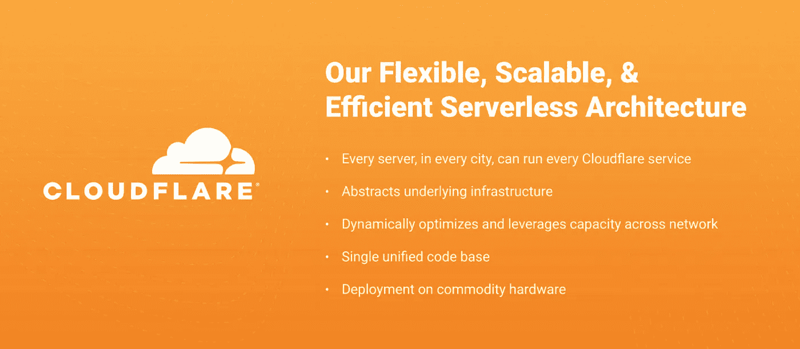

# 投资 Cloudflare(网络)

> 原文：<https://medium.datadriveninvestor.com/investing-in-cloudflare-net-e88a284f4afb?source=collection_archive---------11----------------------->

## 你可以投资互联网的未来

Source: Cloudflare Website

Cloudflare 正在庆祝它成为一家具有前瞻性思维的互联网公司的第十个年头。他们正在迅速扩张，这家小型科技公司正成长为投资者眼中的大盘股。这家公司仍然不为人知，大多数人从未听说过 Cloudflare。我分析了我投资 Cloudflare 的一些原因。

Cloudflare 是一家专注于 web 基础架构、网站安全和网络安全的技术公司。他们位于旧金山，拥有大约 1700 名员工。他们的主要关注点是内容交付网络和互联网安全，但他们正在向边缘云和更多安全领域扩展。Cloudflare 已经获得了来自《福布斯》、《快速公司》和《创业家》的多项[奖项，例如“最值得关注的初创公司”和“最具创新力的公司”。然而，他们不仅仅是一家值得关注的公司，他们应该在一个专注于科技或安全的投资组合中占有一席之地。](https://www.cloudflare.com/press-awards/)

Image Source: Cloudflare Investors Relations

# Cloudflare 收入增长

*   2016 年:8500 万美元
*   2017 年:1.35 亿美元
*   2018 年:1.93 亿美元
*   2019 年:2.87 亿美元
*   [2020 年预计](https://cloudflare.net/news/news-details/2020/Cloudflare-Announces-Second-Quarter-2020-Financial-Results/default.aspx):营收 4.04 亿至 4.08 亿美元

Cloudflare 的收入每年持续增长 45–50%。这种增长正是高增长投资者所寻求的。由于 Cloudflare 正以这种速度增长，这使他们有更好的机会超越大型科技公司、ETF 和许多跟踪市场的大型基金。

你可以在这里注册[我的高级电子邮件](https://jamescarter.substack.com/)！

 [## 这么说一家大型风投基金正在投资你的初创公司？4 实际考虑|数据驱动的投资者

### 首先，恭喜你。融资总是需要努力的，一个大的风险投资基金当然是一个大的…

www.datadriveninvestor.com](https://www.datadriveninvestor.com/2020/08/09/so-a-big-vc-fund-is-investing-in-your-startup-4-practical-considerations/) 

# 关于 Cloudflare 的更多信息

Cloudflare 创造了让互联网更智能、更快速、更安全的产品。他们的产品面向互联网基础设施、应用、网络安全和开发人员。示例不包括:DDoS 保护、内容交付网络和负载平衡。这些产品有助于应用程序和网站安全运行，因此您可以从中受益。它们还有助于防止网络安全攻击，因此当您登录或使用应用程序时，您的数据是安全的。Cloudflare 拥有超过 96，000 名付费客户，其中 637 人每年的支出超过 100，000 美元。他们拥有财富 1000 强中约 16%的付费客户，拥有巨大的发展空间。

Image Source: Cloudflare Investor Relations

# Cloudflare 正在招聘

Cloudflare 发展迅速，正在全球范围内扩张。他们在自己的网站上招聘 200 多个技术和商业职位。他们正在欧洲和亚洲招聘职位，因此他们正在大力扩张，为投资者创造新的收入。对于一家中型科技公司来说，这是一个很好的信号，他们的国际扩张是如此重要！

# Cloudflare 股票

在过去的 6 个月里，Cloudflare(纽约证券交易所代码:NET)的股价一直在 23-43 美元之间波动。截至 2020 年 9 月下旬，在每股 40 美元左右。由于 Cloudflare 正在全球快速增长和扩张，我对未来 12 个月的目标价是 52 美元以上。

# 支持我的工作

感谢您阅读这篇关于 Cloudflare 的文章。你可以[支持我的工作](https://jamescarter.substack.com/)并在 Substack 这里注册我的高级邮件:【https://jamescarter.substack.com/ 

*披露:我拥有 Cloudflare (NET)的股票和看涨期权。本文不是投资建议。*

## 访问专家视图— [订阅 DDI 英特尔](https://datadriveninvestor.com/ddi-intel)