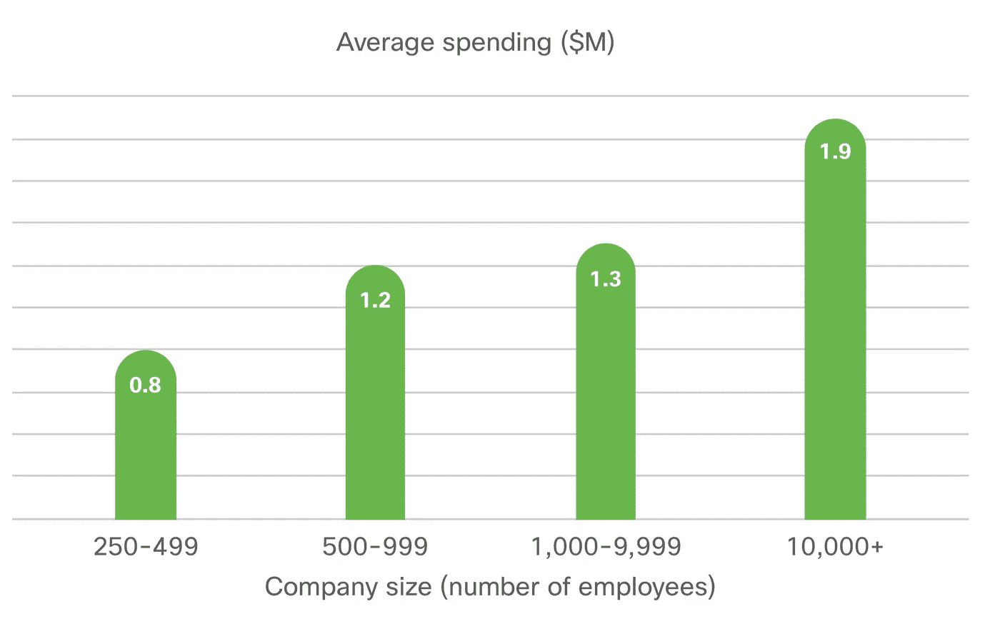

# 投资数据隐私会带来积极的回报

> 原文：<https://medium.datadriveninvestor.com/investing-in-data-privacy-brings-positive-returns-1c44e3728e72?source=collection_archive---------10----------------------->

## 思科的新研究显示，公司在数据隐私方面的投资取得了积极成果。

Source: Cisco 2020, Data Privacy Benchmark Study

随着消费者越来越意识到他们的个人数据的价值，各国正在实施他们的数据隐私法规，我们已经阅读了很多关于企业努力应对这一问题的报道，因为他们不得不将大量的金钱、时间和资源投入到他们的数据隐私议程中。

到目前为止，很少有关于投资回报(ROI)和这些隐私投资的影响的研究，主要是因为还没有太多时间来衡量结果。

 [## 算法交易的机器学习|数据驱动的投资者

### 当你的一个朋友在脸书上传你的新海滩照，平台建议给你的脸加上标签，这是…

www.datadriveninvestor.com](https://www.datadriveninvestor.com/2019/01/30/machine-learning-for-stock-market-investing/) 

在 2020 年的三年里，思科采访了全球数千家企业，以评估隐私投资的影响——除了满足合规要求——他们得出了一些有趣的发现。

但是首先，让我们把背景搞清楚:

# 企业向数据隐私锅里扔了多少钱？

**$ 120 万！**这是所有受访者的年均隐私支出，而 25%的受访者支出高达 50 万美元，14%的受访者超过 2M (2%的受访者支出超过 500 万美元)。如下表所示，投资金额也因公司规模的不同而有很大差异。

Source: Cisco 2020, Data Privacy Benchmark Study

考虑到没有很多最佳实践和行业经验可供公司评估结果，这是一个相当大的数目。截至 2020 年，隐私投资被广泛认为是避免罚款的预防性措施。

# **结果如何？**

除了合规性，思科还调查了对企业是否有任何其他重大的积极影响。事实证明，一般来说，超过 70%的人看到了“重大”或“非常重大”的积极业务影响。

72%的受访者表示他们在通过数据控制实现运营效率方面取得了显著进步，74%的受访者表示在建立客户忠诚度和信任度方面也取得了显著进步。

在财务方面，调查受访者估计其平均效益为 270 万美元，平均效益支出比为 2.7。

> **这意味着每花 1 美元，他们就能获得价值 2.7 美元的收益。还不算太糟糕的交易！**

但是:在平均值之外，并不是每家公司都是赢家。大约 8%的人说他们在隐私投资上有所损失，相当大一部分人(33%)说他们不亏不赚。

不幸的是，该报告没有进一步探究到底是什么让一些隐私投资比其他投资更成功。然而，他们确实在投资金额和隐私回报之间画了一条平行线。那些比他们的同伴投入更多资金的公司，平均来说也获得了更大的收益。

# **公司改变对隐私投资的看法**

在过去的 3 年中，思科一直在进行这项调查，以获得见解并跟踪对隐私投资价值的看法变化。非常引人注目的是，表示他们看到隐私投资相关重大好处(如竞争优势和组织灵活性)的受访者比例去年为 40%，而今年为 70%。

这种急剧增长的部分原因可能是，公司能够更好地评估他们的投资回报率，因为许多好处似乎是长期的，而不是短期的。

尽管大多数企业认识到了投资回报率，但这似乎与他们对 GDPR 等法规的准备程度没有直接关系。比较去年和今年的回答，他们似乎几乎相同，其中 55%的人说他们准备好了，29%的人说他们将在一年内准备好，12%的人预计将在一年多后准备好，3%的人说 GDPR 不适用于他们。

该报告认为，这要么意味着企业在过去一年没有取得重大进展，要么意味着企业将 GDPR 视为其业务运营的一部分。

后者似乎有点奇怪。为了成功遵守 GDPR 等法规，它需要成为业务运营的一部分。因此，一家为 GDPR 做好准备的公司已经成功地在日常工作中实施了一些流程，从而保持了领先地位。

# 概括起来

思科的《2020 年数据隐私基准研究》分享了一些关于企业如何从其隐私工作中受益的有趣见解和知识。对于任何需要让董事会相信隐私投资的价值或从总体上对数据隐私提出令人信服的理由的人来说，这份报告是一个很好的来源，因为它显示了经历过这一过程的公司的好处。

思科可以更详细地介绍不同公司如何处理数据隐私以取得成功，以及这两者之间是否有任何关联，但也许这是他们将来会分享的东西，因为这份报告是他们网络安全系列的一部分。

如果你喜欢阅读完整的报告，可以在这里免费下载。

**需要根据隐私法规管理数据隐私？**查看 [**Palqee**](https://www.palqee.com/) 的数据隐私管理软件。