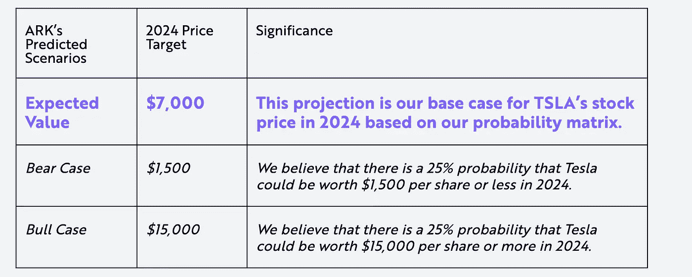
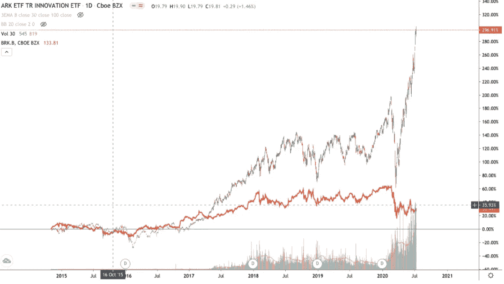
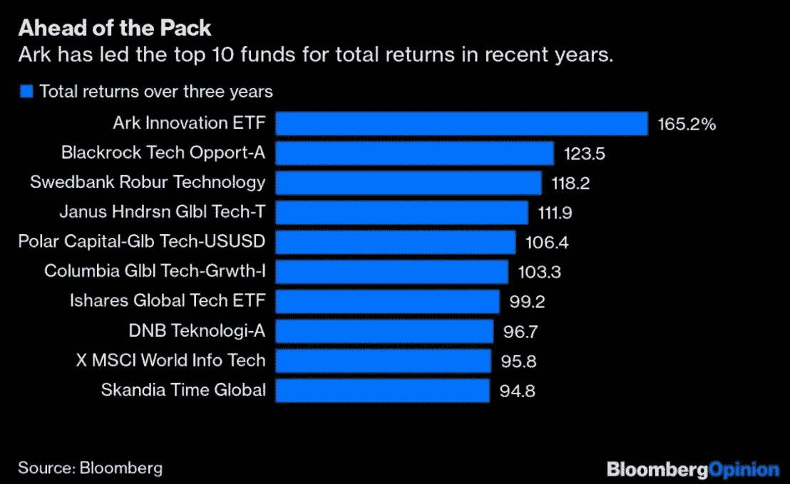
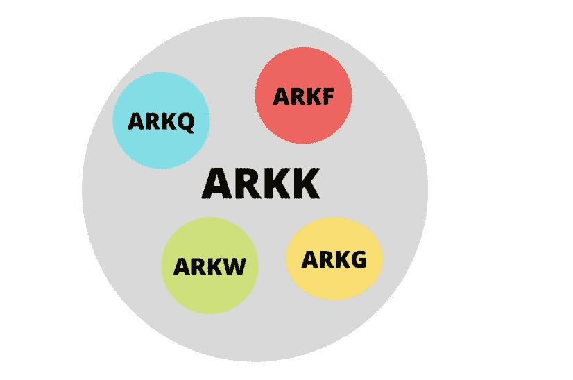
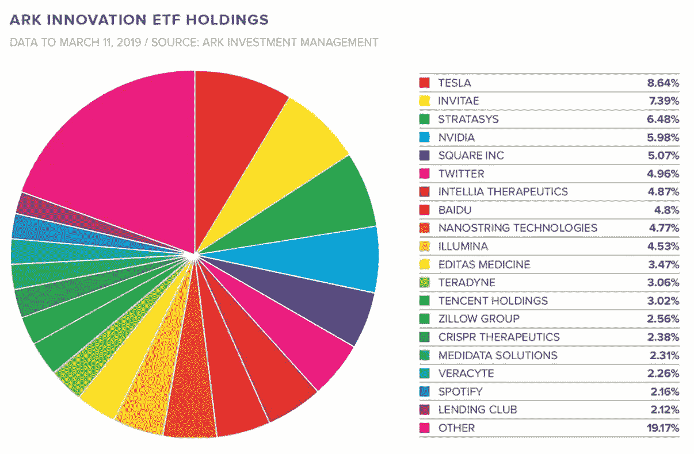

# 投资颠覆性技术变得简单

> 原文：<https://medium.datadriveninvestor.com/investing-in-disruptive-technology-made-easy-data-driven-investor-d68fe101a600?source=collection_archive---------4----------------------->

研究并做好你的尽职调查，找出 10 个可能主宰未来行业的装袋者可能会很难。现在主导指数的科技巨头永远不会用传统的估值标准来识别。要想尽早发现真正的异常值，投资者需要在大盘发现它之前有足够的信心。对个人投资者来说，通过预测未来增长和估值来挑选赢家可能有风险。但还是有办法解决的。

# 进入方舟投资

如果你没有时间在识别处于早期阶段的行业颠覆性公司之前进行令人费解的研究，Ark invest 有一个免费的开源研究生态系统和一系列创新的 ETF 可供选择。Ark 与传统的基金经理完全不同，它只专注于投资有可能跨越多个行业的颠覆性创新。这样做，它寻求大量投资于行业领导者及其在价值链中的受益者。

*Evolution of disruptive technology over the last few centuries*

# 排除万难

"除非你做一些与大多数人不同的事情，否则不可能产生卓越的业绩."—约翰·邓普顿

Ark 的主动投资 ETF 通过忽略噪音和短期价格波动体现了这一点。相反，他们关注的是仍被市场低估的增长机会。声称自己是一个反向投资者，并认为当街上血流成河时你会投资，说起来容易做起来难。这些书让这看起来很容易，但实际上经历这种经历本身就是一种全新的现象。ARK 无所畏惧，专门投资那些违背所有传统标准和信念的公司。

 [## 轻松投资颠覆性技术|数据驱动型投资者

### 研究并做好你的尽职调查，找出 10 个可能主宰未来行业的装袋者可能会很难。的…

www.datadriveninvestor.com](https://www.datadriveninvestor.com/2020/07/13/investing-in-disruptive-technology-made-easy/) 

正如埃隆所说，“假设你总是错的，你的目标是明天少错一些”。有时候，为了每天少犯错，你必须主动寻找与传统观念相矛盾的信息。

最好的例子就是他们对泰斯拉(TSLA)的信任。特斯拉是市场历史上被卖空最多的股票，面临 200 亿美元的空头利息。Ark 认为特斯拉被低估，目标价为 7000 美元。这一估值的关键原因包括资本效率、自主能力和赖特定律所导致的毛利率下降。由于 twitter 和围绕它的大肆宣传，特斯拉是一只高度不稳定的股票。方舟公司充分利用这种市场的低效率，进行适当的买卖。

*Tesla Valuation of $7000\. Conservative?*

标新立异是新常态。

# 集中创造财富，多样化保存财富

Ark 在他们认为对未来影响最大的股票上投资很大。尽管是持有多种头寸的 ETF，但它受到积极的管理和再平衡，以实现优异的表现。方舟投资的大部分改变游戏规则的行业相对于其他行业来说还处于起步阶段。为群众解决问题，就创造了财富。创新型公司解决这些问题，并推动世界在生产力、可持续性和生活质量方面取得进一步的进步。这提供了一个巨大的上升潜力，无法使用传统的指标量化。

与许多其他基金不同，它利用了一个开放的研究生态系统，其中包括各个行业的顶级分析师的研究。这使得投资者在建立自己的信念之前，能够了解 ARK 的思维过程和见解。此外，在专注于个股之前，它能让新的想法从其他来源流出。

Ark invest 使用自上而下的研究系统来识别机会，然后使用自下而上的研究系统来选择他们的股票并进行适当的估值。对于大多数投资者来说，颠覆性技术可能难以理解和领会，因此分解重要的概念并有意义地将其分解以形成投资论点可能需要很长时间。Ark invest 的免费研究是了解最新技术并产生新想法和新思想的最佳方式之一。

唯一令人担忧的是方舟投资公司持有的公司的波动性，但从长远来看，加上对管理团队的信任，波动性的影响可以最小化。Ark invest ETF 可以用作被动指数股票投资组合的 X 因素。

# 游戏中的皮肤

Ark invest 的 Cathie Wood 是 2020 年疫情期间强调在危机中投资未来重要性的孤独声音之一。

在加入 Ark 之前，她在 Alliance Bernstein 工作了 12 年多，担任全球主题战略首席信息官，管理着超过 50 亿美元的资金。她还曾担任 Jennison Associates LLC 的首席经济学家、股票研究分析师、投资组合经理和董事。

她在那段时间对投资哲学的乐观和信念是任何投资者需要听到的唯一声音。尽管投资于颠覆性技术，她的长期愿景依然不可动摇。

# 卓越的性能

价值投资失去的几十年加速了 Ark 等高度集中的成长型基金的表现。最近的疫情是这类基金的完美风暴，极大地加速了全球某些技术和社会趋势。远程医疗、金融科技、物联网和电子商务等等。

*ARK invest outperformed Berkshire Hathaway since its inception. The red line graph denotes BRK.B performance*

伯克希尔·哈撒韦公司(BRK。b)是上个世纪最成功的投资故事。然而，自 2014 年成立以来，Ark 的表现明显优于伯克希尔。想象一下，如果你能回到几十年前，在伯克希尔早期投资。与伯克希尔类似，Ark invest 不支付股息，只专注于通过集中投资组合以高增长率获得复利回报。

*ARK invest has significantly outperformed every other fund*

Ark Innovation ETF 在过去几年中还在全球股票市场上主导了其他 584 只资产超过 10 亿美元的基金。

# 主题和顺风

*Disruptive sector themed ETF’s*

虽然主要的 ETF 是 Ark Innovation(ARKK)，但他们也管理他们相信未来的其他行业 ETF。简单地说，ARKK 基本上是由其他部门 ETF 组成的 ETF。所有交易所交易基金的费用率为 0.75%。

## *1。方舟颠覆性创新(ARKK)*

*   基因组革命，工业创新，下一代互联网，金融科技创新。
*   主要持股:特斯拉(TSLA) 11.6%，英伟达(NVTA) 8.89%，Square 8.1%
*   当前价格:80.89 美元

*Ark innovation ETF holdings*

## 2.*自主科技与机器人(ARKQ)*

*   自主运输、机器人和自动化、3D 打印、能量存储、太空探索
*   主要持股:特斯拉(TSLA) 16.2%，2U 公司 8.2%，赛灵思公司 6.3%
*   当前价格:51.17 美元

## 3.*下一代互联网(ARKW)*

*   云计算和网络安全、电子商务、大数据和人工智能、移动技术和物联网、社交平台、区块链和 P2P
*   主要持股:特斯拉(TSLA) 11.6%，Square 8.6%，Roku 6.7%
*   当前价格:97.36 美元

## 4.*金融科技创新(ARKF)*

*   交易创新、区块链技术、风险转换、无摩擦融资平台、面向客户的平台、新中介
*   主要持股:Square 12.1%，Mercadolibre(MELI) 5.36%，腾讯 4.73%
*   当前价格:34.99 美元

## 5.*基因组革命(ARKG)*

*   CRISPR、靶向治疗、生物信息学、分子诊断学、干细胞、农业生物学
*   Invitae 公司(NVTA) 12.1%，Crispr 治疗公司(CRSP) 11.1%，Illumina 公司 6.3%
*   当前价格:55.72 美元

> *“传统的投资策略通常不会对颠覆性创新进行正确定价，因为人们可能不知道最终的机会有多大。他们没有估计机会，也没有分析中断。”——方舟投资公司创始人兼首席信息官 Catherine d . Wood*

*免责声明:我目前尚未持有任何 ARK ETF。*

## 参考

*雅虎财经。2020.凯西·伍德，你从未听说过的最佳投资者。【在线】可在*[*https://finance . Yahoo . com/news/cathie-wood-best-investor-ve-100012431 . html*](https://finance.yahoo.com/news/cathie-wood-best-investor-ve-100012431.html)

*特斯拉价格目标:特斯拉未来五年(2020 年)的潜在轨迹。可在:*[*https://ark-invest.com/analyst-research/tesla-price-target.*](https://ark-invest.com/analyst-research/tesla-price-target.)*方舟投资|我们相信创新是增长的关键(2020)。可在:*[*https://ark-invest.com 买到。*](https://ark-invest.com.)

*ARKK 股票价格和图表— AMEX: ARKK — TradingView (2020)。可在:*[*https://www.tradingview.com/symbols/AMEX-ARKK/*](https://www.tradingview.com/symbols/AMEX-ARKK/)

*黄，V. (2020)“我的朋友们以为我要失败了”:凯茜·伍德在下水方舟上，可在*[*https://city wire USA . com/professional-buyer/news/My-friends-thought-I-was-to-fail-Cathie-Wood-on-launching-Ark/a 1210917*](https://citywireusa.com/professional-buyer/news/my-friends-thought-i-was-going-to-fail-cathie-wood-on-launching-ark/a1210917)

*原载于 2020 年 7 月 13 日 https://www.datadriveninvestor.com***。**

***访问专家视图—** [**订阅 DDI 英特尔**](https://datadriveninvestor.com/ddi-intel)*