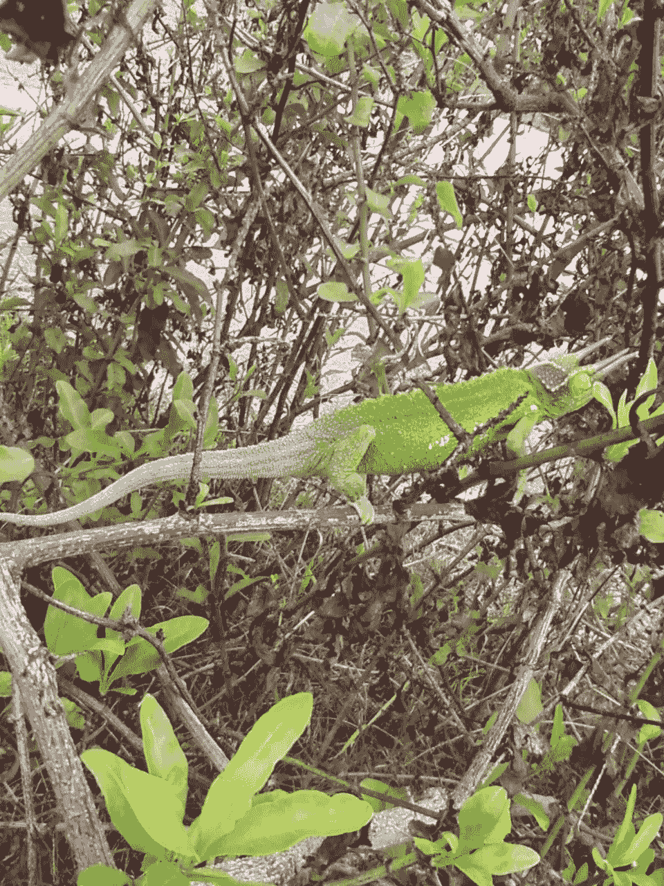

# 投资实验室平板肉

> 原文：<https://medium.datadriveninvestor.com/investing-in-lab-slab-meat-29acccc9bca4?source=collection_archive---------11----------------------->

新冠肺炎疫情提醒越来越多的人注意食肉的危险，但更安全的市场即将出现。

Lab meat protects biodiversity, Christyl Rivers

## 制作更好的肉

对人类来说，肉类加工厂现在是个危险的地方。此外，还有一个严峻的现实，气候变化正在肆虐，栖息地越来越少，牲畜污染越来越严重。事实上，新冠肺炎来自我们人类最糟糕的饮食习惯，这也是事实。

同样值得注意的是，越来越多的人意识到食物本身是一种商品，需要感到安全、可靠、无污染和无疾病，并且对人和动物都不那么残忍。

投资肉类替代品似乎是前所未有的好时机。

但是，在地平线上的是真正的肉，一种从提取的动物细胞实验室培养的替代物，而不是拥挤在集中饲养场的牛。鉴于我们目前看到的现状食品供应的所有问题，改善来源似乎是显而易见的。

 [## 投资区块链前要问的三个简单问题(也是一个困难的问题)|数据…

### 现在是了解区块链的最佳时机。不同货币之间的增长率，比如…

www.datadriveninvestor.com](https://www.datadriveninvestor.com/2020/03/12/three-simple-questions-and-one-difficult-one-to-ask-before-investing-in-a-blockchain/) 

显而易见，新冠肺炎疫情提醒越来越多的人注意食肉的危害。纳税人真的想补贴一个工人、消费者、工会和环保主义者都认为落后和残酷的行业吗？

似乎从来没有一个更好的时机来投资清洁肉类。

干净的肉，或实验室培育的肉，将在五十年后成为现实——假设到那时我们没有根除一个支持性的生物圈——但目前，这并不划算。

在后疫情时代，这种情况将会彻底改变。

实验室培育的肉不是通过大型饲养场或家禽工厂化农场的饲养、喂养、圈养和处理污染物而产生的。取而代之的是，从一种可能快乐得多的动物身上提取细胞，在培养皿或大缸中培养，然后在制造工厂中通过细胞繁殖的自然方式生长。

这对消费者很有吸引力:没有疯牛病。无污染。没有栖息地破坏。不浪费。没有抗体抗性发展。不残忍。屠宰场没有可怕的工作条件。工人不需要工会？这还有待观察。

## 不杀鸟，一举两得

这表明，抓住正确时机的投资者将成为巨大解决方案的一部分，同时解决粮食生产的最大问题。

这对所有人来说都是双赢的，一旦规模扩大到全规模经营，有望大幅降低肉类生产的成本。

这是一个大订单，但目前的危机将推动许多改革。

目前，清洁肉食要在餐桌上找到自己的位置，需要大量的工程、生物技术专业知识、资金和公众支持。

然而，清洁肉类的好处目前正在被重新仔细地研究。

人们对贩运野生动物肉的想法并不感到兴奋，也不支持像中国武汉那样的公共市场，武汉释放了新冠肺炎。

我们大多数人不吃野生动物，但我们吃家养动物。牛、猪、羊、鸡、鸭、马等等都进入了我们的食物供应。这些动物中的每一种都携带着病毒、细菌、真菌和/或抗生素，它们会扰乱我们人类的生活和健康。然后是栖息地和污染问题。

例如，去年亚马逊河被烧毁不是为了好玩，而是为了给牧场主让路。

人们真的希望雨林成为碳汇、美丽的栖息地和奇异的生态系统。

## 文化趋势

大多数人偏爱动物作为共同的地球人，也更喜欢没有残忍的替代品。近年来，除了肉类，不可能的汉堡，博卡汉堡和晨星品牌人气飙升。还有很多其他的。很多都值得投资考虑。

似乎每一种大豆、豆类、坚果和其他食品都在公共市场上找到了它们进入许多饥饿的人口的途径。

虽然已经过了几十年，但公众对肉类替代品的热情正在快速增长。

然而，许多人仍然渴望真正的肉。真正的牛肉、鸡肉、火鸡等等，是许多人仍然需要烹饪杰作的一些肉类，或者对我们大多数人来说，是我们的薯条快餐。

然后是世界上的灵活主义者。这个类别包括我的家庭成员。我们有时吃肉，但不吃猪肉。我会吃牛肉，但不吃小牛肉。我不吃羊肉。这部老电影中有一只小羊羔的天真无邪，让数百万人渴望另一种选择。

这是一个普遍的、未开发的市场。我们大多数人都喜欢煎饼配培根，但目前我们不喜欢它的来源。

这种巨大的替代性社会变革在当前危机之前很久就已经开始了。疫情危机提醒人们注意许多新的现实，食品供应链、肉类加工厂的工作条件、新的安全社会距离要求、可靠分销的需要以及对未来流行病的担忧，特别是动物源性疾病。

投资肉类替代品，或者更好地投资实验室培育的真正肉类，目前需要做大量的功课。现在几乎没有公开上市的公司。然而，由于对我们目前供应系统的所有缺点的态度，聪明的研究人员和创新者正在努力创造一个更清洁的肉类社会。

密切关注食品供应安全问题，以及公众对污染、疫情、公共卫生和营养的态度。这是一个将快速发展的创新领域。