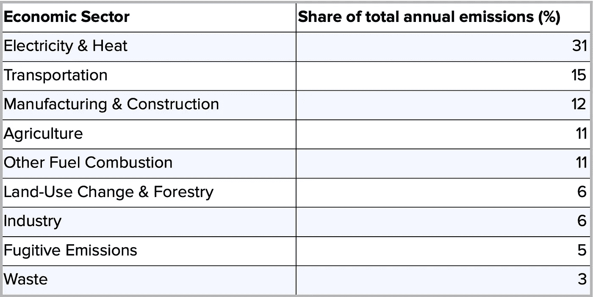
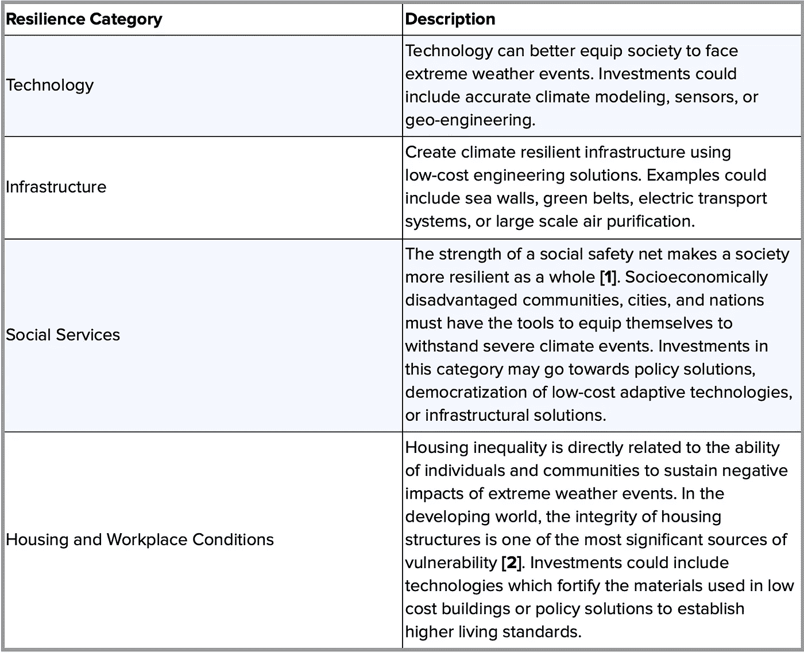

# 投资我们的未来

> 原文：<https://medium.datadriveninvestor.com/investing-in-our-future-3966755e5cb8?source=collection_archive---------21----------------------->

## 一个如何思考气候投资的框架。

Photo by [Michael Benz](https://unsplash.com/@michaelbenz?utm_source=unsplash&utm_medium=referral&utm_content=creditCopyText) on [Unsplash](https://unsplash.com/s/photos/forest?utm_source=unsplash&utm_medium=referral&utm_content=creditCopyText)

全球经济正在发生范式转变。许多现代生活方式是不可持续的，化石燃料已经成为人类的类固醇。化石燃料支持了人类发展，改变了全球经济，让数十亿人摆脱了贫困。但我们对化石燃料依赖的意外副作用开始显现。空气污染、异常大规模的自然灾害和突发疾病向我们展示了我们对环境和日常生活的影响。我们不能忽视这些副作用，随着这些副作用的恶化，我们将不得不面对化石燃料加速增长的后果。范式转换将开始。

在这个新时代，我们重视的原则将是可持续性和弹性。这些原则不一定是出于选择，而是出于需要。在一个冲动和缺乏耐心的人和企业的时代，那些旨在解决琐碎和时尚的市场驱动问题的人将会失败，而那些后退一步，围绕长期愿景建立改变人性的企业和技术，专注于可持续性和弹性原则的人将会获胜**。**该框架旨在通过支持和投资有助于这一模式转变的企业，减少对人类生存的威胁。

该框架为投资评估和投资组合分配提供了一种方法，目的是减少气候对人类的威胁。许多人认为基于气候的威胁对人类构成了生存威胁，所以*既然生存威胁的定义很糟糕，我相信没有其他结果应该被优先考虑。*因此，这一框架有效地将资本引向那些去除/减少温室气体、提高适应性/弹性或实现组织变革的业务和技术。该计划符合可持续性和弹性原则，将造福人类，并为那些促进其变化的人创造一生的金融机会。

 [## 这么说一家大型风投基金正在投资你的初创公司？4 实际考虑|数据驱动的投资者

### 首先，恭喜你。融资总是需要努力的，一个大的风险投资基金当然是一个大的…

www.datadriveninvestor.com](https://www.datadriveninvestor.com/2020/08/09/so-a-big-vc-fund-is-investing-in-your-startup-4-practical-considerations/) 

虽然这些原则应该适用于所有的企业和技术，但我将重点讨论它们在气候变化问题上的应用。市场未能对温室气体排放的外部性以及许多其他环境外部性进行定价。这将会改变。在接下来的半个世纪里，负面的环境后果将会给社会带来压力，因此，市场将被迫意识到这些成本。在这一点上，长期未定价的外部性(温室气体排放)将被定价，温室气体的去除/减少以及气候风险的缓解将变得非常重要。

为了做到技术不可知，应该遵循这个框架，而不对特定的技术产生偏见。这种方法最大限度地增加了风险缓解取得更大成果的机会。必须通过成本/收益分析来评估实现相同结果的技术之间的决策。这可以防止偏见或时尚将投资偏离优先结果。脱碳以及可持续性和弹性原则适用于任何业务或技术，投资应按照以下目标进行评估和分配。

该业务或技术直接追求消除或减少温室气体排放。

*二)这项业务或技术提高了人类应对气候相关问题的能力。*

*III)这项业务或技术是组织变革的推动者。它使组织能够达到前面的两个标准，或者帮助组织准确地说明他们的环境外部性。*

**I)移除/减少**

为了了解哪些业务和技术将推动这种变化，我们必须优先考虑那些消除温室气体(GHG)或取代/防止 GHG 排放的业务和技术。简单地说，它们去除/减少的 GHG 越多，它们的价值就越大。有三种方法可以做到这一点:将它从大气中去除，取代高排放源，或提高效率。虽然实现这些结果之一的任何投资都是一个良好的开端，但有必要进行成本/收益分析，以确定脱碳工作的优先顺序。优先化是将资金分配给最有效的 GHG 减排项目的关键。以下评估器可用于区分选项；

*在该项目上每花费 1 美元，GHG 就减少/阻止了多少吨二氧化碳当量？*

实现这一目标的投资将根据各部门在全球年度排放量中所占的份额在各部门之间进行分配。下表按全球年排放量的份额列出了经济部门。投资于致力于减少排放的企业的资本将按照同样的权重在各个行业进行配置。投资组合的分配应密切跟踪部门排放量的变化，以确保资本流向排放量最高的部门。

Source: [cait.wri.org](http://cait.wri.org) based on 2017 data.

**II)气候适应&适应力**

虽然消除和减少 GHG 是长期的优先事项，但让社会恢复活力也很重要。许多气候变化是不可逆转的，人类需要解决方案来抵御海平面上升、极端天气事件、空气污染或疾病等趋势。为了成为一个有适应力的物种，需要创造解决食物和水资源短缺、空气质量、人类健康等问题的商业和技术。为了评估这些机会，投资应该在两个类别之间进行；

*a)降低未来有害事件的严重性。*

*b)降低有害时事的严重性。*

为了使人类尽可能具有复原力，预防和治疗都需要存在。理想情况下，第一类预测技术的进步将使第二类过时，但在此之前，投资将对半分配。在下个世纪，做出反应的企业将会失败，但那些接受弹性是新常态的企业将会胜出。

为了减少有害事件的风险，可以通过以下类别进行投资:

Sources: [[1]](https://journals.sagepub.com/doi/10.1177/0956247813500902) [[2]](https://backend.orbit.dtu.dk/ws/files/4024541/obit_postprint.pdf)

**III)** **组织变革**

组织变革可以被定义为使其他人减少排放或使人类更有弹性的业务或技术。例如，这些可能包括软件平台、预测和说明性分析，或用于准确环境核算的政策解决方案。

环境会计是组织变革的一个关键部分，它在市场动态和 GHG 去除/减少的结果之间建立了一种一致性。如果调整得当，市场力量将加速变革。此类投资应关注 GHG 的定价。促成 GHG 配额交易市场或为组织提供更好地跟踪或减少环境影响的工具的业务或技术将是关键投资。随着政府对排放越来越严格——对超标排放处以更高的罚款——适当的环境会计对寻求减少罚款的企业来说将至关重要。还应该通过游说渠道对碳税、能源补贴或碳配额交易计划等政策进行投资。

沿着这些轴线进行的投资确保政策的实施或者加速定价外部性的市场采用，或者加速特定技术的采用，从而提高第一类和第二类投资的有效性和价值。

负面的环境结果将从根本上改变全球经济的价值。这将需要新的商业和技术方法。对这些业务和技术的投资必须是动态的，密切跟踪各部门的排放密度和解决方案的成本效益。

最后，必须谨慎但紧急地进行投资。不可逆转的变化已经发生，但我们等待的时间越长，我们的未来就越不确定。对我们星球未来的投资必须偏向于行动。

为了部署这一历史性转变所需的大量资本，我们还必须开发使信息可获取和投资民主化的系统。我们共同分享这个星球，我们都与这个游戏息息相关，因此我们都必须在中发挥*的作用，并从*应对这些巨大挑战的解决方案中受益*。*

## 获得专家观点— [订阅 DDI 英特尔](https://datadriveninvestor.com/ddi-intel)