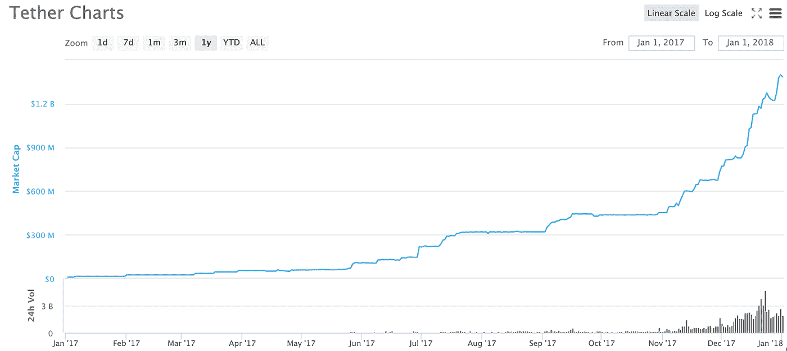
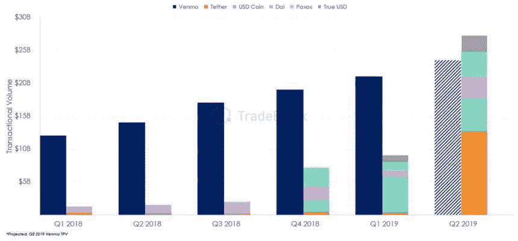
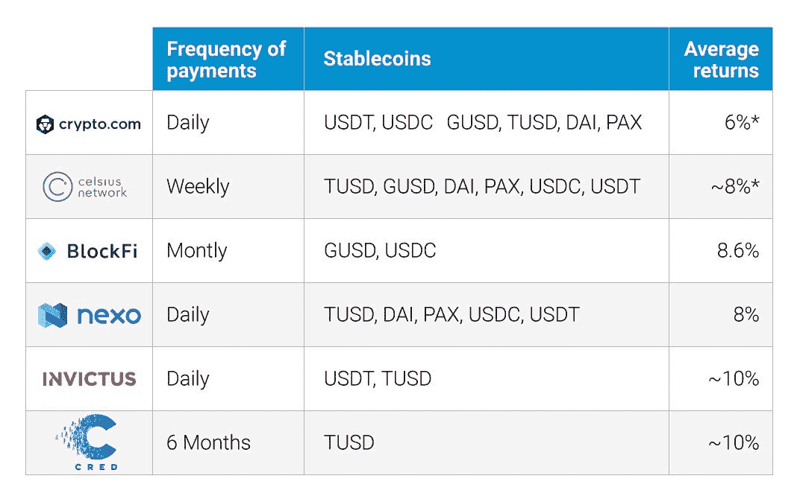

# 投资稳定的信贷

> 原文：<https://medium.datadriveninvestor.com/investing-in-stablecoins-f894d5d7310?source=collection_archive---------0----------------------->

随着对加密货币兴趣的激增，值得考虑的是稳定货币在加密交易者的投资组合中应该扮演什么角色。虽然从技术上来说，你并没有真正“投资”在稳定的硬币上(因为它们本身并不能给你带来回报)，但它们仍然为密码交易员提供了许多重要的好处。

稳定币近来大受欢迎，像 Tether(最大的稳定币)这样的稳定币现在每天的交易量定期超过比特币。这是因为 stabelcoins 为交易提供了许多关键优势，包括:

1.  物价稳定
2.  一种有用的传输机制
3.  赚取高利率的贷款工具

让我们分别看一下这些。

1.  **物价稳定**

stablecoin，特别是 Tether(一种由美元支持的 stable coin)在 2017 年末随着加密市场的爆炸而受到欢迎。随着比特币和许多其他加密货币的波动性大幅飙升，用户将这种特殊资产视为对冲价格风险的工具。

Tether 的市值(衡量流通中 Tether 总价值的指标)从 2017 年初的约 1000 万美元增加到年底的 13 亿美元以上，增长了 130 倍。

来源:[USDT 股价、图表、市值和其他指标](https://coinmarketcap.com/currencies/tether/)

随着泰瑟的成功，许多稳定的公司纷纷效仿。其中包括、、戴、派克斯以及最近的美元(BUSD)等特定于交易所的稳定货币。显而易见的是，所有最受欢迎的稳定货币都有一个一致的趋势:**盯住美元**。

这是因为美元被广泛认为是世界储备货币，并被普遍用作国际贸易事实上的计价单位。

同样，大多数加密交易者最喜欢使用美元支持的代币作为他们的交易货币。

**2。一个有用的传输机制**

Stablecoins 已经成为加密货币生态系统中越来越受欢迎的价值转移方式。事实上如此受欢迎，以至于截至 2020 年 1 月前六大稳定货币(USDT、USDC、派克斯、戴和)在以太网上转移的价值超过了本地货币 ETH。

从交易量来看，Stablecoins 甚至开始挑战 Venmo 等外汇提供商。Stablecoins 销量的季度增长率为 300%，而 Venmo 的季度增长率为 23%，这本身就被认为是一个高增长的初创企业。

这表明 stablecoins 未来可能会取代传统的支付提供商，不再仅仅是一种交易工具，而是一种支付方式。

**3。赚取高息的借贷工具**

像 Celsius Network 和 Nexo 这样的贷款提供商已经进行了创新，为投资者提供了从他们稳定的存款中赚取利息的能力。他们的做法与银行类似，接受美元稳定货币存款，然后以预定的利率将这些存款借给交易员，贷款由加密抵押品担保。

利率高于传统储蓄账户的储蓄利率，因为感知风险更高，也就是说，加密是一种非常不稳定的资产类别，因此存在抵押品被清算的风险。

 [## 加密货币行业是死是活？数据驱动的投资者

### 九月初，我们在 X-Order 内部就代币市场的未来进行了一场辩论。有趣的是，我们的观点是…

www.datadriveninvestor.com](https://www.datadriveninvestor.com/2019/12/12/will-the-cryptocurrency-industry-be-dead-or-alive/) 

自贷款平台推出以来，银行能够提供的美元稳定债券利率一直远高于 6%。在某些情况下，如 Invictus Capital Margin Lending fund，利率[已超过 20%美元](https://earncryptointerest.com/currencies/trueusd-10.html)，这通常是你只会在对冲基金中看到的回报类型。

Source: Earncryptointerest.com

很明显，稳定的硬币为投资者提供了许多巨大的好处，而且这个行业只会越来越大。

最后，你应该选择适合你需求的稳定投资产品，并一如既往地做好自己的研究！