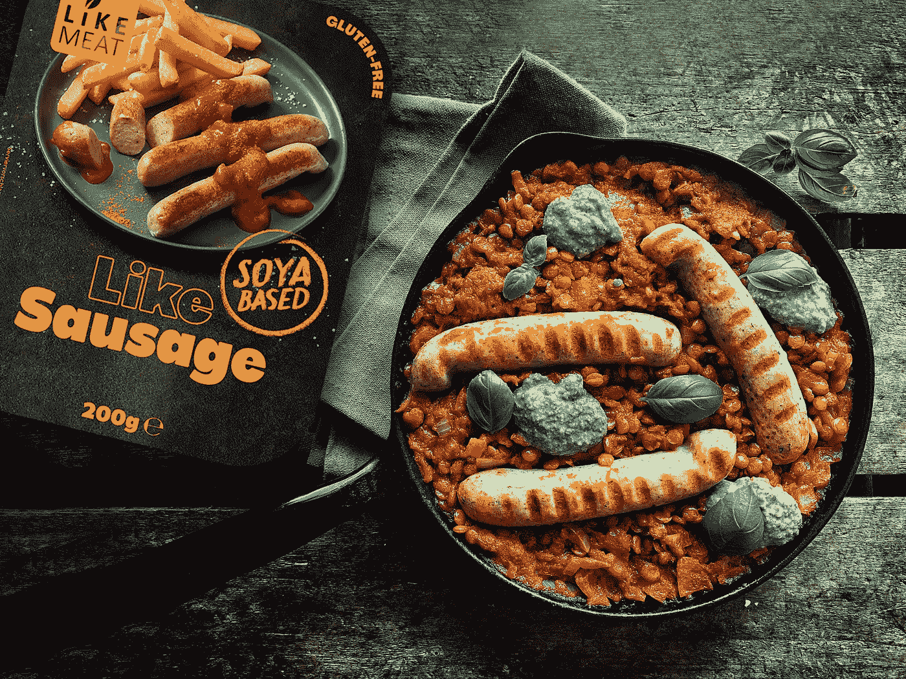

# 投资食品的未来

> 原文：<https://medium.datadriveninvestor.com/investing-in-the-future-of-food-4c5bfc5c04b0?source=collection_archive---------15----------------------->

Photo by [LikeMeat](https://unsplash.com/@likemeat?utm_source=unsplash&utm_medium=referral&utm_content=creditCopyText) on [Unsplash](https://unsplash.com/s/photos/plant-based-meat?utm_source=unsplash&utm_medium=referral&utm_content=creditCopyText)

纵观历史，食物是我们所有人的共同语言和爱。除了生存需要食物之外，食物在我们的文化中扮演着决定性的角色，它塑造了我们。食物影响我们的健康，推动我们的娱乐和社会交往，创造一种爱、快乐、温暖、团结的感觉，甚至可以拍出很棒的照片。现在把科技加入到这个等式中，考虑到全新的一代和我们与食物关系的改变。

在过去十年左右的时间里，我们已经开始看到我们的食品价值链的许多进步——有些是出于眼前的需要，有些是为了更好的未来。全球对食品数字化和透明化的需求加速了这些改进。

> 根据 C.B. Insights 的预测，到 2025 年，中国预计将占所有蛋白质(包括植物性食物)消费的 35%。

展望食物本身，在过去的两年里，我们已经开始看到以植物为基础的替代品的增加，为调色板提供了急需的变化。对于那些保持关注的人来说，一些家喻户晓的名字，如[麦当劳](https://www.thestreet.com/investing/beyond-meat-shares-off-as-mcdonalds-ends-trial-of-plant-based-burger)、[星巴克](https://www.cnbc.com/2020/06/23/starbucks-partners-with-impossible-to-sell-plant-based-breakfast-sandwich.html)、汉堡王、YumChina/ [肯德基](https://www.china-briefing.com/news/starbucks-kfc-offer-plant-based-meat-options-china-tap-new-consumption-trends-post-covid-19/#:~:text=By%202025%2C%20China%20is%20projected,will%20translate%20into%20significant%20returns.)、[雀巢](https://fortune.com/2020/05/21/nestle-plant-based-meat-factory-china/)、泰森食品，已经进入食品科技领域的这一特殊类别，或者与[Beyond Meats](/www.beyondmeat.com)&[Impossible Foods](http://www.impossiblefoods.com/)等建立了轰动性的合作关系，以适应日益增长的消费者需求。这些都为世界上最大的两个消费市场——美国和中国——铺平了道路。

> 全球食用昆虫市场正在崛起，预计到 2028 年**时将达到价值**8.5 亿美元的规模。****

**去年(2019/2020 年)，该领域的许多进步进一步加快，从最初的生产到现在使用的成分，如大豆( [LikeMeat](http://www.likemeat.com) )、豌豆( [NUGGS](https://eatnuggs.com/) )、大米和鹰嘴豆等蛋白质。在过去的 12 个月里，消费者的选择也急剧增加，围绕着 [**乳制品**](https://bigideaventures.com/four-reasons-to-choose-plant-milk-over-cows-milk/)([Just](https://www.ju.st/en-us/products/consumer/egg)&[Evo foods](https://evofoods.in/))**海鲜** ( [珍肉(小龙虾)](https://zhenmeat.com/en))**饺子** ( [蜜饯](https://phuturemeat.com/))[**昆虫**](https://www.forbes.com/sites/allisongasparini/2020/06/30/innovation-in-food-technology-could-help-bring-insect-flours-to-your-pantry/#238b4a1e7ea9)**小吃**随着消费的增加，这些选择无疑将继续扩大，它们到达我们盘子的路线也将演变——想想 3D 打印( [MeaTech](https://meatech3d.com/) 、 [Redefine Meat 的 3D 打印牛排](https://nocamels.com/2020/07/israel-3d-printing-alternative-meat-redefine/))、室内厨房农业、充满垂直农场的仓库。和直接面向消费者(D2C)的超级本地市场。******

** [## 投资区块链前要问的三个简单问题(也是一个困难的问题)|数据…

### 现在是了解区块链的最佳时机。不同货币之间的增长率，比如…

www.datadriveninvestor.com](https://www.datadriveninvestor.com/2020/03/12/three-simple-questions-and-one-difficult-one-to-ask-before-investing-in-a-blockchain/) 

所有这些努力，只是今天的价值链对我们的全球气候、个人健康和整体寿命的直接影响的巨大转变的开始。

关于这一点和我们食物的未来，请听听[大创意投资公司的](https://www.linkedin.com/company/bigideaventures/)[安德鲁·迪夫](https://www.linkedin.com/in/ACoAAAALf5UB83uq7xN8QpeWvtrrcLXEkKMXfnM)、[马克·哈马德](https://www.linkedin.com/in/ACoAAAAFKmUBLZ4XS_4dZBM-qzDBFHLripCv1tY)和我在 VCTV 坐下来讨论投资 [**晚餐吃什么**](https://youtu.be/OfChBUw2AYo) 。”** 

***要想从主要投资者和专家那里获得更多关于此类话题的见解，请订阅《VCTV》的***并关注每日新闻。****

*****访问专家视图—** [**订阅 DDI 英特尔**](https://datadriveninvestor.com/ddi-intel)***