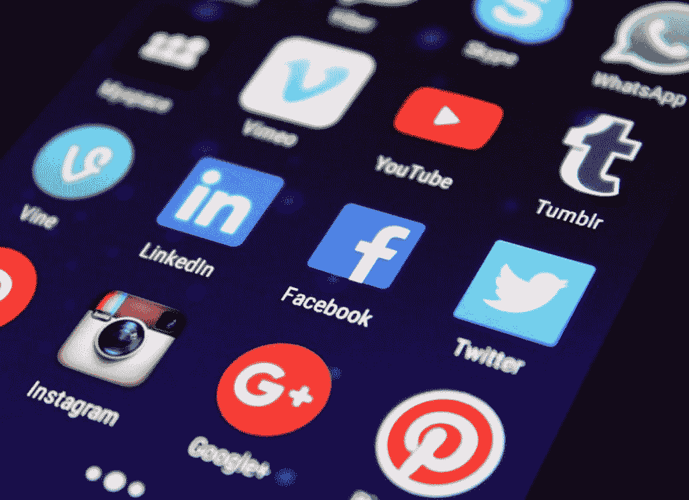
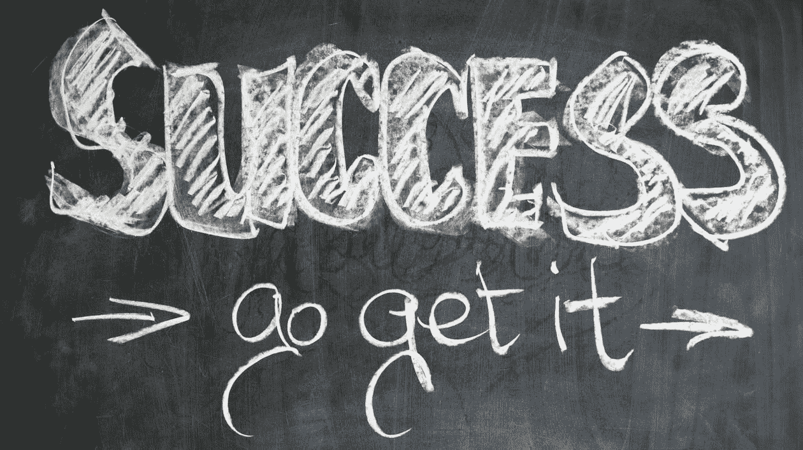

# 投资于你的网络

> 原文：<https://medium.datadriveninvestor.com/investing-in-your-network-6b824f1c2b46?source=collection_archive---------11----------------------->

如何最大化你的(社会)公平回报

Pixabay

我们大多数人都被困在家里，我们的空闲时间很大程度上由消费数字媒体或重拾旧爱好组成。为了保持工作效率和避免幽居病，我找到了一个有趣的方法来投资我的多余时间。

## 形势

自隔离开始以来，互联网使用量增加了 70%，流媒体服务的使用量增加了 12%。这种增长融合了在家工作的专业人士、转向在线课程的学生以及电影、视频游戏或社交媒体形式的娱乐。随着社交媒体和视频流继续吞噬我们的时间，我们有巨大的机会投资于我们的数字关系，将我们无意识的消费转变为有目的的生产。

虽然你可能没有无限的资本来利用低迷的股票价格或房地产，我想建议你可能有一个不同类型的资本过剩；**社会资本**。

 [## 投资区块链前要问的三个简单问题(也是一个困难的问题)|数据…

### 现在是了解区块链的最佳时机。不同货币之间的增长率，比如…

www.datadriveninvestor.com](https://www.datadriveninvestor.com/2020/03/12/three-simple-questions-and-one-difficult-one-to-ask-before-investing-in-a-blockchain/) 

根据字典，社会资本被定义为“在特定社会中生活和工作的人们之间的关系网络，使该社会能够有效地运转”。

疫情冠状病毒彻底颠覆了社会，社交的主要方式从面对面变成了在线。Zoom、Facetime、Xbox Live 和许多其他平台使我们能够继续与朋友和家人聊天和互动。

我花了几个小时和我的朋友们聊天，听他们谈论他们的副业或新的努力。我们一直在反复交换想法，看到一个月以来的变化，真的是太棒了。我的一个朋友开了一个网站，另一个在 Youtube 上创建了一个音乐网站，还有一个现在已经半出名了。我的观点是，当我们继续消费所有这些数字媒体时，我们可以通过使用我们的掌声、喜欢、分享和在线网络来建立彼此，从而创造价值和创造动力。

## 你的影响

你怎样才能有所作为？脸书和 Instagram 上有超过 10 亿人。Linkedin 拥有超过 6 亿活跃会员，占社交媒体 B2B 销售线索的 80%。根据六度分离理论，所有的人都有六个或更少的社会联系。这意味着，如果你积极推广或分享你朋友的材料，或者他们强调你的工作，那么它将有更高的机会被能够赚钱的人看到。

如果你拥有一家小企业，那么现在是与那些帮助你建立品牌的有影响力的人接触的最佳时机。在社交媒体上突出他们，举办一个赠品，或者为他们的帖子付费。也许你的一些朋友正在创建他们的内容。分享他们的视频或利用你的专业网络帮助他们面对一些决策者。

## 你的回归

这只是几个例子，但是你可以看到它们是相当低的努力，你最大的风险是什么也没发生。另一方面，你可能是帮助你的朋友创立他们品牌的催化剂，或者你的一个追随者在你的第一个大客户会看到的地方张贴你的广告。你永远不知道谁在看，我相信一些有意的社会投资会以新企业、艺术家和商业可能性的形式产生巨大的回报。

Pixabay