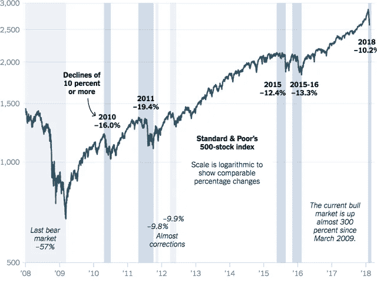
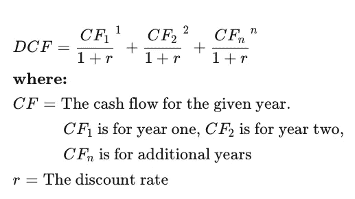
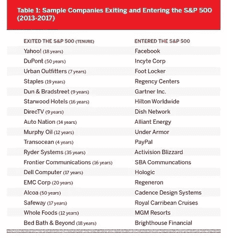

# 像沃伦·巴菲特那样投资是个糟糕的建议

> 原文：<https://medium.datadriveninvestor.com/investing-like-warren-buffet-wont-make-you-rich-a78f19948611?source=collection_archive---------3----------------------->

Photo by [Joshua Hoehne](https://unsplash.com/@mrthetrain) on [Unsplash](http://www.unsplash.com)

## 沃伦·巴菲特是一个伟大的投资者，但不要听从他的建议

《巴菲特致股东的信》是我读 MBA 时读的第一本书。

但七年的股市投资让我意识到，他的建议对散户投资者来说并不那么相关，甚至可能不利于建立长期财富。

## **《不要赔钱》**

沃伦·巴菲特有句名言:投资只有两条规则。1.不要赔钱 2。别忘了第一条规则。

也就是说，沃伦·巴菲特希望你投资那些股价低于其价值的公司。

这和房价下跌时买房是一样的。这个想法是，如果你买了低于市场价值的东西，即使资产失去了价值，你仍然可以免受下跌的影响。

根据这一定义，几乎所有股票都被排除在外。

**根据定义，当你在网上购买股票时，你是在为这些股票支付市值。**

批发收购一家公司的唯一方法是像沃伦·巴菲特那样全盘收购。*但是如果你足够富有，你可能就不会去读一篇关于投资的中型文章了。*

> 你在第一次市场崩盘中亏损，第二次赚钱，第三次发财。

问题是，如果你是股票市场的新手，你就会亏损。市场就是这样运作的。一位智者说，第一次低迷你亏钱，第二次赚钱，第三次发财。好吧，也许只是我。)

投资不仅是提高你的知识，也是发现自己是一名投资者。

你是投资者还是交易者？你更擅长期权和期货、衍生品还是更擅长货币交易？也许你有挑选小公司慢慢成长为大公司的诀窍。或者你擅长研究图表，识别即将上涨的股票。

> **你需要尝试不同的投资风格，以发现你热爱什么，擅长什么。**

不仅如此，作为投资者，理解自己的情绪也很重要。你擅长在市场出现泡沫时避免贪婪并套现吗？或者，当混乱袭击华尔街时，你更善于保持冷静并寻找机会？这些都不是不赔钱就能学到的东西。

> 不要怕在市场上赔钱。这是学习投资艺术的学费。

引用 Spectrum Management Group 的 Bob Phillips 的话来说，“如果你在股市上损失了钱，最好的恢复方法是再次投资，但要更好。”

 [## 生存还是毁灭:经营者 Vs 创始人 Vs 投资人？数据驱动的投资者

### 作为一名从经营者转型为创始人、再转型为投资者的人，我经常被问到这两者的利弊。我经常用一句…

www.datadriveninvestor.com](https://www.datadriveninvestor.com/2020/08/02/to-be-or-not-to-be-operator-vs-founder-vs-investor/) 

## “多元化是傻瓜的事”

沃伦·巴菲特否定多样化。其中的逻辑是，虽然分散投资降低了风险，但也损害了你的收益。他建议最好全力以赴投资你真正信任的公司。

但除非你是沃伦巴菲特，否则你不太可能了解一家公司内部运作的全部信息。也许所有者在伪造数据，也许内部权力争斗损害了公司的增长前景。

如果你是散户，你将是最后一个发现这些事情的人。

到那个时候，很多事先知情的人都已经退出了，股票也已经失去了大部分价值。

当沃伦·巴菲特买下他的第一家公司 Geiko Insurance 时，他千里迢迢来到华盛顿，和公司总裁谈了两个小时，然后*和*花了 65%的钱购买它的股票。但普通投资者没有资源或时间去做那件事。

多样化对散户投资者来说很重要。

> 不要把所有的投资放在一个篮子里。投资股票，买黄金避险。投资外币和国际共同基金。这将有助于确保你的整个投资组合不会同时崩溃。

## “不要选择市场时机”

沃伦·巴菲特说他从来不试图“选择”股票的时间:“我从来不对市场有什么看法”。与直觉相反，巴菲特还表示，对长期投资者来说，最糟糕的环境是股市飙升。

沃伦·巴菲特并不总是买股票。他等待合适的机会买入高质量公司的股票。2008 年，当次贷危机袭击美国时，沃伦·巴菲特正忙于积累蓝筹股的股票。在 2020 年市场崩盘之前，他坐拥价值 1300 亿美元的现金。

> 市场的一个简单规则是上涨比下跌更难。例如，如果一只 100 美元的股票下跌 50%，它需要上涨 100%才能恢复其价值。

市场通常每年会有 10%的调整，每十年会有 30%的调整。在此期间，即使是高质量企业的股票也能以巨大的折扣价买到。

Image by [Seeking Alpha](https://seekingalpha.com/article/4212083-surprising-statistics-of-stock-market-corrections)

绝对没有理由一直投资股票市场。

> 如果市场正在上涨，那么保存现金是一个好得多的策略。耐心等待调整，部署你的资金。

## ***“宁买一家好公司，不买一家好公司。”***

是的，但是你怎么知道什么是公平价格呢？

问 10 个金融专家任何公司的公允价格是多少，你会得到 11 个不同的答案。

每个投资者都有自己计算公允价值的公式(*内在价值更确切的说是*)。[贴现现金流](https://www.investopedia.com/terms/d/dcf.asp) (DCF)是计算股票公允价值最流行的公式。DCF 分析试图根据对一项投资在未来会产生多少钱的预测，计算出该项投资目前的价值。

对于外行来说，这个公式看起来像这样

Image from [Investopedia](https://www.investopedia.com/terms/d/dcf.asp)

问题是现金流和贴现率是基于投资者对增长的假设。未来的现金流取决于多种因素，GDP 增长、市场需求等等。没有两个投资者能够完全同意这些变量的正确值。

股票市场的前提是，每次一个人买入，另一个人卖出，双方都认为自己得到了合理的价值。

自上市以来，特斯拉的股价已经飙升了 4000%,尽管许多大投资者已经将创纪录的【4000 亿美元押在了它的垮台上。*特斯拉的公允价格又是多少？*

> 对散户投资者来说，定期买入一只好股票要比试图找出一只股票的正确价格有用得多。通过这种方式，市场的波动得到了平衡。

## “我最喜欢的持有期是永远。”

没有人会永远持有一只股票，即使是巴菲特。巴菲特建议，如果你对持有一只股票 10 年感到不舒服，就不要持有它，哪怕是 10 分钟。

即使我们假设你很富有，不需要动用你的投资来支付不可预见的费用，这个建议仍然不成立。

与巴菲特开始投资时相比，如今股指中的公司数量要多得多。投资者也多得多。

1965 年，标准普尔 500 指数公司的平均任期是 33 年。到 1990 年，已经 20 年了。预计到 2026 年将缩短至 14 年。

Image from [Innosight](https://www.innosight.com/insight/creative-destruction/)

每隔几十年，经济就会经历巨大的转变。消费模式演变，新的商业机会出现。即使你购买了一家大公司的股票，长期持有也没什么意义。

IBM 是一家伟大的公司，也是在 S&P 坚持了 50 多年的少数公司之一。

从 1993 年到 2003 年，它的股票从 12 美元暴涨到 88 美元。但是如果你在 2010 年投资 1000 美元在 IBM，你今天会损失 8%。相反，如果你在 2010 年卖掉 IBM 并投资谷歌，你的投资将增加近 10 倍。

持有任何公司都有机会成本。总是有新的玩家进入市场，他们有潜力成为未来的市场领导者。

> 重要的是不断分析你的投资组合，剔除那些失去动力的股票，寻找更新更好的机会。

## **“只投资你了解的业务”**

大多数时候，这是个好建议。但也有例外。

当疫情来袭，政府实施封锁时，理解电子商务将成为大赢家是火箭科学吗？当在家工作成为常态时，是否很难预测数字工作工具会被越来越多的人采用？当每个汽车制造商都计划制造电动汽车时，你需要成为工程师才能猜到电池制造公司正蓄势待发吗？

当然，这并不意味着不需要进行进一步的分析，也不需要在市场中发现好的公司。然而，在今天的信息时代，只需点击一个按钮就可以获得知识。即使不是几天，也有可能在几周内对任何业务有一个合理的了解。*(假设你能忍住连续几个小时观看抖音视频的冲动)。*

沃伦·巴菲特和比尔·盖茨是亲密的朋友，然而巴菲特错过了微软的历史性崛起，尽管他有多次投资该股票的机会。

作为投资者，你需要投入时间去了解新的行业和新兴的业务领域。

> 如果你只投资你了解的业务，你可能会错过一些显而易见的赚钱机会。

## 结论

今天的股票市场远比沃伦·巴菲特刚出道时复杂。肯定有很多投资者可以从这位“奥马哈先知”身上学到东西。然而，投资者在效仿巴菲特“照我说的做，不要照我做”的建议之前，应该三思而行。

再次引用我的智者，有很多好的建议，并不意味着对你有好处。

**访问专家视图—** [**订阅 DDI 英特尔**](https://datadriveninvestor.com/ddi-intel)