# 利用杠杆投资——您需要知道的

> 原文：<https://medium.datadriveninvestor.com/investing-with-leverage-what-you-need-to-know-cb95be303842?source=collection_archive---------15----------------------->

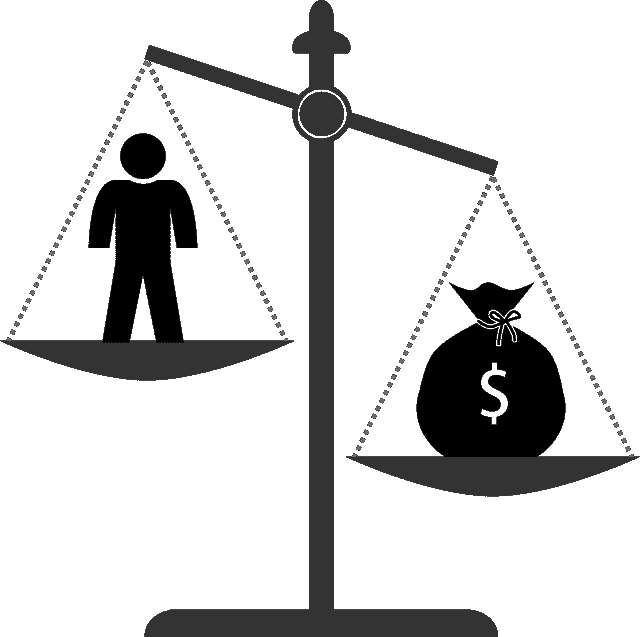

杠杆，在错误的人手中，是一个灾难的配方。打个比方，就像把枪放在新手手里，让他去打。十有八九，他最终会射杀所有人，不管是朋友还是敌人，包括他自己。至于杠杆，它在受贪婪驱使的人，或者不明白它如何运作的人手中，变成了一个定时炸弹。为了安全地使用杠杆，你需要知道背后的数学原理和风险。因此，如果你是那些无意做正式作业的人之一，那么听从我的建议，避开杠杆。

 [## 投资区块链前要问的三个简单问题(也是一个困难的问题)|数据…

### 现在是了解区块链的最佳时机。不同货币之间的增长率，比如…

www.datadriveninvestor.com](https://www.datadriveninvestor.com/2020/03/12/three-simple-questions-and-one-difficult-one-to-ask-before-investing-in-a-blockchain/) 

# 理解杠杆的本质

关于杠杆的许多误解比比皆是。实施的结果可能与你设想的相差甚远。因此，在我们研究如何充分利用杠杆作用之前，让我们试着理解它背后的本质。我在之前的文章中也谈到了其中的一些。但是为了完整起见，我在这里强调它们。

**1。借贷是有成本的**

世界上没有免费的东西，尤其是借钱的时候。你可以选择通过保证金账户、杠杆产品或从其他地方借入资金来进行杠杆操作。但是无论你做什么，都会有直接或间接的成本。尽管自 2008 年至 2009 年的金融大危机(GFC)以来，借贷成本有所下降，但对你的口袋来说仍是一个打击。不管你的投资是赚钱还是赔钱，你都要支付这笔钱。

对于那些通过保证金账户交易的人来说，经纪人通常会向你收取基于某种参考利率加上价差计算的日利息。参考汇率取决于你借入的货币。例如，美元借款通常使用隔夜伦敦银行同业拆放利率或实际联邦基金利率。收取的差价因经纪人而异，可以根据你借款的多少进行分级。基本上是借的越多，利差越低。为了让你有一个大致的了解，下面的表格显示了每年的平均隔夜 LIBOR + 1.5%。

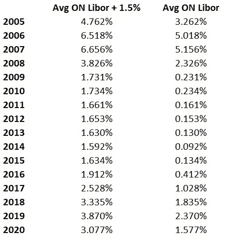

Financing Costs

在高利率环境下，融资成本的拖累可能会很大。举个例子，在 2007 年，如果你借了 10 万美元，你将被收取大约 10 万美元 x 1/365 x 6.656% = 18.24 美元的日利息。

**2。杠杆每天都在波动，除非积极管理**

如果大多数使用杠杆的人只是在第一次交易时使用它，我不会感到惊讶。之后，他们保持仓位不变，直到他们决定平仓。与此同时，他们预计自己的日回报率将是标的证券走势的数倍。这意味着，如果他们使用 2 倍的杠杆，他们期望获得 2 倍的每日回报。如果他们使用 3 倍的杠杆，那么 3 倍的日回报率，等等。在没有剧烈波动的情况下，短期内这可能是一个近似值。但是在更长的时间里，结果会非常不同。

盈利会降低你的杠杆，亏损会增加它。举例来说，让我们考虑这样一种情况，你有 10，000 美元，你用 2 倍的杠杆增加到 20，000 美元来购买证券。我们暂时也不要考虑融资成本。因此，你的投资组合每天的净清算价值(NLV) 包括你借的 10，000 美元，以及你的证券当时的价值。从这里开始，为了在每天结束时得到你的杠杆，你只需要得到你的总敞口，用你的证券价值来衡量，然后除以你的投资组合的 NLV。让我们看看这是如何在两种情况下实现的——(1)每日正回报，(2)每日负回报

Leverage Decreases When Returns Are Positive

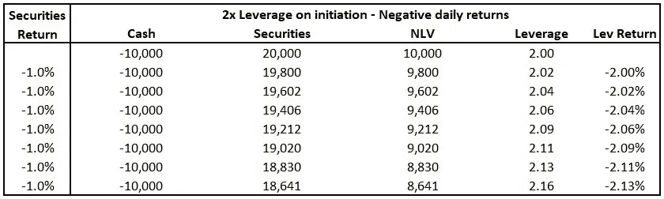

Leverage Increases When Returns Are Negative

如你所见，杠杆不是固定不变的。为了维持它，你需要主动调整你的仓位大小。你需要买进获利，卖出亏损。如果我们纯粹从算术的角度来看，在整个 7 天的时间里，你确实赚或亏了两倍的钱或回报。然而，这并不意味着获得或失去两倍的每日无杠杆回报。为什么？因为每日回报是复合的，你的投资组合的 NLV 比你持有的证券价值增长或损失的速度更快。

**3。杠杆绩效依赖于路径**

你的投资如何变动或波动有多大，对杠杆的表现有很大影响。

假设你有两个产品:(1)真实的间谍，(2)无风险的间谍。实际间谍，顾名思义，就是真正的间谍 ETF。另一方面，无风险间谍是虚构的间谍版本，每天以固定的速度增长。从 1993 年到 2020 年，两者都实现了 9.156%的复合年增长率(CAGR)。更清晰的图片，请看下面的图表。

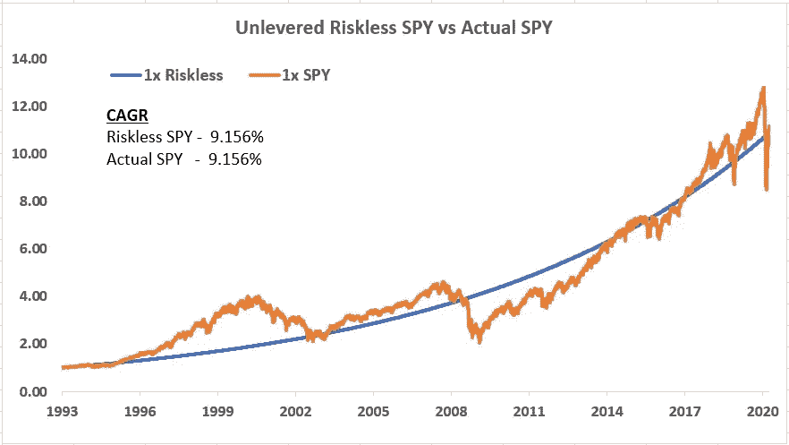

Unlevered Riskless SPY vs Actual SPY

现在，这两种产品的 2 倍杠杆版本表现如何？假设我们**积极管理杠杆，使其在每天结束时保持在 2 倍**。为了更现实，我们还可以包括一个 0.05% 的**交易成本和一个更接近机构收费的**美国隔夜 LIBOR + 0.5%** 融资成本。对于美国隔夜 LIBOR，我使用其年度平均值作为每日利率的估计值。许多人会很快得出结论，认为两者应该给你相同的结果。但是很抱歉让那些认为事实如此的人失望了，因为事情并不是这样进行的。**

杠杆倾向于低波动、低损失和更频繁上涨的策略。你可以更有效地将正回报和更少的损失结合起来。所以无风险间谍是个完美的候选人。它每天都在上涨。因此，它远远超过了真正的间谍。不幸的是，在现实世界中，无风险的间谍只存在于你的梦里。如果不是这样，每个人都会最大限度地借钱，并把所有的钱都投资进去。

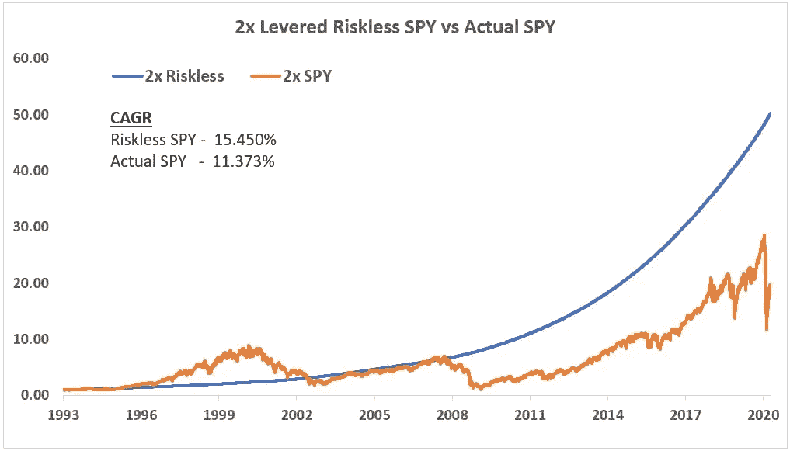

Leveraged Performance of Riskless SPY vs Actual SPY

**4。杠杆翻倍不会使 CAGR 翻倍，但会使波动性翻倍**

有些人错误地认为，投资策略的长期 CAGR 会随着所用杠杆倍数的增加而增加。这不是真的。如果你足够敏锐，你会在前面的图表中注意到，加倍 SPY 的杠杆并没有加倍其相应的 CAGR。这并不是说杠杆不能成倍增加 CAGR。从数学上来说，这是可能的。但实际上，这是非常不可能的，除非无风险的间谍存在，经纪人变得慈善，融资是免费的。所以在实践中，你的策略的杠杆 CAGR 不会接近它的倍数。

回到之前的例子，从 1993 年到 2020 年，一个 2x 间谍给出了 11.373%的 CAGR，而未杠杆化的 CAGR 给出了 9.156%。这只是大约 1.24 倍，而不是一些人预期的 2 倍。然而，从另一方面来说，它确实使你的策略的波动性从 18.89%增加到 37.79%。因此，杠杆往往会降低夏普比率等风险调整指标。这是需要记住的事情。

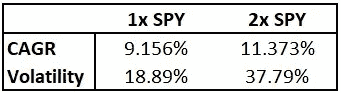

Leverage — CAGR & Volatility

**5。过度杠杆化会降低回报**

现在，你们中的一些人可能会认为不给出全部倍数是没问题的，因为我总是可以增加杠杆，直到它达到我期望的长期回报。如果 2x 不够，我会做 4x、5x 或更多。这是一种危险的思路。让我们以 1993 年至 2020 年的 back SPY 为例，为了便于说明，我假设了几件事:

1.  经纪人可以向你提供你想要的任何贷款。
2.  没有追缴保证金。
3.  你从 20 万美元开始
4.  间谍可以无限小的分数单位买卖。

从下面的图表中，你可以看到 CAGR 和 NLV 在 2020 年底的杠杆率达到 2.0-2.5 后开始逐渐下降。它不会一直上涨。事实上，当杠杆率超过 4.5 时，你的 CAGR 就会为负。

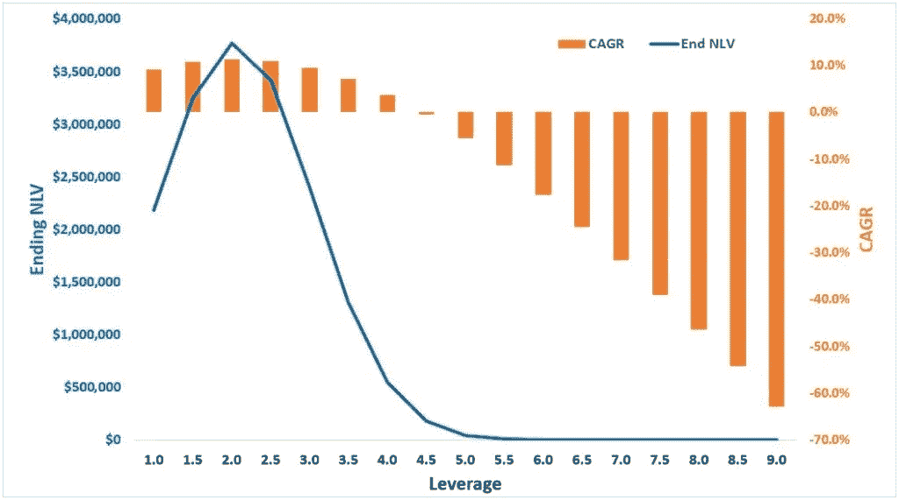

Excessive Leverage Lowers Returns

为什么会这样呢？因为杠杆是一把双刃剑，也会放大你的损失。亏损越深，该策略就越难东山再起。10%的保守损失需要 11.1%的相当接近的收益来填补缺口。另一方面，95%的巨大损失意味着在你的投资恢复之前，1900%的漫长而陡峭的攀升。SPY 在 GFC 期间已经经历了超过 50%的大幅缩水。

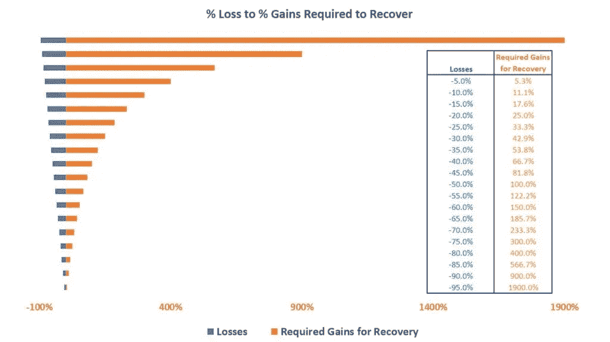

Loss To Gains Required Fro Recovery

我知道有些人觉得用美元和美分来描述更容易。在这种情况下，你只需要想象你投资了 1000 美元到一项变坏的投资中，只剩下 50 美元。现在，去把这 50 美元变成 1000 美元。大多数人会放弃。尤其是商业基金，早在它们到达那里之前就已经关门大吉了。

然而，回报开始下降的临界点会因不同的策略而异，取决于它们的平均回报、波动性、利率和策略路径。当然，我们是在事后才得到这些数字的。这些都是经过回溯测试的，我们无法知道未来会发生什么。但它仍然是一个很好的工作参考。

# 我们应该从哪些方面寻找杠杆？

我们都听说过这样的故事:投资者利用杠杆，最终却让自己的账户血本无归。对于那些盲目、公然使用杠杆的人来说，这是一个意料之中的结果，尤其是在追求回报的高风险策略上。尽管有种种缺点，但如果我们对合适的候选人保守地使用杠杆，它仍是一个有用的工具。

对我个人来说，适当的杠杆取决于多种因素，包括你的策略的长期平均回报、波动性、尾部风险、你自己的风险承受能力和目标回报。为了得到答案，我们需要能够在一个完整的市场周期或更长的时间内对策略进行建模或回溯测试，这样我们就可以观察它在不同市场条件下的行为和表现。

**1。CAGR 应该很体面。**

这里不需要让人瞠目结舌的回报，但确实需要一个像样的回报。我所说的体面回报是什么意思？这意味着你的策略应该有一个长期的 CAGR，在融资成本之上有足够的利润空间。如果你连这都做不到，那就别麻烦了。当你的杠杆率增加一倍或两倍时，只获得少得可怜的 1%左右的额外收益也没有多大意义。因为风险回报没有吸引力。请注意，在我之前展示的例子中，我使用的是 LIBOR + 0.5%的美元，这低于大多数人支付的价格。最重要的是，更高的杠杆意味着你的尾部风险变大了。我们稍后会谈到这一点。

**2。波动性应该很低。**

杠杆投资的表现不仅仅取决于回报。波动性也是一个因素。这种关系不太明显，但总的来说，不稳定的投资往往有巨大的波动和更大的损失。有了杠杆，这些就会被放大，从长远来看对你不利。

有些人利用波动性来确定最佳杠杆，使用的是从[凯利标准](https://en.wikipedia.org/wiki/Kelly_criterion)推导出的定量公式。

*最优杠杆=(收益-无风险利率)/方差*

举个例子，你可以用你的策略的每日回报来衡量它的每日借贷成本。分子给你你的策略带来的超额回报。分母是日收益率的方差，数学上就是日波动率的平方。但是，如果你严格遵守这个公式的建议，就会出现问题，因为它倾向于建议一个过高的水平，以至于不能安全操作。

为什么？首先，总会有估计误差，当我们处理杠杆时，我们对误差的容忍度就缩小了。接下来，波动率等标准指标将一切都拟合到正态分布，假设对称分布，并严重低估尾部风险，我们看到这种情况比典型的正态分布所暗示的更经常发生。一个尾部事件已经够糟糕了，再加上杠杆作用，就足以毁掉一切。

**3。最大提取金额应较低。**

没有可靠的方法来模拟尾部。所以这是我们需要谨慎行事的地方。我们用我们所拥有的和我们所知道的来凑合。一个有用的衡量标准是该策略经历的**最大损失**(有史以来最大的历史损失)。为了使这有任何意义，请使用足够长的时间来捕捉不同的市场周期和场景，以便该策略有机会不仅展示其优势，更重要的是展示其弱点。当你只在稳定的牛市中运行时，告诉我你的只做多股票或看跌期权策略在极低的亏损下表现出色是没有意义的。因为这样我们才看到事情好的一面，不出所料，没有什么会杀了你。但我们想知道的是什么能杀死我们。

最大提款权让我们意识到在非常糟糕的情况下什么会打击我们。最大提取额度越大，杠杆作用的范围就越小。因为它会让你的杠杆更快地进入收益递减点。你可能还记得 SPY 的例子，当杠杆率超过 2 倍时，回报率就会下降。当然，这里隐含的假设是，同样的狗屎还会发生。为什么不呢？完全相同的事件可能不会重复，但其他事情总是会引发另一个相同规模或更糟的下降。

**4。最大日内损失应该很低。**

如果你的历史回溯测试是从收盘到收盘，这一点经常被忽略。日内波动可以向两个方向延伸得更远。巨大的变动是完全可能的。最著名的例子之一就是黑色星期一。在 1987 年 10 月 19 日，标准普尔 500 在一天之内暴跌了 20%以上。如果价格下跌发生在开市时，你将没有时间退出你的头寸。如果你的杠杆倍数超过 5 倍，你将会损失每一分钱甚至更多。如果你没有关于你策略的当天信息，你可以试着模拟最坏的情况。

**5。你自己的心理损失极限是多少？**

这是只有你能回答的问题。而如果你从来没有测试过，你可能连自己都不了解。这是失去痛苦的门槛，超过这个门槛，你就会开始失去冷静和恐慌。对一些人来说，这一比例可能低至 10%，一些人可能高达 20%，更激进的人可能高达 50%或更高。不管是什么，在那一点上，你开始不理智地行动，做一些不在你计划之内的蠢事，如果你一开始就有计划的话。杠杆可以加速你的道路。所以如果你不想去那里，那就让它变得难以到达。

# 案例研究——风险对等策略

我们只有在对战略建模并收集了我们需要的信息后，才能知道杠杆的适当大小。每一个都不一样。你自己的风险偏好也不同于他人。所以没有一个放之四海而皆准的解决方案。为了更清楚，让我带你看一个仅做多的[风险平价资产配置策略](https://investmentcache.com/risk-parity-common-sense-in-diversification/)的案例，该策略在 2005 年至 2020 年的 15 年间进行了测试。下面是它的无杠杆性能的总结，为了比较，我包括了间谍。

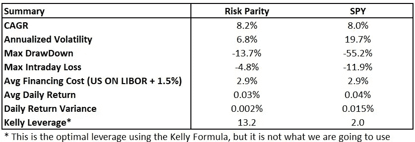

**CAGR 检查—通过**

它产生了大约 8.2%的相当不错的 CAGR。这与同期 SPY ETF 的回报率相当。现在，如果我们将其与同期的平均融资成本进行对比，它也表现良好，实现了超过 5%的正利润率。请注意，这是考虑到我在这里应用了 1.5%的更高价差这一事实。

**波动性检查—通过**

年波动率非常低，为 6.8%。(< 10%). This is like a third of SPY’s volatility. So the day to day fluctuations of the Risk Parity strategy is much more stable and measured. This makes it a more suitable candidate to carry leverage.

**最大压降—通过**

历史最大跌幅为-13.7%。同样，这比间谍经历的-55.2%要低得多。如果你还记得的话，随着亏损越来越深，弥补亏损所需的回报会大幅增加。所以在这方面，风险平价策略有更广泛的范围来使用更高水平的杠杆。

**最大日内损失—通过**

至于最大日内损失，我在计算中采用了最坏情况的方法。我假设每天，风险平价策略持有的证券都以低点收盘。实际上，所有证券同时触及低点的可能性极小。即便如此，这段时间最大的日内跌幅也只有-4.7%。从理论上讲，这意味着你需要 21 倍的杠杆才能在最糟糕的一天把这个账户清空。另一方面，SPY 面临着-11.9%的亏损。如果我们追溯到 1987 年 10 月 19 日，黑色星期一，这一天内的损失将膨胀到-20%(注意:间谍只在 1993 年开始，但我们可以用标准普尔 500 作为代表)。

**考虑目标收益&风险承受能力**

现在，让我们来看看我的目标回报和风险偏好。我希望长期目标是 CAGR 在 10%-15%之间，同时限制我的损失不超过-30%。为了找出我应该使用的杠杆，我需要知道在不同的杠杆水平下我的回报和提款是怎样的。见下图。

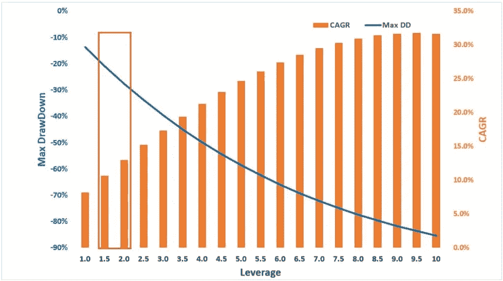

CAGR & DrawDown With Increasing Leverage

如您所见，这种策略在用尽优势之前可以承受高达 9.5 倍的杠杆。当然，这是基于历史结果的，并且会随着战略的发展而变化。但无论如何，我们没有看那么远。我应该以 1.5 到 2.0 之间为目标的杠杆最佳点在红框中。这是我同时满足 CAGR 和损失限额标准的区域。

我倾向于保守阵营，作为额外的预防措施，我喜欢抱着我们还没有看到最坏情况的预期工作。所以我想在最大提款和我的损失限额之间设置一些缓冲。这给了我和我的战略更多的回旋余地，这样我们就不会过早地终止或去杠杆化一个好的战略。因此，杠杆比率在 1.5 倍到 1.7 倍之间，其中最大的最大提款为 23%，看起来更容易接受。

这与糟糕的一天把我烧成碎片所需的 21 倍杠杆相差甚远。它也远未达到凯利标准建议的 13.2 倍。在杠杆回报率开始下降之前，它也远未达到 9.5 倍。这是一个低得多的保守的 1.5 倍-1.7 倍，可以由拥有正常保证金账户的小投资者实施，而不需要使用期货、期权或其他杠杆产品。让我们看看 1.7 倍杠杆的情况。

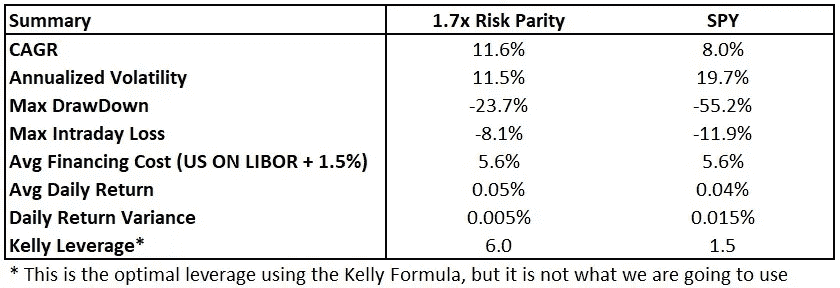

简单地看一下，我们可以看到，即使有杠杆，这种策略的风险仍然比间谍低，尽管提供了更高的潜在回报。当你与合适的合作伙伴配对时，这就是杠杆作用的来源。

**其他需要注意的事项**

在这篇文章中，我假设我们每天都在积极地维持一个恒定的杠杆。在实践中，你不必这样做，尤其是如果交易成本是一个问题。只有当杠杆偏离超过某个阈值时，你才能调整投资组合。根据投资的表现和你的杠杆比率，你也可以在更长的时间内这样做，也许一周一次，两周一次或一个月一次，等等。还有其他人，尤其是机构投资者，更喜欢根据特定的波动目标而非固定的杠杆系数来确定自己的头寸规模。在这种情况下，他们投资组合的杠杆率会不时波动。但是无论你选择做什么，记得做你的功课。

# 结论

这是一篇关于杠杆的长文。我已经很久没有写过这么长的文章了。无论如何，对于那些刚接触杠杆的人来说，我希望你在读完这篇文章后能学到一些东西。杠杆只是一种工具。是的，它可以帮助，但也可以杀死。最终，它的作用取决于你如何使用它。

*原载于 2020 年 5 月 25 日***。**