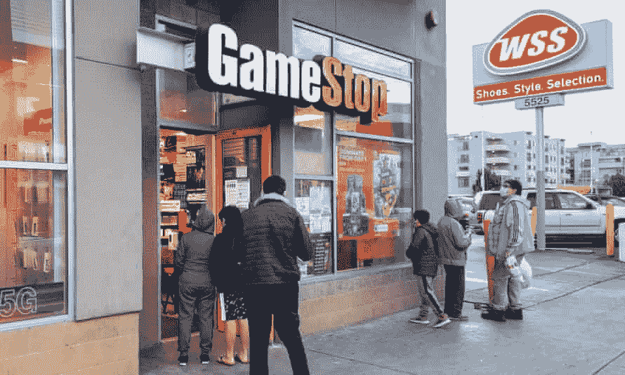
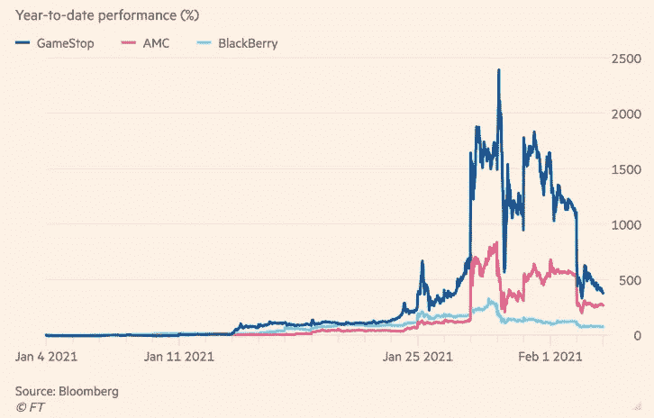

# 投资者从 GME 和 Reddit 狂热中吸取了所有错误的教训

> 原文：<https://medium.datadriveninvestor.com/investors-are-taking-all-the-wrong-lessons-from-gme-and-reddit-mania-a856eb04ab7?source=collection_archive---------18----------------------->

## 这与崩盘/上涨无关，而是随后会发生什么

一只股票如何团结各行各业的政客，让亿万富翁为“小人物”出头，让对冲基金“失败”？很简单——我们取消类固醇文化。

Photograph: AaronP/Bauer-Griffin/GC Images, Guardian

ameStop 的迅速崛起和衰落被描述为“普通”散户投资者与攫取资金的对冲基金之间的战斗，但它关键忽略的一点是，最终散户投资者最终为这场大屠杀买单。真正的对冲基金损失了数千万，如果不是更多的话(没有同情——这是他们的业务)。但是谁在顶部买入呢？一些对冲基金在“买进以收盘”，但主要是散户投资者想参与进来。

没有人站出来说实话——华尔街 Bets 不是伟大投资论文的创始人，它是一个乌合之众形成的地方，他们选择将一只股票的价格抬高到任何估值模型都无法证明的水平。自 2020 年 3 月以来，GME 可能是陷入竞购狂潮的一长串股票中的最后一只。柯达、破产的赫兹、诺基亚——都是呆在家里的无聊投资者带来的希望。我并不怀疑 WSB 人的素质——我肯定那里有一些杰出的投资者，但我们不要把它说成是普通投资者与对冲基金之间的较量。

我不喜欢传统的对冲基金模式，在这种模式下，基金经理在建立基金的那一刻就赢了，原因很简单，他可以收取丰厚的资产管理费。我也不认为所有对冲基金都需要生存——我认为有些糟糕的策略应该放弃。如果他们因零售狂潮而破产，那就更好了，因为他们在退出时提供了一些娱乐。

然而，我们没有问自己的是，这种狂热告诉我们市场将走向何方。当一个散户投资者把所有的钱都投入进去时，是什么让这些股票价格居高不下？这个投资者从哪里再找一分钱？(你可能会辩称，拜登总统的支票很快就会到账，散户投资者随时都可以借钱——但能借多少呢？).

F 从一种轻度歇斯底里的状态——你逐渐上升到哪里？谁是这些接近顶部股票的边际投资者？简单的事实是——散户投资者作为一个群体，没有足够的力量来保持高价格。当然，他们可以让股价上涨一两天、一周或一个月，但时间永远不会长到足以让他们声称代表的整个“散户”阶层持续赚钱。

作为专业投资者或个人投资者，如果你做空，你希望被做空者或伽玛陷阱套牢吗？绝对不行——因为你可能会被要求破产。你应该关注 WSB 吗？你必须。但是你不应该为了好看而宽恕暴民的歇斯底里。

像马克·库班和查马斯·帕利哈皮蒂亚这样的投资者从 WSB 的顺风中受益匪浅，因为他们的投资经常被抬高价格。查马斯长期以来一直看好特斯拉——他会反对去年上涨 7 倍吗？当然不是。

> 因此，你让他们打着民粹主义亿万富翁的幌子来到美国消费者新闻与商业频道，声称要为“小人物”出头。(他们与上一位掀起狂热的亿万富翁有那么大的不同吗？！)

我假设他们足够聪明，不会留下他们空头头寸的痕迹——因为看到他们的空头被 WSB 盯上会很有趣。

Image: Financial Times

投资者应该被禁止购买他们想要的任何股票吗？上个星期，这个最后的问题团结了所有肤色的人。没人想说的一件不受欢迎的事情是——清算所和经纪商经常“切断客户的联系”。断路器是交易所为类似目的部署的一种机制。把他们想象成一个酒保，他关掉水龙头，把你送上出租车，然后送你回家。

例如，上周晚些时候，总部位于英国的小型经纪商允许你卖出任何美国头寸，但限制买入，不仅是 GME、AMC 和其他 meme 和 YOLO 的热门股票，而且几乎包括除大型股以外的任何美国股票。为什么？因为他们的外汇交易对手要求他们提高保证金，并限制订单流。这都是因为他们想要更多的美元来弥补他们的头寸，而你可以通过让你的英国客户卖出他们的美国股票来创造更多的美元供应。这不是火箭科学——保证金提供者、清算所和债权人经常要求提供更多抵押品。

这种“去平台化”并不是正确的公关举措或表现，但也不像许多人所说的那样邪恶。专家将通过疫情产生的个人储蓄描绘成股票的“火箭燃料”(鉴于债券收益率为负)。然而，没有人想去想当边际投资者在 2020 年 3 月撤出时会发生什么。泡沫在众目睽睽之下破裂，而警告信号往往被忽视。今天的边缘投资者的构成应该让我们所有人都感到担忧。

> 我们还需要摆脱那种认为没有什么坏事会发生在任何人身上的观念。是的，对冲基金可以也应该失败。散户投资者投机可能而且应该赔钱。

支撑股市泡沫不是美联储和其他央行的工作。有悖常情的是，它通过让富人更富(通过膨胀的资产估值)，让太少的财富流下来，与它声称要做的事情背道而驰；所有这一切都是为了让“普通人”买不起房子，接受良好的教育，并有能力照顾自己的家庭。

这就是为什么散户投资者蜂拥进入 GamesStop 这样的“计划”——让他们的财富倍增，并尝试拥有资产。如果你能把 1 万美元变成 5 万美元，那就很有意义了。市场调整(或崩盘)是一个新的开始，我们都可以这样做，而不是证明今天疯狂的估值或辩论市场准入。