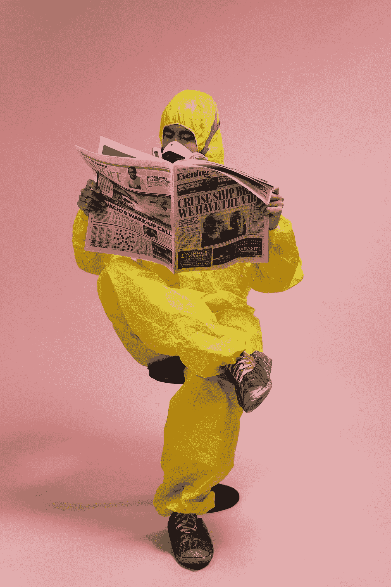
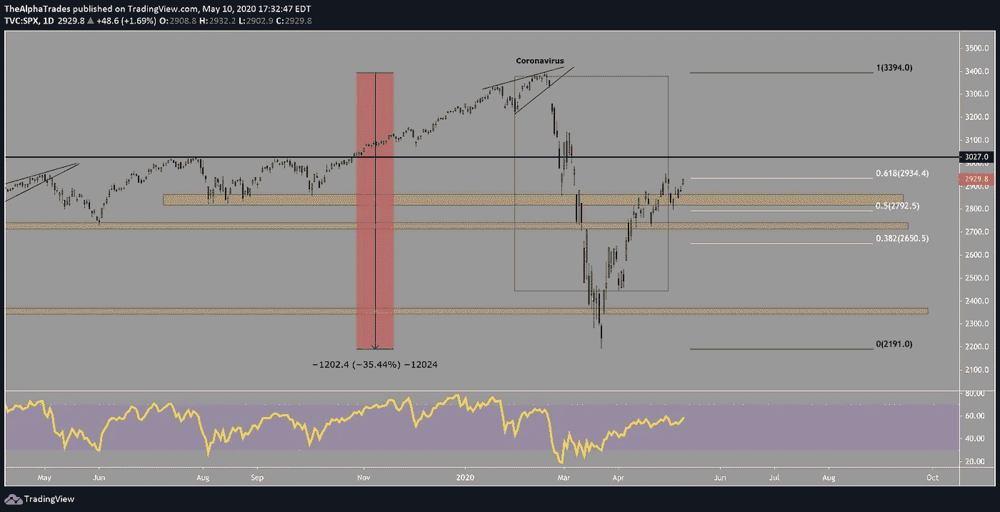

# 世界重新开放，投资者紧张不安——每周市场评论

> 原文：<https://medium.datadriveninvestor.com/investors-on-edge-as-the-world-reopens-weekly-market-review-8560e96bb1eb?source=collection_archive---------16----------------------->

## 这是顶部吗？住房和金融部门给出混合信号，比特币领先股票！

Stock market equities analysis, Photo by cottonbro from Pexels

# 摘要

*   冠状病毒对全球经济的影响
*   经济状况，聚焦美国
*   比特币作为领先指标
*   本周交易电话！

在上周的股市回顾中，我们根据不同行业的市场领导者的技术设置，给出了下周成为牛市的高概率。我们最好的预测是盘整或继续向上攀升，我们的预测是正确的。

# 冠状病毒概述

冠状病毒[在全球已经突破 410 万例](https://www.worldometers.info/coronavirus/)，死亡总数为 281，000 人，美国死亡人数约为 80，000 人。这是一个大国，但美国在死亡人数和感染人数方面仍然领先。世界正在慢慢重新开放，经济中受限制的部分正在重新上线，但一些已经重新开放的地区，如德国和 T2，报告称新增病例和死亡人数上升。随着各国放松封锁，这在意料之中，但我们真的即将摆脱疫情带来的最严重影响吗？

我们的分析师 Faisal 报道，休斯顿郊区，如 Sugarland 和 Stafford，似乎正在回归一些社会常态，大量的行人和不带口罩的人在杂货店里闲逛。这确实[增加了第二波](https://www.history.com/news/spanish-flu-second-wave-resurgence)的几率，所以重要的是人们不要自满，继续实践最简单的公共卫生安全准则。随着世界继续部署大规模测试，人们寻找他们以前的生活，但我们的集体行为已经发生了变化。

 [## 如果资本主义失败了，那么还有什么选择呢？数据驱动的投资者

### 在当前政治领域的修辞之旅中，我们都可以面对面地接触到流行词汇，如…

www.datadriveninvestor.com](https://www.datadriveninvestor.com/2020/03/16/if-capitalism-is-a-failure-then-what-is-the-alternative/) 

新冠肺炎在人体内会潜伏 9 到 14 天，许多被病毒感染的人都没有症状。很多人认为，美国在疫情的每一个阶段都没有做好准备，但其他国家，如德国和韩国，在采取重大措施确保本国人民的安全后，一旦这些国家开始恢复正常运作，就无法完全遏制病毒的传播。与此同时，俄罗斯已经成为欧洲新感染的热点。在许多方面，人类都没有做好准备(或知情)，令人印象深刻的是，一开始就有如此全球性的努力来遏制病毒。

今年医疗部门发布的数据将揭示大量有关流行病的信息，以及各地区应对危机的有效性。有几种疫苗正在研发中，要让一种被认可的疫苗面向大众还需要更长的时间。最终，社会可能会像对待季节性流感一样对待新冠肺炎——定期、季节性地接种疫苗，以跟上病毒变异的步伐。

# 我们如何解释这些股市多头？

当整个市场下跌 30%时，投资者进入恐慌状态，整个金融体系即将崩溃！然后，美联储介入，无限制地印钞，为小公司和大公司提供刺激方案，并承诺如果实在不行，他们将购买最低质量的债券(垃圾债券)。投资者坐拥现金(其中一些人是 T2，至少是 T3)，持有标准普尔 500 指数(S & P 500)即将打破另一个历史高点(以及真正的 V 型复苏)。**我们团队对标准普尔 500 的新目标是大约 3050 到 3100 点**，高于我们之前的目标 2900 到 3000 点。金融和工业部门持续的上升趋势将是这些新水平的主要驱动力。我们预计下周的失业数据将再次变得难看，但基于过去八周华尔街收益和主要街道痛苦之间的背离，我们不认为失业数据会对股市价格产生任何影响。

如今的全球经济动态与 2008—2009 年金融危机时大不相同。经济中的债务比以往任何时候都多，更多的企业处于违约边缘，因此这看起来更像是一个比 2008—2009 年席卷全球的更大债务周期的结束。

许多成长型公司的估值高得离谱，这向基本面或收益在过去几年是否重要提出了挑战。随着降息、央行注资、回购注入和美联储支持债券，大公司和投资者正在押注于数万亿美元的承诺，即美联储将不惜一切代价让经济恢复到病毒爆发前的水平，美联储可以被视为全球最后贷款人。

优步发起进攻，裁员约 14%，许多其他公司也纷纷效仿，而在一些地方，食物银行的队伍排到了一英里多长。我们必须考虑大街上的现实和华尔街天上掉馅饼的估价。

自 2009 年经济衰退以来，美国花了 11 年时间增加了 2240 万个工作岗位，现在我们在*官方*失业索赔中突破了 3300 万。请记住，要被认为是“被雇用”并不需要太多。你每周工作一小时吗？[那么你就没有被计入那些失业数字](https://youtu.be/EIzlsO988hI)。在两个月内，劳动力下降到低于上次衰退时的水平，虽然这在很大程度上是由于病毒封锁，但我们能保证在人们生病和绝望之前有多少人会回来？

Investors On Edge as the World Reopens — Weekly Market Review, Source: Alpha Trades, LLC

# 让我们考虑一下最好的情况。

一半失去的工作会在接下来的两到四个季度中恢复。这意味着我们仍然停留在 3300 万失业人口的 50%,而且这些只是官方数字，甚至没有考虑到小企业、临时工和个体经营者将会受到多季度衰退的严重打击。即使就业率恢复了 50%,美国的持续损失也可能接近我们在上次金融危机中经历的水平。

值得指出的是，虽然上一次金融危机中市场下跌了 50%，而最近一次暴跌了 30%，并且出现了相当大的复苏，但这一次美联储的干预力度和速度都是前所未有的。在上一次市场崩溃中，许多大公司在美联储介入之前就倒闭了，所以这一次美联储考虑了过去的教训，尽早向系统注入大量资金。

最好的情况听起来仍然很糟糕，但这就是我们对当前市场状况的分析。尽管美联储做出了承诺，散户交易者和机构等既兴奋又绝望，不仅在美国市场，而且在世界各地都在推高美元和美国股市，**我们坚信，目前的市场估值完全过高。**

# 未来一周

从鸟瞰的角度来看，我们仍然预计要么整合，要么继续上升趋势，因为金融，工业，或许医疗保健行业先于科技股，而后者早就应该整合。

像网飞这样的科技龙头在周五开始落后，而金融和能源行业的一些价值公司表现出色，我预计这种转向价值导向型行业(工业，住房和金融)的趋势将持续到下周。摩根大通(JP Morgan)和花旗(Citi)是金融行业的两大热门，而我预计能源行业的瓦莱罗(Valero)、资源(Beijing Resources)和响尾蛇能源(Diamondback Energy)将有很好的几周表现。一些胜出的科技股可能会有一些获利回吐，但如果一家公司在冠状病毒环境中具有优势，我不会大举押注科技股当前的市场赢家。

在预期股票回调时，我们的首席分析师之一(Amol)是黄金多头(GLD)和黄金矿工 ETF (GDX)。他也是短狮门(LSF)和 IBEX，这是西班牙的指数。如果指数打破当前数月以来的头肩顶形态，西班牙经济将陷入真正的困境。

# 债券市场一片混乱

由于预期利率会降至负值，债券市场可能会做出负面反应。[美联储迄今一直抵制负利率](https://www.barrons.com/articles/the-federal-reserve-starts-meeting-today-here-are-4-things-to-look-for-51588083707)，但市场似乎正在考虑推进负利率的决定。

LQD(投资级公司债券 ETF)，通常被认为是市场上最安全的资产之一，特别是考虑到美联储表示他们将在必要时购买这些债券，实际上正在抛售。我们目前无法对债券做出明确的预测，因为信号是混杂的，像往常一样，世界正在等待美联储采取另一项行动。

几个 AAA 级债券将在 2020 年夏天被降级(尽管其中一些公司在新冠肺炎崩盘之前就已经被降级了)。冠状病毒所做的是将整个世界推向未来五年。与其说只是一次挫折，不如说是一记耳光，“醒醒吧！现在是未来！”

# 房地产市场应该得到一些缓解。

周五，我们从 Zillow 的首席执行官那里得到消息，该公司已经看到虚拟房地产旅游增长了 500%。Zillow 经营着一个在线平台，你可以在那里买卖房地产，你可以想象，该公司在疫情期间经历了一波暂停销售。冻结一个月后，该公司看到人们慢慢回到市场。同样，Pulte (PHM)等房屋建筑商也传出了好消息。尽管目前很少有人在找房子，但价格并没有大幅下降，许多专家预计住房需求将会反弹。

Faisal 预计，与网飞等成长股和病毒优势股相比，房地产和住宅行业受到的抑制不成比例，未来几周将有所缓解。关注先锋房地产指数(VNQ)寻找线索。

与标准普尔 500 不同，价值行业的公司给出了市场和整体情绪所处位置的更清晰信号。摩根大通仍比危机前的高点低 34%。美国运通也下跌了 35%。这描绘了市场的严峻现实，而所有主要指数都受到主要科技股的支撑(上周我们提到标准普尔 500 指数的大部分力量如何集中在十大股票上)。

# 比特币为市场疲软提供了线索。

正如我们在几个视频和文章中提到的，比特币是一种高风险资产。因为投资者在预期市场低迷时倾向于先撤出高风险资产，反之亦然，如果市场好转，比特币提供了股票走势的画面。八周以来，比特币和标准普尔 500 一直势均力敌。但在此之前，比特币与市场的其他部分不相关，通常会为较大市场不久后的走势提供早期信号。我相信，比特币与其他市场的反向或无相关性正在回归，在这种避险环境下，我们可以期待比特币等资产在疲软方面引领整体市场。

# 本周交易电话

*免责声明——这不是投资建议。*

上周做多的是 CarMax (KMX)，上涨了 9%。

**费萨尔本周长呼:**环球显示器(有机发光二极管)。考虑到该公司与中国和韩国的密切关系，这是一个高风险的选择。这家公司开发智能屏幕，比如用于电视的那种。他们是照明和屏幕技术的领导者。随着世界被最先进的智能屏幕淹没，有机发光二极管将走在前列。这一资产已经贬值，部分原因是由于病毒导致中国和韩国的业务关闭。但这家公司的债务为零，现金增长非常快，所以这可能是一个很好的长期投资。费萨尔也相当看好中国的复苏。

**费萨尔本周的简短电话:**拉夫·劳伦(Ralph Lauren)，它有太多的实体产品。费萨尔认为，该股将继续每季度下跌，最终将达到 50 至 60 美元的区间。该股目前相对于其历史每股收益区间过高。在零售领域，像亚马逊和沃尔玛这样的最佳赢家拥有拉尔夫·劳伦或梅西百货这样的公司所没有的优势。

# 奖金长期挑！

我真的想给你们一些有价值的东西带回家，所以这里还有一家公司可以考虑。这是一家市值 50 亿美元的公司，也是数据中心市场的重要参与者。该公司生产世界上许多 GPU，我认为这可能是一个赢家，**我预计该公司将在两年内达到 300 亿美元的范围**。随着越来越多的人呆在家里使用互联网，公司将需要更大、更高效的数据中心来满足这一需求。该股交易价格接近 110 美元，但我认为长期来看，它可以达到 200 美元——300 美元。

请自行研究。阿尔法贸易不是一个财务顾问小组，请咨询您的财务顾问在作出任何决定。我们在这里向您展示我们在市场中如何保持盈利。

# 处于优势

感谢您成为这个社区的一员。如果你对这篇文章有共鸣，请[订阅 Discord 服务器](https://bit.ly/2KJ1oor)。你将可以免费访问公共频道，在那里我们每天发布大量免费有用的内容。今天就成为[优势会员吧！](https://bit.ly/3bUdg3a)更多详情见下方视频。

Stock market near the top? Source: Alpha Trades, LLC via Youtube

# 放弃

Alpha Trades，LLC 提供的信息不用于制定任何财务决策，也不是购买、持有和/或销售特定产品、数字资产或 ICO 的请求或建议。

访问我们的完整服务条款:[https://bit.ly/3faVeeV](https://bit.ly/3faVeeV)